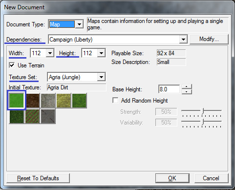
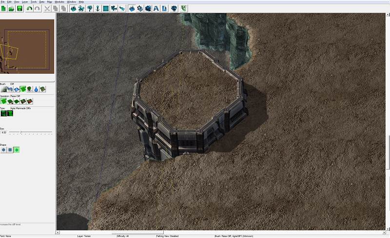
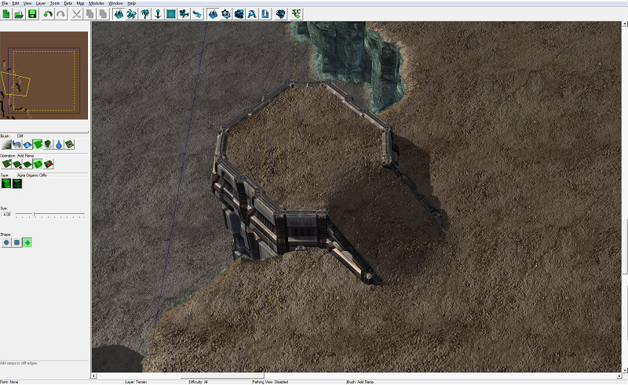
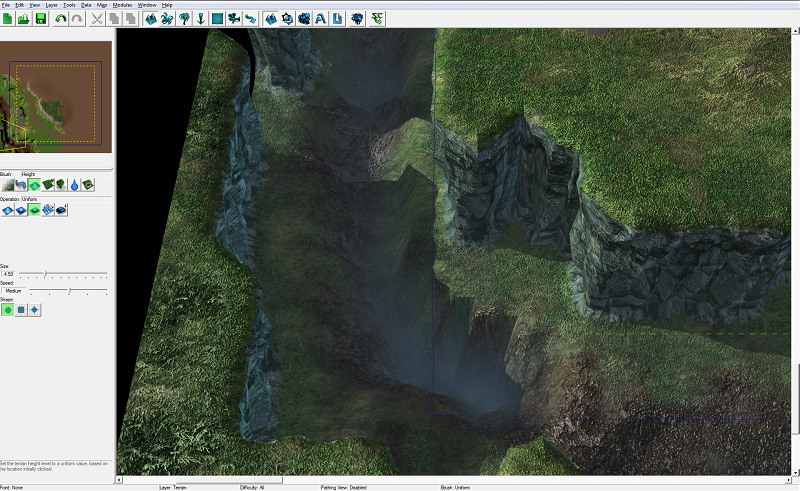
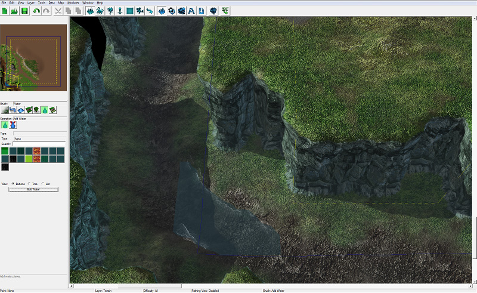
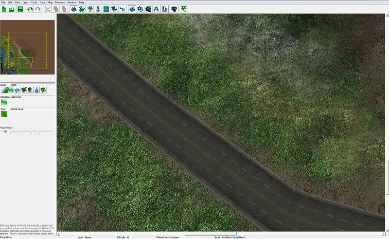
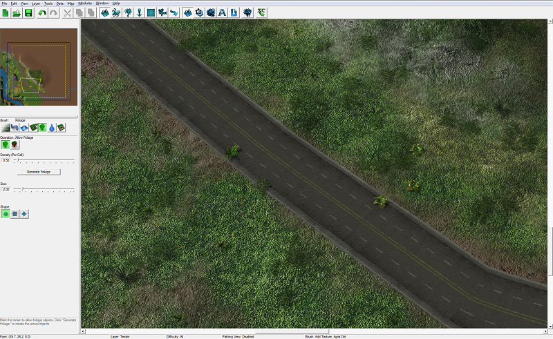

# Terrain Module - Part 1

In this three-part tutorial, you will get acquainted with some of the many features that the StarCraft II Editor has to offer, while making a small adventure map similar to the first mission in the Wings of Liberty campaign.

We will have a starting area where our heroes begin the mission, which includes the heroes themselves, the military base they live and work in, and some surrounding vegetation.

## Introduction

The Terrain Module is the first window that opens when you start the editor by default. This is where you create the layout and look of the environment, and where you can place props, units, and structures that are created when the game starts.

Controls for changing terrain and placing units are separated into different control "layers." There is a terrain layer, where you change the layout and environment of the map, a units layer, where you place units, and a few more, most of which we will make use of in this tutorial.

## Before we get started

Create a new map (File > New...) in the Agria tileset. For the starting texture, select Agria Dirt. When you create a new map, you can select what "Dependencies" the map has. You can think of a Dependency as a set of units, tilesets, and options. In StarCraft II there are multiple dependencies available. The Melee (Liberty) dependency contains all of the units and settings used in standard multiplayer and ladder games. Campaign (Liberty) contains everything found in campaign as well, such as the Kerrigan, Zeratul, and Raynor units. We are going to choose the Campaign (Liberty) dependency so that we have access to all of the units and structures in the campaign, and some extra environment props and doodads which aren't available in standard multiplayer games. Lastly, set the Width and Height of the map to 112 x 112.

## Create the Terrain

The first layer we are going to work with is the terrain layer, where we will modify the map ground textures and topography. To get to the terrain layer, press the [T] key or click on the button that has a picture of teal-colored twin mountain peaks:

### Cliffs

The military base that our heroes work on is going to be located on the edge of a large canyon, so we need to use the Cliffs tool to create some cliffs for our canyon:

On the left side of the window, just below the mini map, is a row of buttons that correspond to different terrain "brushes." Select the "Cliff" brush button. This is the button that has a picture of a cliff and a green up arrow.

The term "brush" is used figuratively. In the editor, any tool you select that adds, modifies, or removes terrain, textures, units, etc. is referred to as a brush.

Next, we need to select an "operation" for our cliffs brush to perform. Select the "Lower Cliff" operation to create cliffs by pushing the terrain down. The "Lower Cliff" operation button has a cliff and a red down arrow. You can then select the size of the brush and the shape, and choose what cliff type you want to draw. We've gone with Organic Cliff for now.

Use the brush by clicking or holding down the left mouse button on the terrain, and move your view of the map by holding down the right mouse button and dragging the mouse. As you can see in the picture, we've moved the map view to the bottom-left part of the map, and carved out some cliffs on the lower left side of the map.

Next, use the Raise Cliff operation to create a raised manmade cliff that sticks out into the canyon. This is going to be the helipad.

The helipad needs a ramp, otherwise it will be inaccessible. Select the Add Ramp brush. Ramps can only be drawn onto cliff edges, and not on flat land.

Before we move any further, let's save the map. Unexpected events can cause you to lose your progress if the editor closes unexpectedly due to automatic updates forcing your computer to restart, electrical outages, and household pets accidentally unplugging your computer. Rather than blaming the electrical company for the loss of 5 hours of work, make sure you save often!

### Textures

Now that we have some cliffs, we can get an idea of what textures we'd like to place down on our map. We don't want the entire map to be covered in dirt, so we're going to plant some grass and pave some concrete as well.

Select the texture brush, which is the left-most button on the row of available brushes.

There are many different operations, including Add Texture, Remove Texture, Blend, Smudge, Fill, etc. We're going to use Add Texture for most of our texture needs, but feel free to play around with the others. There are also a number of options for how fast textures are painted, and the shape, size, and style of the texture brush:

Increment - This option controls how quickly a texture is painted as you are holding down the Left Mouse Button.

Size - Increase the slider for this option to increase the radius of your texture brush.

Speed - Works similarly to the Increment option.

We're going to select the Concrete texture, and paint it on the helipad and the helipad ramp.

Continue painting textures around the base. Our heroes now have some concrete around the base for buildings and hangers to be built on, and some grass areas and dirt paths around the base.

### Height

Canyons are often formed by water erosion, so we're going to put a river at the bottom of our canyon. Before we place the water, we will lower some of the terrain to make a ditch for the water to run. We can use the Height brush to raise or lower terrain without making cliffs. Using this brush, we can make hills, valleys, craters, and piles of dirt or leaves if we want.

Select the Height brush button, which looks like a blue hill and is located to the left of the cliff brush.

Select the Lower operation.

Use the brush to create a ditch that runs through the canyon.

Sometimes using the height brush can leave undesirably sharp edges. We can use the Smooth operation to blend terrain height to get rid of jagged edges.

### Water

We are now ready to let water run through our ditch.

Select the Water brush button, which looks like a big water drop.

There are only two operations for the water brush to perform: Add Water and Remove Water. Select the Add Water operation (even if it is already highlighted) to bring up the different types of water that are available to place.

Place some of the water where we created the ditch in the canyon.

The water is probably floating high above the canyon. To fix this, use the Edit Water button to bring up a new window full of water settings. The setting we're concerned with at the moment is the Height setting. Use the slider to adjust the water height until it is sitting comfortably in the ditch and not floating above it. There are many different options to play with. When the water looks perfect, press Okay to close the window.

Continue placing water until the ditch is full of water.

### Road Tiles

Our military base is going to be accessible by a 4 lane highway. To make this highway, we are going to use the Road brush.

Select the Road brush, to the left of the Height brush button.

Currently there is only one Operation, and one Type per tileset.

Left clicking the mouse will place a road point. road points will automatically connect to other nearby road points. To place a road point that does not connect to nearby road points, hold down the control button while placing it.

We've placed enough road points to have the road wind and follow the canyon, and then take a left turn when it reached our military base and move to the edge of the map.

If you need to adjust your road, you can enter "selection mode" and adjust the road points. To enter selection mode, press the [Space Bar] or [Escape] keys. You should see green pyramids where the road points are. To move the points, click and drag them. To rotate the point, select the point you'd like to orient, and hold down [Control] and the left mouse button, and drag the mouse around.

Road tiles do not show up on the mini map. In order to show players where the road is, we've painted the concrete texture underneath the road.

### Foliage

We're almost ready to start placing down some props and units on our map, but first, we are going to add some small foliage. In the editor, larger pieces of foliage like trees and bushes are placed deliberately and specifically by designers, but smaller plants like grass and flowers are placed using the Foliage generator. The benefit of this is that you don't have to place thousands of grass props by yourself, but the other major advantage is that generating foliage this way is much less difficult for the game to process, so the game runs smoother.

A note about foliage before we get started: Foliage cannot be seen on Low graphics settings. specifically, the "Terrain Quality" setting determines whether or not foliage is displayed in the game.

Select the Foliage brush, which looks like a tree and is located to the right of the Cliff brush.

Select how dense you want the vegetation to be, and then press the Generate Foliage button. We've gone with a density of 0.50.

You might notice that foliage was also placed on our road. To keep this from happening, we need to use the Disallow Foliage operation and draw where we want to keep foliage from appearing.

Switch back to the Allow Foliage operation, and generate foliage again. Now foliage has been generated all over the map, but not on the road where we don't want it.

