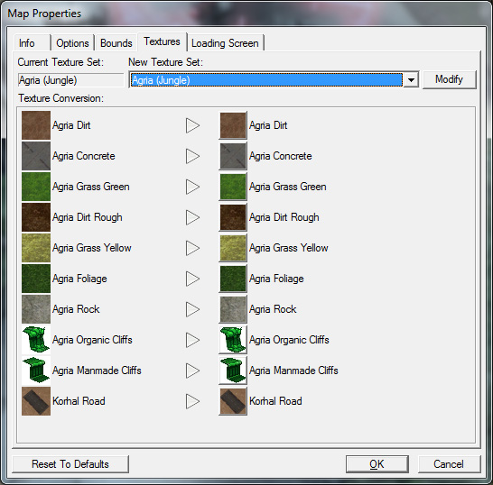
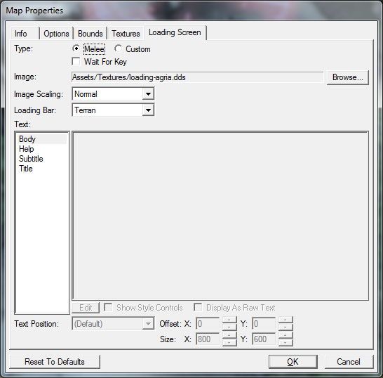

# Terrain Module - Part 5

## MAP PROPERTIES

The last few settings that we're going to modify before jumping into the game to run around in our map is the Map Properties window. To open the Map Properties window, go to the "Map" menu option at the top of the editor, and select "Map Info..."

The Map Properties window is separated into 5 tabs. Each tab offers different options.

## INFO

This tab lets you set the options about your map that show up when players are looking at your map on battle.net. You can change the name, author, description, and preview images for your map.

## OPTIONS

The options tab contains several options, the most notable right now being the Unexplored Areas, or Fog of War, setting. This controls whether areas of the map that you haven't seen are dimmed, or blacked out. Because this is going to be an adventure map, we're going to change the setting from Grey Mask (dimmed) to Black Mask (blacked out).

## BOUNDS

The Bounds tab controls how big or small the map is. If you find that your map has a lot of unused space, or that it needs more space, you may modify it here.

Camera bounds and map bounds control how far you can scroll the camera or move your units, and how far the map terrain itself extends, respectively. Right now, our map is a good size, so we'll leave this alone.

## TEXTURES

The Textures tab lets you change what tileset you're using, and lets you swap out textures. We're going to leave our map with the Agria tileset.

## LOADING SCREEN

The Loading Screen tab contains controls for editing the image that is displayed while the map is loading. The melee setting will automatically generate a load screen with the map name, and an image corresponding to the planet tileset used on the map. For our purposes, this is fine, so we are going to leave it alone.

We're all set to test out our map now! Before testing the map, make sure to save your map. Press the "Test Document" button on the very right of the editor toolbar to launch StarCraft II and load your map automatically. The button has the letters "SC" and an arrow underneath them.