# Trigger Module

In this three-part tutorial, you will get acquainted with some of the many features that the StarCraft II Editor has to offer, while making a small adventure map similar to the first mission in the Wings of Liberty campaign.

If you haven't completed Part One of this tutorial yet, you can find it [[here](../terrain/1)].

If you would like to jump straight into this tutorial without having to go through the terrain tutorial, you can use the map that we made in that tutorial, located [[here](#finishedMap)].

Learn to use the Trigger Module by creating Triggers to handle victory, defeat, and scripted in-game events.

[Download the Trigger Module - finished product map file](https://web.archive.org/web/20130126143031/http://media.blizzard.com/sc2/game/maps-and-mods/tutorials/trigger/Trigger-Module-finished-product.SC2Map)

[Download the Trigger Module - fleshed out terrain map file](https://web.archive.org/web/20130126143031/http://media.blizzard.com/sc2/game/maps-and-mods/tutorials/trigger/Trigger-Module-fleshed-out-terrain.SC2Map)

[Download the Trigger Module - starting point map file](https://web.archive.org/web/20130126143031/http://media.blizzard.com/sc2/game/maps-and-mods/tutorials/trigger/Trigger-Module-starting-point.SC2Map)

## End Result

This is the end result we're going for with this tutorial:

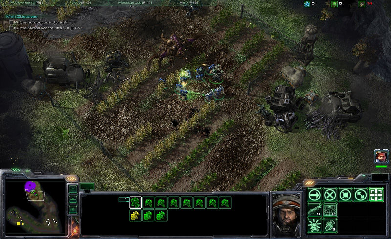

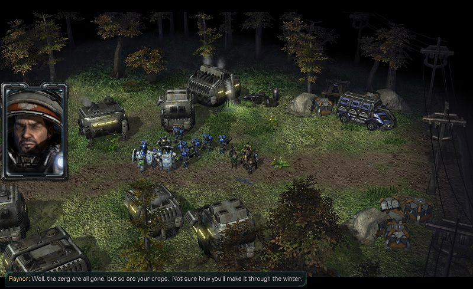

We will be able to play through a short adventure-style mission where our heroes investigate the mystery of who has been smashing and eating the local colony's crops on Agria.

## Introduction

The Trigger Module is where the gameplay and storytelling happens. It is where you create in-game cinematics, spawn in units mid-game, create and track objectives, and much more.

Triggers can be thought of at the basic level as a set of instructions. When you want something to happen during the game, you use a Trigger to tell the game when you want it to happen, and exactly how you want it to happen.

1. Triggers are comprised of several sections:

2. **Events** - This is what causes the Trigger to run. If we want to set up a Trigger to end the game when the hero dies, then the event for that Trigger would be "**when a unit dies**".
3. **Conditions** - Conditions make sure that a Trigger only runs when certain circumstances are true. In the example above, when the Trigger runs because a unit has died, we would add a Condition to make sure that **the unit that died was the hero**.
4. **Actions** - Actions are the instructions that are carried out when the Trigger is run. In our example, the Action that would run when our hero dies is "**Game over for player 1**".

## Before we get Started

We are going to continue using the map that we worked on in Part One of this tutorial. In the tutorial, we only finished creating the canyon and the military outpost. For this tutorial, we've finished creating the rest of the map using all of the same concepts that we learned in Part One of the tutorial.

If you don't want to spend time decorating the rest of the map, you can use the map that we made as a starting point for this tutorial, located [here](https://web.archive.org/web/20130126143031/http://us.battle.net/sc2/en/game/maps-and-mods/tutorials/trigger/#finishedMap).

We've added several key areas that our heroes will be visiting that you can see in the pictures below:

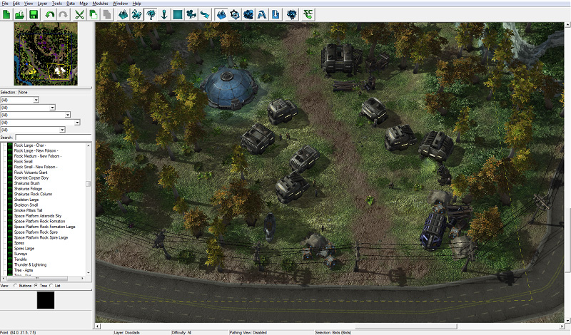

We added a small colony at the southeast part of the map, just off the road. These are the poor people whose crops have been destroyed.

We also added a destroyed farmland section with an Ultralisk (Burrowed) in the center of the crops. Killing this unit is the objective of our map.

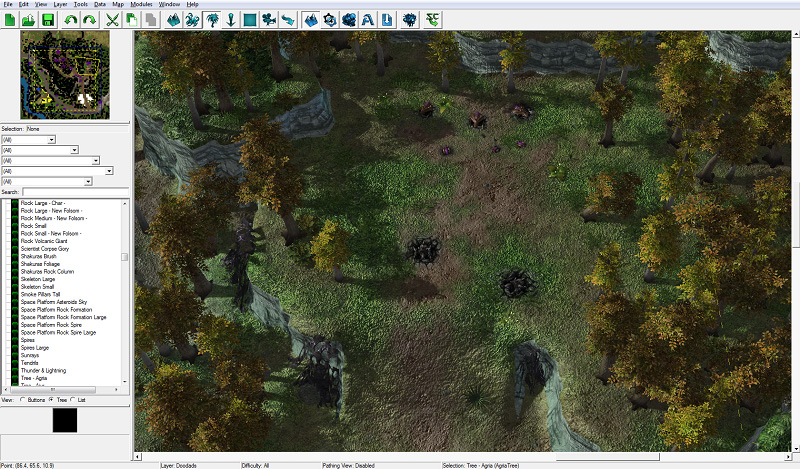

We also added a little optional area to the north of the colony and east of the crops. There will be a few zerg units here.

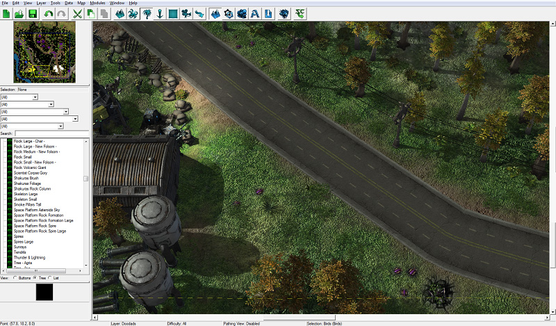

Lastly, we've scattered some small zerg units around the map for the player to interact with.

## I. Setting up View Options

If it isn't already, open the Trigger Module by pressing the Trigger Module button on the editor toolbar, or press [F6].

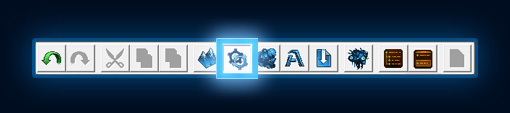

Before we dive into Triggers, we will take a quick look at different ways to setup the Trigger Module window. There are two options that we will set specifically, although you are encouraged to look at and play around with the other options as well.

### A. Show Subviews

The Trigger Window contains a list of all the Triggers on the map, which is the section on the left. There is a Melee Initialization Trigger already created on the map by default.

If you want to modify any of the Events, Conditions, or actions in the Trigger, you have to double-click on the item to bring up a window where you can edit the Event, Condition, or Action.

However, if we turn on subviews, then when we single-click an item to select it, its contents will be shown in an additional section that shows up below the Trigger contents. To toggle the Use Subviews option, press the Use Subviews button on the toolbar at the top of the window.

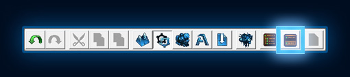

### B. Hide Libraries

All of the Events, Conditions, and Actions in StarCraft II are contained within "Trigger Libraries". Users can create their own Trigger Libraries. For this map, however, we do not need to create any, so we are going to hide them. To toggle Trigger Libraries, press the "Show Libraries" button on the toolbar, next to the "Use Subviews" button.

### C. More Options

Many more options can be found in the View menu at the top of the window. We will leave them alone for now, but feel free to take some time to experiment with them later if you'd like.

## II. My First Trigger - Victory and Defeat Triggers

Let's make some Triggers! The first two that we will make will be simple victory and defeat Triggers that run when the Player kills the Ultralisk and Nydus Worm, and when the player's units die, respectively.

Before we do that, we should delete the Melee Initialization Trigger. The Melee Initialization Trigger contains Actions for preparing StarCraft 2 melee maps; we don't need it for our map because it will be a custom map that won’t require things like harvesting minerals or constructing buildings. You can delete Triggers by selecting the Trigger and pressing [Delete], or by right-clicking it and selecting the "Clear" option.

### A. Defeat Trigger

The Defeat Trigger should run when our hero dies, ending the game in defeat for player 1 when that happens.

#### Creating a new trigger

1.	Right-click on the Trigger list and select New>New Trigger, or press [Ctrl+T] to create a new Trigger.

2.	We are going to name our new Trigger "Defeat".

3.	Select the Trigger to show its contents.

#### Creating a new Event

1.	To add a new Event to the Trigger, right-click Events label and select New>New Event, or left-click on the Events label and press [Ctrl+E].

2.	From the window that pops up, select the "Unit Dies" event and press “Ok”.

#### Creating a new Condition

1.	Right-click in the Trigger contents list and select New>New Condition, or press [Ctrl+K].

2.	The Window that pops up contains a list of Condition types. Select the Comparison Condition type from the list and press "Ok". We are choosing Comparison because we want to compare the unit that died to our hero unit. If they are the same, then the Condition is true, and the Trigger’s Actions will be carried out.

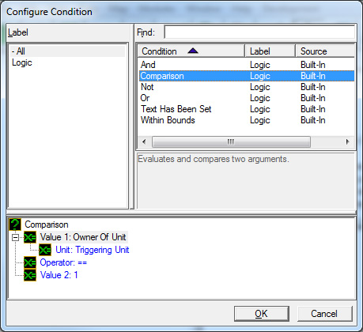

3.	When the Condition you’ve just created is selected, you can see its contents in the subview section. There should be “Value 1”, “Operator”, and “Value 2” fields in the subview.

4.	Double-click on the Value 1 field to bring up a list of conditions to choose from, and select “Triggering Unit”. Triggering Unit refers to the specific unit that caused the Trigger to run. In this case, the triggering unit is the unit that died.

5.	The Operator field is where we select how we expect the two values of the Condition to relate to each other. In this case, there are only two options: equal (==), or not equal (!=), because the two units we are comparing are either the same, or they aren't. There is no "kind of the same" value. We are going to leave the Operator as “==” because we want the Trigger to run when the unit that died is the hero unit.

6.	Double-click on Value 2 to bring up the Condition list again. This time we aren't going to select a Condition from the list. Instead, just above the list, there is a row of radio buttons that control what type of Condition value you can choose from. Right now, we are looking at the list of Condition Functions. Select the “Value” radio button to bring up a list of units that exist on the map. When we made the map terrain and placed down units for Player 1, we placed 2 Marines and a Jim Raynor (Commando) unit. Find Jim Raynor (Commando) in the list and select him, and then press Ok.

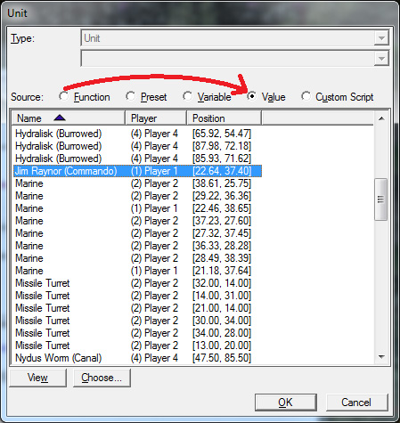

#### Creating a new Action

1.	Right-click in the Trigger contents list and select New>New Action, or press [Ctrl+R].

2.	From the list of actions that pops up, find and select “End Game For Player”. Typing all or part of the Trigger you're looking for in the "Find" field will help narrow down your search as well.

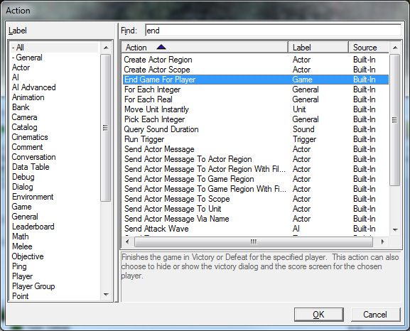

3.	Selecting the Action will show its contents, just like it did for the Condition we made.

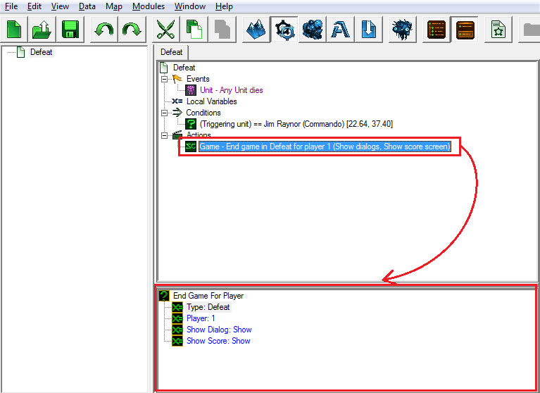

4.	Double-click on the “Type” field, and change the value from “Victory” to “Defeat”.

#### Test it!

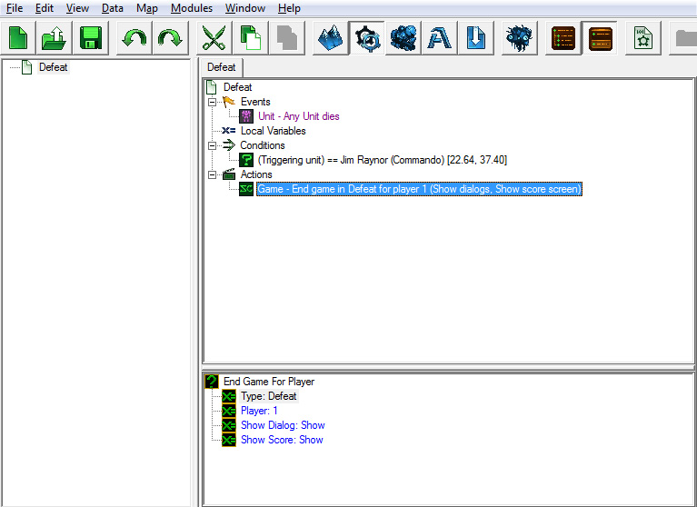

We've completed our first trigger! Let's jump into the game and test our new trigger.

1.	Press the "Test Document" button on the very right of the editor toolbar, or press [Ctrl+F9].

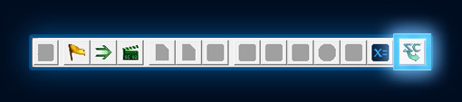

2.	Once in the map, select your units and order them to attack Jim Raynor. When he dies, you should see the Game Over menu pop up like so:

### B. Victory Trigger

Next we're going to make a simple Victory Trigger. This Trigger will end the game in victory for player 1 if both the Nydus Worm and Ultralisk units that we placed on the map are dead.

If you haven't placed Nydus Worm and Ultralisk (Burrowed) units on the map, you should do that now. For information on how to place units on the map, see Part 1 of this tutorial series, in the Units section of the [Terrain Module](https://web.archive.org/web/20130126143031/http://us.battle.net/sc2/en/game/maps-and-mods/tutorials/terrain/3). We've placed the two units in the farmland section of the map:

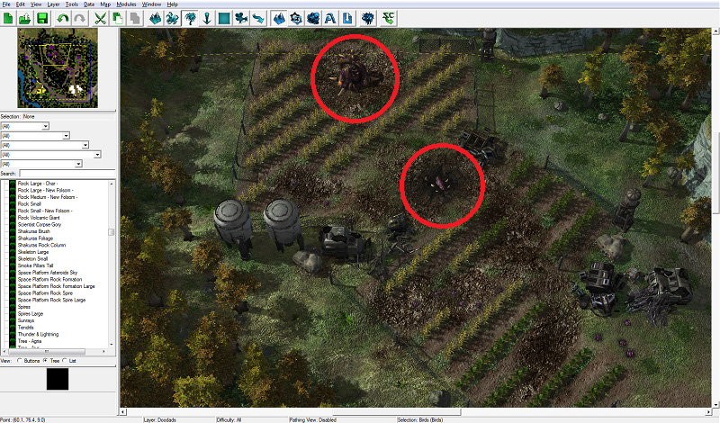

Before we make the Trigger, we need to make a variable for each of the two units that we want to kill in the mission.

#### Variables!

Variables in the StarCraft II Editor work the same way that they do in scripting and coding languages.

For those unfamiliar with the concept, a Variable is an identifier that can be set to some value. For example, if a is our Variable, then we can say a = 5. If we use a in an equation, then it is like we are using the number 5 in the equation, so a + 2 = 7. You can change the value that a Variable is set to at any time. So we can replace a = 5 with a = 6 after we complete the a + 2 equation, so that the next time we use a in an equation, we use the number 6 instead of 5. We can have many different types of Variables in the StarCraft II Editor, such as units, integers, and text.

#### To make a Variable in the Trigger Module

1.	Right-click in the Trigger list and select New>New Variable or press [Ctrl+B]. Name your new variable NydusWorm.

2.	When you select the Variable, you can see its contents on the right. Each variable has a type. The type corresponds to the type of value that the Variable can store. They can store integers, real numbers, text, units, and much, much more. We are going to set the type of this Variable to “Unit”, because we want the Variable to store the specific Nydus Worm unit that we placed on the map.

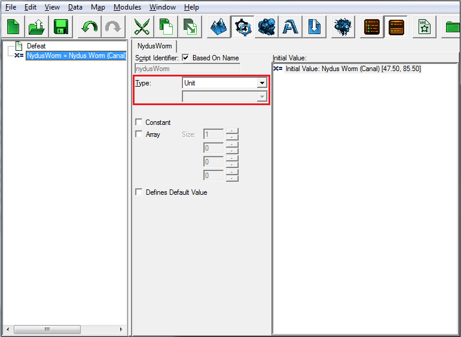

3.	Double-click on the “Initial Value” field in the section to the right.

4.	Select the radio button for "Value," and then find and select the Nydus Worm (Canal) unit.

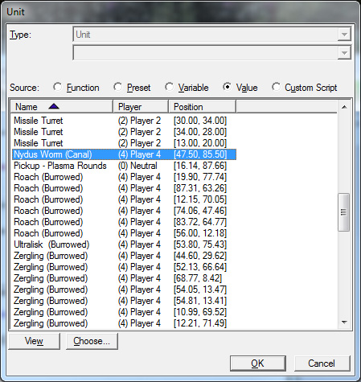

5.	Repeat these steps to make a Variable for the Ultralisk as well.

Now we're ready to make the Victory Trigger. Go ahead and create the Trigger now.

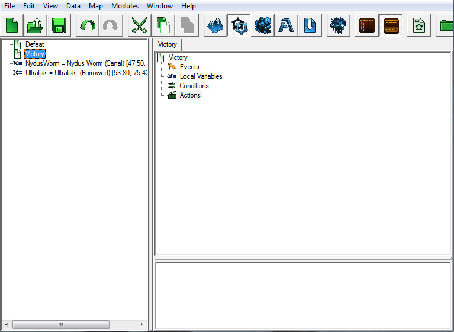

#### Event

The last Trigger we had an event that ran every time a unit died. This time, we're going to use an event called Periodic Event to make the Trigger run at repeating intervals.

1.	Right-click in the Trigger area, and select New>New Event or press [Ctrl+E].

2.	Then in the pop-up window, select Periodic Event from the Function section.

3.	Change the Duration value from 5.0 to 1.0.

4.	Leave the Time Type value set to Game Time.

#### Condition

For this Trigger, we need two Conditions: one for each unit that we want to check.

1.	Right-click in the Trigger area and select New>New Condition, or press [Ctrl+K].

2.	Select “Comparison” for the Condition type and press Ok.

3.	Select the new condition to view its contents in the Subview section.

4.	Change Value 1 to "Unit is Alive".

5.	Change the Unit value to the NydusWorm variable we created.

6.	Double-click Value 2 to open the Value 2 selection window, make sure that the "True" checkbox is unchecked, and then press "OK". We want to set Value 2 to False because we want the trigger to run when the units are not alive.

7.	Repeat steps 1 through 6 for the Ultralisk. You can save a little time by copying your first trigger and changing the “Unit” Variable, since the rest of the second Trigger will be the same for both.

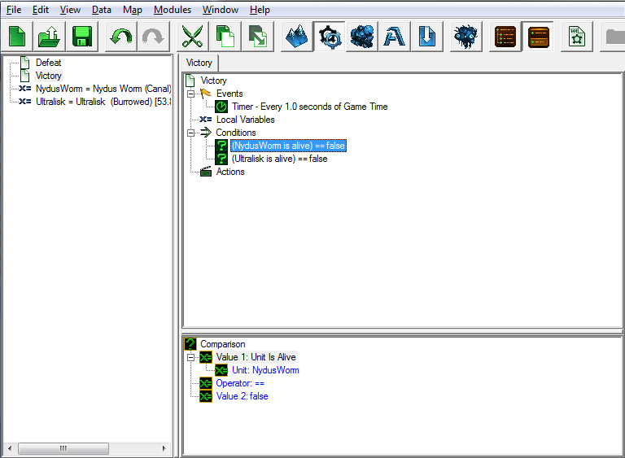

When you have two Conditions in a Trigger, the Trigger Actions only run if both Conditions are true. If you want to run a trigger when either one of two Conditions are true, you can add an “Or” Condition, and then create conditions inside of the Or Condition. This will make it so that if any of the conditions inside the Or Condition are true, the whole thing is true, and the Trigger will run.

In our case, we want both the Nydus Worm and the Ultralisk to die in order to win the mission, so we won’t be using an Or Condition.

#### Action

Create another “End Game For Player” Action like we did for our last Trigger, but make sure that it is ending the game in Victory this time, not Defeat.

### C. Folders

It's important to keep our Triggers organized, so before we move onto the next section, we're going to create a folder in the Trigger list, and drag and drop our Victory, Defeat, and Variables into it.

1.	Right-click your mouse in the Trigger list and select New>NewFolder, or left-click your mouse in the trigger list to give focus to that section, and press [Ctrl+G].

2.	Drag and drop your Triggers and Variables into the folder like you would with any other file or folder on your Desktop.

You'll see through the tutorial that we create several folders to group the Triggers by what they do: victory and defeat triggers, gameplay triggers, objectives triggers, etc.

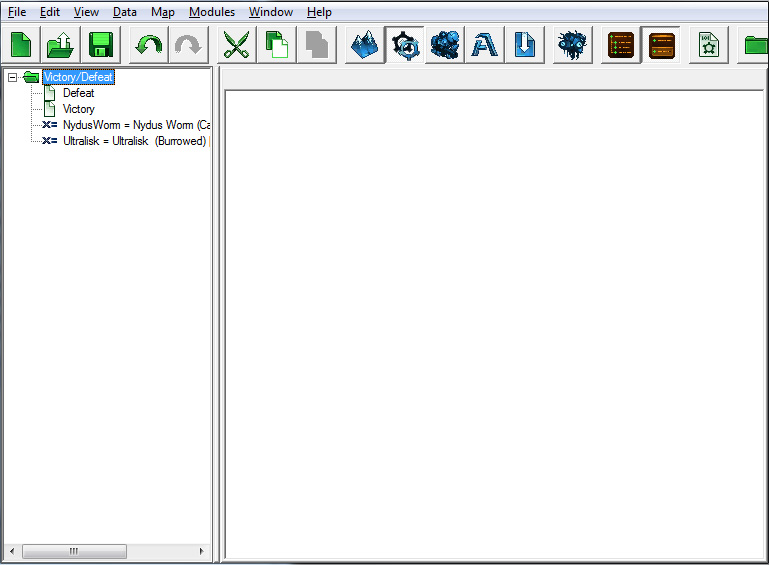

Navigate onto :

- [Next Part](../2)