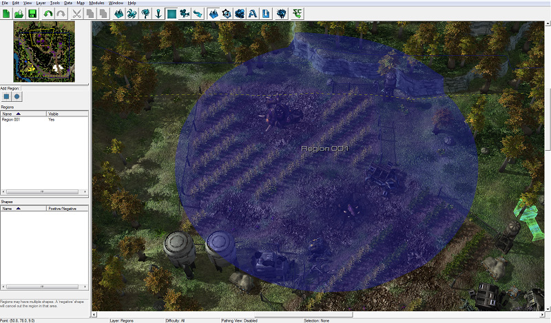
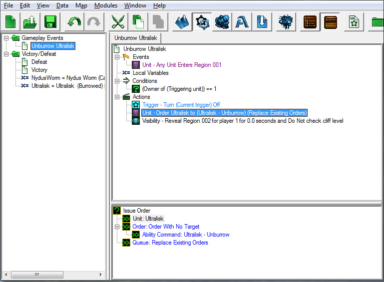
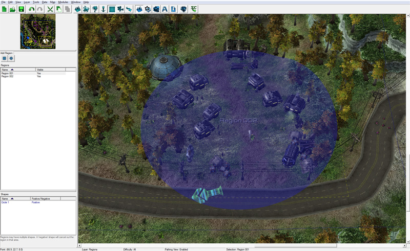
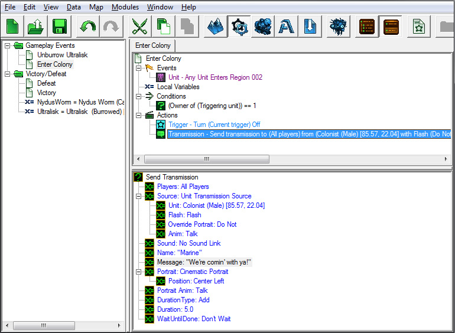
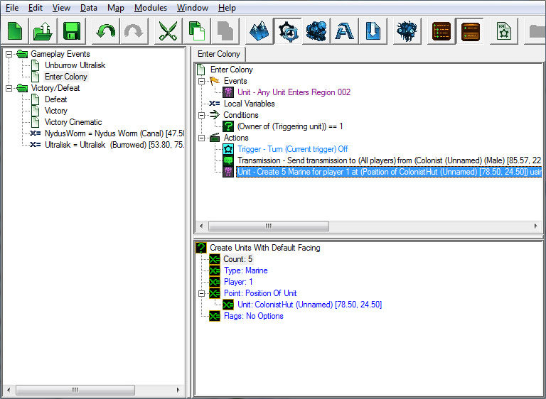
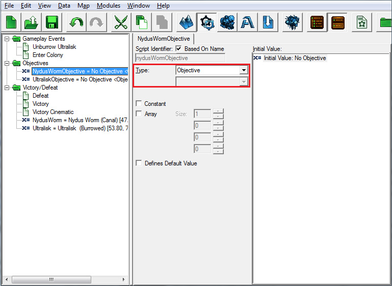

# Trigger Module - Part 2

## III. TRIGGERS THAT USE REGIONS

Regions are areas on the map that can be referenced with Triggers. You can, for example, run a Trigger when a unit enters or leaves a Region, issue orders to any units currently inside of a Region, create units at random points within a Region, and more.

In our map, we are going to make a Trigger that creates extra units for Player 1 when our units enter a Region where the colony is, and another Trigger that makes the Ultralisk unburrow when our units enter a Region around the unit.

### A. Placing Regions

Before we can use a Region in our Triggers, we need to place it on the map.

1.	Open the Terrain Module and select the Regions layer by pressing [R].

2.	Select the one of the two shapes--square or circle--from the row of buttons below the minimap.

3.	Move your view of the terrain so that you are looking at the farm area, and left-click and drag the mouse to place a Region in the center of the farm area.

4.	If you would like to change the name of your Region, select it from the list of Regions on the left and press enter to bring up the Region Properties window.

5.	You can rename a region by double-clicking on the region in the Regions list under the mini-map display, and entering the desired name in the pop-up window. We've left our region named "Region 001", which is the default name.

### B. Entering Ultralisk region causes unit to unburrow

We won't be able to kill the Ultralisk and win the mission unless it unburrows first. Using our new Region, we can have him unburrow when our heroes get close.

Let's switch back to the Trigger Editor window and create a new folder named Gameplay Events by pressing [Ctrl+G] hotkey. Create a new Trigger in this folder called Unburrow Ultralisk using the [Ctrl+T] hotkey. After that, select the Trigger and add the following Events, Conditions, and Actions:

#### Event:

We need an event to fire when our units enter the region we just created.

1.	Right-click in the trigger area, and select New Event.

2.	Then in the pop-up window, select Unit Enters/Leaves Region from the Function section.

3.	Change the "Region" value to our new Region (Region 001 in the screenshot). When selecting the Region, the Source should default to "Function"; we will need to change it to "Value" in order to select the Region. We can also use the "Choose" button to find and select the Region in the Terrain Editor to choose it for the Trigger.

#### Conditions:

For this Trigger, we need two Conditions: one for each unit that we want to check.

1.	Right-click in the Trigger area and select New Condition, and select Comparison and press OK.

2.	Value 1 should be set to "Owner of Unit".

3.	The Unit subvalue should be "Triggering Unit".

4.	Value 2 should be 1 (referring to Player 1).

#### Actions:

We're going to create two Actions for this Trigger. First, we'll order the Ultralisk to unburrow. Second, we'll add an Action to reveal the entire farm region.

1.	Right-click in the Trigger area and select New Action.

2.	In the pop-up window, select "Turn Trigger On/Off" action and press "OK".

3.	Ensure the "Trigger" value is set to "Current Trigger" and the "State" value is set to "Off".

This will make it so that the Unburrow Trigger only runs once. If we don't turn this Trigger off, then we will continue to run the Trigger over and over.

4.	Create an "Issue Order" Action.

5.	Select the Ultralisk Variable for the Unit.

6.	For the Order, select "Order With No Target".

7.	For the Ability Command, select "Ultralisk ? Unburrow"..

8.	Leave the Queue field set to "Replace Existing Orders".

9.	Create a "Reveal Area" Action.

10.	Set the "Area" value to the region that we used in the event.

11.	Set the Duration to 0.0. This ensures the Region remains revealed indefinitely; no Fog of War will cover a region set to Reveal for 0.0 seconds.

12.	Leave Player and Check Cliff Level set to their default values.

#### Save it! Test it!

Now would be a good time to jump into the map again and test our work; it's also probably a good time to Save [Ctrl+S] so that we don't lose any of our work.

1.	Press the "Test Document" button on the very right of the editor toolbar, or press [Ctrl+F9].

2.	Once the map loads, your units will be attacked by the yellow computer player. We'll fix this later. For now, use Raynor and his two Marines to kill the yellow computer player and then go find and kill the Ultralisk and Nydus Worm in the colony farmland area. The Ultralisk should unburrow, and you should be able to kill both units to trigger the victory screen:

If not, go back and check your Triggers; there could be a missed step or incorrect value set somewhere. Review the walk-through, examine the Triggers, and try again!

### C. Entering colony region causes transmission from colonists about investigating the crops and spawns reinforcements

When we enter the colony, we should have the colonists explain their problem with a transmission.

Create a new Region covering the colonist area.

Create a new Trigger to send the transmission when you enter the region.

#### Event:

1.	Create a Unit Enters/Leaves Region event.

2.	Change the "Region" value from Entire Map to your new Region.

#### Conditions:

1.	Create a new Comparison condition.

2.	Change "Value 1" to "Owner of Unit".

3.	Change the "Unit" subvalue to "Triggering Unit".

4.	Leave "Operation" set to "==".

5.	Change "Value 2" to "1".

#### Actions:

1.	Create a "Turn Trigger On/Off" Action, and make sure the Trigger is set to Current Trigger and the State is set to Off.

2.	Create a Send Transmission Action.

3.	You can modify who is sending the transmission, what sound file plays, what the subtitles are, and much more when sending a transmission. These are the options that we set:

4.	Next, add a "Create Units With Default Facing" Action.

5.	Set the "Count" value to 5.

6.	Set the "Type" value to Marine.

7.	Set the "Player" value to 1.

8.	Leave the "Flags" value as-is.

9.	We want the Marine units to spawn in at one of the colonist buildings. To do so, we need to set the "Point" value to "Position of Unit".

- Double-click on the "Point" value, and select the "Function" radio button. Select "Position of Unit" from the list of functions and press "Ok".
- Setting the "Point" value to "Position of Unit" has created a new sub-value under "Position of Unit".
- Double-click this new "Unit" value, and select the "Value" radio button to view available units on the map.
- Select one of the colonist buildings and press "Ok".

When we're done, the Action will look like this:

10.	Create an "Issue Order to Unit Group" Action.

11.	Set the "Group" value to "Last Created Units", found under the "Function" Source in the pop-up window.

12.	Set the "Order" value to "Order Targeting Unit".

13.	Set the "Ability" value to "Move".

14.	Set the "Unit" value to Jim Raynor (Commando), found under the "Value" Source, since he is a unit on our map.

15.	Leave the "Queue" value on "Replace Existing Orders".

16.	Repeat steps 4-6 to create a few Medics as well.

## IV. OBJECTIVES TRIGGERS

Players won't know what they are supposed to do in a map unless we give them an objective or two, so next on the list of Triggers to make is Discover Objective and Complete Objective.

Let's create another folder with the name "Objectives" by right-clicking in the Trigger list window and selecting New Folder or using the [Ctrl+G] hotkey.

### A. Discover objective

The Discover Objective Trigger will create the objective in the upper left-hand side of the screen, and contain text that lets players know what the objective is. This Trigger will run when the game starts.

#### New Variables:

We need to add a couple of Variables to track our two objectives.

1.	NydusWormObjective
So far, our Variables have all been Integers. Change the Type on this one to "Objective".

2.	UltraliskObjective
Type: Objective

Create a new trigger called "Discover Objective".

#### Event:

1. Create a Map Initialization event.

#### Conditions:

We don't need to make any Conditions for this Trigger, since it will need to run every time the game starts.

#### Actions:

1.	Create a "Wait" Action. This causes the Trigger to pause for the specified number of seconds. We're using a Wait in this Trigger so that players have time to get oriented on the map before we throw information at them. They'll have time to see the environment and find their units on the map, and then they'll see the objectives show up. We've set the "Time" value to 2 seconds.

2.	Next, make a "Create Objective" Action. Keep the "State" and "Type" values set to "Active" and "Primary", but change the text and description to something related to killing the Nydus Worm.

3.	Add a "Set Variable" Action next. Choose the "NydusWormObjective" Variable we made earlier, and choose the Function "Last Created Objective" for the second value, so that we can reference our new objective by calling the Variable.

4.	Repeat steps 2 and 3 for the Ultralisk objective.

When you are done your trigger should look like this:

#### Save it! Test it!

Now when you start the game, you will see some spiffy objectives onscreen! Press [Ctrl+F9] to test the map and see if our new Trigger works.

### B. Complete objective

This Trigger will fire when the objective is complete, and it will set the objective's status to "completed".

#### Event:

1.	Create a "Unit Dies" Event.

#### Conditions:

We need Conditions in this Trigger, but we aren't going to put them in the Conditions section. Instead, we are going to use a special Action to create them them in the Actions section.

#### Actions:

Sometimes, in the middle of your Trigger, you want to choose between different Actions depending on the circumstances of the game and based on what caused the Trigger to run. For this Trigger we're changing the state of one objective or the other to "complete" based on whether the unit that died was the Nydus Worm or the Ultralisk. To do this, we can use an "If Then Else" Action.

"If Then Else" Actions contain a section for Conditions, and two sections for Actions. If the Conditions are true, then the first set of actions is carried out. If the Conditions are false, then the second set of Actions is carried out.

1.	Create an "If Then Else" Action.

2.	In the "If" section, make a Comparison Condition to check if the triggering unit was the Nydus Worm (you will need to change Value 1 from "Owner of Unit" to "Triggering Unit").

3.	In the "Then" section, make a "Set Objective State" Action, and set the Objective to our "NydusWormObjective" Variable, and set the State to "Completed".

4.	Leave the "Else" section blank.

5.	Repeat steps 1-4 for the Ultralisk.

Now if any unit dies, our Complete Objective Trigger will fire; when it does, our "If Then" Actions will check to see if it was one of our two objectives; if so, then that objective's status will be set to complete.

#### Save it! Test it!

Let's test our map again to make sure that the objectives are completing correctly when we kill the appropriate units.

Navigate onto :

- [Previous Part](../1)
- [Next Part](../3)
