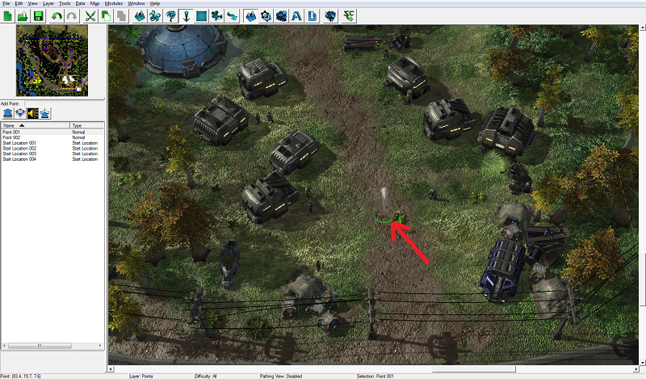
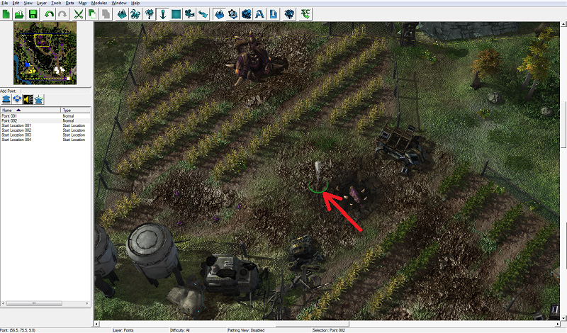
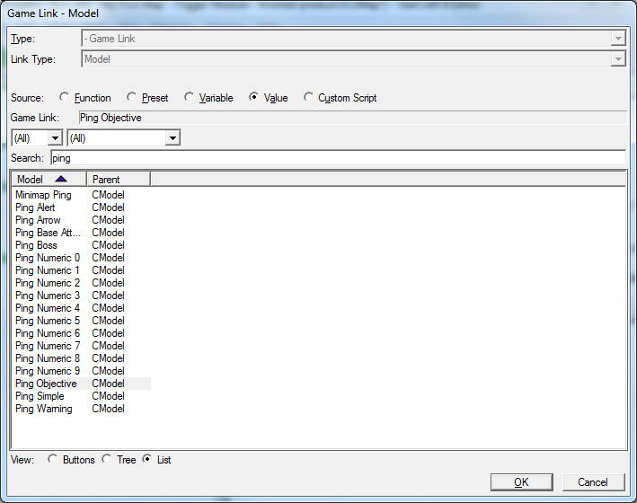
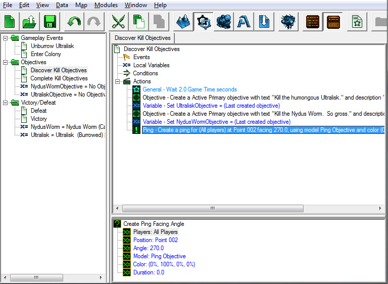
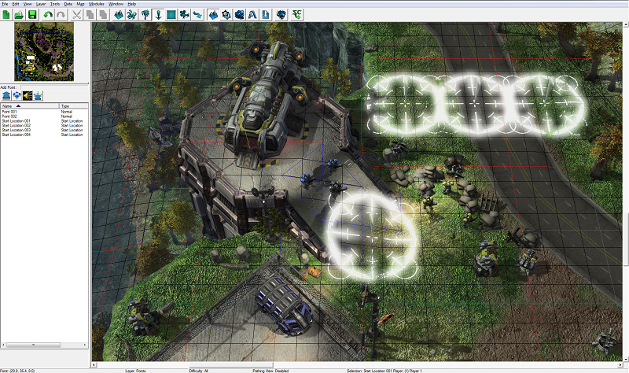
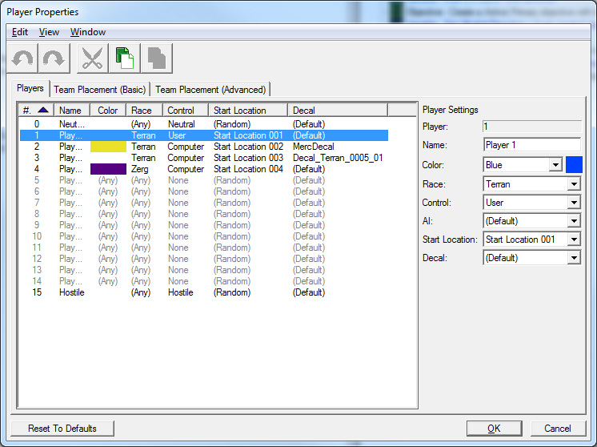
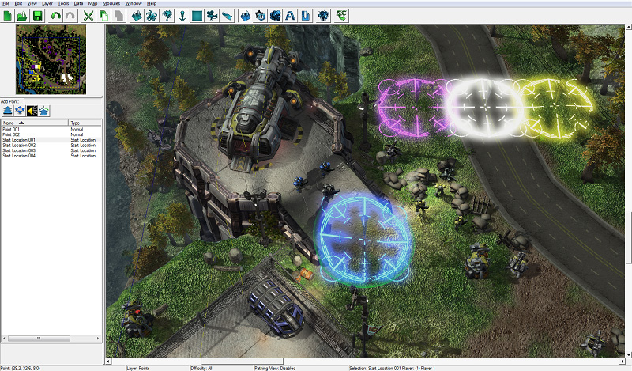
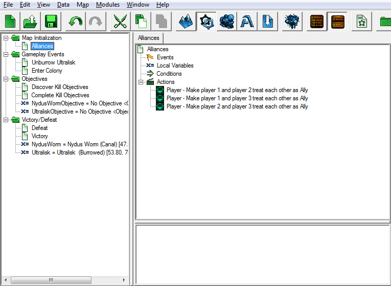
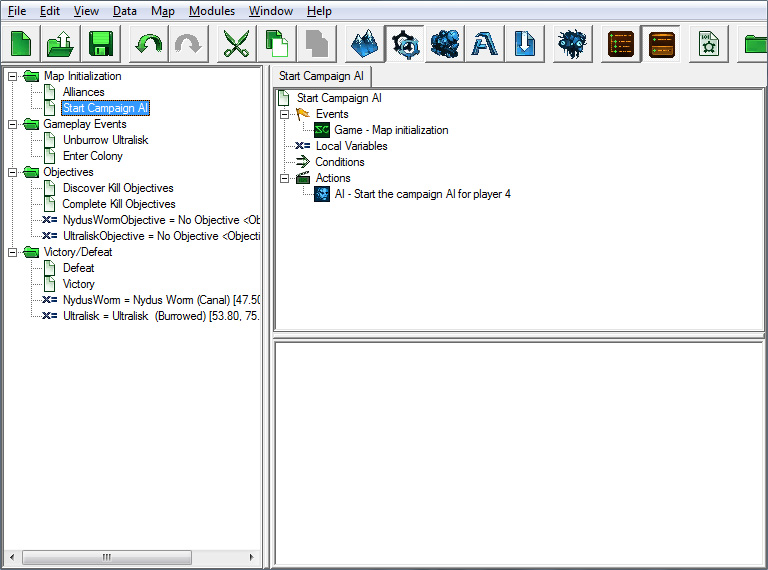
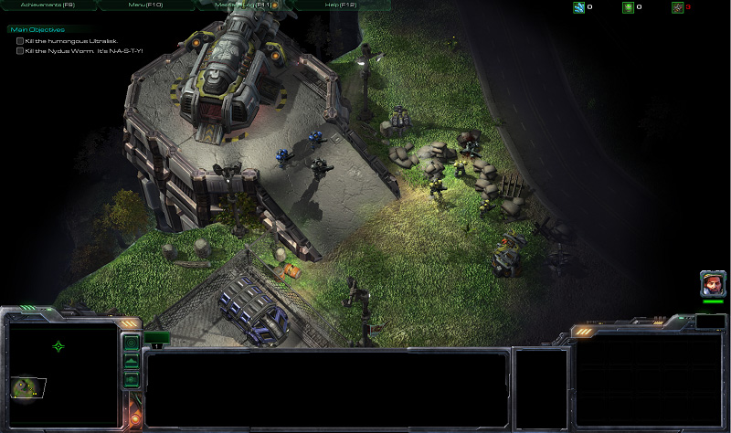

# Trigger Module - Part 3

## V. Triggers that use points

Points are used by Triggers for various purposes. They are used as references for spawning units at a Point, ordering a unit to move to a specific location, creating effects at a specific spot on the map, and much more. Points are visible in the editor but not in-game.

Placing and modifying Points works the same way that placing and modifying doodads and units does.

### A. Placing Points

First we need to place a Point so that we can use it in a Trigger.

1.	Open the Terrain Module and select the Points layer by pressing [P].

2.	Select the Normal Point button that looks like a big up arrow from the row of buttons just below the mini map. It is the left-most button in the row.

3.	Move your view of the terrain so that you are looking at the farm area, and left-click to place a Point in the center of the farm area.

4.	If you would like to change the name of your Point, select it from the list of Points on the left and press enter to bring up the Point Properties window.

### B. Ping crops POI

Now that we have a Point, we can refer to it in our Triggers.

1.	Switch back to the Trigger module and select the Discover Objective Trigger.

2.	Add a new "Create Ping Facing Angle" Action at the end of the Trigger.

3.	For the "Position" value, select the Point we just created in the Terrain Module. Remember to click the "Value" radio button in the pop-up window to view a list of points on the map.

4.	For the "Model" value, select "Ping Objective" or "Ping Boss".

When selecting your Ping model, you can type "Ping" into the search box to see the list of ping models available.

5.	Set "Color" to any value that looks good. Leaving it black will cause the Ping to be hidden, since the unexplored area of the minimap where the Ping will be used is already black. We've chosen green for our Ping color.

6.	Choose any value you would like for "Duration". We've set the duration to 0, which will cause the Ping to stay forever, or until we remove the Ping with Trigger Actions.

When the objective is created, the Ping will appear and let the player know where he is supposed to go.

### C. Start Locations and Player Properties

Start Locations are Points with special properties in melee maps. When making melee maps, the player's town hall and workers are created at Start Locations, and where the player's camera is centered at the start of the game.

We are going to place a Start Location right on top of Player 1's units. We'll use it in a Trigger in the next section to center the camera on this Point when the map starts.

Place down Start Location Points for players 2, 3, and 4 as well:

Next, we're going to set up some Player Properties for our units and the computer's units. We can modify each Player's color, decals, race, and Starting Location in the Player Properties window.

1.	Open the Player Properties window by opening the "Map" menu option at the top of the editor and clicking on "Player Properties..."

2.	For this map, we are going to set the following Properties:

Adding Start Locations for AI Players allows us to enable Campaign AI for those Players. Enabling Campaign AI in our map will make it so that all of those burrowed zerg units will unburrow when our units get close. But we'll get into that more a little later. Once we set up our computer Players with Start Location values, you'll notice that the Start Location Points we placed on the map turn the color of the associated Player:

## VI. Map Initialization Triggers

In this section, we will create some "Map Initialization" Triggers, which run when the map finishes loading and set a number of different game options and settings when you first start the mission. These Triggers will set the player's units to be allies with the colonists, and with the military outpost folks. It will also set the position of the camera when the mission starts, and turn on our objectives.

Let's start by creating a folder to hold all of the Triggers we are about to create, like we've been doing with our other Triggers thus far. Press [Ctrl+G] to make a new folder and name it "Map Initialization".

### A. Alliances

You may have noticed when testing your map that the military outpost and colonist units owned by computer players 2 and 3 will attack our hero units when they see them. Setting players 1, 2, and 3 to be allies will prevent this from happening.

To do this, we need to create a new Trigger called "Alliances" in the newly created "Map Initialization" folder.

#### Event:

Create a "Map Initialization" Event for this Trigger, so that it runs when the map starts.

#### Condition:

None

#### Actions:

1.	Create a "Set Alliance" Action, and set "Source" to Player 1 and "Target" to Player 2. There are several different "Alliance Setting" values to choose from. We are going to use "Ally" so that we are friendly with Player 2, but won't see what they see; only our units will reveal the map.

2.	Create another "Set Alliance" Action with the "Target" value set to Player 3, and the "Alliance Setting" set to Ally.

3.	Just in case the military units and the colonists interact, we have also set Player 2 and Player 3 to be allies.

### B. Turn on Campaign AI so zerg units unburrow

In addition to the Nydus Worm and Ultralisk, we've placed a number of other zerg units on the map, including Burrowed Zergling, Burrowed Roach, and Burrowed Hydralisk units. However, if we were to walk our units around the map right now, the only thing we'd have to fight is the Ultralisk, because we made a Trigger to make it unburrow. All of the other burrowed units would stay burrowed.

We could make a Trigger to unburrow each of those units, but if we turn on the campaign AI instead then all of those burrowed enemy units will unburrow automatically when our units get close.

Create a new Trigger called "Start Campaign AI".

#### Event:

Create a "Map Initialization" Event for this Trigger, so that it runs when the map starts.

#### Condition:

None

#### Actions:

Create a "Start Campaign AI For Player" Action, and set the "Player" value to 4.

When the map starts we are going to move our camera view to center on our units, and also fade in from black for dramatic effect. Our new Trigger will be called "Camera".

### C. Fade into the map and center the camera on our heroes

#### Event:

1.	Map Initialization

#### Condition:

None

#### Actions:

1.	Add a "Pan Camera" Action. Set "Point" to Start Location 001 (remember, you can find a list of previously-created points by clicking on the "Value" radio button), and set the Duration to 0.0. This will make it so that the camera will cut to our start location immediately, rather than panning to that location over a period of time.

2.	Add a "Fade In/Out" Action. Set the "Fade In" value to "Fade Out", "Duration" to 0.0, and "Color" to black (0%, 0%, 0%). This will make it so that the game will start with a black screen, allowing us to fade in.

3.	Add another "Fade In/Out" Action to fade in over 2 seconds.

#### Save it! Test it!

Now that we've got our map initialization Triggers all set up, let's jump into the game again and see how it works.

When the game starts, we should be allied with Player 2 and 3, and the camera should be centered on our heroes. When we walk around the map, the stray zerg units should unburrow and attack us.

Navigate onto :

- [Previous Part](../2)
- [Next Part](../4)