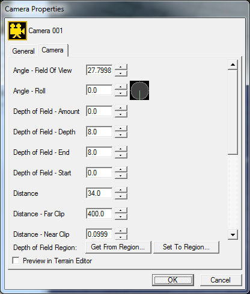
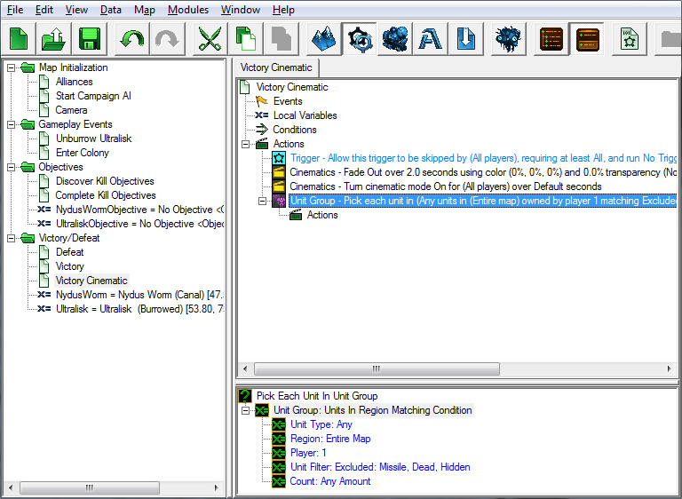
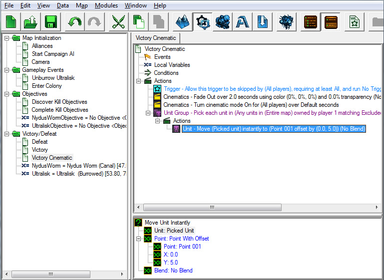
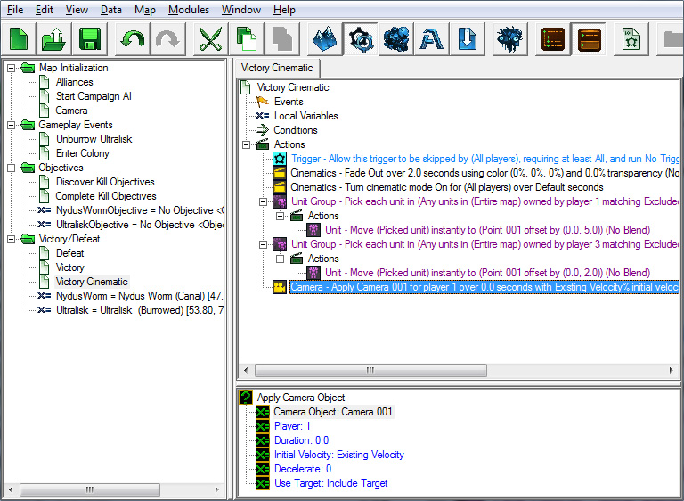
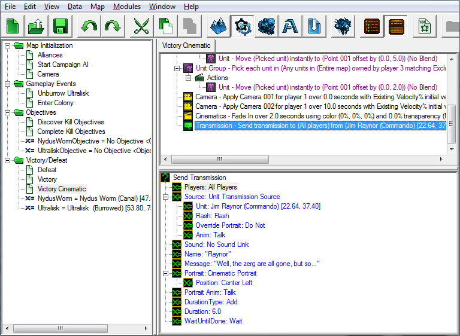
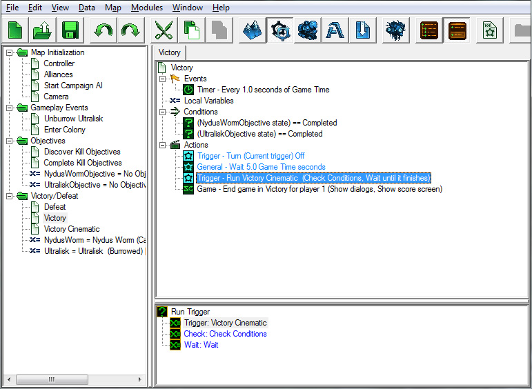

# Trigger Module - Part 4

## VII. Triggers that use cameras - mission victory cinematic (really simple one)

When the mission ends, we should show a little victory cinematic as a reward for beating the missing and tying up the little story we've told. To do this, we will learn about and place a couple of "Cameras" that we can use in the cinematic.

A Camera in the StarCraft II editor is placed in the terrain editor. Each Camera contains a point that the Camera is aimed at, the Camera's distance from that point, and the angle from which the Camera is viewing the point. Each Camera also contains a bevy of settings regarding exposure, depth of field effects, and more.

### A. Placing Cameras

You can place and manage your Cameras in the Camera Layer of the Terrain Module.

1.	Switch to Camera Layer in Terrain Module. To do this, press [C] while using the Terrain Module, or select Layers>Camera menu option.

2.	Move the editor Camera to where you want it. Hold [Ctrl+Right-Click] and drag the mouse to adjust the pitch and yaw of the Camera. Hold [Right-Click] and drag to adjust the target point of the Camera.

3.	Press the "Create Camera" button to create your first Camera. We've created ours in the middle of the colony, because that's where our cinematic will take place.

4.	Right-click the Camera you just created in the Cameras list on the left side of the Terrain Module window and select "Modify Properties". You can modify Camera settings in the Properties window. We're going to leave all of the default settings for our Cameras in this tutorial.

For reference:

- **Field of View**: Adjusts how wide the Camera's vision is. Set this value higher than 35 to get a fisheye lens effect. For a telephoto zoom effect, set this value less than 20.
- **Roll**: If you want to tip the Camera on its side or turn it upside down, you can adjust this value.
- **Depth of Field**: These values define what is in focus when viewing this Camera. If you want everything to be in focus, then you want large Amount, Depth, and End values, and a low Start value.
- **Far Clip/Near Clip**: All terrain past the far clip and in front of the near clip is not drawn on the screen. Not drawing all of the terrain will improve performance.
- **Target**: The point that the Camera is looking at on the ground: the center and focus of the Camera.

5.	Create a second Camera for use in the cinematic as well. We've placed ours in the colony like the first one, but it's looking at the colony from a different angle.

### B. Play Cinematic

Now that we have placed a couple of Cameras, we can get to work on that Victory Cinematic Trigger.

We're going to create a new Trigger called "Victory Cinematic" in the Victory/Defeat folder.

#### Event:

None - we will be running the Trigger directly from our Victory Trigger.

#### Condition:

None

#### Actions:

1.	The "Allow Trigger to be Skipped" Action makes it so that the Player can skip the remaining Actions of the Trigger by Hitting [Esc]. This is useful in cutscenes, because Players don't always want to watch the entire cutscene, especially if he or she has seen it before.

2.	Create a "Fade In/Out" Action. Set the "Fade In" value to "Fade Out" and the duration to 2 seconds.

3.	Add the "Cinematic Mode" Action to turn Cinematic Mode on. In Cinematic Mode, the UI is hidden, and there are black letterbox bars at the top and bottom of the screen to make the action seem more "cinematic".

4.	Place a Point in the center of the colony. We'll move our units to this Point for the cinematic.

5.	To move our units, we will create a "Pick Each Unit In Unit Group" Action. For the "Unit Group" value, select "Units In Region Matching Condition" (under "Function"), and then set the "Player" field to "1" (select the "Value" radio button and type in "1"). This Action works like a For loop, selecting each unit on the map that matches these Conditions and allowing us perform Actions on them.

6.	In the Actions section of the "Pick Each Unit In Unit Group" Action, create a "Move Unit Instantly" Action. For the "Unit" value, select "Picked Unit". This will use the unit that is currently selected with the "Pick Each Unit In Unit Group" Action. Set the "Point" value to the Point that we placed in the center of the colony.

7.	Repeat steps 4 and 5, but for Player 3's units, so that the colonists are moved to the center of the colony for the cinematic as well.

8.	Double-click on the "Unit Filter" value and make sure the "Value" radio button is selected. Find "Structure" in the list and change its state from "Allowed" to "Excluded". This will make it so that buildings controlled by Player 3 are not moved to the point for the Cinematic.

9.	Next, add an "Apply Camera Object" Action. We will set the duration to 0 so that the camera is applied immediately. Set "Camera Object" to the first Camera we created.

10.	Add another "Apply Camera Object" Action and set "Camera Object" to our second camera. Set the duration of this Action to 10 seconds. This will pan the camera between the two cameras we created on the map over 10 seconds.

11.	Add another "Fade In/Out" Action, set the "Fade In" value to "Fade In", and the duration to 2 seconds.

12.	Create a "Send Transmission" Action so Raynor can say he completed the mission. These are the options we set:

13.	Create another "Send Transmission" Action so the colonists can thank Raynor. These are the options we set:

14.	Add one more "Fade In/Out" Action, and set it to "Fade Out", with a "Duration" of 5 seconds.

We now have a working victory cinematic!

We're almost done. The last thing we should do for our cinematic is in the Victory Trigger.

1.	Add a "Turn Trigger On/Off" Action so that the Victory Trigger only runs once. Remember, if we don't turn this Trigger off, then we will continue to run the victory Trigger over and over.

2.	Add a "Wait" Action and set "Duration" to 5 seconds. This will give the Player some time to revel in victory before the victory cinematic starts playing. The Player will be able to see the Ultralisk and Nydus Worm units completely fall over and die, which is satisfying for the player to watch.

3.	Add a "Run Trigger" Action. Set "Trigger" to our Victory Cinematic trigger, and make sure it is set to "Wait until it finishes". Otherwise the game will end before the cutscene is done playing.

Our Triggers are now complete. We should be able to jump into the map, run around, kill stuff, and complete a couple of objectives to see our victory cinematic and win the mission.

Navigate onto :

- [Previous Part](../3)
- [Data Module](../1)