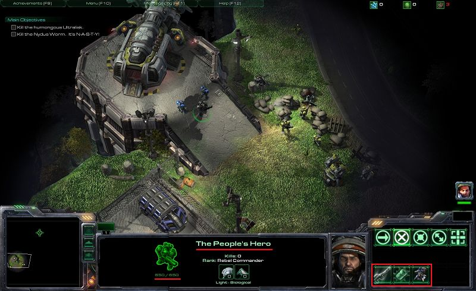
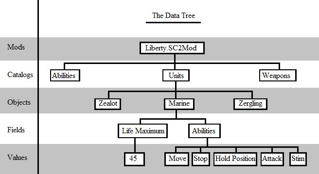
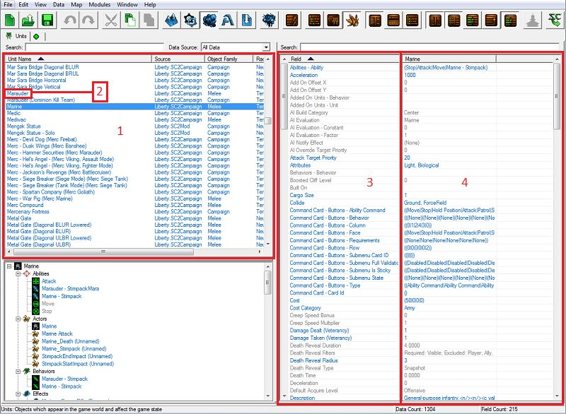
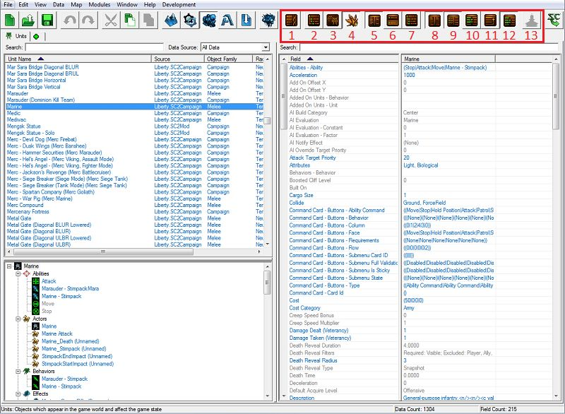
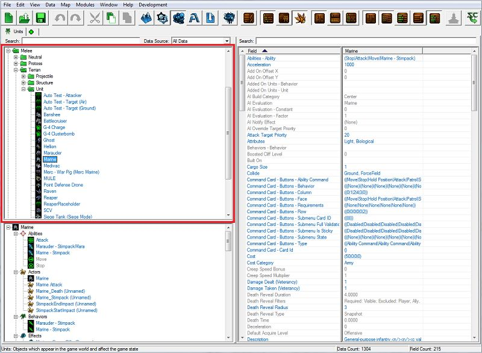
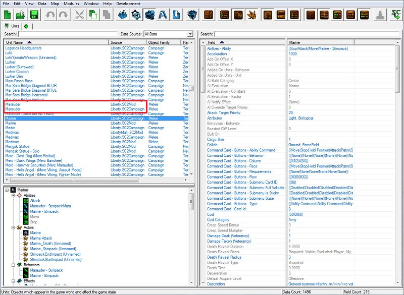
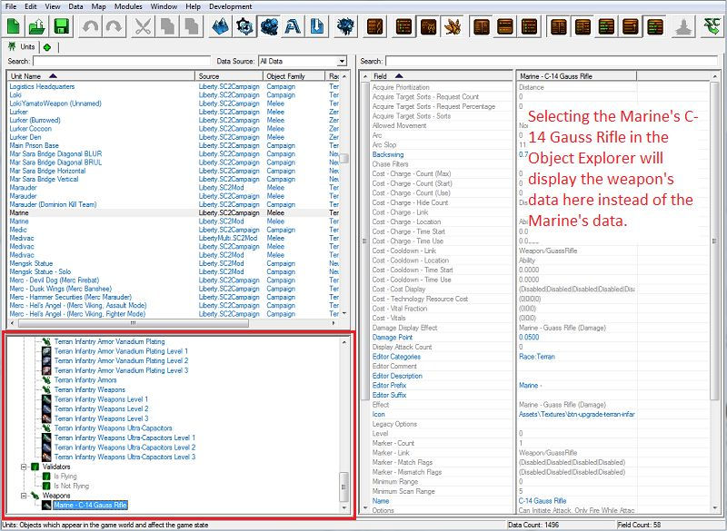
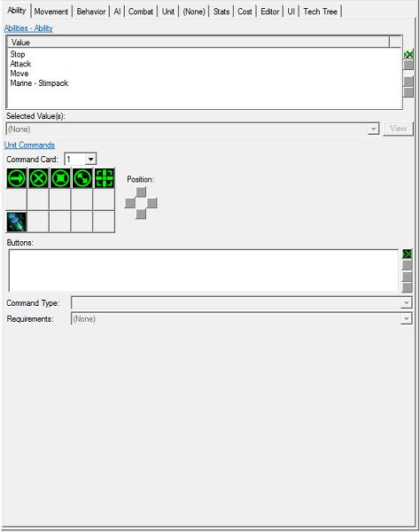

# Data Module - Part 1

In this three-part tutorial, you will get acquainted with some of the many features that the StarCraft 2 Editor has to offer, while making a small adventure map similar to the first mission in the Wings of Liberty campaign. 

If you haven't completed Part One of this tutorial yet, you can find it [[here](../../01_Terrain_Module/1)].

If you haven't completed Part Two of this tutorial yet, you can find it [[here](../../02_Trigger_Module/1)].

If you would like to jump straight into this tutorial without having to go through the terrain and trigger tutorials, you can use the map that we have been working on in those tutorials, located [[here](../../02_Trigger_Module/1/#finished-map)].

## Objective:

Get acquainted with the Data Module by editing existing data for units, abilities, effects, and weapons.

## End Result:

When we finish this tutorial, we will have a modified Jim Raynor (Commando) unit with extra health, armor, different abilities, and a modified weapon.

## Introduction

StarCraft II comes packed with hundreds of pre-made units, doodads, tilesets, and abilities. But what if we wanted to create a map with an entirely new unit or ability? Or a map where Dark Templar could Blink, and Battlecruisers had no armor but insane health? The Data Module is where we can set all of that up. In fact, the Data Module lets us modify almost everything about StarCraft II.

In this tutorial, we will go over ways to modify existing data including modifying unit health, armor, starting energy, adding and removing existing abilities to units, and modifying weapon firing rates and damage.

### I. Navigating the Data Editor

To open up the Data Module, press [F7] or click on the Data Module button from the toolbar at the top of any of the other editor modules. The Data Module button has a picture of a blue Marine on it.

The Data Module window looks intimidating on first glance. There are tables full of words in small fonts and drop-down menus with a lot of options whose purposes might not be that intuitive. Once we explain how things are organized, however, it won't feel so daunting.

#### A. The Data Tree

We can think of Data in StarCraft II like a tree. Each map in StarCraft II has at least one “Mod” attached to it that contains information about the units, abilities, weapons, tilesets, effects, UI, etc. that can be used on that map

##### 1. Catalog

   This trunk is broken into different "Catalogs" of data. “Units” are a catalog. “Abilities” are a separate catalog. These catalogs work together to form the game data as a whole.

##### 2. Object

Each catalog contains "Objects," which are specific entries in that catalog. In the Units catalog, "Marine" is an object. "Stalker" is another object.

##### 3. Field

Each Object contains a list of "Fields" that are associated with it. These are the types of information that define each unit. For the Marine object, "Life Maximum" is a field. "Abilities" is another field.

##### 4. Value

Each field has one or more "Values." Some are a single value, like "Life Maximum." The Marine’s Life Maximum is 45. Some have a list of values, like "Abilities," since each unit can have multiple abilities.

#### B. Setting Up Our Workspace

Before we start working, we're going to set a couple of options like we did in the Trigger Module tutorial. Keep in mind that all of the options that we are going to set are for the sole purpose of following along with the pictures in this tutorial. There is no right or wrong way to set up your editor to work; so experiment and see what works best for you.

##### 1. View Raw Data
We're going to turn this option OFF. Every object has an ID that it is referred to with, and it has an associated text value that is its name. Take the unit we are going to be modifying, Jim Raynor (Commando), for example. His ID is just Raynor, but his name is Jim Raynor (Commando). Show Raw Data would let us view Raynor instead of Jim Raynor (Commando).

##### 2. Display Object List As Tree
We're going to turn this option OFF. Show Object List organizes the list of objects into folders based on categories, so that you can look through the objects list like you do when looking through folders on your computer.

##### 3. Display All Object Sources
We're going to turn this option OFF. As we modify data, we don't modify the game data for the entire game; we just modify the data for our particular map. This new data is stored in the map we're making. Toggling this option ON will show us the original data as one entry, and our new, modified data as a different entry when we modify existing units. Since we have the option set to OFF, when we change our unit, Jim Raynor (Commando), we won't see two entries for the unit, just one.

##### 4. Show Object Explorer
We're going to turn this option ON. Explorer view is good for showing you what objects are connected to other objects in data. If we're viewing Jim Raynor (Commando) and we want to look at his weapon data really quick, we can find his weapon in the Explorer section and select it to show its data, rather than navigating to the Weapons tab and finding his weapon in the list of weapons in the game.

##### 5. Table View
We're going to turn this option ON. When this option is turned ON, we see a table with a list of object fields on the left, and field values on the right. Double-clicking on a field or value will bring up a new window with controls to edit the value. Turning this option ON will automatically turn Detail View and XML View off.

##### 6. Detail View
We're going to turn this option OFF. When this option is turned ON, instead of seeing a table with a list of fields and values, we will see all of the controls for editing those values. Turning this option ON will automatically turn Table View and XML View off.

##### 7. XML View
We're going to turn this option OFF. When this option is turned ON, we see a text editor view of the data, which is formatted in XML. All of the game data in StarCraft II is stored and read by the game in this format. The Data Module’s main purpose is to make this data easier to read and modify for those unfamiliar XML. We will go into more detail about this view in another tutorial. Turning this option ON will automatically turn Table View and Detail View off.

##### 8. Show Default Values
We're going to turn this option ON. Instead of storing every value of every field for every unit, we save space by storing some default values for some objects, and then setting up new objects so that they "inherit" values from these first, or parent, objects. In the editor, these default values show up grey, and can be hidden by toggling this option ON. This can be confusing if we're looking for a value that hasn't been explicitly set for a unit, because it will be hidden to us.

##### 9. Show Advanced Values
We're going to turn this option ON. By default, certain fields that require a detailed knowledge of game data are hidden. Experienced users may need to use these fields to implement more advanced functionality. These fields can be shown by toggling this option ON.
##### 10. Show Field Type Names
We're going to turn this option OFF. Fields are organized by "field type," so that all fields related to unit behaviors or unit abilities, are grouped together in Table View. Sometimes this is helpful for finding fields, but sometimes it can be confusing if you don't know what field type your desired field is grouped under. For now, we are going to leave it OFF.

##### 11. Combine Structure Values
We're going to turn this option ON. Some object fields are related. Double-clicking on any one of the related fields will bring up the same window with controls for all of the related fields. An example of this is Unit Command Card fields. Turning this option ON will combine all of those fields in Table View into one field with a "+" sign after the field name.

##### 12. XML Syntax Highlighting
We're going to turn this option ON. Some object fields are related. Double-clicking on any one of the related fields will bring up the same window with controls for all of the related fields. An example of this is Unit Command Card fields. Turning this option ON will combine all of those fields in Table View into one field with a "+" sign after the field name.
##### 13. Commit XML Changes
This button is greyed out unless you have uncommitted XML data changes while working in XML view. We aren’t using XML view in this tutorial, so we won’t use this button.

Navigate onto :

- [Next Part](../2)