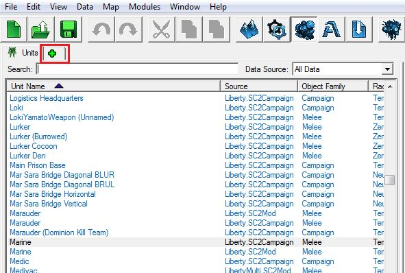
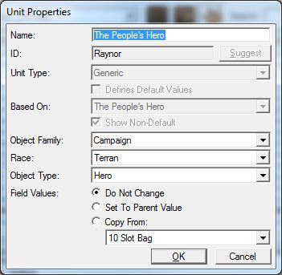
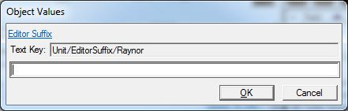
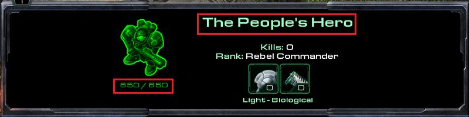
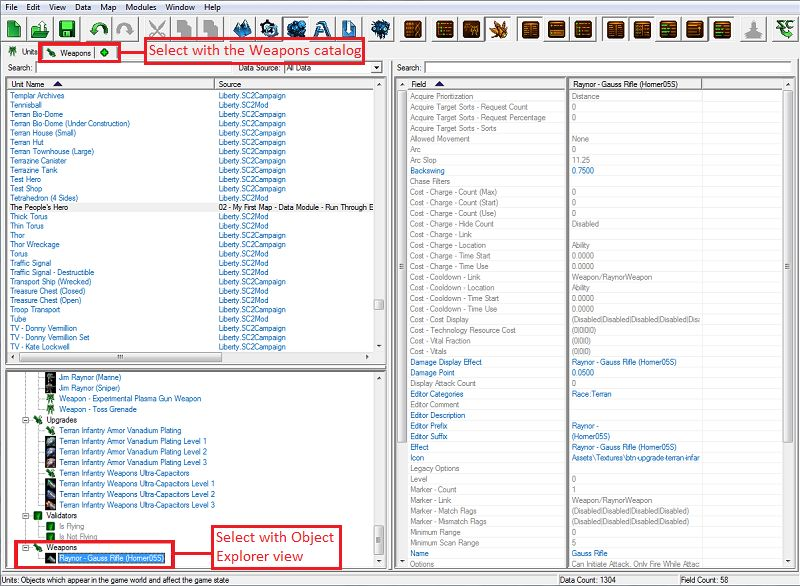
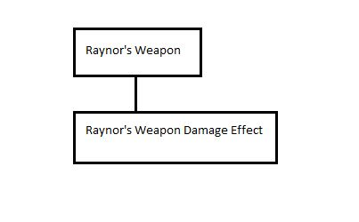
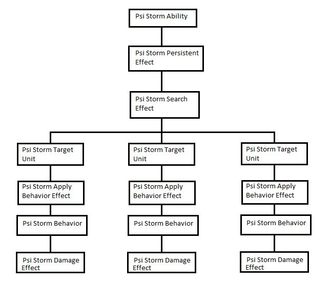

# Data Module - Part 2

## II. Changing Unit Name/Health/Armor/Energy

Time to change some data! The first bits of data we're going to modify will be simple, single-value fields, just to get our feet wet. We're going to change Jim Raynor (Commando)'s name, health, armor, and energy.

### A. To open the Units catalog:

1. The Units catalog should be open by default, but if it isn't, then click on the "+" tab located under the toolbar to open a context window of available catalogs.
2. 

3. Select "Edit Game Data" and then "Units."
4. 

5. The Units tab will appear in the same group of tabs as the "+" tab that we used to open the Units catalog. Any catalogs that you open up will add tabs.

### B. Name

1. Scroll through the list or use the search bar above the Units object list to find and select Jim Raynor (Commando).
2. Right-click on the object and select "Modify Unit..." or just press [Enter] with the object selected.
3. Type in your desired name for the unit. We're going to go with "The People's Hero."
4. 

5. You'll notice that part of the old name is still there: "(Commando)." This is because this is not part of the unit's name; it's the unit name's suffix. Each object can have a prefix and a suffix attached to it that shows up in the editor, but not in game. This makes it easier to differentiate between two different objects that share the same name. In this case, we have 3 different Jim Raynor units that are used on various missions in the campaign. We use different suffixes to differentiate between them in the editor.
6. To remove the unit suffix, make sure that the unit is selected in the object list, and then look at the list of fields and find the "Editor Suffix" field. Double-click on the field value to bring up a window that will let us modify the unit's suffix.
7. 

8. Delete the "(Commando)" text and press OK.
9. 

You may notice that our Unit object changed colors in the editor from blue to green. This is because this unit contains data specific to the map we're working on right now. The basic color scheme is:

- Grey: basic, default, core gameplay data
- Blue: data from a Blizzard dependency or mod, like liberty or campaign data
- Orange: data from a custom dependency or mod
- Green: data from the map file you're currently working in.

C. Health

Next, we are going to change Raynor's health. We'll need to modify 2 field values: Life Maximum and Life Starting Amount. We changed both values to 650.

### D. Armor

Armor values are listed under the Life Armor field. We changed Raynor's armor to 3. We also changed Life Armor Name to "The People's Armor."

### E. Energy

Last, we are going to change Raynor's health. We'll need to modify 2 field values like we did for Raynor's health: "Energy Maximum" and "Energy Starting Amount." We're going to change his abilities so that he uses abilities that cost no energy, so we set both values to 0.

### F. Test It Out

Now that we've changed some unit data, let's save our work and run the map to see our changes. Upon starting the game and selecting our modified unit, we should see that he has a new name, health, armor, armor name, and that he no longer has energy:

## III. Changing weapon fire rates and damage

We're going to pretend that Raynor doesn't have a special gun that is more powerful than other marines; he just takes more time to line up his shots and hit his targets where it hurts. To make it seem like that is happening, we're going to change the firing rate of Raynor's weapon so that it is slower than normal, and then increase the damage that the weapon does.

### A. Weapon Period

Units' attack information isn't stored in the unit data directly. Sometimes, we want a unit to have more than one attack, like the Hydralisk or Roach, which have both melee and ranged attacks.

So, to change the firing rate of the weapon, we need to select Raynor's weapon in the Weapons catalog. We can either select the catalog from the "+" tab like we did before to show the Weapons catalog and then find Raynor's weapon in the list (called Raynor - Gauss Rifle (Horner05S)), or we can use the Explorer section to find Raynor's weapon:

With the weapon selected, find the Period field and change its value to 1.92, which is roughly twice as slow as it is normally. We also changed the weapon's name from Gauss Rifle to The People's Gun.

### B. Weapon Damage Effect

Data for weapons is stored in two different locations. Information about how the weapon is used is stored in the weapon data itself. Information about what the weapons does when fired/used by the unit is stored in the Effects Catalog.

Effects are the movers and shakers in data. Whenever something acts on something else, it does so through effects. Abilities, Behaviors, and Weapons can all trigger effects. The Psi Storm ability triggers a set of Psi Storm effects. The Mothership Cloak behavior periodically triggers an effect that searches for units to cloak. Weapons also trigger effects when they are fired.

We won't go into too much detail about how effects work in this tutorial. It is a very versatile system, but as such, there is a lot to explain.

- Effects work in a chain of events that unfolds like a tree.
- One effect can trigger one or more other effects, each one serving a purpose.
  - Some are simpler than others. Raynor's weapon calls on a single effect that does damage to the unit we target with the weapon.
  - 

  - Some are more complicated, like Psi Storm. Psi Storm calls an effect which lasts for a few seconds, and periodically calls another effect that searches a small area to find units. This search effect calls an effect on each unit it finds that damages the unit.
  - 
- There are also different types of effects.
  - Some exist simply to call other effects.
  - Some exist to deal damage.
  - Some exist to search for units in an area.

### C. Test It Out

Let's save our work and run the map again to see our changes. Raynor should be able to attack less frequently, but deal more damage per hit:

Navigate onto :

- [Previous Part](../1)
- [Next Part](../3)