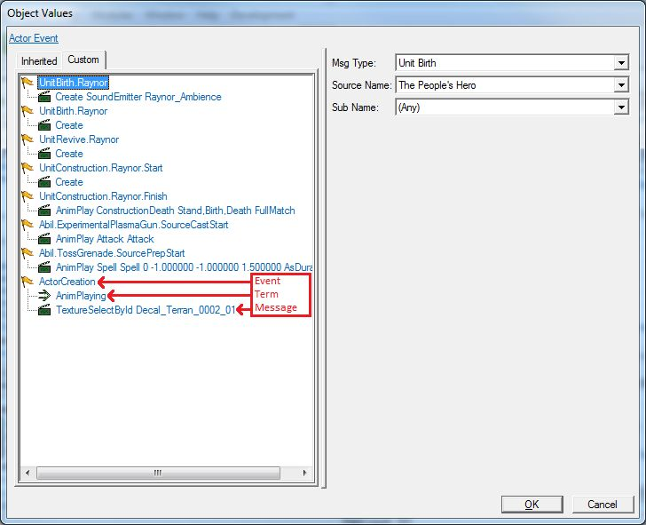
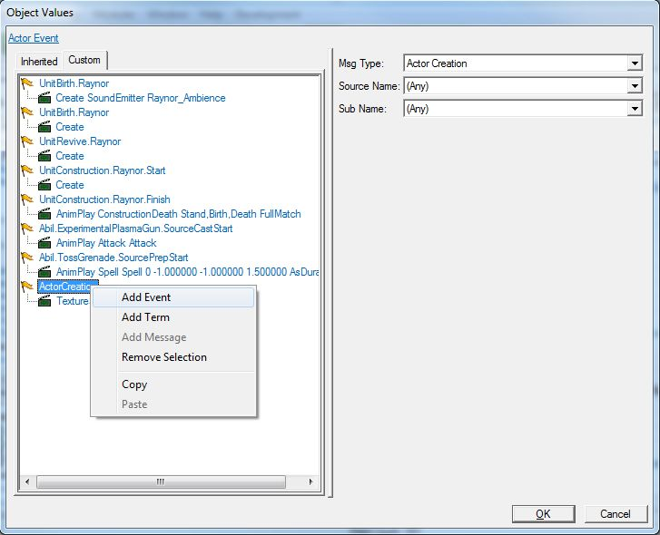
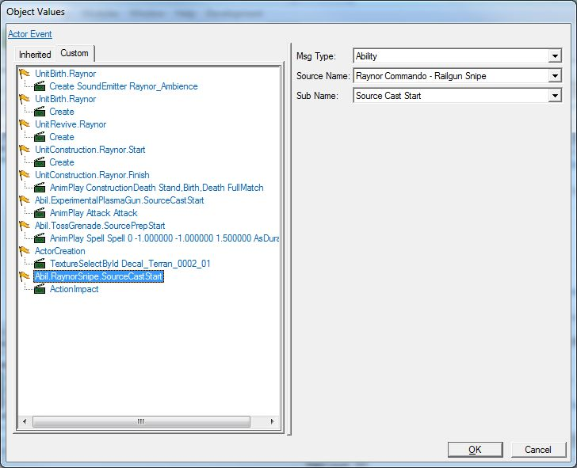
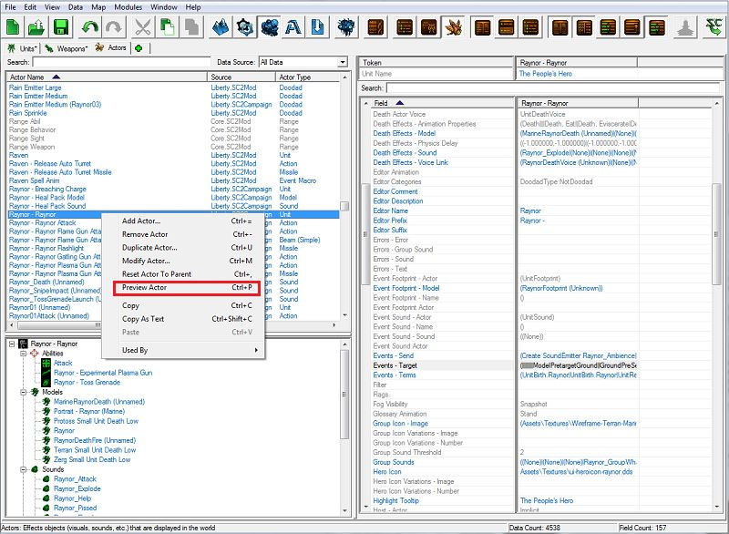
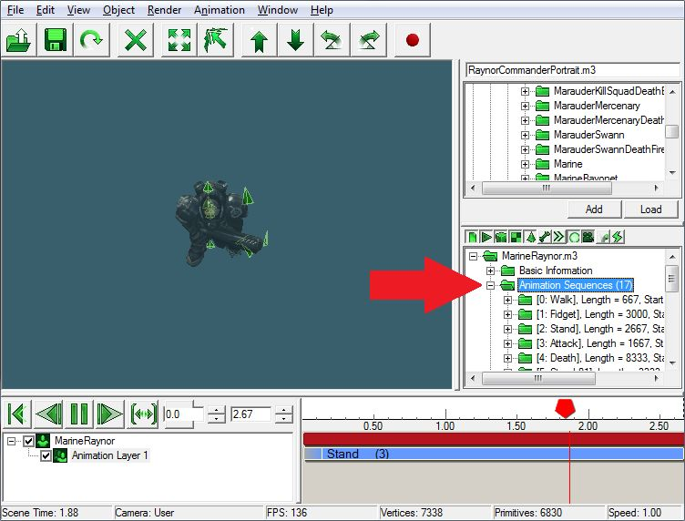
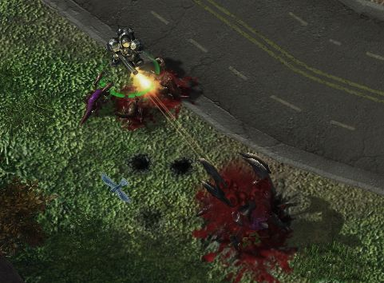
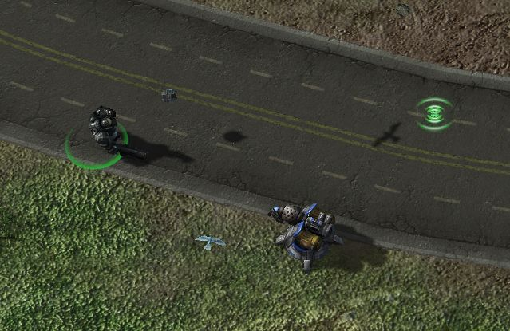

# Data Module - Part 4

## V. Adding animations to units

You may have noticed while testing out the abilities that The People's Hero just stands there like a doofus when you tell him to use his abilities. Sure, he still uses the abilities, but he doesn't lift a finger to make them happen. It's as if he is able to shoot grenades from his belly button, and create turrets and make zerg units explode from sheer thought alone. To make The People's Hero correctly animate when he uses his abilities, we have to delve into the Actor catalog. Like the Effects catalog, Actor is a very versatile, but complex system.

- While the Units, Abilities, Effects, and other catalogs define what happens in StarCraft II, the Actor catalog if where we define what it looks and sounds like when it happens. Each unit, effect, and ability that you see in-game is tied to an actor.
  - All information about how a unit works is stored in the Units catalog:
    - Hitpoints
    - Energy
    - Abilities
    - Movement Speed
  - All information about what the unit looks like is in Actor:
    - Model
    - Animations
    - Unit Icons
    - Sounds
- Like with effects, there are also different types of actors. Actors can be made to control:
  - Units
  - Missiles
  - Sounds
  - Effects
  - Etc.
- We tell actors what to do and when to do it with Actor Messages. Each Actor Message has an Event, zero or more Terms, and a Message.
  - Event - We wait for something to happen in the game that will trigger the message we want to send to the actor. For example, we wait for a hellion unit to attack something.
  - Terms - This is similar to conditions in a trigger. When the event happens, we check to make sure that certain game conditions are true. For example, when a hellion attacks something, we check to see if it has an upgraded attack or not.
  - Message - The message is what we want to happen when the event takes place. For example, when the hellion attacks, we tell it to play its attack animation.

- Open the Actors catalog.

- Select Raynor - Raynor.

- Find and double-click the "Events +" field value to bring up the Actor Messages window. You can see the concepts of Events, Terms, and Messages that were explained before in practice.

  

For this ability, we are going to tell the Raynor actor to play his attack animation, since that will point his gun in the direction of the ability and look like he's shooting the Penetrator Round.

### Creating the Event

1. To create a new event, right-click the mouse anywhere in the Actor Messages list and select the Add Event option.

   

2. Select the new action we just created and we can see its event options on the right side of the Actor Messages window.

3. For Msg Type, select Ability from the list.

   1. There are many different message types, from unit creation, to abilities being used, to units dying, to behaviors being added to or removed from a unit, and much more.
   2. Selecting Ability from this list will let us choose an ability that will fire off the Actor Message.

4. For Source Name, select Raynor Commando - Railgun Snipe.

   1. Since we selected Ability as our message type, the Source Name option lists all the abilities in the game.

5. For Sub Name, select Source Cast Start.

   1. Since we have Ability as our message type, Sub Name lists all of the different phases that an ability can have. This way we can choose when exactly during the ability our Actor Message will fire off.

   2. Some examples of ability phases are when the ability starts casting, when it finishes casting, when it starts or stops channeling, and when it starts or stops preparing to cast.

   3. Source Cast Start means when the source (our unit) starts to cast the ability. So when The People's Hero starts to use the Railgun Snipe ability, this Actor Message will fire off.

      

### Creating the Terms

For this Actor Message, and for the other ones we are going to make in this tutorial, we don't need to create any terms. We will cover terms creation in future tutorials. Suffice it to say for now that they work in a similar manner to creating events and messages.

### Creating the Message

1. When we created our event, a default message was automatically created underneath it. Select that message and we can see its options on the right side of the Actor Messages window.

2. Leave the Target field blank. The target refers to what actor we want to send this message to. Because we want to send this message to this actor, we don't need a target.

3. Change the Msg Type field to Animation Play.

   1. There are many, many different types of actor message types.

   2. We can change actor scale, actor color/tint, actor opacity, we can change what model this actor uses. We can even create other actors in actor messages.

   3. We also use actor messages to destroy actors when we are done with them, so if our event is "unit dies," our message can be "destroy actor."

      

4. In the Parameters section, select the Name field. Below the Parameters section, you will see a Name drop-down menu. To the right of that drop-down you will see a Customize button. Change the Name drop-down option to any of the available drop-down options, or press the Customize button to create your own name.

   1. The name of an animation doesn't have any bearing on the animation itself; it just lets us refer to it in other actor messages.
   2. For example, we can say "start playing the animation FunTimes" in one message, and then in another message say "stop playing the FunTimes animation."

5. Still in the Parameters section, select Animation Properties. Below the Parameters section, you will see an Animation Properties drop-down. Select Attack from the list.

   1. This contains a list of every animation name available in the game. Not every model has every animation. To see a list of what animations are available to a particular actor, right-click the actor in the Object List, and select Preview Actor.

      

      This will open up the Previewer window (which we will go into more detail about in a future tutorial), and display our actor's model and information. In the middle on the right-hand side of the previewer window is a list of folders. Expand the Animation Sequences folder and you will see what animations are available to the actor model you're viewing.

      

   2. When you select an option from the drop-down, a second drop-down will appear, letting you add more modifiers to the animation. In this case we do not need any modifiers.

6. In the Parameters section, change the Time Type from Automatic to Duration and the Time Variant from -1 to 2. This will make the animation play over the course of 2 gametime seconds. If we had left these options set to their default values, the animation would play its default speed and then stop, which is faster than the ability takes to cast.

7. We're going to leave everything else alone in the Parameters section.

## B. Toss Grenade

For this ability, we are going to tell the Raynor actor to play his Spell animation, which will make the Raynor actor make an overhand throwing motion and look like he's throwing the grenade. When the Actor Message is all set up, it should look like this:

For this ability, we are going to tell the Raynor actor to play his Spell animation like we did with the Toss Grenade ability so that he looks like he's throwing the turret. When the Actor Message is all set up, it should look like this:

Now that we have the rest our hero's ability animations all hooked up, let's save our work and test them in-game.

That's it! We've set up our custom hero, The People's Hero, with new health, armor, and energy values, a modified weapon, and new abilities. Throughout the course of these three tutorials, you have been acquainted with the StarCraft II Editor. We have only just scratched the surface, but hopefully this series of tutorials has started to build a solid foundation for you to explore terrain, triggers, and data to make a wide variety of maps. In future tutorials, we will learn more about data, advanced trigger concepts, and more. And don't forget that there is a plethora of existing mods and maps both included with the game and on Battle.net that have examples of how to create terrain, triggers, and data for your own custom maps. Until next time, happy editing!

Navigate onto :

- [Previous Part](../3)