# Mapmaking: Best Practices in Art and Performance

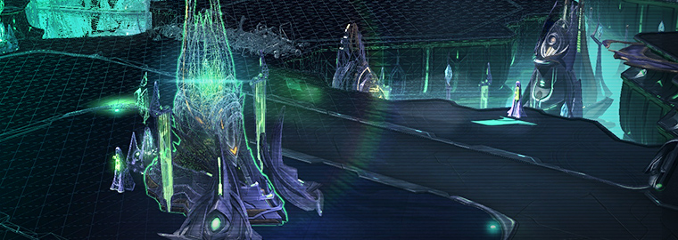

Last week, our friends over at Team Liquid announced the 7th Team Liquid Map Contest! We’re extremely excited to see the creative minds of the community develop new and interesting maps for us all to play on in the coming ladder seasons.

As mapmaking activities ramp up across the community, we wanted to take this opportunity to share with you some best practices that we felt would be beneficial for all our community mapmakers to be aware of. These best practices are wholly related to the artistic-side of mapmaking, and their use allows maps to not only look great, but also to perform well on the huge variety of machines which our players play StarCraft II on. So, without further ado, let’s start by discussing doodads: the various structures, vegetation, and decorative models available to mapmakers.

## Doodads

[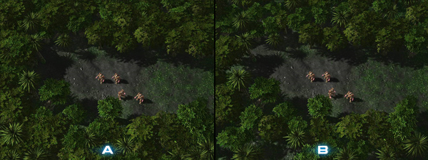](./resources/mapmaking-best-practices02.jpg)

**Image A:** In this scene there are 200 trees. While this might look nice, it is unnecessarily tough on performance. Many trees are overlapping or covered by other trees.

**Image B:** Here, there are half as many trees, but each tree has been given more space and there is less overlap, and the general look is preserved. This is valuable for players with less performance to spare.

[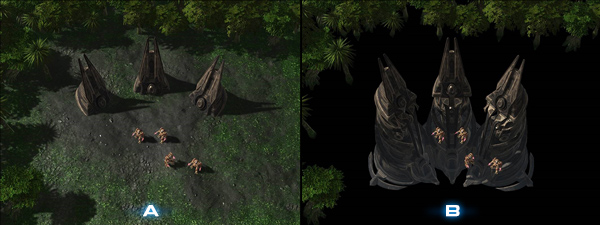](./resources/mapmaking-best-practices03.jpg)

**Image A:** These doodads have a hidden cost. . .

**Image B:** When the terrain is hidden, you can see the rest of the doodad that has been lowered beneath the terrain. Large doodads like this are still *completely* rendered and have a large overdraw.

[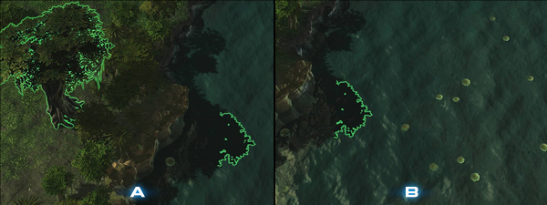](./resources/mapmaking-best-practices04.jpg)

**Image A:** Why is overdraw bad? Here is a large tree near water (which is already expensive to render). You can see the shadow on the water.

**Image B:** In this image you see that *even when you move the camera away* and the tree is no longer on screen, the shadow is still visible, which means that the tree still has to be rendered.

[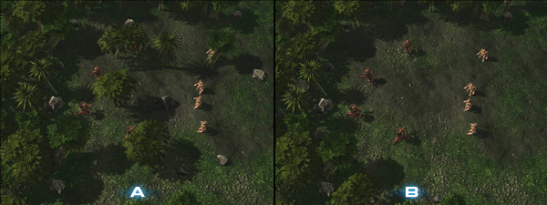](./resources/mapmaking-best-practices05.jpg)

**Image A:** While it looks more natural to have objects placed evenly in areas, this can obscure units, or give unfair advantage to certain units.

**Image B:** Try to keep areas of gameplay unobstructed and leave most of the doodads to be placed in non-playable areas or in areas that you do not want players to go.

------

## Lighting & Shadows

[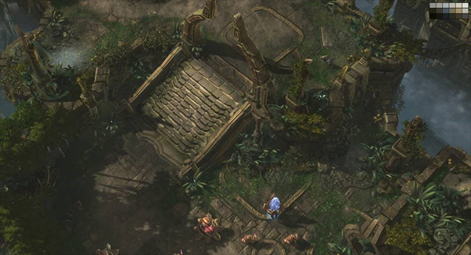](./resources/mapmaking-best-practices06.jpg)

When creating a level, choose doodads, fog, and lighting that all harmonize in color by limiting your pallet. Having too many colors can be distracting from the gameplay by pulling focus away from the units. 

[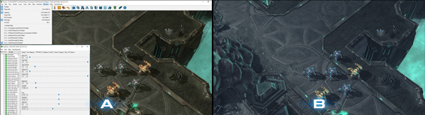](./resources/mapmaking-best-practices07.jpg)

When lighting your level, the highest priority should be **unit readability**.  On the left, you’ll see the MarSara lighting, which is a good place to start. From there, try playing with the settings to set the tone and mood for your level.  The image to the right has nice moody lighting, yet the units remain readable.

[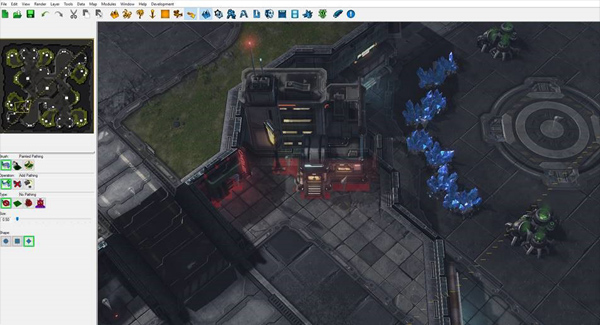](./resources/mapmaking-best-practices08.jpg)

Make sure to paint pathing wherever doodads appear on your map.  This will keep units from entering into the geometry of the meshes.  This includes filling gaps where small units like zerglings get stuck.  Hit the H key to get to the pathing menu.  

[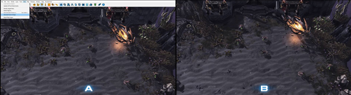](./resources/mapmaking-best-practices09.jpg)

Generate foliage and build your shadows for a level to look more polished.  They can be both be found in the data menu on the top task bar.  Ctrl+Shift+L builds shadows.

Keep in mind that if you move any doodads in the level this will break the shadowmaps and you will have to rebuild the lighting again.

------

## Painting & Effects

[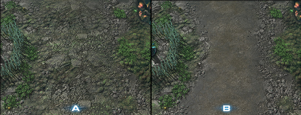](./resources/mapmaking-best-practices10.jpg)

**Image A:** In this image, it is somewhat difficult for players to understand which way they should be sending their units on the map.

**Image B:** This presentation clearly leads players by using trails and doodads on the terrain. This approach helps people know where to go and locate important areas on your map.

[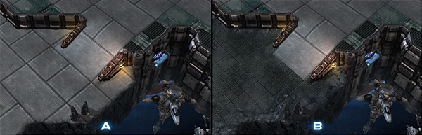](./resources/mapmaking-best-practices11.jpg)

**Image A:** In this image, it is harder to tell at what point you’re approaching a higher or lower level of terrain. This is an important aspect of a map to consistently highlight.

**Image B:** Here, we see the different levels of cliffs with cliff textures that have varied color values. This helps players know they are approaching high or low levels of terrain.

[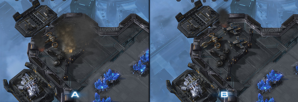](./resources/mapmaking-best-practices12.jpg)

**Image A:** When adding effects with particles, be considerate to performance outside of your machine. Too much smoke can cause particle overdraw, *drastically* reducing the performance on your map.

**Image B:** In this image, we still get the feel of a small destroyed air-vehicle outpost (perhaps even more so!), and the cost is significantly less in terms of performance.

[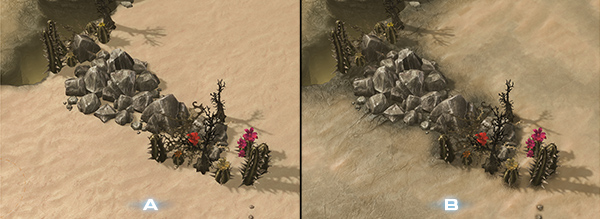](./resources/mapmaking-best-practices13.jpg)

**Image A:** Remember to add the artistic flavor! This image shows some destructible rocks and organic doodads that feel quite out of place standing against the immaculate sand beneath them.

**Image B:** Try to paint textures underneath doodads that make sense for the location. This image shows the same rocks sitting on a rocky dirt type texture, which helps ground the assets into the terrain.

------

We hope that you find these best practice tips useful for the maps that you design in the future! Please don’t hesitate to ask questions or seek further clarification in the comments section below, and feel free to return to this page often to reference these practices so that your maps can be quickly and easily made ready for players around the world to play on. We love your passion for mapmaking, and we want to do all we can to enable you to make the best maps possible – let us know if there are other ways we can help, and thanks!