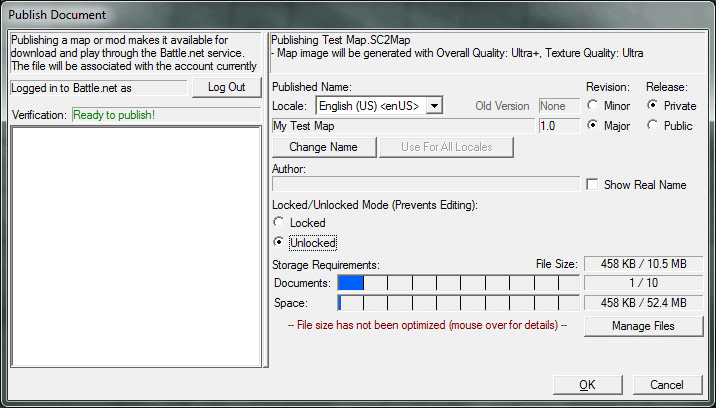
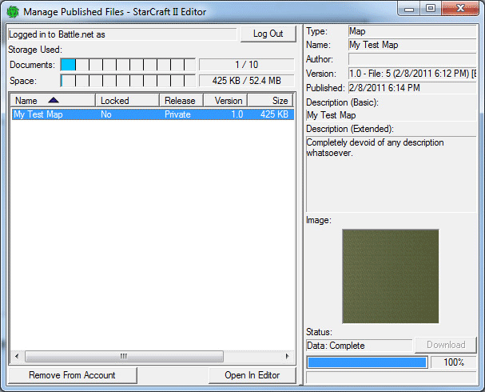

# PUBLISHING

The new Battle.net publishing system allows you to publish your maps and mods directly to the Battle.net service, where they are permanently stored online and made available for others to play within the game. If you want to play your map online with other players, or if you want others to be able to use your mod in their maps, it must first be published to Battle.net.

## PUBLISHING YOUR MAP OR MOD

Publishing is done through the editor. First, open the map or mod you want to publish, and use the File > Publish command from any module window. This will open a dialog for configuring the publishing details, as follows:

Log In - Click the Log In button in the left panel to log in to Battle.net using your Battle.net account and StarCraft II character.

- Published Name - The published name of your map or mod is what uniquely identifies it on Battle.net, and this name must not already be in use by any existing map or mod that has already been published by another user. By default, this will be the name defined through Map > Map Info or in the Document Info component within the Overview Manager.

If this name is already in use, or if you want to publish using a different name, click the Change Name button to enter a new name. You may also specify a different name for each language the game supports, but this is not required. Note that the name in each language must be unique across all languages.

- Revision - Each published file has a version number associated with it. When you re-publish a map or mod that you have already published (that is, using the same published name), this version number will be incremented automatically. You can choose to increment it as a Minor revision, which generally means only small tweaks or fixes have been made, or as a Major revision, which means significant changes have been made.

- Release (Maps only) - When you choose a Private release, the map will not be available to other players within the game, and only you will be able to create games using this map, after which you may invite other players into the game. This is a good way to test your map with friends online before releasing it to everyone. When you choose a Public release, the map will be available to the entire StarCraft II community, and anyone can create a game using your map.

- Author - The author name will automatically display as your StarCraft II character, or you may optionally choose Show Real Name to have your real name shown instead.

- Locked For Editing (Maps only) - Before publishing a map for the first time, you are required to choose whether it will be Locked or Unlocked.

> NOTE: Once published, a Locked map cannot be opened in the editor by anyone, including yourself. Choose this option if you want to prevent others from viewing or copying your map using the editor. However, make sure to retain a local copy of your map for future modification in the editor.

> NOTE: An Unlocked map can be opened by other users within the editor. Choose this option if you would like share your map with other map makers. This is a good way to contribute to the map making community, but keep in mind that others will be able to copy and publish the map as their own.

- Locked (Owner Use Only) (Mods only) - Similar to maps, mods must also be either Locked or Unlocked.

> A Locked mod will not be available to other users, and only you will be able to include it in the maps you make.

> An Unlocked mod can be used by others in their maps, and sharing your mods with other map makers can benefit the map making community significantly. But as with maps, remember that an unlocked mod may also be copied by others.

- Storage Requirements - Battle.net has the following limits for published files per user: up to ten individual maps or mods (represented as "slots" in the dialog), with no more than 50 MB total size, and no more than 10 MB used for any single map or mod.

If there are any additional requirements for publishing the map or mod, they will be listed on the left. Once everything has been configured, you can accept the dialog, and your file will be uploaded to Battle.net. Upload progress can be seen in the File Transfers window which will automatically be shown. When the upload is complete, you can hop in the game and play your map!

## MANAGING YOUR PUBLISHED FILES

Once you've published one or more files to Battle.net, you can use the File > Manage Published command from any editor module to open a window for viewing all of your currently published files. You can log in to Battle.net from this window, and must do so in order to see your files.

- Storage Used - Shows you how many publishing slots and how much storage space is currently being used by your account.

- File List - Lists all maps and mods published to your account, with basic details about the status of the files. Selecting a file will show additional information and a preview image on the right.

- Remove From Account - This button will remove the selected map or mod from your account and free up a storage slot. This means it will no longer be available for play or use through the Battle.net service. Note that for mods, any existing published maps that include the mod will still be able to access the old mod data, but newly created maps will no longer be able to use it.

- Open In Editor - This button will open the map or mod in the editor, where it can be modified and saved to a new local file. This can only be done for Unlocked maps or mods.