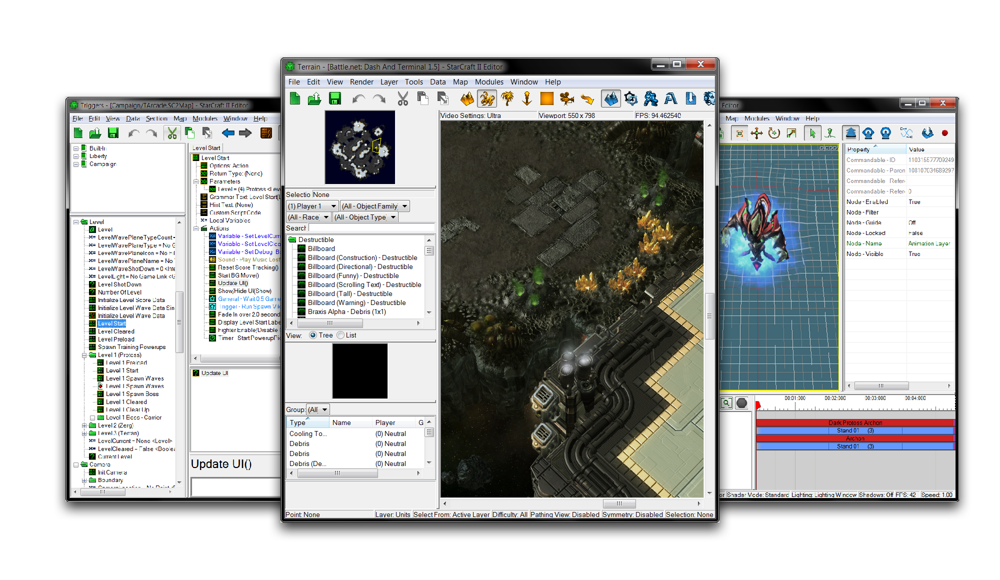
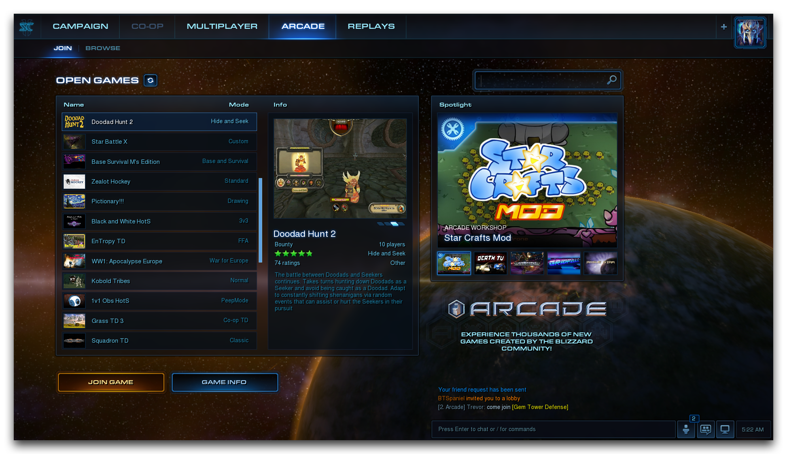
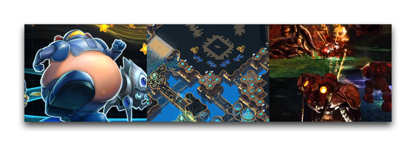

# Introduction

The StarCraft II Editor is a suite of tools for game development bundled with StarCraft II. These are the very same tools Blizzard themselves used in the development of the latest version of StarCraft. Together with Battle.net and the Blizzard Arcade, the Editor offers a robust game-development platform, hosting system, and multiplayer network.

The StarCraft II Editor was first released with Wings of Liberty in 2010, giving players access to all of the game\'s art and assets. This continues Blizzard's tradition of offering its player community full access to its own creative tools, which began with the release of WarCraft II: Tides of Darkness in 1994. With each edition of StarCraft II, more has been added to the Editor, including an official pack containing all of Warcraft III\'s assets.

## The Arcade

The StarCraft II modding community has responded by creating thousands of custom maps and mods. All of their creations can be found on a Blizzard-hosted platform called the Arcade, which players can access using the StarCraft II game client. In the Arcade players can discover, play, and share in a vibrant online game development community. Using the Editor will give you access to this community, including the ability to exhibit your own projects, present them to an audience, get feedback, explore other people\'s games, get inspired, and most of all play.

## Capabilities

The Editor is a professional-quality game engine with a broad range of features, including its own scripting language. Despite that, you won't need coding experience to get started. If you\'d like to start educating yourself on how to use the Editor, then you've come to the right place. This site serves as an essential manual and course plan for anyone learning to use the StarCraft II Editor. So read on for an introduction, then start exploring the site.

Thanks to its history as one of the first community tools for map design, the Editor is often referred to as the 'Map Editor.' However, the Editor stretches far beyond simple map creation. It is robust game engine that you can use to build a diverse range of games, maps, and modifications to the StarCraft II experience.

If you're a fan of competitive StarCraft II, you can create new melee maps for other StarCraft II players to battle on. Your map could even become popular enough to be the setting for the decisive game in a premier eSports championship.

From there, you can being to tweak and explore StarCraft's gameplay. You can apply custom data modifications to any existing StarCraft II melee map, including maps you've created yourself. You can then build your maps out into full custom campaigns, telling your own stories in the world of StarCraft.

Alternatively, you can set out to create your own game type. Developers have made things from simple environments, to complex tower defense maps, and even sprawling RPG epics. You can draw inspiration from the long history of custom games from Warcraft and StarCraft, a vibrant modding culture that birthed genres like Tower Defence and Hero Brawlers, such as DotA and our own Heroes of the Storm (a game whose prototypes were built in the StarCraft II Editor).

The Modules
-----------

Modules are major divisions of the main Editor. Each presents a smaller, more focused editor for a specific section of the game development process. As individuals tools each Module is highly specialized. As a whole, they give you the creative control you need to build an entire game.

 * **Terrain Editor:** The terrain Editor allows you to sculpt the terrain and give game worlds. Melee mappers can paint landscapes for competitive battles, and for other type of creations this is the main tool for building a world's appearance.
 * **Trigger Editor:** The Trigger Editor is where you'll bring life and logic  to your game. You can choose to use either StarCraft II\'s internal  scripting language or a helpful GUI system suitable for newcomers to programming.
 * **Data Editor:** The Data Editor is the storehouse for both the existing game assets and your own unique creations. Here you can engineer things like units, buffs, abilities, effects, sounds, and more. As you gain experience creating games, these creations will always be there, ready to be repurposed in new playfields.
 * **Importer:** The Importer allows you to introduce custom-designed assets from outside the Editor, including 3D models, images, music, or anything else you need.
 * **UI Editor:** The UI Editor gives you the tools to define and create custom interfaces, or to alter those already found in StarCraft II.
 * **Cutscene Editor:** The Cutscene Editor allows you to create your own cinematics, serving as a tool for both in-game storytelling and Machinima content to be presented outside the game.
 * **Text Editor:** The Text Editor allows you to change fonts, styles, and other typographical effects in the game\'s texts.
 * **AI Editor:** The AI Editor is where you'll create and alter the artificial intelligence that determines unit actions, make an ultimate competitive foe, or define the thinking for your custom game\'s computer-controlled inhabitants.

Onward!
-------

Now is the perfect time to start learning and creating. This site will serve as a guidebook while you launch yourself into the many creative possibilities of the StarCraft II Editor. Read on, and remember to have fun.

Adventures await! (credit: njordys)
