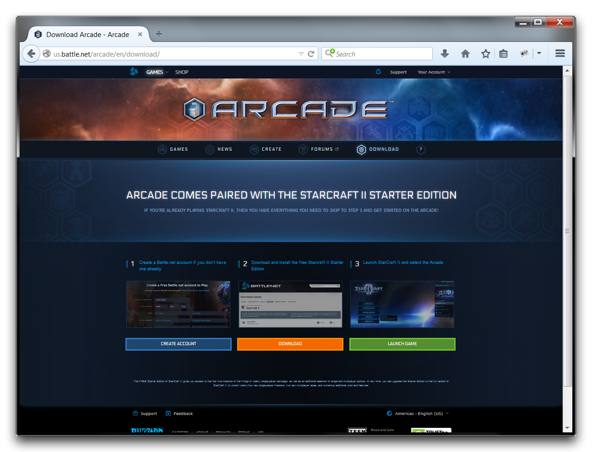
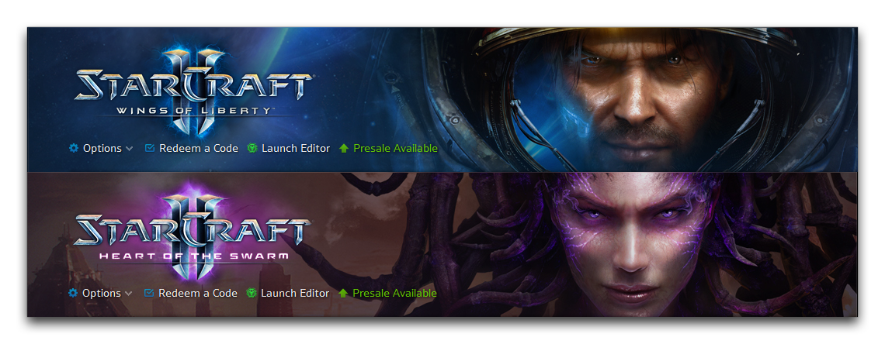
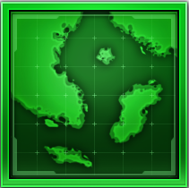
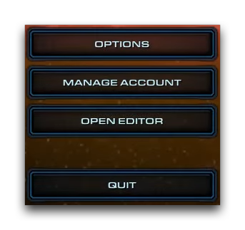
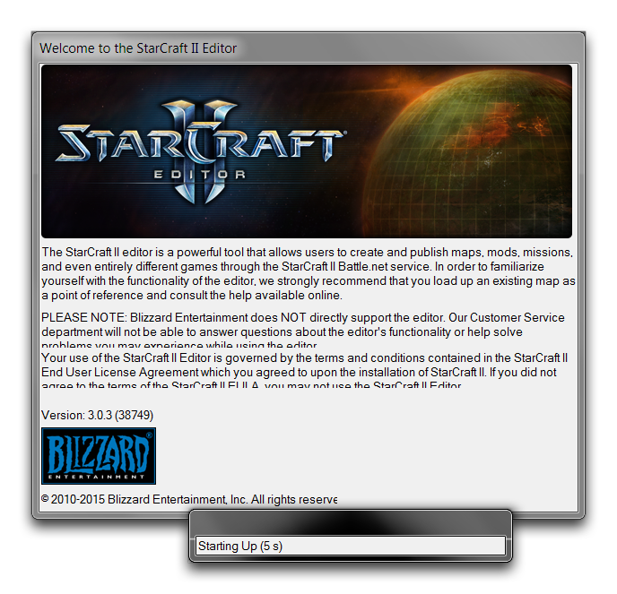

# Getting to the Editor

The Editor is bundled with all editions of StarCraft II, including Wings of Liberty, Heart of the Swarm, and Legacy of the Void. It is also included with the free StarCraft II Starter Edition. You can download the Starter Edition by heading to us.battle.net/arcade/en/download, pictured below.

Once you have downloaded the client, you can access the Editor through the Battle.net launcher.

You'll find the 'Launch Editor' button just below the header link in the launcher. The image below shows how this looks in two versions of the launcher.

You can also find the Editor linked locally, both in the StarCraft install folder and any Start Menu links. Its icon is pictured below.

You'll also find that opening any native .SC2Map files will launch the editor. Their icon is pictured below.

You'll also find a tab on the left side of the StarCraft II login screen with a link titled, 'Open Editor.' This menu is pictured below.

Once you've launched it, the Editor will display its start-up screen while it loads. Depending on your game settings and the default map set to load, this may take some time. The start-up screen is shown below.

