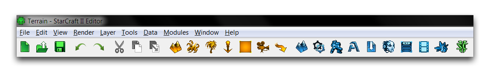
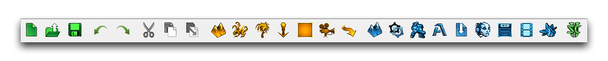
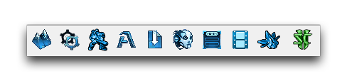
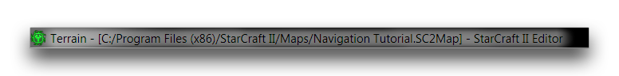
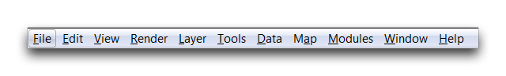

# Navigating the Interface

The Editor is split into eight distinct Modules, each presenting a different view of the game-building process. This division is very useful in separating and understanding each part of the development process. However, the number of different views available means that it can take a little time to understand the basic rules for navigating both the general environment and each individual Module. Below you'll find a quick description of the toolbars, views, and utilities available globally throughout the Editor.

If you'd like to learn more about the interface specific to each Module, you can refer to the articles that cover those Modules in more depth.

## Toolbars

At the top of any Module, you'll find a collection of tabs and toolbars that will follow you through each view of the Editor. These components will change slightly according to which view you have of the Editor, offering relevant options for each Module. From top to bottom, its main components are, the Title Bar, the File Bar, and the Main Toolbar.

The Main Toolbar, is a constant throughout the Editor. Despite looking
like a single, solid bar, it is in fact composed of three components.
Two of those components, the leftmost Utility Bar, and the rightmost
Navigation Bar are constant, maintaining the same buttons regardless of
your location in the Editor. The central portion of the toolbar is a bar
that targets the current Module. These include the Terrain Bar, Trigger
Bar, Data Bar, AI Bar, UI Bar, Cutscene Bar. The Importer and Text
Editor have no specific bar, but you'll find an Overview Bar in the
Overview Manager. The main toolbar is pictured below.

## Utility Bar

The Utility Bar offers several standard functions that are relevant to
every Module. You can identify this bar by its green buttons. Below you
will find an image of the bar and a breakdown of its functions.

| Button         | Functionality                                                |
| -------------- | ------------------------------------------------------------ |
| New (Ctrl+N )  | Launches the 'New Document' window, allowing you to create new maps and mods. |
| Open (Ctrl+O)  | Launches the 'Open Document' window, allowing you to open either local files or files to be downloaded from Battle.net. |
| Save (Ctrl+S)  | Saves the current file.                                      |
| Undo (Ctrl+Z)  | Reverts the last change made in the current Module.          |
| Redo (Ctrl+Y)  | Reapplies the last reverted change made with Undo.           |
| Cut (Ctrl+X)   | Removes the current selection and saves it to the clipboard. |
| Copy (Ctrl+C)  | Copies the current selection to the clipboard.               |
| Paste (Ctrl+V) | Places the elements currently stored in the clipboard. For Cut, this will also clear the clipboard. For Copy, the clipboard retains its selection. |

Note that these operations are context sensitive, you can use them on different types of elements depending on your current Module in the Editor. This means that, if you are in the Trigger Editor, copy and
paste will operate on things like triggers, actions, or events. Similarly, if you are in the Terrain Editor, you can copy and paste entirely different elements, like units or doodads.

## Navigation Bar

The **Navigation Bar** is used for moving from Module to Module. You can identify it by its blue buttons. Below you'll find an image of the bar and a description of its functions.

| Function                   | Effect                                                       |
| -------------------------- | ------------------------------------------------------------ |
| Terrain Editor (F5)        | Navigates to the Terrain Editor.                             |
| Trigger Editor (F6)        | Navigates to the Trigger Editor.                             |
| Data Editor (F7)           | Navigates to the Data Editor.                                |
| Text Editor (F8)           | Navigates to the Text Editor.                                |
| Importer (F9)              | Navigates to the Importer.                                   |
| AI Editor (Shift+F5)       | Navigates to the AI Editor.                                  |
| UI Editor (Shift+F6)       | Navigates to the UI Editor.                                  |
| Cutscene Editor (Shift+F7) | Navigates to the Cutscene Editor.                            |
| Overview Manager (F12)     | Navigates to the Overview Manager.                           |
| Test Document (Ctrl+F9)    | Launches the current map for testing, as specified in 'Preferences.' |

This bar hosts the incredibly useful 'Test Document' function, which you'll be using a lot. You can also use it to navigate to the Overview Manager, which functions as a sort of bird's eye view of the entire project and each module.

## Additional Bars

The Title Tab displays the current location in the Editor, as well as the current location and file structure of your active project. An example is shown below.

When accessing a file from battle.net, the file structure will take the form of \[Battle.net: FileName\].

The File Bar is also where you'll find many tabs with options relevant to all aspects of a project. Similar to the Main Toolbar, it offers the File, Edit, View, Map, Modules, Window, and Help tabs regardless of your location. You'll find several other context-sensitive options depending on your current location in the Editor.

The Editor also offers a context-sensitive bar with functions only available and relevant to your current location. These are discussed in more detail in the articles that describe the main locations in the Editor, the eight Modules and the Overview Manager.

## Hotkeys

The Editor has extensive support for hotkeys, it also allows complete customization of all of its standard controls. You can set hotkeys for almost any function available, most of which do not have any default hotkeys. You can access the hotkey controls by navigating to File -\> Configure Controls. This will launch the 'Configure Controls' window, which is shown below.

