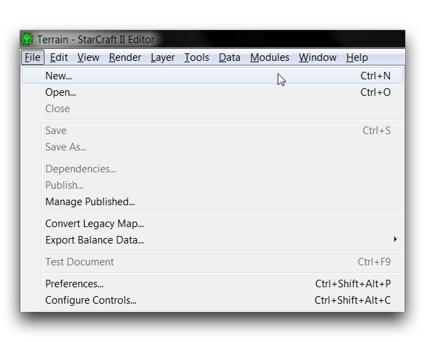
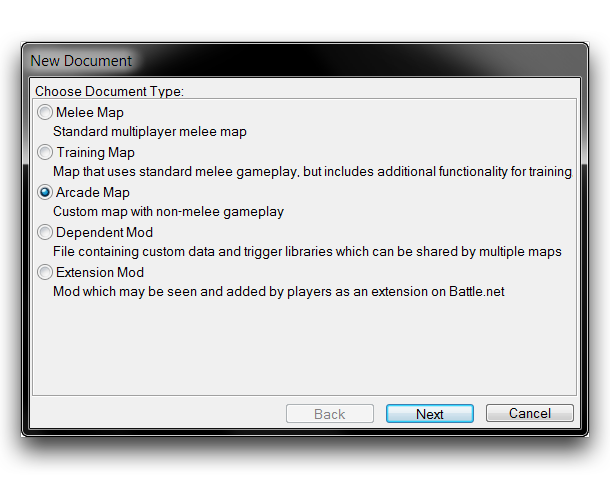
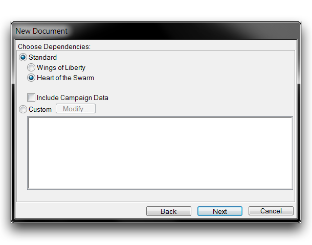
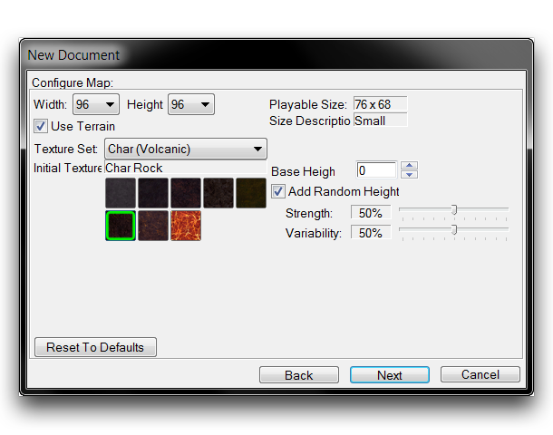
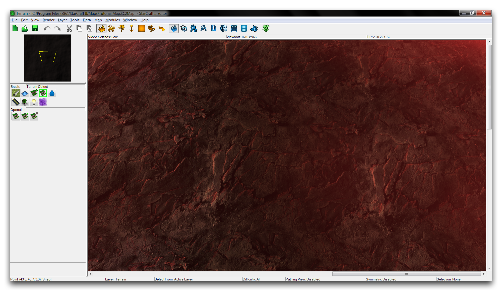

CREATING A MAP
==============

The first step in any project is the creation of a new document, either
a map or a mod. When you are creating a document, you'll be presented
with options to help you configure your project quickly. Any of these
initial configurations can be changed later within the Editor itself.

MAP CREATION OPTIONS
--------------------

With the Editor launched, navigate to the file tab in the top left
corner of any Editor screen.

File Menu

This will bring you to the 'New Document' window, where you can select
the type of document you wish to create.

Choosing Document Type

For this scenario, select 'Arcade Map' by clicking the button to its
left, then hit 'Next' to proceed. You will be brought to the dependency
section, pictured below.

Choosing Dependency

Dependencies describe which mod files will provide assets to a project.
You can always proceed by navigating to the 'Custom' heading, then
selecting nothing. This would provide an entirely blank project, with no
mod file dependencies. In this example, you'll use the substantial
archive of StarCraft assets, typically known as the 'standard
dependencies.' Access to the standard dependencies is one of the primary
strengths of working with the Editor.

To import the most recent iteration of StarCraft's assets, select the
'Heart of the Swarm' standard dependency, then proceed by selecting
'Next'. This will bring you to the map configuration section, pictured
below.

MAP CONFIGURATION
-----------------

Example Generation Options

The map configuration screen is where you'll make some basic decisions
about the initial look of your terrain. The effects of each option are
broken down in the following table.

  ----------------------------------------------------------------------------
  Property      Effect
  ------------- --------------------------------------------------------------
  Dimensions    Sets the initial full size of the map. You can change this
  (Width x      later from the Map Bounds options. Dimensions range from 32 to
  Height)       256 units, in increments of 8.

  Playable Size The actual area of a map in which units can path, the
                correction is made based on a hard-coded variable buffer on
                each side of the map. At some extremely small sizes this
                buffer is avoided.

  Size          A basic description of map sizes. Options include Tiny, Small,
  Description   Medium, Huge, and Epic.

  Use Terrain   Unchecking this cancels terrain generation. While you may want
                a terrainless map in some cases, it is functionally similar to
                a mod.

  Texture Set   Selects the 'Terrain Type' for a map, this is the palette of
                eight textures that will be used to build the ground in your
                environment. This also applies to creep visuals, cliff types,
                lighting, and atmospheric sound sets.

  Initial       On generation, the entire terrain will be painted this single
  Texture       type of the terrain set.

  Base Height   All terrain is generated at this default height. If the Add
                Random Height option is unchecked, the terrain will be
                produced as a smooth surface.

  Add Random    Creates random distortions in the Base Height at a magnitude
  Height        determined by the Strength and Variability option sliders.
                This is useful in producing a more naturalistic base for
                terrain.
  ----------------------------------------------------------------------------

Following the guidelines set out in our 'Example Generation Guidelines'
image above should give you a map that looks like the one pictured
below. This map is primed to begin a project with. At this time, it's
usually wise to save your file.

Newly Generated Char Rock
