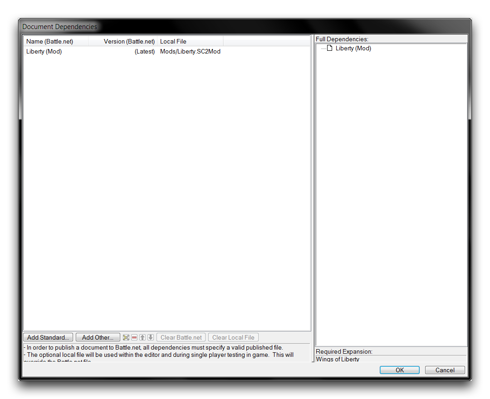
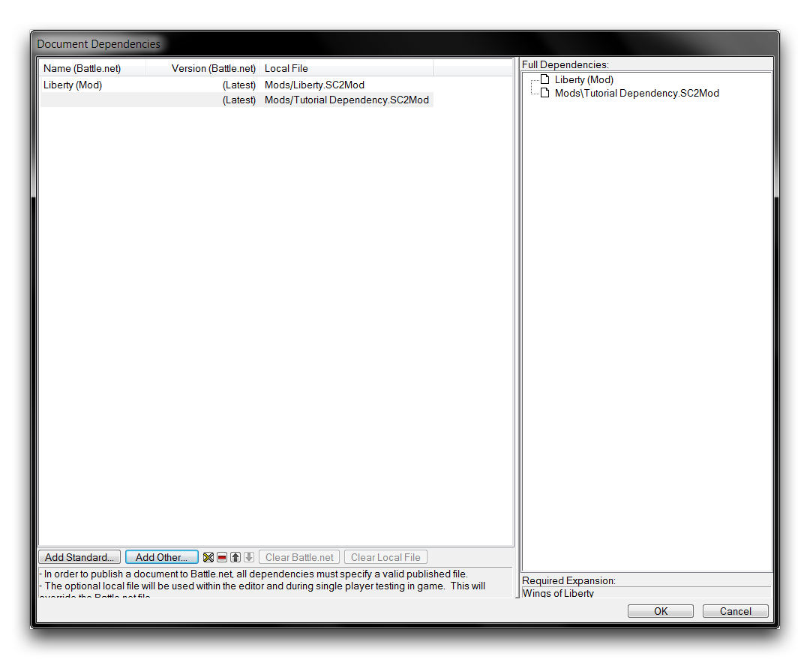
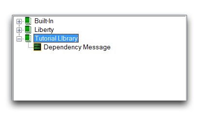
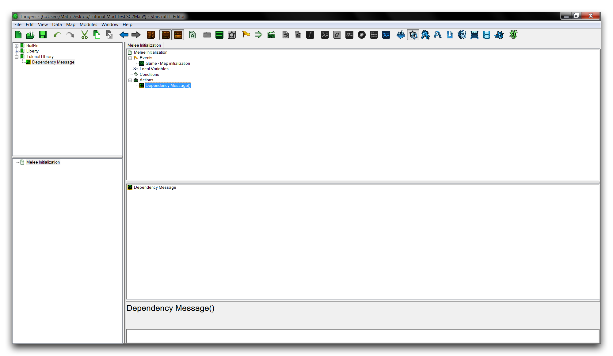

# Creating Mods

Although map files are always the final product of the Editor, mod files are the real heart of any project. By separating data from the constructed map, mods allow for projects that can be more freely developed and shared. This relationship goes beyond ease of use. Mods expand the possibilities of projects to extents that have never been possible in a Blizzard Editor. The best way to discover this is by experimenting with the Editor's ability to construct, combine, and utilize mods.

## Building A Basic Mod

Create a new document by navigating to File -\> New. This launches the 'New Document' window, in which you should choose to create a 'Dependent Mod.' Click 'Next' to proceed to the 'Choose Dependencies' heading, select 'Custom,' then click 'OK.' Now use the Terrain Module to navigate to Mod -\> Mod Info, launching the 'Mod Properties Window.' There, enter the title 'Tutorial Dependency' into the 'Name' field. You can also enter a description stating that, 'This is a tutorial dependency.' Use the image below as a guide.

*Mod Creation & Configuration Order*

You have now created a simple mod. The 'Dependent Mod' is the basic mod type. Its name comes from the fact that any map inserted into a mod enters into a relationship known as a Dependency. When you selected 'Custom' under the 'Choose Dependencies' view and left it blank, the mod file was set to have no base dependencies. An empty mod is the best starting point for an entirely custom starting project. The only information in your mod is the few details included in the last step.

Save your mod to your preferred location under the name 'Tutorial Dependency.' StarCraft assigns the .SC2Mod file extension to mods.

## Adding Data To A Mod

A mod's eventual purpose is to be a container for assets. You can learn more about this by populating your basic mod with some triggers. Note that a mod file will require a trigger library to hold its triggers. This is not the case for map files, which can support triggers that are outside of a library.

Move to the **Trigger Module**, here you'll create the Trigger Library. Do so by right-clicking on the **Triggers Panel** and navigating to Library -\> New Library. The new library will appear in the List Panel. Rename it to Tutorial Library. Now add an action definition by selecting the Trigger Panel again, navigating to New -\> New Action Definition. Rename this definition to 'Dependency Message.' In this action definition, add a new action via Actions -\> Debug Message. Finally, change the text field of this action to, 'This is a message from the dependency.' You should end up with something that looks like the image below.

*Mod's Trigger Library*

## Using A Mod As A Dependency

Now that you've set up your mod file, you'll need to create a new map file to test it as a dependency. You can do so by navigating to File -\> New -\> Arcade Map. Click 'Reset to Defaults' on the terrain screen, and save this map as 'Tutorial Mod Test.'

To add a mod as a dependency to this map, navigate to File -\> Dependencies. Based on the default map configuration, the 'Liberty (Mod)' standard dependency has already been included. Since you want to add a custom mod, select 'Add Other.'

*Dependency Adding View*

This will launch a 'Choose Document' window that gives access to mod files both stored locally and on Battle.net. In this case, you've already saved the desired mod file locally. Find it using the supplied file browser and click 'OK,' after which you'll be sent back to dependency selection screen.

*Custom Dependency Added*

Finish adding the dependency by hitting 'OK,' then reopen the Trigger Module. Now is a good time to make sure you enable library viewing, which you can do from View -\> Show Libraries. The trigger assets within your custom mode should be visible now and ready for use. In the List Panel at the top, you'll see that there are libraries of triggers titled Built-In, Liberty, and Tutorial Library.

*Imported Library from Mod*

Test the dependency's functionality by adding a 'Dependency Message' action to the Melee Initialization trigger in the map. Right-click under the 'Actions' heading, then navigate to New -\> New Action -\> Dependency Message. Note that the imported action definition will show its source as 'Tutorial Library,' rather than the Blizzard libraries 'Built-in' or 'Liberty.' From here, delete all of the extraneous default melee actions. This will leave you with the following setup.

*Dependency Action Definition in Use*

Running your document as a test should now deliver a result similar to the image below.

*Output from Dependency Library*
