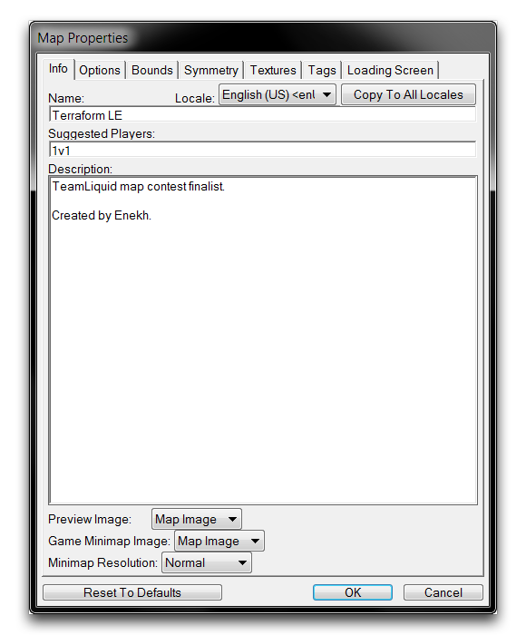
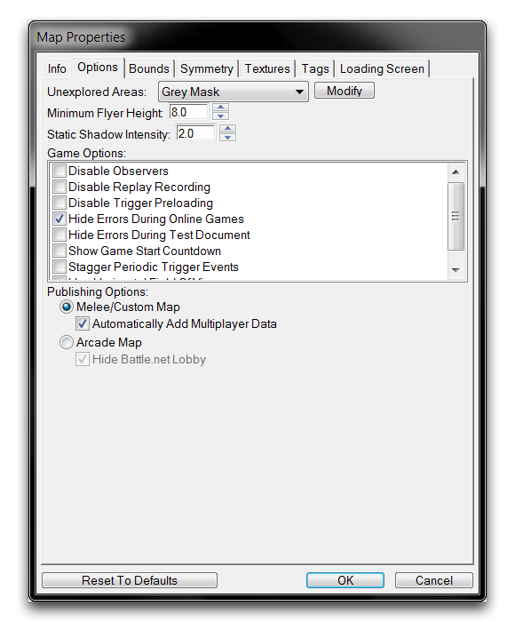
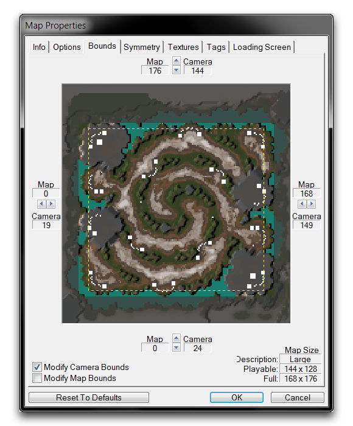
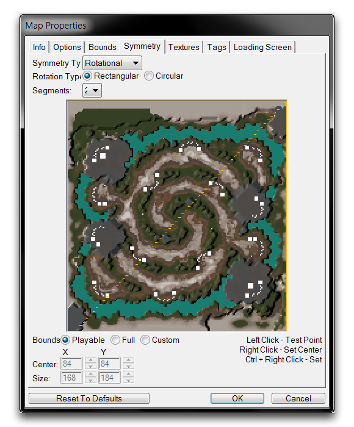
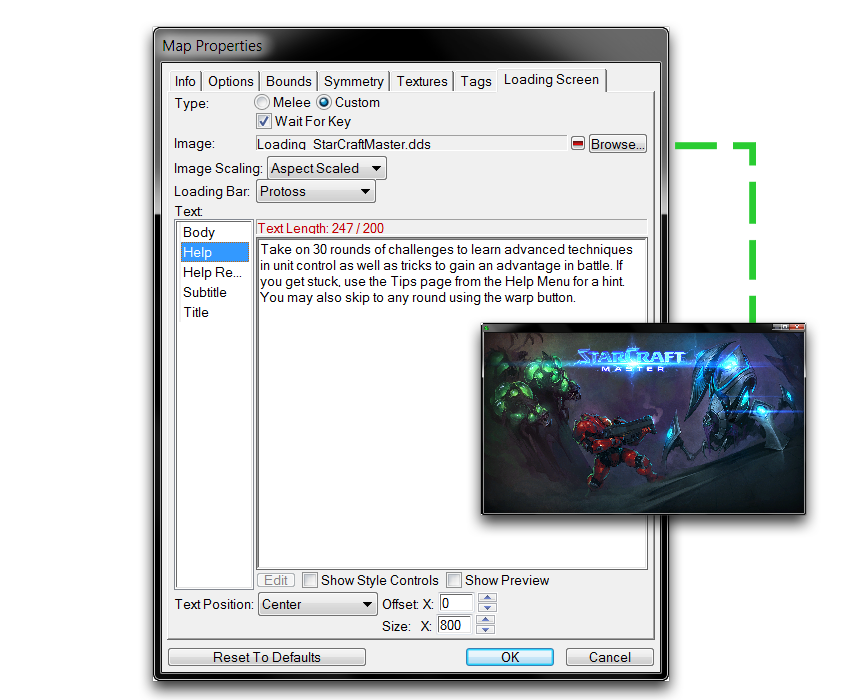

# Map Properties

Map Properties affect a wide range of settings, determining everything from how your game lobby is handled on Battle.net to how the 'Fog of War' behaves. You can navigate to the collected map properties via Map ▶︎ Map Info, from any of the Editor modules.

*Map Tab*

Note that 'Map Properties' actually refers to a grouping of eight tabs of options that govern high-level map decisions. Accessing any of the eight headings under the Map tab will direct you to the same 'Map Properties' window. These tabs are broken down in the following sections.

  
MAP INFO --------

The Map Info properties determine logistical details about a map.

*Info Tab*

<table>
<colgroup>
<col style="width: 10%" />
<col style="width: 89%" />
</colgroup>
<thead>
<tr class="header">
<th>Prope rty</th>
<th>Details</th>
</tr>
</thead>
<tbody>
<tr class="odd">
<td>Name</td>
<td>The map name, displayed to locations such as Battle.net, the Arcade, and the publishing screens.</td>
</tr>
<tr class="even">
<td>Sugge sted Playe rs</td>
<td>An internal note for how many players the map could require. This is unrelated to the Suggested Players value found in ‘Game Info’ and ‘Map Info’ screens in the custom games section and the Arcade respectively. That value is automatically generated from lobby info.</td>
</tr>
<tr class="odd">
<td>Descr iptio n</td>
<td>An area for describing the map’s contents. This section is also often used for author credits or any other type of general message that could be of interest to an audience.</td>
</tr>
<tr class="even">
<td>Previ ew Image</td>
<td>This image is displayed in several contexts.</td>
</tr>
<tr class="odd">
<td></td>
<td><ul>
<li>As the main thumbnail on the Arcade’s ‘Browse’ screen.</li>
<li>When highlighting a game within the ‘Custom Games’ section of Battle.net.</li>
<li>Within the publish screen.</li>
<li>As the map preview screen under default map settings.</li>
<li>In the ‘Game Info’ screen of the Arcade, if no screenshots are selected.</li>
</ul></td>
</tr>
<tr class="even">
<td></td>
<td>It may be set as a Map Image, Custom Image, or Hidden. The last option results in no image appearing in any of the contexts listed above.</td>
</tr>
<tr class="odd">
<td>Game Minim ap Image</td>
<td>Determines what image the minimap will use. Options include a Map Image, or a Custom Image. Traditionally a Map Image is expected, but the option is provided for non-traditional games.</td>
</tr>
<tr class="even">
<td>Minim ap Resol ution</td>
<td>Determines minimap quality level as follows: Normal: 256 x 248, High: 512 x 496, Ultra: 1024 x 992.</td>
</tr>
<tr class="odd">
<td>Local e</td>
<td>Selects the locale version for the inputted information. You will also notice a ‘Copy to All Locales’ button, which will move the information from the current view to all other existing locales.</td>
</tr>
</tbody>
</table>

## Map Options

The Map Options are a collection of gameplay and visual oriented options for altering the game. There are also some logistical options here that can affect decisions made during map creation.

*Options Tab*

| Prop erty                   | Details                                                                                                                                                                                                                                                                                                                                                                                                        |
| --------------------------- | -------------------------------------------------------------------------------------------------------------------------------------------------------------------------------------------------------------------------------------------------------------------------------------------------------------------------------------------------------------------------------------------------------------- |
| Unex plor ed Area s         | Sets the type of the 'Fog of War' used by the map. Options include Grey Mask, Black Mask, and Black Mask (Reduced Radius). Additionally, the 'Modify' tab directs you to the Data Module, for a higher degree of customization.                                                                                                                                                                                |
| Mini mum Flye r Heig ht     | Sets the minimum height flying units will descend to.                                                                                                                                                                                                                                                                                                                                                          |
| Stat ic Shad ow Inte nsit y | Sets the opacity for static mapped shadows, a provision for low graphics.                                                                                                                                                                                                                                                                                                                                      |
| 'Gam e Opti ons' Flag s     | Disable Observers: Prevents observers within online matches.                                                                                                                                                                                                                                                                                                                                                   |
|                             | Disable Replay Recording: Turns off replay archiving within map sessions.                                                                                                                                                                                                                                                                                                                                      |
|                             | Disable Trigger Preloading: Any data referenced explicitly within triggers is eligible for preloading, cutting initial load time at the expense of trigger load time.                                                                                                                                                                                                                                          |
|                             | Hide Errors During Online Games: Prevents any map debug or error messages from being displayed on Battle.net.                                                                                                                                                                                                                                                                                                  |
|                             | Hide Errors During Test Document: Prevents any map debug or error messages from being displayed during use of the 'Test Document' function.                                                                                                                                                                                                                                                                    |
|                             | Show Game Start Countdown: Enables an animated countdown after the map loads.                                                                                                                                                                                                                                                                                                                                  |
|                             | Stagger Periodic Trigger Events: Automatically spaces out periodic triggers in an effort to optimize performance and avoid trigger queueing.                                                                                                                                                                                                                                                                   |
|                             | Use Horizontal Field of View: Changes the game from its default vertical field of view. Useful for custom projects such as third or first person shooters.                                                                                                                                                                                                                                                     |
| Publ ishi ng Opti ons       | Sets the map category to Melee/Custom Map or Arcade Map. This distinction determines whether the map is available in the 'Custom Games' or Arcade sections of Battle.net. Automatically Add Multiplayer Data allows the Melee/Custom Map to add the needed multiplayer dependencies at game launch. Hide Battle.net Lobby will allow Arcade Map users to minimize the lobby while waiting for a game to start. |

## Map Bounds

The Map Bounds allow for dynamic alteration of the size limitation of both the playable area and the camera area within the map. The arrow buttons found on each side of the map allow for resizing along their specific axes.

*Bounds Tab*

| Property               | Details                                                                                           |
| ---------------------- | ------------------------------------------------------------------------------------------------- |
| Modify Camera Bounds   | Locks or unlocks the effect of resizing on the camera area.                                       |
| Modify Map Bounds      | Locks or unlocks the effect of resizing on the playable map area.                                 |
| Reset to Defaults      | Alters all configured bounds to their default settings.                                           |
| (Map Size) Description | A basic generated description of map sizes. Options include: Tiny, Small, Medium, Huge, and Epic. |
| Playable (Map Size)    | The current map's dimensions, minus the required buffer of unplayable area around the map.        |
| Full (Map Size)        | The current map's dimensions, including buffer area.                                              |

## Map Symmetry

*Symmetry Tab*

Map Symmetry is used to set the symmetry controls within the map. This is useful in terrain generation for melee maps, where symmetry is often a necessary feature for competitive play.

## Map Textures

*Textures Tab*

Each map uses a specific Texture Set type, which is a palette of eight textures used to paint the ground on the map. You can select these palettes for use in the Map Textures tab. Note that cliff styles are also a part of this palette and may be configured here.

## Map Tags

Map Tags are used to create Difficulty Tags for organizing terrain objects, such as Units, Doodads, Regions and Points, allowing you to filter them for later viewing.

*Tags Tab*

## Map Loading Screen

The Map Loading Screen tab allows you to configure the introductory screen shown to players while the map is loading.

*Load Screen Tab*
