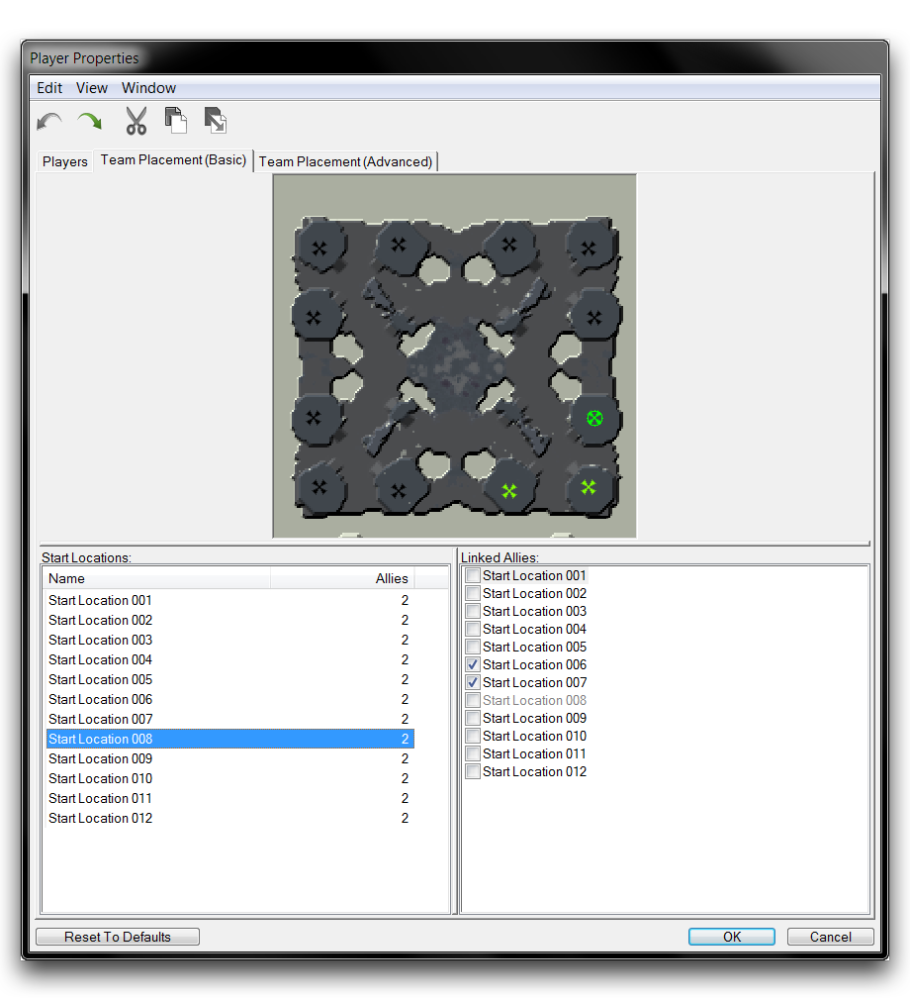

TEAM PLACEMENT
==============

Team Placement offers a set of controls for organizing player spawns.
This organization begins with the 'Starting Location' points, which you
can place using the Terrain Module. These points indicate all of the
possible locations where a player may spawn, but they are only markers.
There is no logic determining which players may spawn onto them under
given circumstances. Instead, this logic is set at Team Placement, where
locations are grouped into specific arrangements determining how and
where teams spawn.

Despite this system having been originally established for melee maps,
it is still useful when working on non-traditional games. The system of
grouping players via start locations and controlling team spawns
relative to enemies can be used for any map type, though it can be of
limited use beyond melee play.

Team Placement (Basic) and Team Placement (Advanced) are subsections of
Player Properties and can be found grouped together under the same
window as the Player Properties tab. Otherwise, you can find Team
Placement by navigating to Map -\> Team Placement (Basic) or Map -\>
Team Placement (Advanced).

Team Placement Views

Alongside this article, you'll find an illustrative demo map. This map
contains twelve starting locations spread roughly equidistant around the
edges of a square, allowing for many reasonable team-spawning
arrangements.

Demo Map Minimap

BASIC TEAM PLACEMENT
--------------------

Open Basic Team Placement with Map -\> Team Placement (Basic). As well
as the current project's minimap, you will see a listing of every
starting location on the map. You can determine teams by selecting each
Start Location and linking them to potential allies. For Basic Team
Placement, you must then use either Game Variants or triggers to
activate these teams in a game.

DEMOING BASIC TEAM CREATION
---------------------------

You can create team links by selecting a start location via the Start
Locations subview, then selecting the checkbox of another start location
in the Linked Allies subview. Using the demo map, select Start Location
001 in the northwest corner of the map, then click the checkboxes of its
two closest neighbouring start locations, Start Location 002 and Start
Location 012. As you add allies to a team, their starting locations will
turn green. Finishing this step should give the following result.

Basic Team Setup

The Allies field next to each starting location will show the number of
allies linked to each Starting Location. Generally, you'll want each
start location to have the same number of allies for melee maps, as this
would demonstrate a symmetrical amount of arrangement options. Continue
to link Starting Locations, connecting each of the three remaining
corner start locations to their respective neighbours. The finished map
should look like the image below. Note that each potential team
arrangement has the same number of allies.

Fully Configured Team Placement

ADVANCED TEAM PLACEMENT
-----------------------

Open Advanced Team Placement by navigating to Map -\> Team Placement
(Advanced). Beside the minimap view, you will find a listing for Teams
and Linked Enemy Teams. The Teams category lets you arrange teams as you
did in Basic Team Placement, which are then paired with enemy team
configurations. Unlike Basic Team Placement, this is a conclusive
option, handling both team construction and the selection of possible
enemy team arrangements. Once done, the game can be briefly set in 'Game
Variants' then be fully prepped for gameplay.

DEMOING ADVANCED TEAM CREATION
------------------------------

You can add a team by clicking on the 'New' button beneath the 'Teams'
subview. You will be taken to the window shown below.

Team Creation Pop Up

Here teams can be built by selecting groups of start locations. In this
case, choose 'Start Location 001,' 'Start Location 002,' and 'Start
Location 012' to create a team in the North West corner of the map. Name
it '3 V 3 North West'. Repeat this process for each corner of the map
using similar naming conventions. You should now have a total of four
teams. Note that each team becomes available as a 'Linked Enemy Team' as
it is added.

Now, you'll link two teams as enemies. Select a team, use '3 V 3 North
West' for this example, then select the teams you wish to be possible
enemy arrangements from the 'Linked Enemy Team' subview. This result
should look like the image below.

Team Arrangements Matched as Foes

This system supports teams of any size, but the teams should be paired
with equally-sized groups of opponents. It is also worth noting that
teams cannot share any start locations between them. Still, there are
many possible configurations supported here. Below you will find an
alternative arrangement.

Further Team Arrangement Possibilities

In closing, you should be aware that Advanced Team Placement is a more
powerful option than Basic Team Placement. As a result, it will take
precedence if both areas are configured within a map.
