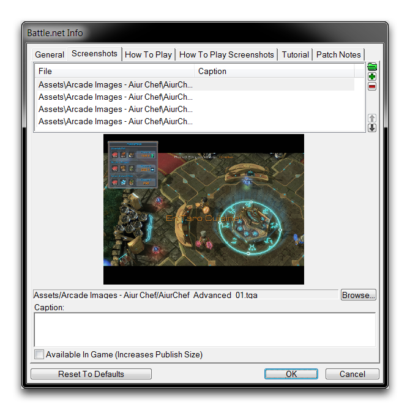
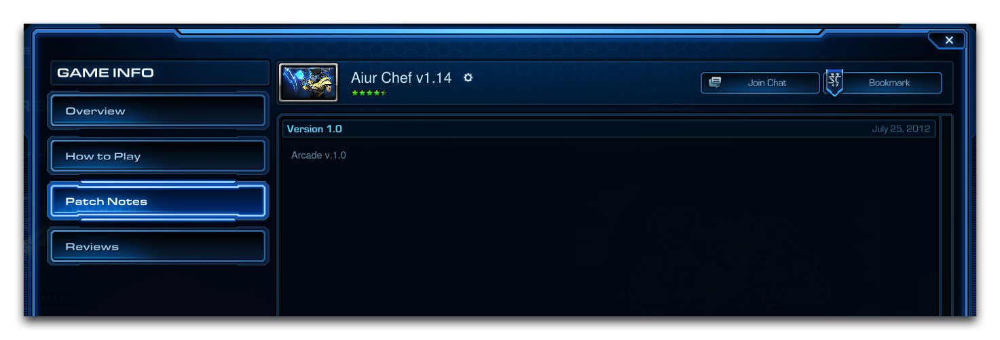

BATTLE.NET INFO
===============

Battle.net Info is the hub for customizing how a map is presented on the
Arcade.

GENERAL
-------

General Tab

A project's Icon and a linked Website are set under the General tab. The
Website will be appended to the bottom of a game's Details and can offer
a hyperlink to a community website. A project's Icon is used frequently
throughout the Arcade as the main representation of a project. This
includes the Browse screen, the Open Games listing, and many other
locations. In the following image, you can see the icon next to the
game's title on the Overview screen.

Arcade Overview Screen

SCREENSHOTS
-----------

The Screenshots tab allows you to select five promotional screenshots to
be published to the project's Overview screen.

Screenshots Tab

Screenshots are uploaded either from the map's current data with the
Archive Browser or from the local computer. Each shot must have a
resolution of 800x600 px. Should your screenshots exceed the default
resolution, you will be prompted to crop the source image to the
required size. Checking the Available In Game option will add the
screenshot to the game's data separately (at the expense of publishing
size). Once added, your screenshots are used to populate the
'Screenshots' rotation on the 'Overview' screen, as shown below.

Screenshots from Overview Screen

HOW TO PLAY
-----------

You can add a brief manual detailing how to play your game under the How
To Play tab. Players in the Arcade will see these details at the 'How To
Play' screen. Players will often check this screen while the map loads
or while idling in a lobby. This gives you a chance to impart some
strategic or gameplay information prior to the loading screen. You can
see how to build your How To Play section in the image below.

How to Play Tab

Filling out the Basic Instructions, How To Win, and Advanced
Instructions fields will fill their corresponding sections of the 'How
To Play' screen. If you check the Use Bullets option, your instructions
will keep the same bulleted appearance you see at the How To Play tab
when they're on the Arcade. You can see how these descriptions look in
the Arcade in the following image.

. 

Arcade How to Play Screen

HOW TO PLAY SCREENSHOTS
-----------------------

The How To Play Screenshots tab functions in the same way as the
Screenshots tab and is used to add up to five screenshots to the 'How To
Play' section of the project's Arcade page.

How to Play Screenshots Tab

The screenshots should be sized to 800x600 px, you can add a caption to
each to help add context. Once added, the screenshots are used to
populate a section on the rightmost side of the 'How to Play' screen,
pictured below.

How to Play Screenshots in Arcade How to Play Screen

TUTORIAL
--------

The Tutorial tab can be used to set an instructional tutorial map for
your project. Once set, players can access this map individually through
the 'Play Tutorial' button found on the 'Overview' screen. A tutorial
map can be used to give players a safe, risk-free space to learn
essential skills required by the main map. Players will be presented
with the option to play a tutorial map as shown in the image below.

Play Tutorial Button on Overview Screen

The Tutorial tab itself is shown below.

Tutorial Tab

The tutorial map is linked via the Tutorial Map File. There are three
options to choose from. Selecting Self will provide the tutorial as a
Tutorial Game Variant of the current map. Selecting Other allows you to
define another map file, either saved locally or on Battle.net, to serve
as the tutorial. Alternatively, you can select None, which will remove
the 'Play Tutorial' button from the 'Overview' screen.

The Tutorial Game Speed option allows you to set the game speed of the
tutorial map independently of the main map.

PATCH NOTES
-----------

The Patch Notes tab allows you to add patch notes for each version of
your project. These are displayed publicly on the 'Patch Notes' screen
of the Arcade. Users can use this page to keep up with any important
updates and balance changes, as well as seeing if the map is still being
maintained.

Patch Notes Tab

Each 'Patch Notes' entry contains a Version, Date, and a set of Notes.
Patches are always displayed according to their Version number, with the
latest patch at the top. Each set of Notes can be a maximum of 100 lines
long, while individual lines cannot exceed 140 characters. You can set
the Version and Date manually and there is no requirement to match the
values generated by the Arcade's publishing system.

Arcade Patch Notes Screen
