# Standard Dependencies

Every data asset used in the StarCraft II trilogy is distributed through a dependency mod. These Standard Dependencies build on the game's base Core.SC2Mod and supply assets relevant to a specific version of StarCraft. This article breaks down each standard dependency with information on its purpose and contents, both in terms of assets and other dependencies.

*Standard Dependencies Selection*

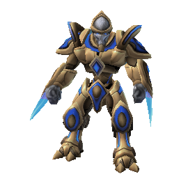

Contains the primary data assets supporting the Wings of Liberty melee game.

Dependency Contents: Null

Data Counts:

Units 432 Abilities 227 Behaviors 139

Effects 474 Weapons 57 Validators 636

Upgrades 111 Actors 1930 Movers 61

Models 2042 Textures 259 Sounds 3398

Buttons 496 Lights 134 Terrain Types 24

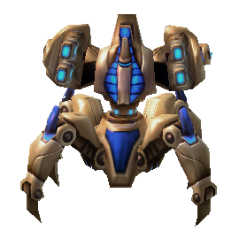

Updates and balance changes made for the Wings of Liberty multiplayer melee game.

Dependency Contents:

*Liberty*

Data Counts:

Units 2 Abilities 48 Behaviors 20

Effects 55 Weapons 12 Validators 8

Upgrades 49 Actors 32 Movers 2

Models 1 Textures 1 Sounds 1

Buttons 3 Lights 0 Terrain Types 0

Data and assets that are unique to the singleplayer campaign of Wings of Liberty.

Dependency Contents:

*Liberty*

Data Counts:

Units 950 Abilities 282 Behaviors 340

Effects 913 Weapons 112 Validators 206

Upgrades 156 Actors 2571 Movers 71

Models 2150 Textures 338 Sounds 1714

Buttons 320 Lights 294 Terrain Types 1

Contains assets related to the story mode of Wings of Liberty, such as voiceover from the sequences aboard the Hyperion and a few campaign upgrades.

Dependency Contents:

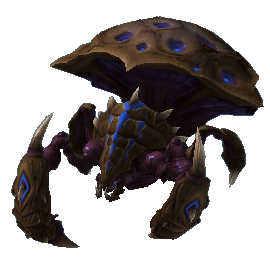 

Liberty LibertyCampaign

Data Counts:

Units 8 Abilities 37 Behaviors 3

Effects 10 Weapons 5 Validators 2

Upgrades 91 Actors 119 Movers 0

Models 31 Textures 0 Sounds 3215

Buttons 1 Lights 0 Terrain Types 0

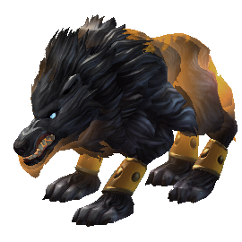

Contains the primary data assets supporting the Heart of the Swarm melee game.

Dependency Contents:

*Liberty*

Data Counts:

Units 330 Abilities 383 Behaviors 187

Effects 577 Weapons 32 Validators 291

Upgrades 84 Actors 1699 Movers 30

Models 1436 Textures 74 Sounds 1314

Buttons 129 Lights 43 Terrain Types 64

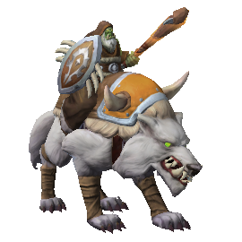

Updates and balance changes made for the Heart of the Swarm multiplayer melee game.

Dependency Contents:

 

Liberty Swarm

Data Counts:

Units 4 Abilities 64 Behaviors 47

Effects 144 Weapons 21 Validators 48

Upgrades 49 Actors 156 Movers 5

Models 2 Textures 0 Sounds 14

Buttons 30 Lights 1 Terrain Types 0

[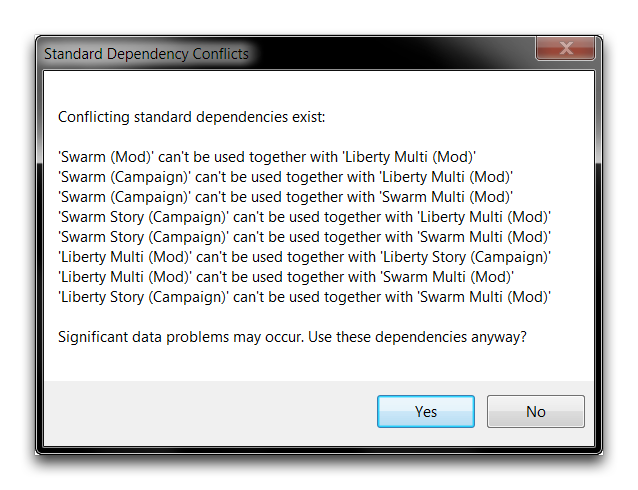](./resources/013_Standard_Dependencies08.png)

Data and assets that are unique to the singleplayer campaign of Heart of the Swarm.

Dependency Contents:

  

Liberty LibertyCampaign Swarm

Data Counts:

Units 705 Abilities 554 Behaviors 492

Effects 1722 Weapons 212 Validators 508

Upgrades 111 Actors 2021 Movers 83

Models 1386 Textures 20 Sounds 1160

Buttons 573 Lights 82 Terrain Types 1

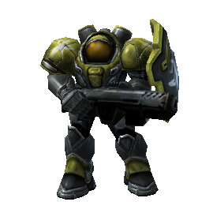

Contains assets related to the story mode sequences of Heart of the Swarm, like being aboard Kerrigan's Leviathan.

Dependency Contents:

   

Liberty LibertyCampaign Swarm SwarmCampaign

Data Counts:

Units 157 Abilities 0 Behaviors 0

Effects 0 Weapons 0 Validators 0

Upgrades 0 Actors 258 Movers 0

Models 320 Textures 59 Sounds 840

Buttons 0 Lights 84 Terrain Types 1

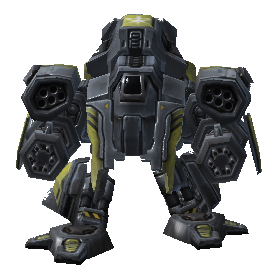

Contains the primary data assets supporting the Legacy of the Void melee game.

Dependency Contents:

 

Liberty Swarm

Data Counts:

Units 284 Abilities 428 Behaviors 133

Effects 520 Weapons 37 Validators 227

Upgrades 75 Actors 1553 Movers 27

Models 1173 Textures 68 Sounds 1283

Buttons 110 Lights 46 Terrain Types 40

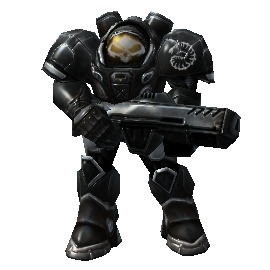

Updates and balance changes made for the Legacy of the Void multiplayer melee game.

Dependency Contents:

  

Liberty Swarm Void

Data Counts:

Units 8 Abilities 51 Behaviors 47

Effects 122 Weapons 30 Validators 52

Upgrades 41 Actors 131 Movers 5

Models 18 Textures 0 Sounds 4

Buttons 10 Lights 2 Terrain Types 0

Contains data and assets unique to the singleplayer campaign of Legacy of the Void.

Dependency Contents:

    

Liberty LibertyCampaign Swarm SwarmCampaign Void

Data Counts:

Units 566 Abilities 700 Behaviors 767

Effects 2977 Weapons 166 Validators 848

Upgrades 327 Actors 2851 Movers 133

Models 1698 Textures 19 Sounds 2164

Buttons 740 Lights 48 Terrain Types 0

Contains assets related to the story mode sequences of Heart of the Swarm, such as being aboard the Spear of Adun.

Dependency Contents:

     

Liberty LibertyCampaign Swarm SwarmCampaign Void VoidCampaign

Data Counts:

Units 217 Abilities 0 Behaviors 2

Effects 1 Weapons 0 Validators 0

Upgrades 0 Actors 232 Movers 0

Models 569 Textures 49 Sounds 4004

Buttons 0 Lights 265 Terrain Types 0

*## War3.Sc2Mod*

HD updates of model, art, interface and sound assets from Warcraft III.

Dependency Contents: Null

Data Counts:

Units 0 Abilities 0 Behaviors 0

Effects 0 Weapons 0 Validators 0

Upgrades 0 Actors 0 Movers 0

Models 0 Textures 0 Sounds 0

Buttons 0 Lights 0 Terrain Types 0

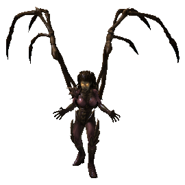

Data and assets supporting the Warcraft III art updates, making them into a playable version of the game.

Dependency Contents:

 

Liberty War3

Data Counts:

Units 1595 Abilities 960 Behaviors 83

Effects 2092 Weapons 754 Validators 260

Upgrades 0 Actors 3068 Movers 384

Models 2669 Textures 61 Sounds 2782

Buttons 2077 Lights 0 Terrain Types 2

## Dependency Conflicts

Populating a mod with dependencies that share the same dependency contents will result in a standard dependency conflict as shown in the image below.

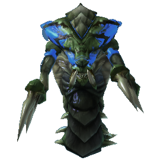
*Standard Dependency Conflicts*
