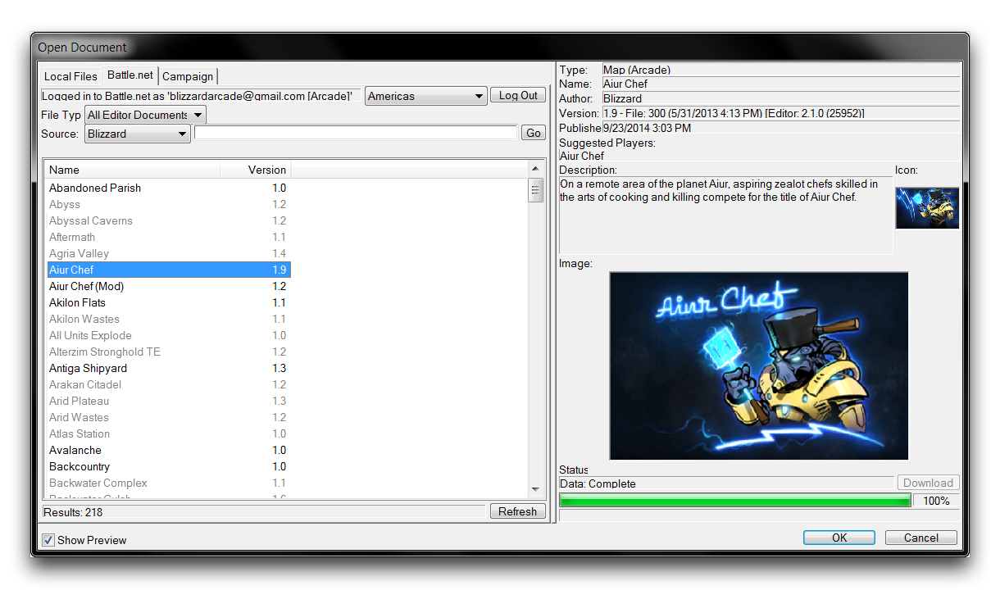

FINDING HELP
============

Due to the expansive nature of game design, it's unlikely that there
will ever be a single guide comprehensive enough to include everything
you could want to know. This is usually best solved by interacting with
a community. Reaching out to get educated and contribute can be very
rewarding, as well as helping you solve your problems. Knowing where to
find help in these situations is a big part of being a developer.

A NOTE ON ATTITUDE
------------------

Before starting a discussion, try to keep in mind that you are asking
for a favour from another individual. They are likely volunteering their
time, so make the most of any time people give to answering your
questions. You should, start out by preparing to ask for help. Carefully
go over the problem and make sure the issue is not a product of
frustration or exhaustion. Prepare any screenshots and information you
may need to describe your problem as succinctly as possible.

When asking for help, it is important to be polite and patient. While it
can sometimes feel as though no one is paying you any attention, it is
worth considering that it may take some time for others to assist you,
especially if your problem is difficult. If it is a specific issue, it
may take time for it to be found by others who have dealt with it
before. If you feel you're receiving no help, it never hurts to explore
in an effort to solve the problem for yourself.

COMMUNITY FORUMS
----------------

Discussion forums can be excellent places to pick up the information you
require. You can find Blizzard's official StarCraft II forums at
<http://us.battle.net/sc2/en/forum/index>. There are several forums
where you might find help, but you may want to start in the
'Development, Feedback and Discussion' section.

Blizzard's Official SC2 Forums

Note that these forums are divided into subforums with headings largely
based on the Editor modules. Posting to the appropriate subforum can
help ensure your questions find the most appropriate audience. You can
also try searching community forums, perhaps the most notable of which
is SC2Mapster. You can find it at the address
<http://www.sc2mapster.com/forums>. There you'll want to target the
'Development' forums section. Like Blizzard's official forums, the
forums there are divided into subforums.

SC2Mapster's Community Forums

Whether the forums are official or not will not have any bearing on the
quality of discussion, but if you have a software issue it may be best
resolved on the official forums, where Blizzard employees are regular
visitors. Some community sites, like SC2Mapster, also boast live chat
over an IRC channel. These can be great places to ask questions with
active users who can quickly guide you with your problem.

BUILDING RELATIONSHIPS
----------------------

Almost every developer needs help testing their games at some point. By
volunteering to help others, you'll soon make friends. Having a strong
network of developers is the best way to solve problems and learn.
Later, you'll have help when the time comes to look for testers for your
own project. Once you've begun to build your knowledge bank,
volunteering to help with problems can help you build relationships
amongst your community.

EXPANDING YOUR SEARCH
---------------------

Another way to look for help when faced with a problem is to look for
existing documentation or tutorials. You may want to focus your search
on large community-based media sites. Services like YouTube boast a
wealth of community tutorials built up over years.

Existing StarCraft maps are perhaps the best sourcebook for educating
yourself. Any maps whose status is set to 'Unlocked' may be opened,
read, and changed by any Editor user. Remember to take note of the
original user's wishes though, if you republish another person's work as
your own you may face repercussions.

Among the notable 'Unlocked' content available is Blizzard's own work
made with the Editor. The entirety of the campaign has been made
available to the general public for learning purposes, along with many
Blizzard Arcade projects. Locate any projects via File -\> Open -\>
Battle.net, then set the search source to 'Blizzard' and click 'Go.'
This will deliver a full list of Blizzard published maps. The 'StarCraft
Master,' 'Left 2 Die,' and 'Aiur Chef' maps in particular are worth
investigating.

One of Blizzard's Open Source Maps

If your problem involves a more general concept, like math, physics, or
design, don't hesitate to push your quest for knowledge out into those
topics. More specialized websites, books, and other materials will help
you learn these disciplines. You can then apply your new knowledge to
game development. That way you can continue to enrich your designs with
new and exciting sources of inspiration.
