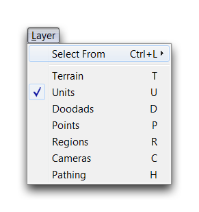
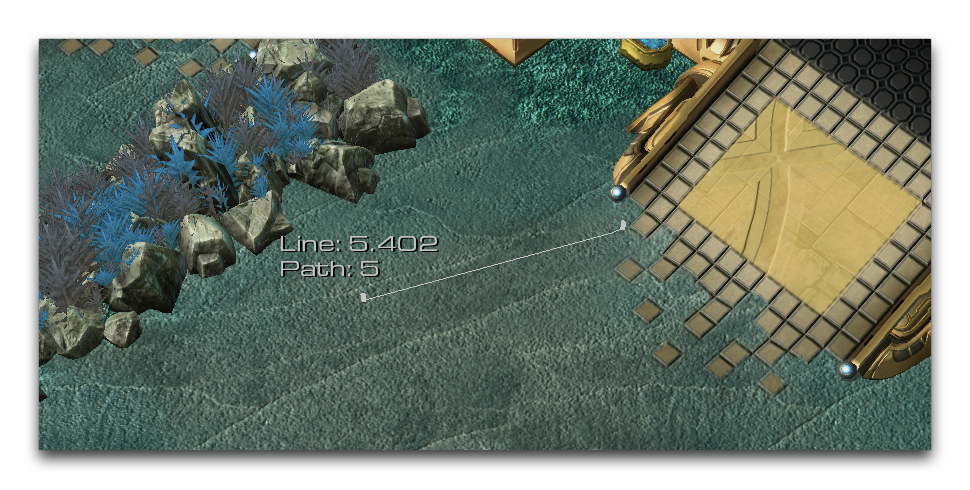

TERRAIN EDITOR INTERFACE
========================

The Terrain Editor is probably the most diverse section of the Editor.
Beyond its use as a workspace for map design, it is also where many of
the Editor's other sections interact with the map file itself. The
Trigger Editor, for example, communicates with the Terrain Editor
through points and regions. The Data Editor communicates with it through
units and other entities, while the Cutscene Editor works through
cameras, and much more.

THE INTERFACE
-------------

Interface View of Uvantak's Ganymede

As you may have guessed from the above, the Terrain Editor serves as a
sort of project hub. The end result is that it features a wide range of
options and functions. This has led to its being divided into seven
individual layers. You can navigate these layers using the Terrain Bar
on the Main Toolbar. There you'll find buttons which take you directly
to each layer, as seen below.

Terrain Bar

By default, the layers are distinctly separated. Once a layer is active,
you may only work on elements designated to that layer. While using the
Terrain Editor, you will always have one active layer. You can find your
current location by checking which layer button is currently
highlighted.

Every layer features its own options. These are presented on a large
panel on the left-hand side of the main terrain view. This is called the
UI Panel. The image below shows how it looks with the Units Layer open.

UI Panel

The **UI Panel** changes depending on the current layer. Each layer has
a Palette that offers most of the major controls within that layer. You
can read about Palettes in more detail in the individual articles
dealing with each layer. It is also worth noting that the top File Tab
offers many options, which are broken into subtabs. Those are described
below.

VIEW OPTIONS
------------

These options control the visibility of individual components within the
Editor, change the current viewport properties, and offer some support
for camera features. You can reach them from the View Tab, as shown
below.

View Tab

  -----------------------------------------------------------------------
  Action         Effect
  -------------- --------------------------------------------------------
  Show UI Panel  Controls the visibility of the UI Panel.

  Show UI        Controls the visibility of several advanced UI features,
                 such as framerate.

  Show Layer     Controls the visibility of each layer individually.

  Show Names     Controls the visibility of the names of elements like
                 points and regions.

  Show Tags      Controls the visibility of tags created within the 'Map
                 Properties' menu.

  Show           Controls the visibility of the difficulty setting of
  Difficulty     units.

  Show           Controls the visibility of the skybox in the Editor
  Background     display.

  Show Placement Controls the visibility of grid components.
  Grid           

  Show Pathing   Controls the visibility of differing types of pathing,
                 such as 'Unpathable Areas'.

  Show Terrain   Controls the visibility of certain terrain components
                 such as creep, water, or map bounds.

  Enable Object  Toggles the sound effects for placing objects in the
  Sounds         Editor.

  Lock Game View Locks the camera to the specific settings found in melee
                 games.
  -----------------------------------------------------------------------

RENDER OPTIONS
--------------

This section contains options you can use to control the visibility of
advanced graphical elements in the Editor. You can find them using the
Render Tab, as seen below.

Render Tab

  -----------------------------------------------------------------------
  Action         Effect
  -------------- --------------------------------------------------------
  Show Shader    Controls the visibility of the different types of
  Mode           shaders.

  Show Lighting  Choose to display either the game lighting or custom
                 lighting currently being edited.

  Show Fog       Controls the visibility of fog features.
  Effects        

  Show Particles Controls the visibility of particle elements including
                 models, actors, and so forth.

  Show Wireframe Enables a mode that displays every element in wireframe.
  Mode           
  -----------------------------------------------------------------------

Below is a shot of a few hydralisks that has been set to show in
wireframe mode.

Wireframe Mode

LAYER OPTIONS
-------------

This section allows you to control which layers are active at any given
time, breaking their default separation. You can do this using the
Select From field to activate different configurations of layers. You
will also find the navigational options here, which allow you to move
from layer to layer, the same as the Terrain Bar. You can find layer
options using the Layer Tab, shown below.

Layer Tab

TOOLS
-----

Here you'll find options supporting basic functions like selecting and
designing a map. You can navigate the tools using the Tools Tab.

Tools Tab

  -----------------------------------------------------------------------
  Action           Effect
  ---------------- ------------------------------------------------------
  Selection Mode   Allows you to select objects using the mouse.

  Measure Distance Changes the cursor into a measuring tool.

  Snap to Grid     Alters grid-snapping behavior for placing elements.

  Diagonal         Rotates the axis for selection, so box selection
  Selection        occurs along a 45° axis.

  Use Group        Changes selection behavior to only affect units within
  Selection        a group.

  Use Symmetry     Toggles the symmetry behavior used for the map.
  -----------------------------------------------------------------------

The Measure Distance option changes the default mouse so that you can
measure from one point to another. This can be useful in determining
rough distances for things like melee map design, as well as helping
with calculations for triggers or data. You can use the tool by clicking
once to begin measuring, then clicking at your desired endpoint. The
image below shows Measure Distance in action.

Measuring Tool
