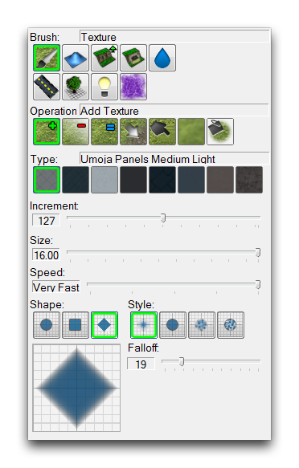
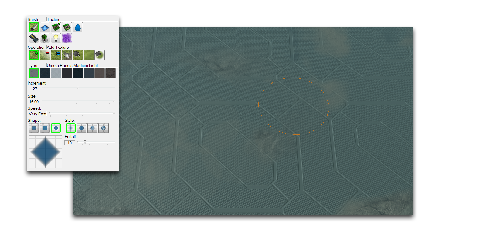
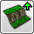

TERRAIN LAYER
=============

The Terrain Layer deals with the fundamental elements of terrain design,
including ground texture, elevation, cliffs, and water. You can access
it from the Terrain Bar, by clicking the icon shown below.

Terrain Layer Icon

TERRAIN PALETTE
---------------

Every map begins at the creation screen, here you'll make basic
decisions about the look of your map, determining its texture, height,
and size. Once the Editor has generated the map, it will open in the
Terrain Editor, giving you a fresh slate of terrain, a blank canvas.

Map Creation

The terrain development process usually begins at the Terrain Layer.
Continuing the painting theme, the tools in this layer are called
brushes. They can be found in the Terrain Palette, shown below.

Terrain Palette

BRUSH OPTIONS
-------------

Selecting any brush will display various modifiers within the palette.
Every brush has options allowing you to control the ways in which you
'paint' your terrain. Below you'll see an example of these options,
followed by a breakdown of all the options available to you.

Brush Options

  -----------------------------------------------------------------------
  Pro   Effect
  per   
  ty    
  ----- -----------------------------------------------------------------
  Inc   Adjusts the magnitude at which the current action is performed.
  rem   
  ent   

  Siz e Changes the dimensions at which the current action is performed.

  Spe   Adjusts the speed at which the current action is performed.
  ed    

  Sha   Selects the shape of the area in which the current action is
  pe    performed.

  Sty   Applies an effect to the action being performed. These include
  le    various opacity, shape, and randomness options.

        The Paintbrush style is the default standard with no additional
        effects.

        The Airbrush style applies a degree of opacity around the edges
        of the application area, controlled by the Variability slider.

        The Noise style adds a random component to the application, while
        the Fractal style applies the brush recursively. These final two
        styles, and their modification with the properties Variability
        and Resolution, are best described by the preview found in the
        Editor.
  -----------------------------------------------------------------------

Beyond these general options, each of the nine brushes available in the
Terrain Layer has a number of unique options. You can read a breakdown
of the brushes and their options in the following sections.

THE BRUSHES
-----------

This tool allows you to paint textures onto the surface of the map.
Painting is done with a mixing system that allows the dynamic layering
of a palette of eight textures per map.

Texture Brush and its Use

  ------------------------------------------------------------------------
  Property   Effect
  ---------- -------------------------------------------------------------
  Add        Applies the currently selected texture to the map using the
  Texture    selected brush options.

  Remove     Removes the currently selected texture to the map using the
  Texture    selected brush options.

  Uniform    Applies the current texture at a locked Alpha value,
  Texture    resulting in no variation in opacity.

  Replace    Replaces the first texture selection with the second, does
  Texture    not alter any other textures.

  Smudge     Pushes the first texture the user clicks onto other textures
  Texture    for as long as the button is held.

  Blur       Softens the border between adjoining textures.
  Texture    

  Fill       Fills an entire area with the selected texture. The area is
  Texture    selected based on the altitude at which the brush is clicked.
  ------------------------------------------------------------------------

This tool allows you to alter the topology of your terrain. All height
features made with this brush will remain pathable by unit movement,
regardless of how outlandish they may appear. You can make pathing
distinctions with the cliff and pathing tools.

Height Brush and its Use

  -------------------------------------------------------------------------
  Property    Effect
  ----------- -------------------------------------------------------------
  Raise       Increases the target area's height based on the brush options
              and Amplitude.

  Lower       Decreases the target area's height based on the brush options
              and Amplitude.

  Uniform     Alters the height within the brush's target area to be
              approximately equal.

  Noise       Applies a random variation in height to the target area.

  Amplitude   Sets a magnitude for height alterations, similar to the
              standard brush option Increment.
  -------------------------------------------------------------------------

This tool changes the cliff levels of the target selection. There are
four distinct levels of terrain, which have special gameplay rules and
interactions. Ground-based units move between these layers using ramps.
You can also use this tool to place those ramps.

Cliff Brush and its Use

  -------------------------------------------------------------------------
  Property   Effect
  ---------- --------------------------------------------------------------
  Raise      Raises all terrain in the current target area up one cliff
  Cliff      level. If the area is already at the highest level, it will
             not be altered.

  Lower      Lowers all terrain in the current target area down one cliff
  Cliff      level. If the area is already at the lowest level, it will not
             be altered.

  Same Level Clicking with this brush selects the cliff level of the target
  Cliff      area, holding the button will apply this level of cliff
             anywhere the brush is moved.

  Add Ramp   Creates a ramp between terrain levels at the target, if
             possible.

  Remove     Removes any ramps in the target area.
  Ramp       

  Type       Toggles between possible visual styles of ramps in the current
             terrain type.
  -------------------------------------------------------------------------

This tool allows you to select from an array of dynamic set-piece
objects available in the Editor. These terrain objects require special
placement and cooperation with doodads or units to produce desired
effects.

Terrain Object Brush and its Use

  -----------------------------------------------------------------------
  Property      Effect
  ------------- ---------------------------------------------------------
  Add Terrain   Places the currently selected terrain object at the
  Object        target area.

  Show Terrain  Displays any terrain cells in the target area that have
  Cells         had their visibility changed.

  Hide Terrain  Alters the visibility of any terrain cells in the target
  Cells         area.

  Terrain       A list of all the available terrain objects, sorted by
  Object List   the cliff level they are properly applied to.
  -----------------------------------------------------------------------

This brush will apply regions to the map where water will be rendered.
In this context, 'water' actually refers to a variety of dynamic fluids
and may appear as lava or acid in certain terrain types. The regions are
locked to a constant size applied in square units by this brush.

Water Brush and its Use

  --------------------------------------------------------------------------
  Property   Effect
  ---------- ---------------------------------------------------------------
  Add Water  Applies a water region to the target area.

  Remove     Removes any water regions within the target area.
  Water      

  Water Type Offers a selection of various types of water which may be
  Listing    applied. Note that these are not linked to terrain types and
             may be applied in any quantity.

  State      Toggles between any alternate settings in the current water
             type.

  Height     The height at which the water in the region being applied will
             render. Water is applied at a set height per region. This
             setting can affect the look of certain areas, from shallows to
             being flooded.
  --------------------------------------------------------------------------

This tool renders roads, which are treated as a special type of visual
element. Roads are rendered automatically along a path laid down by this
tool in points. This system is designed to quickly generate realistic
looking roads without having to lay down individual doodad segments.

Road Brush and its Use

  -----------------------------------------------------------------------------
  Property   Effect
  ---------- ------------------------------------------------------------------
  Add Road   Creates a road segment by placing individual points. Clicking
             outside of currently placed points will add a new segment.
             Clicking within currently placed points allows you to alter the
             road segment.

  Type       Selects from the road textures available in the current terrain
             type.

  Road Width Alters the width of the road segment being currently placed.
  -----------------------------------------------------------------------------

FOLIAGE BRUSH
-------------

This tool allows you to paint regions so that the Editor can
automatically generate foliage depending on their current texture.
Foliage is a kind of automatically generated visual element, similar to
a doodad, which cannot be directly altered in the Editor.

Foliage Brush and its Use

  --------------------------------------------------------------------------
  Property   Effect
  ---------- ---------------------------------------------------------------
  Allow      Sets the target area to permit foliage generation. When the
  Foliage    brush is active, these areas will display in a grey overlay.

  Disallow   Sets the target area to not generate foliage.
  Foliage    

  Density    Determines the amount of foliage to be generated when using the
  Per Cell   Generate Foliage option.

  Generate   Creates foliage elements within the marked areas of the map.
  Foliage    Will also clear foliage from the last generation run, updating
             the areas whose foliage status has changed.
  --------------------------------------------------------------------------

This tool gives you access to a palette of four lighting regions to
paint onto your map. It also allows you to mix these regions together.
When the game is launched, each individual region will have a
corresponding set of lighting options applied within its bounds. Any
areas with a mix of lighting regions will have the lighting options
mixed as well. This allows you to build dynamic, realistic lighting
environments. While the brush is active, the four lighting regions are
displayed using colored overlays of red, green, blue, and yellow.

Lighting Brush and its Use

  -------------------------------------------------------------------------
  Property   Effect
  ---------- --------------------------------------------------------------
  Add        Applies the currently selected region to the map using the
  Lighting   selected brush options.

  Remove     Removes the currently selected texture from the map using the
  Lighting   selected brush options.

  Uniform    The first click of the brush samples the composition of the
  Lighting   selection region. Continued use of the brush will then apply
             that composition to other regions.

  Blur       Creates a softer mixture between adjoining light regions.
  Lighting   

  Fill       Fills an entire area with the selected light region. The area
  Lighting   is selected based on the altitude at which the brush was
             clicked.
  -------------------------------------------------------------------------

The creep tool allows you to create creep on the map without the need
for creep-generating Zerg units. It also allows you to designate special
rules to certain areas for disallowing or permitting creep.

Creep Brush and its Use

  -----------------------------------------------------------------------
  Property         Effect
  ---------------- ------------------------------------------------------
  Add Creep        Applies creep to the target area.

  Remove Creep     Removes creep from the target area.

  Disallow Creep   Flags the selected area to disallow the generation of
                   creep.

  Allow Creep      Flags the selected area to allow the generation of
                   creep.
  -----------------------------------------------------------------------
