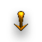
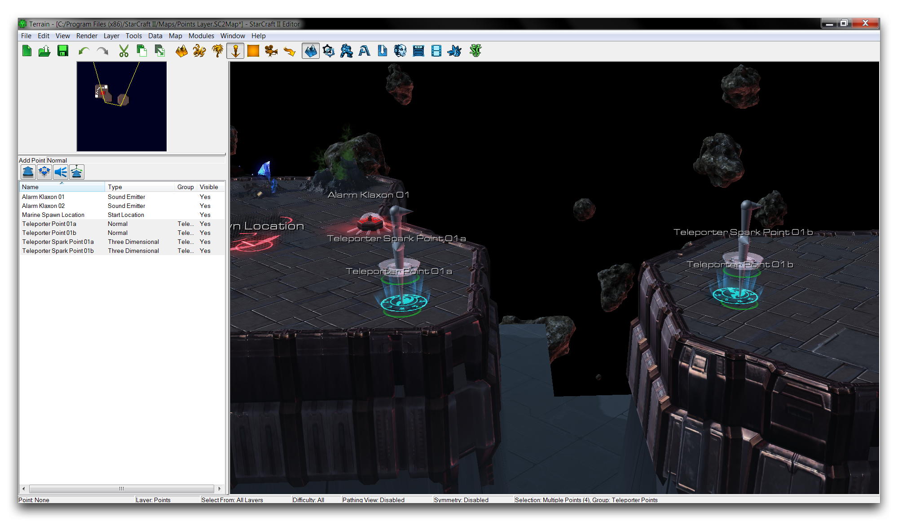
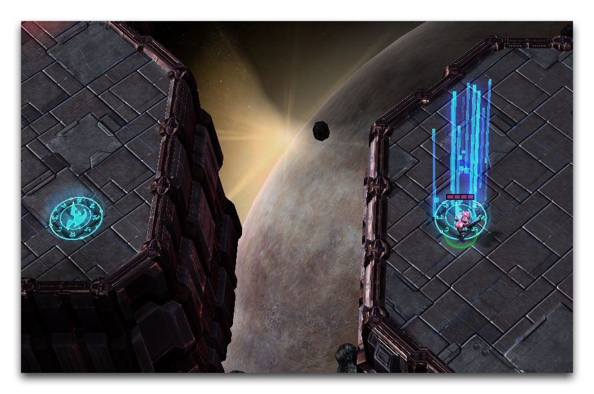
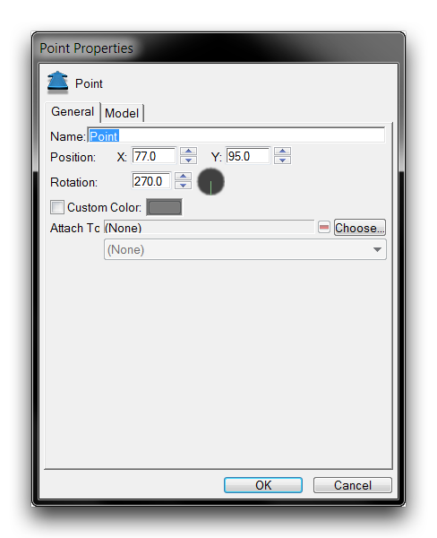
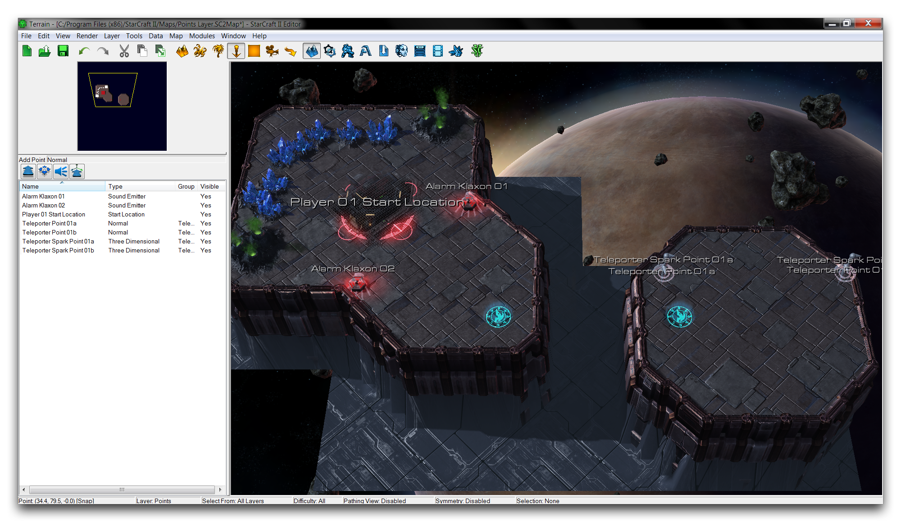
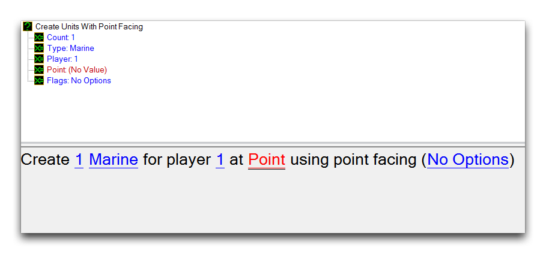
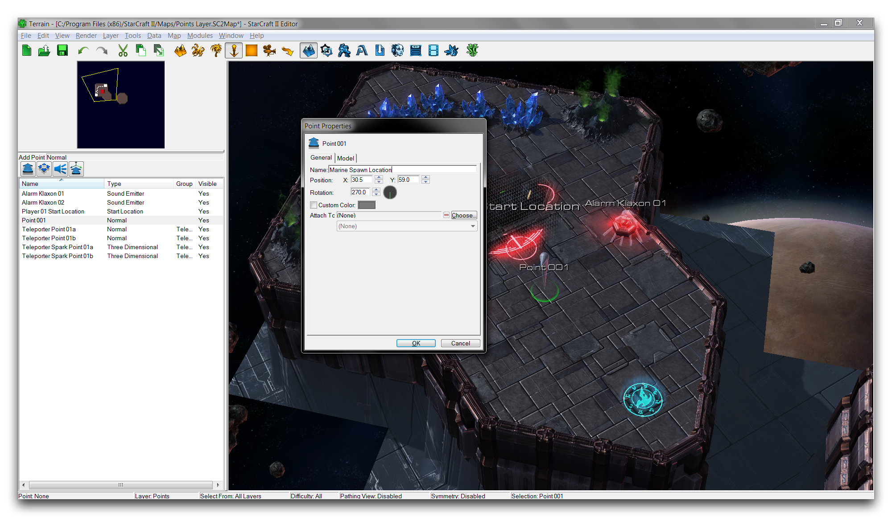

# Points Layer

The Points Layer uses marking elements called points. Points communicate locations to other Modules and can be accessed from the Terrain Bar using the icon pictured below.

*Points Layer Icon*

## Points Palette

The Points Palette is where you'll find the tools for creating the different types of points, as well as a list of every active point in the map. You can find it on the left-hand side of the Terrain Editor when the Points Layer is active.

*Points Palette with Existing Point List*

There are four types of points, Normal Points, Start Locations, Sound Emitters, and 3D Points. You can place each of them by selecting their respective tools and clicking on the desired location on the map. This will mark that location with a point and create a marker at the location. You can move points after they've been placed by selecting and dragging the marker. Despite the appearance of their markers, points don't take up any space and will not be visible outside of the Editor. You can also hide the markers individually by right-clicking on a point in the Points Palette and changing their Show in Editor property. Point markers appear in the Editor as shown in the image below.

*Four Types of Point Markers*

## Point Types

 Normal points mark a specific coordinate on the map in the XY plane.

 Start Locations are assigned to players, marking their initial starting positions. This is a special distinction which receives several uses throughout the Editor. These points mark the location for spawning the base and workers in standard melee games. They also set the default initial camera position for their respective players.

 Sound Emitters play sounds at their location. Typically they produce environmental noises within a specific distance range on the map. This means you can use them as a sort of audio doodad, creating decorative and atmospheric sound.

 Three Dimensional points are like Normal points, but have an additional Height value, meaning they are used to mark a coordinate in XYZ or 3D space.

## Point Properties

Points have a number of configuration options that you can set from the 'Point Properties' window. You can access this window by double clicking a point's marker in the Terrain Module. Alternatively, you can double click a point's name in the list on the Points Palette. Below you will find an example of a Point Properties window and a breakdown of the options it gives you.

*Point Properties*

| Property  | Description                                                                                                                                                                                                                                                                     |
| --------- | ------------------------------------------------------------------------------------------------------------------------------------------------------------------------------------------------------------------------------------------------------------------------------- |
| Name      | Labels the point for identification in the Points Palette.                                                                                                                                                                                                                      |
| Position  | The location of the point on the map as an XY value.                                                                                                                                                                                                                            |
| Rotation  | An angle stored within the point for possible use. The default facing of a point is 270 degrees. A point with a custom marker will show this facing.                                                                                                                            |
| Color     | Tints the point's marker a select color. This option is not available for Start Locations.                                                                                                                                                                                      |
| Attach To | Selecting a unit with 'Choose' will immediately set the point's position to that of the unit. The point will then stay attached to the unit as it moves, allowing it to serve as a marker for the unit's position. Useful for communicating dynamic locations to other Modules. |
| Model     | Customizes the point's marker model.                                                                                                                                                                                                                                            |
| Height    | For 3D points only. Sets the Z component of the point's location.                                                                                                                                                                                                               |
| Sound     | For Sound Emitters only. Sets the sound to be played by the emitter.                                                                                                                                                                                                            |

## Demoing Points

Open the demo map provided with this article. You'll see a small course nestled on a space platform with several points already placed. The course should appear as in the image below.

*Demo Map Course*

The objective here is to make use of some existing trigger code that will spawn a marine, then allow the beacon on the map to teleport the marine from one platform to another. Navigate to the Trigger Editor and note the 'Initialization' trigger. A trigger for creating a marine has already been set up, but it requires a point for the marine to be spawned at. This trigger appears as follows.

*Trigger Requiring a Spawn Point*

Create that point by navigating to the Terrain Editor and clicking on the Normal Point tool in the Points Palette. Click somewhere near the start location on the leftmost space platform to create a point. Double click the new marker to open the 'Point Properties' window and label the point 'Marine Spawn Location.' You should be looking at something like the image below.

*Labelling a Point*

Return to the Trigger Editor and set the 'Point' value of the creation trigger to Marine Spawn Location. The finished trigger should match the image below.

*Point Hooked up to Trigger*

Your marine is now prepared to use the teleportation system, but if you turn your attention to the map you'll notice that the points controlling the teleportation have been moved out of position. You'll find it useful to use 'Object Groups' to help you reposition those points. You can find them by navigating to Map ▶︎ Object Groups ▶︎ Points.

Grouping these points together will let you manipulate them all at once. First, you'll have to put them all into one group. Right-click in the leftmost subview and select Add Group. Name the group 'Teleporter Points' and then right-click in the rightmost subview and select Add Points. This will launch the 'Placed Objects' window, where you can add the points to a group. Select Teleporter Point 01a, Teleporter Point 01b, Teleporter Spark Point 01a, and Teleporter Spark Point 01b, then click 'Ok.' This procedure is shown in the image below.

*Creating the Object Group*

Now you should make sure that Use Group Selection is on by navigating to Tools ▶︎ Use Group Selection. This means that moving any point in a group will move all of the other points in that group as well. Use this by selecting one of the grouped teleporter points. Move the leftmost point to the leftmost beacon on the space platform. Both sets of points should now line up with the beacons, as shown below.

*Aligning the Points to the Teleportation Beacons*

Running the map as a test should now spawn a marine at the 'Marine Spawn Point.' From there, you can move the marine onto the beacon, which will cause him to teleport to the rightmost platform, then back again.

*Teleportation Complete*

## Attachments

 * [023_Points_Layer_Completed.SC2Map](./maps/023_Points_Layer_Completed.SC2Map)
 * [023_Points_Layer_Start.SC2Map](./maps/023_Points_Layer_Start.SC2Map)
