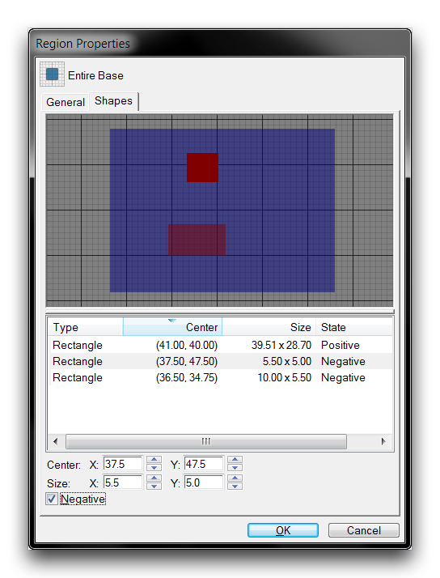
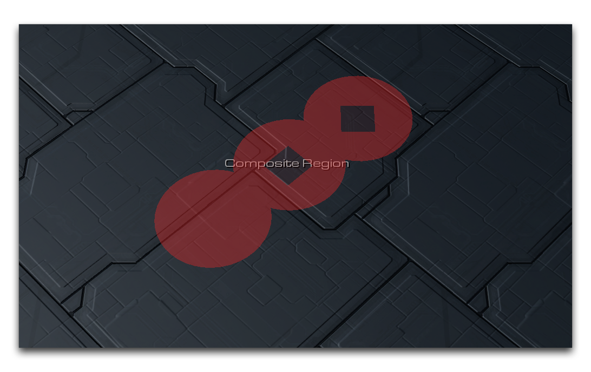
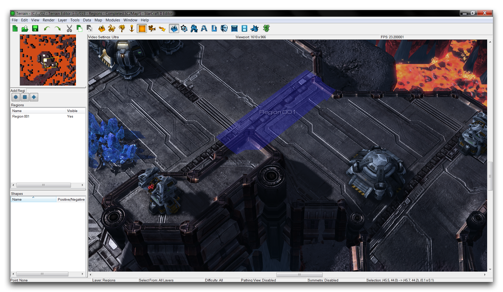
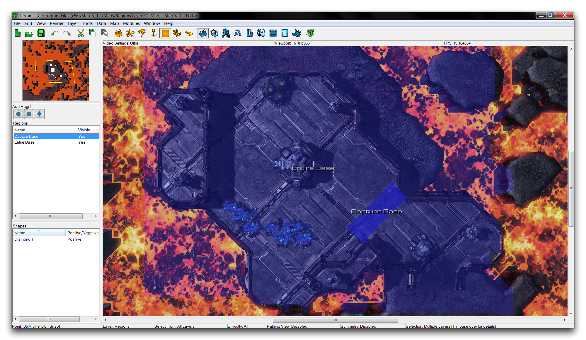
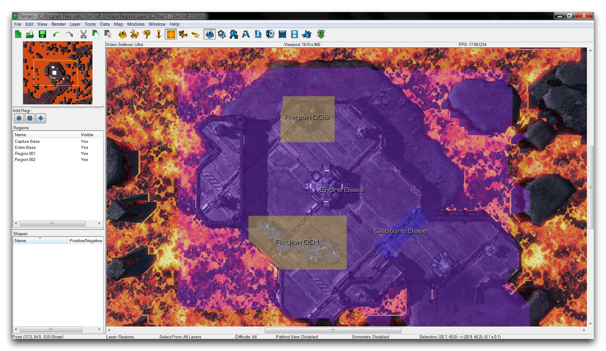
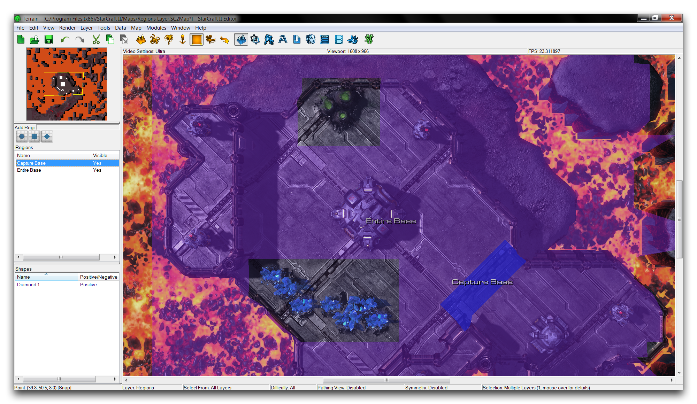
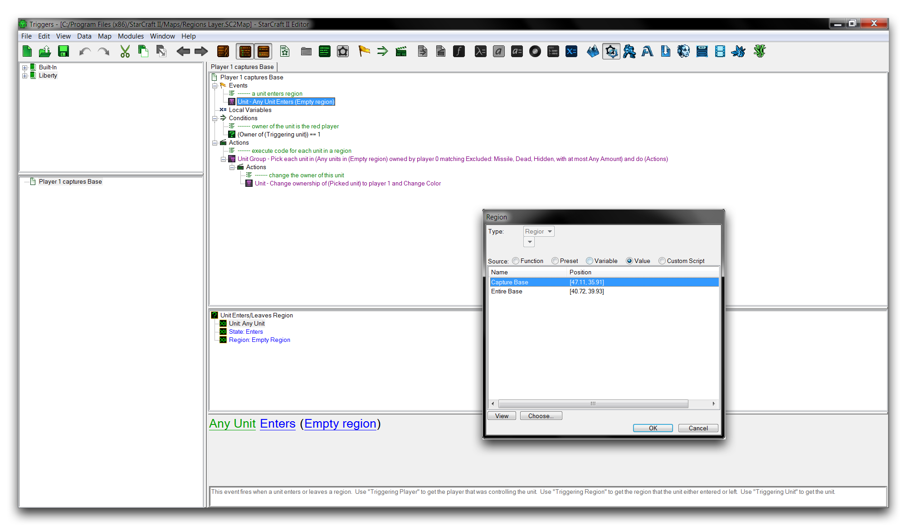
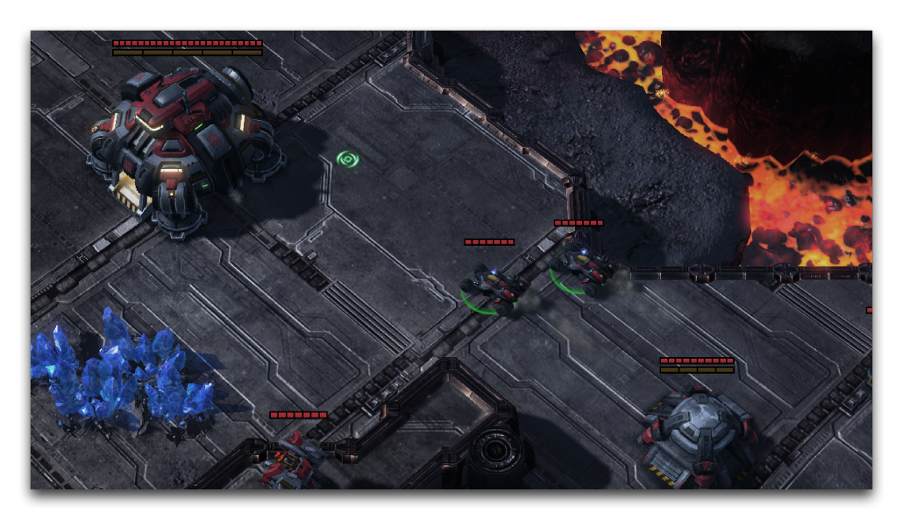

# Regions Layer

The Regions Layer allows you to create regions. Regions are marked zones of the map that communicate areas for use in other Modules. Regions differ from points in that they mark specific shapes on the map, rather than single coordinates. Select this layer from the Terrain Bar using the icon shown below.

*Region Layer Icon*

## Regions Palette

The Regions Palette is where you'll find the controls for creating regions, along with a list of any regions already on the map. This palette is on the left-hand side of the main viewport when the Regions Layer of the Terrain Editor is active. It looks like the image below.

*Regions Palette*

Regions consist of shapes applied to the map using three tools: the rectangle, the circle, and the diamond. Areas in a region are marked in the Editor using a colored overlay, but are invisible during normal play. You can also build composite regions by combining any number of basic shapes. You can combine shapes either positively, so that their areas are added together, or negatively, so that an area is subtracted from an existing region.

You can check the composition of a region by selecting a region and consulting the bottommost subview of the Regions Palette. This list will show a tally of all the primitive forms contained within that region and if they were combined in the Positive or Negative method.

## Region Properties

Composite regions are built using the 'Region Properties' window. You can find this by double clicking on a pre-existing region either in the map view or within the Regions Palette. You can see an example of the Region Properties window in the image below.

*Composite Region Building*

Here, you can build a composite by beginning with a single, positive region. You can then add shapes by right-clicking on the shape listing and selecting Add Circle, Add Rectangle, or Add Diamond. Any of these shapes can be turned into cutouts by selecting the Negative option. Positive regions are displayed as a blue overlay, while negative regions are displayed in red. Back in the map view, the actual shape will be displayed as a colored overlay, with negative cut-out regions appearing transparent. In the map view, the example from above would appear as shown below.

*Composite Region in Editor*

## Demoing Regions

Open the demo map provided with this article. This map consists of a small fort on top of a hill, with a pair of player-owned hellions some distance away.

*Demo Map Course*

If you check the Trigger Editor in this map, you'll find that there is a brief action found under 'Player 1 Captures Base,' which will turn control of the fort's neutral units over to the player once a unit entering a region. To facilitate this, you'll create a region near the fort's entrance that can be hooked into this trigger.

Create a region by clicking on one of the three region tools in the Regions Palette. The Add Region Diamond tool will be most appropriate here. Select it, then click and drag on the map view to draw the region. This should give you something that looks like the image below.

*Creating a Region*

If you don't like the placement of your region, you can resize it by toggling the cursor into selection mode. Pressing Space on the keyboard will swap the mouse cursor between a normal pointer for selection mode and a pointer with a plus sign for region creation. Once you're in selection mode, clicking on a region will reactive it, allowing you to move it by clicking and dragging the region to another location. You can resize the region by holding down Ctrl and clicking on the edge of the region, dragging it to a new size.

Now, click the region in the Regions Palette to launch its 'Region Properties' window, then navigate to the 'General' tab. Set the name to 'Capture Base.' The properties window should look like the one shown below.

*Region Properties Contents*

You can edit the region in the leftmost view under the 'General' tab, as above. It's also worth noting that the dimensions and position of the region are presented under the 'Shapes' tab as Size and Center. You can confirm your region size here if you had any trouble during the original placement.

Next, return to the Terrain Module and prepare another region by selecting the Add Region Rectangle tool. This time, create the region so that it encompasses the entire hilltop fort. Rename this region 'Entire Base'. You should be left with something like the image below.

*Current Region Layout*

If you're having trouble seeing the entire scene, try either zooming out or setting the camera to a bird's eye view by going to View ▶︎ Entire Map. From this view, you can zoom in and get the perspective seen in the example image. Note that you can also highlight a specific region by selecting it in the map view, as has been done for the 'Capture Base' region above.

Unfortunately, there are now minerals fields and a vespene geyser inside the 'Entire Base' region. According to the actions in the Trigger Module, this would result in the player being given control of these resources. Resources typically must belong to the Neutral player. You can use a composite region to build a region that encompasses the base, but also makes allowance for these elements.

Prepare your composite region by creating two rectangular regions, one boxing around the mineral line and one around the vespene geyser. You can change these to Negative regions that will be cut out of the larger shape, ensuring that resources aren't included in the region. This procedure should result in the following view.

*Cutout Regions Prepared*

To make sure everything is easy to read, the new regions and 'Capture Base' have had custom colors applied to them. You can do this by heading to Region Properties ▶︎ General ▶︎ Custom Color. You can now create a composite region by selecting its three constituent regions, then navigating to the 'Region Properties' window. Select all the regions by holding shift and clicking on 'Capture Base,' 'Region 001,' and 'Region 002.' Now right-click in the Regions Palette and navigate to Edit ▶︎ Merge Selection.

*Collected Region Properties*

This view presents an abstraction of what you can see in the Terrain Editor. From here, you can create the cutouts by selecting the two smallest regions and changing their State to Negative. The negative shapes will be drawn in red, which should give you a result like the one shown in the Region Properties window below.

*Constructed Composite Region*

Returning to the map view should now show the region containing the entire fort, but with two holes around the resources.

*Cutout Regions Prepared*

Now that the regions make sense, you can move to the Trigger Editor and back to the 'Player 1 Capture Base' trigger. Select the 'Unit Enters/Leaves Region' event, and double click on the 'Region' field. This will launch a 'Regions' window populated with the active regions on the map. Select the composite region 'Capture Base' and click 'Ok,' as in the image below.

*Selecting Composite Region*

Now move to the 'Change Owner' action and set the 'Region' field to 'Capture Base' using the method described earlier.

Now that the project is complete, you can take a moment to review its function. By moving the hellions at the base of the hill into the 'Capture Base' region, the trigger event will shift everything in the 'Entire Base' region into the player's control. Due to the cutouts in the composite region, the minerals and gas geyser should remain neutral entities.

If everything is working, hitting 'Test Document' and leading the hellions into the fort's entrance should transfer ownership correctly, as shown below.

*Claiming the Fort*

## Attachments

 * [024_Regions_Start.SC2Map](./maps/024_Regions_Start.SC2Map)
 * [024_Regions_Completed.SC2Map](./maps/024_Regions_Completed.SC2Map)
