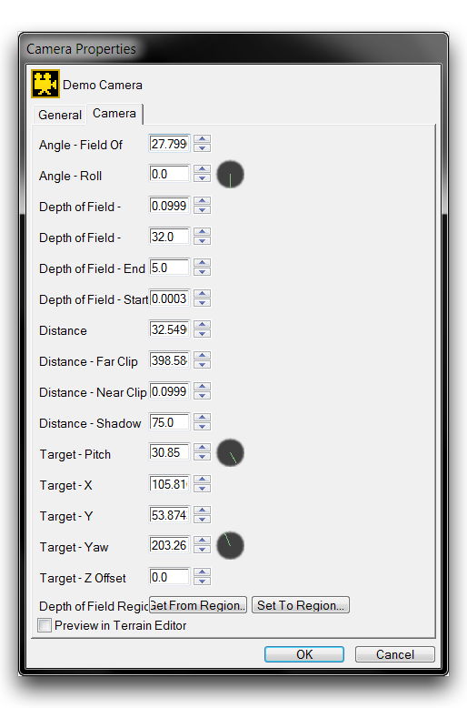

CAMERAS LAYER
=============

StarCraft is usually seen from the top-down view that characterizes the
standard melee game.

Standard Melee View

It's easy to overlook the fact that this view is a central point of much
of the game's visual design. Despite the engine's cinematic usage
throughout the single player campaign, players can often forget that
they're looking through a dynamic, fully moveable camera.

Using the Cameras Layer, unique perspectives, effects, and movements can
be described using a type of game object called a camera. This layer
offers you the ability to hop inside these objects easily, allowing you
to see from their viewpoint and configure them for use. You can then use
the Trigger Editor and the Cutscene Editor to use cameras in various
cinematic or gameplay capacities to offer your players a richer
experience. To learn more about cameras, move to the Cameras Layer from
the Terrain Bar using the icon pictured below.

Cameras Layer Icon

CAMERA OBJECTS
--------------

Once created, cameras appear as marker objects in the Editor, showing
their position and orientation just like an actual camera. Cameras will
only appear within the Editor, where they are displayed as a phantom 3D
model, as shown below.

Camera Object

Despite its illustrative appearance, the camera in the left of this
frame is essentially the same as a point that would be found on the
Points Layer. The camera is closely related to a '3D Point' in that it
is a point in space with an X, Y, and Z value. The big difference
between a camera and a 3D point is that the camera also has a vector.
This vector is an arrow in 3D space describing a direction.

The combination of the camera's point and vector equate to a location
and viewpoint. When you introduce a camera object, the camera transmits
information describing 'Where it is' and 'Where it is looking' to the
game, setting the view for the player. Looking through the lens of the
above camera gives you the view below.

Camera View

Remember the 3D model that marks the camera in the Editor view and it's
easy understand as a representation of a point and vector. The point is
roughly where the center of the lens is, while the vector is represented
by the projection coming out of lens.

Maintaining your understanding of the Editor's cameras as physical
cameras will make them easier to work with. At some point, you may find
yourself managing many cameras as you build game scenes and cinematics.
In these situations, it helps to think of yourself as a director,
setting scenes and placing particular camera shots.

CAMERAS PALETTE
---------------

You'll find cameras and camera creation controls as part of the Cameras
Layer under the Cameras Palette, shown below.

Cameras Palette

The main list on this palette tracks each camera available in the
current map. You can look through any camera by selecting them from this
list and clicking View Selected Camera. Here you will also find support
for exporting camera configurations to files through the Save View to
File option. Cameras are created using the Create Camera button here,
which spawns a camera in the Editor at your current viewpoint.

CAMERA PROPERTIES
-----------------

Once you've created a camera, you can configure it through its 'Camera
Properties.' This is accomplished by right-clicking on a camera in the
Cameras Palette and navigating to Camera Properties. You will then be
presented with the 'Camera Properties' window, which is shown below,
followed by a breakdown of its options.

Camera Properties

  --------------------------------------------------------------------------
  Property   Description
  ---------- ---------------------------------------------------------------
  Distance   Determines the space between the camera and its target.

  Roll       Rotates the angle of the camera in the plane of the page. If
             the camera were your head, consider Roll as rotating in the
             direction that would turn your view upside down.

  Yaw        Rotates the camera side to side. If the camera were your head,
             this would be equivalent to looking from left to right or
             shaking your head in a 'no' motion.

  Pitch      Rotates the camera up and down. If the camera were your head,
             this would be equivalent to nodding your head in a yes motion.

  Target X   The X coordinate of the map that the camera vector is pointing
             to.

  Target Y   The Y coordinate of the map that the camera vector is pointing
             to.

  Target Z   The differential between the camera and target point.
  Offset     Essentially the Z coordinate or height of the camera. Also
             known as Height Offset.

  Depth of   An effect that blurs components of the view to resemble real
  Field      world vision. This setting sets the start, end, and magnitude
             of this effect.

  Field of   Controls the extent of the game world visible to the camera.
  View       

  Near Clip  The distance of the closest clipping plane, closer than which
             no game elements will be rendered. Essentially the starting
             distance in 3D space at which rendering begins.

  Far Clip   The distance of the furthest clipping plane, beyond which no
             game elements will be rendered. Essentially the distance in 3D
             space at which rendering stops.

  Shadow     The minimum distance at which shadows are drawn.
  Clip       

  Custom     Tints the camera model within the Editor.
  Color      
  --------------------------------------------------------------------------

FREE CAMERA CONTROLS
--------------------

The Editor offers a set of hotkeys for moving its viewpoint in 3D space,
known as the free camera controls. By orienting the viewpoint before
using the Create Camera tool, you can use these controls as an intuitive
way of designing cameras. These controls can be viewed by navigating to
File -\> Configure Controls, then searching for the Free Camera labels,
as shown below.

Free Camera Controls
