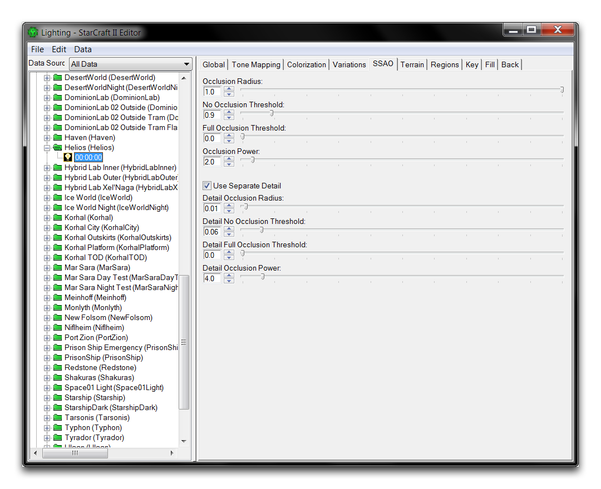
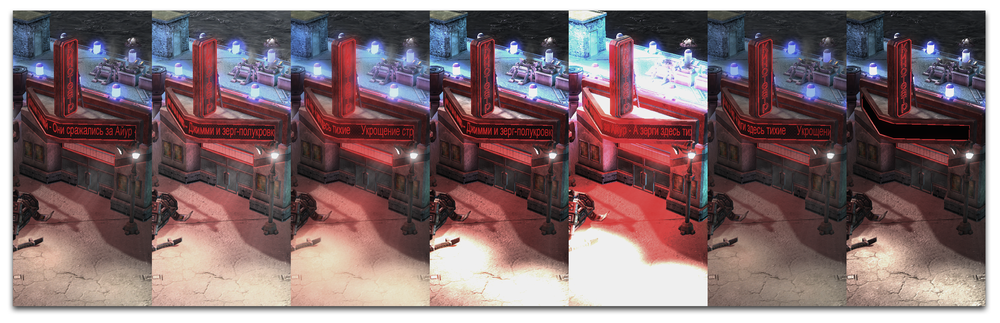
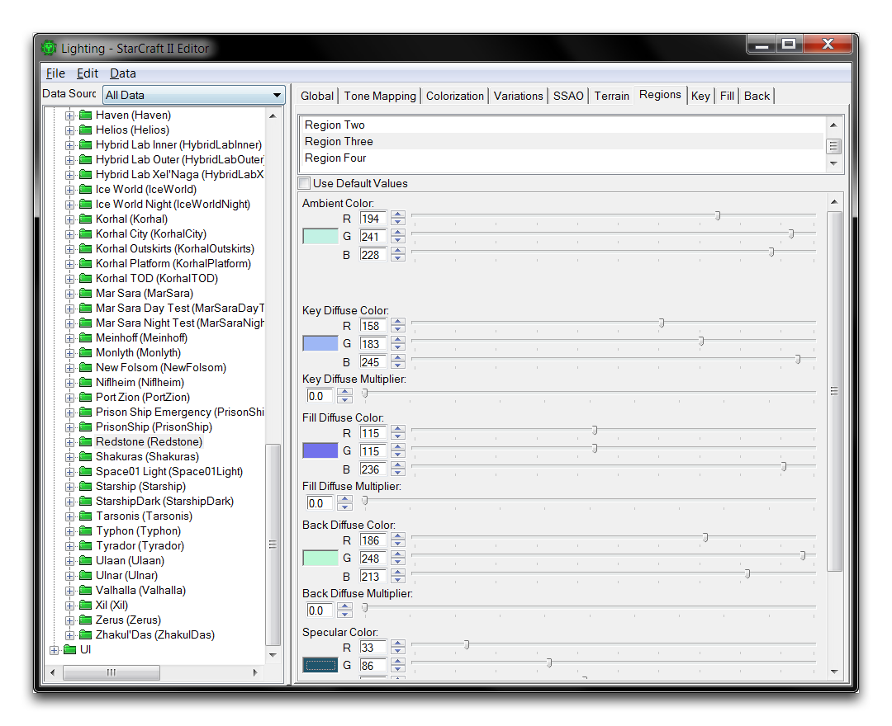
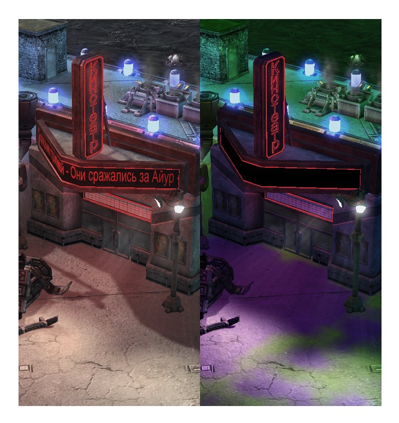
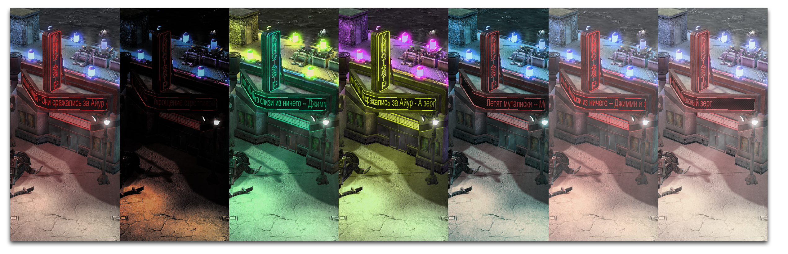
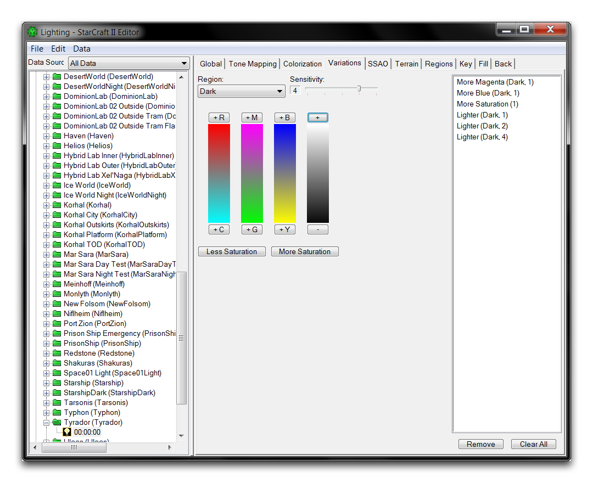
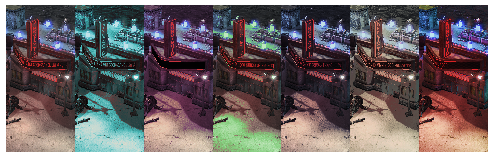
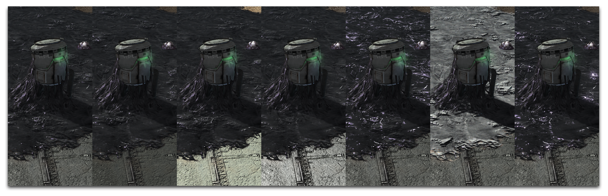

# Lighting Window

The Lighting Window is an interface for altering and previewing lights within the Editor. You can use it to create entirely new lighting arrangements, as well as using any of the existing lighting assets in the game. You can see what it looks like in the image below.

*Lighting Window and its Use*

You can access the Lighting Window by navigating to Window ▶︎ Lighting from anywhere in the Editor. Every lighting setting in the game is found here, grouped into categories like UI Lighting, Tileset Lighting, Portrait Lighting, and Cinematics Lighting. From here you can browse and alter these sets, or even import and export lights between projects. To do so, navigate to either File ▶︎ Export Light or File ▶︎ Import Light. Outside the Editor, these are stored as .SC2Lighting files.

Modifying lights can be daunting due to the number of parameters in the Lighting Window. These parameters are broken down into ten categories: Global, Tone Mapping, Colorization, Variations, SSAO, Terrain, Regions, Key, Fill, and Back. These are discussed in more detail below.

The easiest way to understand these properties is to use the Lighting Window to preview lighting in the main Editor view, which will dynamically update with every change. You can do this by opening the window, then moving to the Terrain Editor. Configure the lighting to show the game lighting by navigating to Render ▶︎ Show Lighting ▶︎ Game Lighting. Any selections and changes to the lighting selection should immediately render in the Editor view, giving you ample opportunity to test and experiment.

The following sections explore each of the features in the lighting tab, along with a description of their properties and a preview of some of their effects. Each preview features the base lighting arrangement on the leftmost side, set to 'Agria (Jungle)' lighting. This will be shown alongside various lighting alterations described in the caption for each image. These alterations are not cumulative, each one is made to the base lighting.

## Global

*Global Lighting*

| Property            | Details                                                                                                                                                                      |
| ------------------- | ---------------------------------------------------------------------------------------------------------------------------------------------------------------------------- |
| Ambient Color       | Defines the color of the global lighting on every surface.                                                                                                                   |
| Specular Multiplier | Sets the magnitude of light emitted from reflective surfaces.                                                                                                                |
| Emissive Multiplier | Sets the magnitude of light emitted from emissive textures.                                                                                                                  |
| Light Time of Day   | Sets the light's time of day value. These are used within 'Time of Day' lighting to simulate, through a series of lights, the changes occurring during a planet's movements. |
| Current Test Time   | Sets the current time of day in the Editor preview. Setting this to the Light Time of Day will test the current light.                                                       |

Base -- Red Ambient -- Green Ambient -- Blue Ambient -- High Specular -- High Emissive -- Low Emissive

## Tone Mapping

*Tone Mapping*

| Property             | Details                                                                                                                                                                               |
| -------------------- | ------------------------------------------------------------------------------------------------------------------------------------------------------------------------------------- |
| Exposure             | Sets the amount of light applied to the scene.                                                                                                                                        |
| Bloom Threshold      | Sets the minimum light value to apply bloom to. Bloom is a type of fringe lighting that has a distinct bleeding effect emitted from shiny objects. Low bloom is common of night time. |
| Ambient Multiplier   | Sets the magnitude of the ambient light. This is currently not active in the Editor                                                                                                   |
| Diffusive Multiplier | Sets the amount of white light generated by objects.                                                                                                                                  |
| White Point          | Sets the amount of light applied to the scene when the Method is set to Reinhard.                                                                                                     |
| Method               | Alters how tone mapping is applied. Each method is a different algorithm, which affects brightness and contrast.                                                                      |

Base -- High Exposure -- Low Bloom Threshold -- High Diffusive Multiplier -- Extreme Diffusive Multiplier -- High White Point with Reinhard Mapping -- Linear Tone Mapping

## Colorization

*Colorization*

| Property      | Details                                                                                                                                           |
| ------------- | ------------------------------------------------------------------------------------------------------------------------------------------------- |
| Input Low     | Controls the contrast in the darks of the scene. Must remain lower than Input High.                                                               |
| Input High    | Controls the contrast in the highlights of the scene. Must remain higher than Input Low.                                                          |
| Input Gamma   | Controls the contrast in the scene's midtones.                                                                                                    |
| Output Low    | Alters the darks of the scene, while preserving color. Must remain lower than Input High.                                                         |
| Output High   | Alters highlight brightness, while preserving color. Must remain higher than Input Low.                                                           |
| Brightness    | Sets the magnitude of light being reflected in a scene.                                                                                           |
| Contrast      | Sets the emphasis of the difference between darks and highlights.                                                                                 |
| Hue           | Hue shifts the color value of all objects in the scene. This is much more distinguishable with Colorize turned off.                               |
| Saturation    | Sets the intensity of color within the scene.                                                                                                     |
| Lightness     | Alters the overall amount of light within a scene.                                                                                                |
| Colorize      | Alters the intensity and contrast of color in the scene. Turning this off modifies how hue, saturation, and lightness contribute to the lighting. |
| Correct Gamma | When active, corrects the color of the scene based on monitor's gamma settings.                                                                   |

Base -- Input Low Increased -- Input High Decreased -- High Input Gamma -- Output Low Increased -- Output High Increased-- High Contrast

Base -- High Contrast --Hue Decreased with Colorize Off -- Hue Increased with Colorize Off -- Low Saturation -- Lightness Increased -- Correct Gamma Off

## Variations

Variations are simple filters that can be used to affect the overall lighting of scene. Selecting any of the variation controls will add the associated property to the light.

*Lighting Variations*

| Property                          | Details                                                                                                             |
| --------------------------------- | ------------------------------------------------------------------------------------------------------------------- |
| Region                            | Sets whether the variation applies to the scene's darks, midtones, or highlights.                                   |
| Sensitivity                       | Controls the strength of the applied filter. These are additive; Red 5 is equal to five applications of Red 1.      |
| Color Settings                    | Applies the selected color. Options include Red, Cyan, Magenta, Green, Blue, and Yellow.                            |
| Light Settings                    | Applies more lightness or darks to the scene. These elements neutralize each other.                                 |
| Less Saturation & More Saturation | Applies more or less saturation to the scene, changing the emphasis on color. These elements neutralize each other. |

Base -- Cyan Midtones -- Violet Darks -- Green Highlights -- Darker Blue Darks -- Yellow Lighter Midtones -- More Saturation

## Ssao

*Ambient Occlusion*

Screen Space Ambient Occlusion (SSAO) is a rendering technique that shades objects based on their distance from the camera. These settings are currently inactive.

## Terrain

*Terrain Lighting*

| Property                      | Details                                                                |
| ----------------------------- | ---------------------------------------------------------------------- |
| Terrain Specular Exponent     | Sets the base amount of light reflected from the terrain's highlights. |
| Terrain Diffuse Multiplier    | Sets the magnitude of the terrain's general light reflectivity.        |
| Terrain Specular Multiplier   | Sets the magnitude of the terrain's highlight reflectivity.            |
| Creep Specular Exponent       | Sets the base amount of light reflected from creep.                    |
| Creep HDR Diffuse Multiplier  | Sets the magnitude of creep's general light reflectivity.              |
| Creep HDR Specular Multiplier | Sets the magnitude of creep's highlight reflectivity.                  |
| Creep HDR Emissive Multiplier | Sets how much light is created from creep's emissive texture.          |

Base -- Increased Terrain Specular Exponent -- Increased Terrain Diffuse Exponent -- Increased Terrain Specular Multiplier -- Decreased Creep Specular Exponent -- Increased Creep HDR Diffuse Multiplier -- Increased Creep HDR Specular Multiplier

## Regions

*Region Lighting*

Regions define lighting settings that are applied distinctly to one area of the map. Up to four areas can be painted with the lighting brush within the Terrain Layer of the Terrain Module. Each region is highly configurable with support for individual Key, Back, Fill, and ambient settings. Once set, the lighting within a region overrides the global lighting. You can apply lighting regions to terrain in the Terrain Layer of the Terrain Module.

*Base -- Painted Regions*

## Key, Fill, And Back Lighting

These three associated categories make up a three-point lighting model, a traditional method of lighting scenes in various media. The Key is the principal light, it illuminates the main components of the scene and is the primary emphasizer of looks, colors, and shadows. The Fill is a secondary light that traditionally shines from an angle to the side of the Key. This contributes body, lessening the impact of individual shadows and creating softer lighting.

Back lights, as the name suggests, shine either from behind or from another side of the scene. Usually Back lighting is set to give a sort of halo effect to objects in the scene, separating them from their surroundings with lighting around their rim. You'll find these lighting types in three similar tabs in the Lighting Window. One of these is shown below.

*Key Lighting*

| Property            | Details                                                                                                                                                                                                                                                                                                                                                                                        |
| ------------------- | ---------------------------------------------------------------------------------------------------------------------------------------------------------------------------------------------------------------------------------------------------------------------------------------------------------------------------------------------------------------------------------------------- |
| Diffuse Color       | Sets the color of the light's entire surface reflection.                                                                                                                                                                                                                                                                                                                                       |
| Diffuse Multiplier  | Sets the strength of the light's entire surface reflection.                                                                                                                                                                                                                                                                                                                                    |
| Specular Color      | Sets the color of the light's direct reflection.                                                                                                                                                                                                                                                                                                                                               |
| Specular Multiplier | Sets the strength of the light's direct reflection.                                                                                                                                                                                                                                                                                                                                            |
| Direction           | Sets the heading of the light using the H and V controls. H, or Horizontal angle, corresponds to cardinal direction as follows: North is 0, East is 90, South is 180, and West is 270. V, or Vertical angle, corresponds to the light's altitude. Directly above the target is 90, directly below is 270. Note that a light positioned below the horizon will not light the terrain's texture. |

## Customizing A Light

Open the demo map provided with this article. There you should see the scene used in the creation of some of this article's images. It's a film noir styled bar front. Unfortunately, the clean daytime lighting is spoiling the mood. You can use the lighting interface to solve this problem. To explore light customization, navigate to the Lighting Window via Window ▶︎ Lighting Window. Now select the premade light set 'Custom Night Light' and click on the '00:00:00' to open the light.

*Starting Light*

From here you'll make a series of adjustments to the lighting, they will be listed with their effects shown in the photo strip below. Unlike the images used in our previous examples, these effects are cumulative. Compare the results of each step using this sample image to get a feel for the effects of different lighting properties. By the end of this exercise, this scene should have much more film noir appeal.

1.  In Global, set the Ambient Color to R86, G79, B147. Set the Specular Multiplier to 0.6, and the Emissive Multiplier to 1.1.
2.  In Tone Mapping, lower the Exposure from 1.5 to 0.6.
3.  Lower the Bloom Threshold from 1.0 to 0.1. Increase the Diffuse Multiplier from 1.0 to 1.4.
4.  In Colorization, increase the Input Low from 0 to 0.05. Decrease the Input High from 1 to 0.9.
5.  Increase the Colorization from 0.3 to 0.5.
6.  In Terrain, decrease the Terrain Diffuse Multiplier from 1.0 to 0. Decrease the Terrain Specular Multiplier from 3.75 to 0.

*Base -- Step 1 -- Step 2 -- Step 3 -- Step 4 -- Step 5 -- Step 6*

## Attachments

 * [028_Lighting_Window_Start.SC2Map](./maps/028_Lighting_Window_Start.SC2Map)
 * [028_Lighting_Window_Completed.SC2Map](./maps/028_Lighting_Window_Completed.SC2Map)
