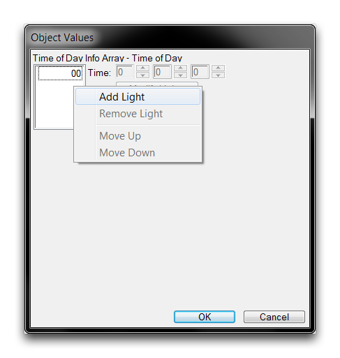
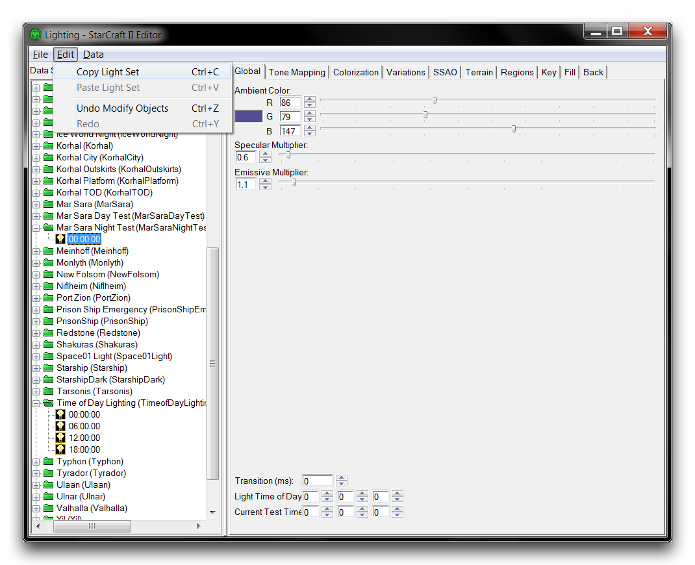
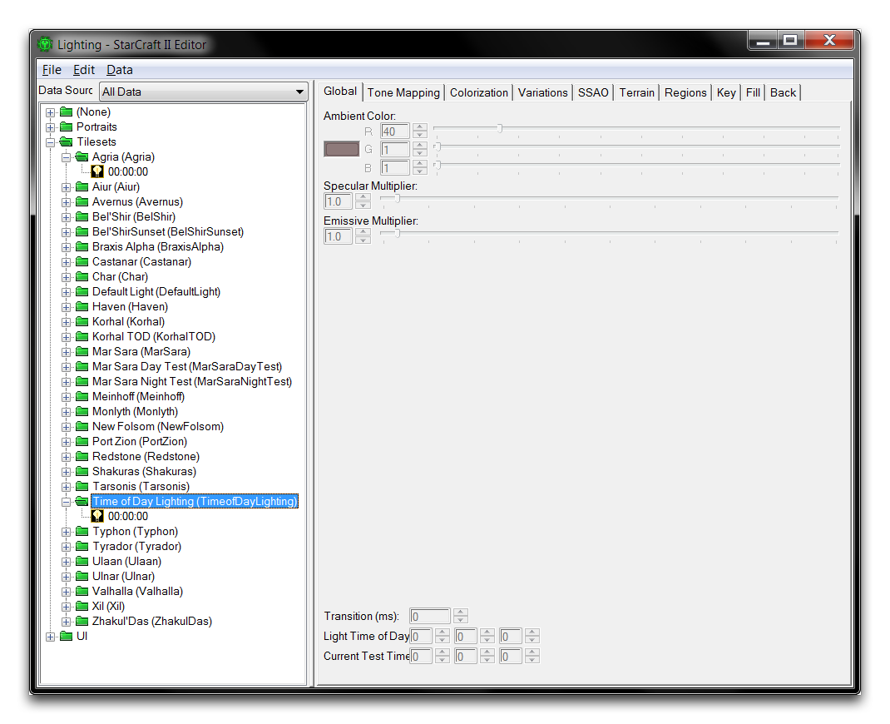
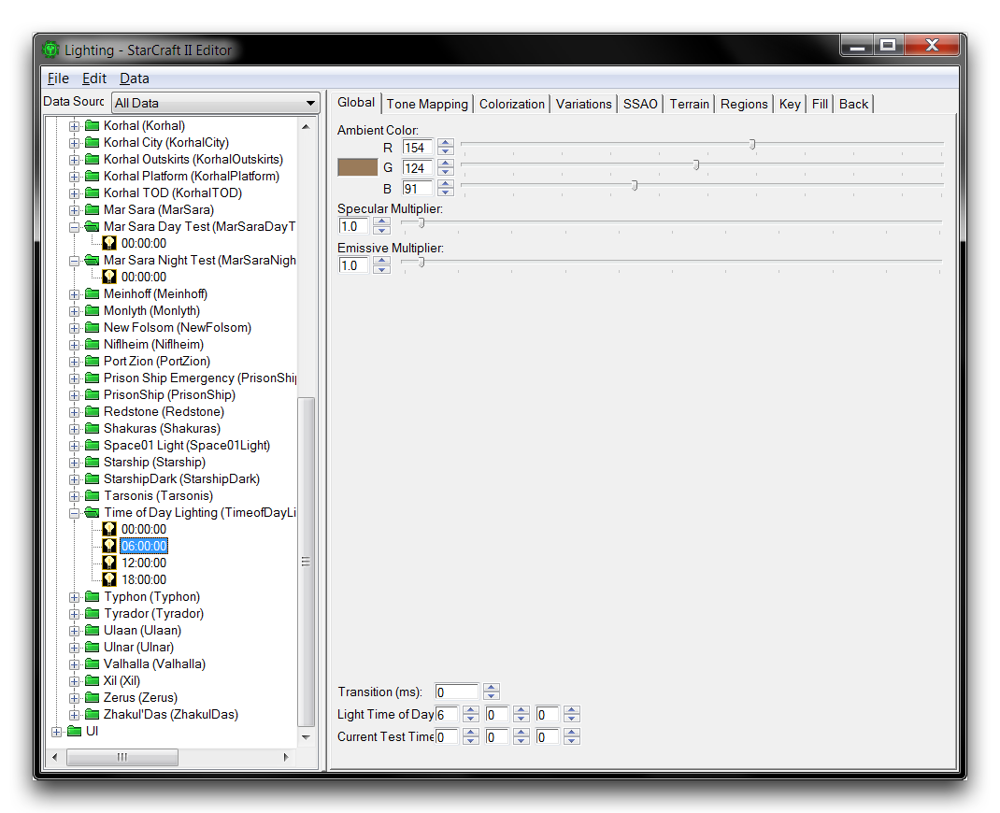
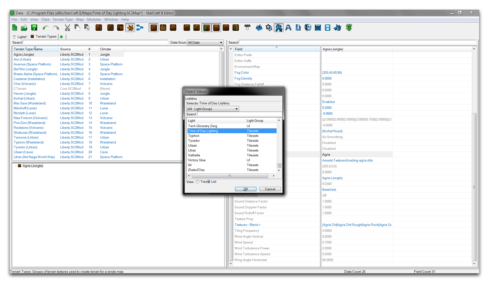

# Time Of Day Lighting

As a real-time strategy game, StarCraft has many systems centered on time. For lighting, there is a useful setting called Time of Day Lighting. This system allows lighting to react to the passage of time, altering its conditions to simulate the passing of day and night. The cycle will repeat, unless told to stop, for as long as the game persists. You can employ this as a tactic for establishing mood and atmosphere, but it also supports a variety of gameplay features by hooking into a set of Time of Day validators. This allows you to trigger different effects as your game cycles through lighting effects.

## Creating Time Of Day Lighting

Open the demo map provided with this article. Inside you'll find a scene featuring the exterior of a bar set against a backdrop of some burning wreckage. Move to the Data Editor and open lighting tab by clicking the green +, then navigating to Edit Art and Sound Data ▶︎ Lights. Create a new light by right-clicking inside the main view, and selecting Add Light. Name the light 'Time of Day Lighting' and hit suggest to generate an ID. Next, set the 'Light Group' to 'Tilesets' using the drop down. This process should look like the image below.

*Light Creation*

Click on your new light, then double click the field 'Time of Day.' This field will be labelled 'Time of Day Info Array' if the Combine Structural Values option is not activated. This will launch the 'Object Values' window.

Inside this window you'll see a list of all the current times of day for which there are lighting behavior. Currently you will only see the value 00, a shorthand for 00:00:00. Times of day are recorded in military time using the format HH:MM:SS, or hours, then minutes, then seconds. The 00 value is thereby equal to the zero hour, or midnight. If you only have one value here, the time of day behavior is by default constant, meaning that your game's lighting will be constant.

Right-click inside the white box and select 'Add Light' to add a new time of day. You can see an example of this below.

*Adding a Time of Day Light*

Set this new light to 06:00:00 by clicking into the first term of the 'Time' field and writing 6. This field mirrors the HH:MM:SS format. Now, add two more lights, 12:00:00 and 18:00:00, to create four times of day in total. The finished array should look like this.

*Four Time of Day Lights in an Array*

Click 'Ok' to close the window, updating the light in the Data Editor. Now double click on the 'Time of Day' field again to repoen it. It's worth noting at this point that the lighting window is an interface that requires a lot of updating. It pushes data directly to the Editor view, creating a very useful dynamic rendering of lighting styles. Data and trigger features that send information directly to the Editor can occasionally get stuck. A few precautionary manual refreshes can really help in avoiding this behavior, and that's what you've just done.

Now, click on the first light of the array 00 to highlight it, then click the 'Modify Light' button to open the current Light in the Lighting Window.

*Light Opens in the Lighting Window*

The lighting window will launch and then automatically show the selected Time of Day light in a folder of the current Light. Note that the folder is categorized by the Tileset type that you selected during light creation. It's quite common for the Lighting Window not to have been updated with all of the Time of Day values in the array. If the folder only contains the 00:00:00 value, refresh the window by highlighting 00:00:00, then right-clicking and selecting 'Add Light to Set.' This is shown in the image below.

*Refreshing Light Set*

The lighting window will update and should display five entries under the 'Time of Day Lighting' set. Right-click the extra 00:00:00 light, which was created to refresh the window, then select 'Remove Light from Set.'

Now you can configure your four time of day lights, setting different properties for each one. The game uses time of day lighting as a sort of plan. As time passes the game gradually changes the properties of its lighting, shifting from its current values to the values of the next light in the array. It repeats this process again and again, so that by making realistic lights for each part of the day you'll see a recognisable day and night cycle develop.

Configuring light properties from scratch can be quite time consuming. It's often better to copy data from a pre-existing light and use that as a base for modification. You can do this here by using some of the 'Mar Sara' settings as the basis of your day and night lighting. Navigate to the 'Mar Sara Night Test' folder and highlight the light inside. With this light selected, copy its properties with Edit ▶︎ Copy Light Set.

*Copying Light Set*

Return to the 00:00:00 light in the 'Time of Day Lighting' set, highlight it and paste in the copied data with Edit ▶︎ Paste Light Set. You can see this process in action in the image below and to the left, while the light updated with the pasted properties is shown on the right.

*Pasting Light Set -- Pasted Light*

Using the copied properties as a base, you can now configure the 00:00:00 point. Navigate to its Key tab and set H (Horizontal Angle) to 180, and V (Vertical Angle) to 80. Moving the light to this low, high angle will help to create the dark atmosphere expected at 00:00:00, or midnight. This should look like the image below.

*Key Lighting Being Set*

To finish setting up this light, move to the Fill tab and set H to 45 and V to 45. Under the Back tab set H to 0 and V to 45. Now move to the 'Mar Sara Day Test' folder, highlight its 00:00:00 light and copy it. Paste its values into the 06:00:00 light in the 'Time of Day Lighting' set. Navigate to the Global tab and set 'Light Time of Day' to 6 0 0. This is the most important field to set for time of day lights. You didn't need to set it in the last example because the default value is 0 0 0. The image below shows how to set the value.

*Light Time of Day Being Set*

For this light, set the Key H to 270 and the V to 350. Set the Fill H to 135 and the V to 5. Then set the Back H to 90 and the V to 45. These settings give this light, which simulates the sunrise, very long shadows and a lot of backing light on objects.

Repeat the process to finish out the last two lights with the following inputs.

For the 12:00:00 light.

  - Copy the 'Mar Sara Day Test' 00:00:00 light to the 'Time of Day Lighting' 12:00:00 light.
  - Set the 'Light Time of Day' to 12 0 0.
  - Set its Key H to 0 and the V to 275. Set its Fill H to 225 and V to
    60. Set its Back H to 180 and V to 45.

This configures the light to be almost directly overhead, as if the sun were at high noon.

For the 18:00:00 light.

  - Copy the 'Mar Sara Night Test' 00:00:00 light to the 'Time of Day Lighting' 18:00:00 light.
  - Set the 'Light Time of Day' to 18 0 0.
  - Set its Key H to 90 and the V to 350. Set its Fill H to 315 and V to
    5.  Set its Back H to 270 and V to 45.

This sets the light to set in the west, making long shadows similar to the 06:00:00 sunrise, but in the opposite direction.

Close the Lighting Window and open the Data Editor. If it is not already done, highlight the 'Time of Day Light' light.

Navigate to the 'Time Per Game Loop', and set it to 0 20 0, as in the image below.

*Setting Game Loop Time*

This value determines the amount of time taken by the full time of day lighting cycle. Setting a short period of 20 seconds here will allow you to preview the effects in the map test. Finally, navigate to the 'Terrain Type' tab, highlight 'Agria (Jungle),' and set the 'Lighting' to 'Time of Day Lighting.' This procedure is shown below.

*Enabling Custom Lighting in Terrain Type*

Your lighting setup is now complete. Use the 'Test Document' function to test the map. This should reveal an exaggerated day and night cycle in which a night scene is broken by sunrise, the day quickly passes, the sun sets, and the scene plunges back into night, repeating itself indefinitely. This behavior is a result of the scene moving through the four lighting set-ups quickly, blending their features from one to another on a scale of about five seconds. To get a better idea of how lights blend using time of day settings, feel free to examine the individual lights using the Lighting Window.

You can see the results of this test run below.

*Sunrise to Sunset Using Time of Day Lighting*

## Attachments

 * [029_Time_of_Day_Lighting_Start.SC2Map](./maps/029_Time_of_Day_Lighting_Start.SC2Map)
 * [029_Time_of_Day_Lighting_Completed.SC2Map](./maps/029_Time_of_Day_Lighting_Completed.SC2Map)
