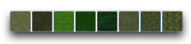
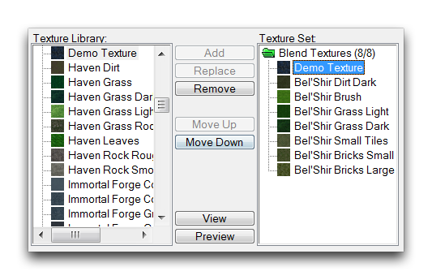
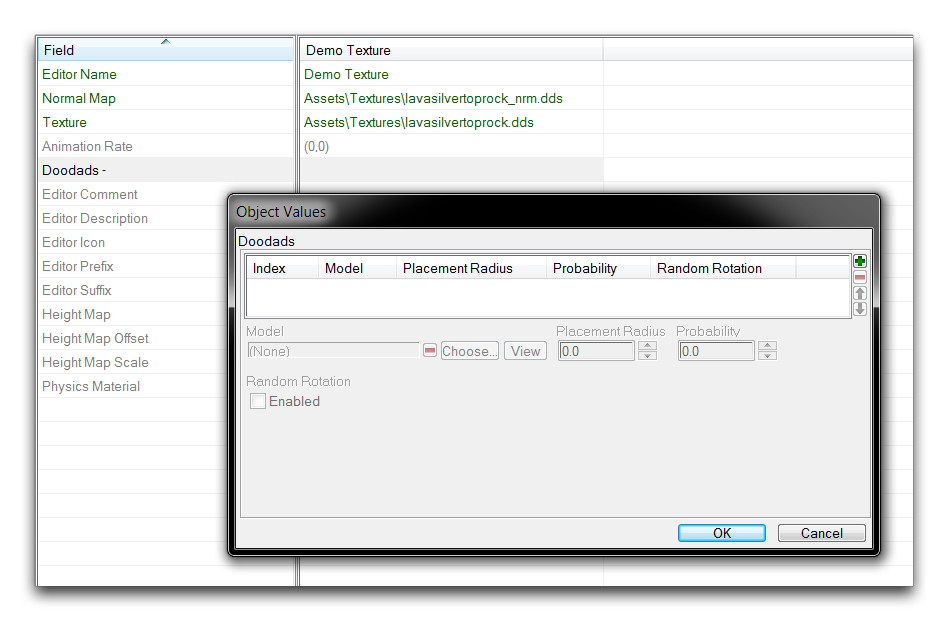
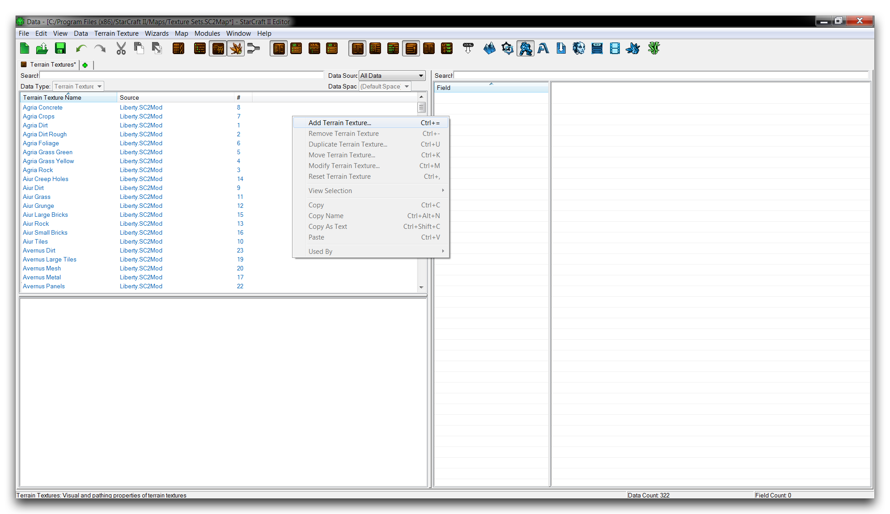
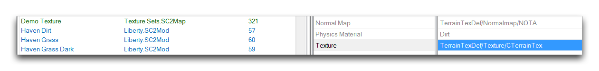
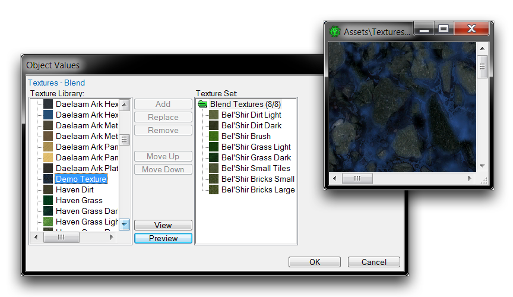
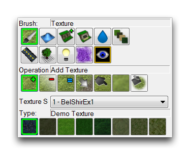

# Texture Sets

The type of textures available for use on any given map's terrain are organized into sets. Historically these sets are known as tilesets, owing to the 2D roots of the RTS genre. Now though, they are referred to within the StarCraft II Editor as Texture Sets, referring to the fact that they are composed of individual Texture assets. This name game actually extends further, and the data type of texture sets are referred to in the Data Editor as Terrain Types. The names of the prebuilt sets are likely familiar to anyone who has experience with the campaign or competitive StarCraft. Examples include: Bel'Shir, Shakuras, and Char. An example of one such set, as presented in the Terrain Palette, is shown below.

*Bel'Shir Texture Set*

The composition of Texture Sets/Types is limited for performance reasons. The robust landscape painting provided in the Terrain Editor allows a lot of blending in between its texture palette. As a result, the scope of textures available at any given time must be limited. Fortunately, existing palettes can be configured and entirely new ones can be custom-built to open up more diverse texture options for a particular project.

## Terrain Textures

Terrain types are composed of a set of eight individual textures, which are stored in data as Terrain Textures. This type is built from raw texture files that then have several fields injected into them. Doing so gives the texture the proper information in terms of things like physics, lighting, and foliage typing, rendering it eligible for use in the game. Some important fields of the Terrain Texture type can be found in the following table.

| Property         | Details                                                                                                                                                                                                                                              |
| ---------------- | ---------------------------------------------------------------------------------------------------------------------------------------------------------------------------------------------------------------------------------------------------- |
| Physics Material | The material reported to the actor system for certain events occurring on this texture's space. For example, in the Trigger Editor actors can be made to play different sounds or use alternate models, depending on the texture's physics material. |
| Doodads          | Determines what type of foliage is generated on this terrain via the Generate Foliage function of the Terrain Palette.                                                                                                                               |
| Texture          | Sets the visible texture for the Terrain Texture. It provides the look of a specific texture, but will not always reflect its exact in-game appearance through the Editor if a normal map is required.                                               |
| Normal Map       | Sets the normal map, which controls reflected color and game lighting data. Omission of a normal map will likely result in graphical errors.                                                                                                         |

## Creating A Custom Terrain Texture

First, create a new Arcade map and set its default texture set to 'Bel'Shir (Jungle).' You don't need to specify any other map properties for this tutorial. Now move to the Data Editor by navigating to Modules ▶︎ Data.

Within Data, open the terrain textures tab and create a terrain texture by right-clicking the Object Listing and selecting 'Add Terrain Texture.' This should appear as shown below.

*Creating Terrain Texture*

This will launch a 'Terrain Texture Properties' window. Enter 'Demo Texture' under 'Name,' then hit the 'Suggest' button to generate an ID. The completed terrain texture creation screen should look like this.

*Creating Terrain Texture*

Click 'Ok' to create your terrain texture, then move on to the newly created texture's fields. You should now select a raw texture by double clicking the 'Texture' field, as in the image below.

*Creating Terrain Texture*

Opening the 'Texture' field will launch an 'Object Values' window with a browse option. Clicking the 'Browse' button should bring you to the Archive Browser, where you can select a texture. Quickly select the lavasilvertoprock.dds texture using the search function, then hit 'Ok' to complete selection.

*Selecting Terrain Texture*

You will also have to supply a normal map texture alongside the base texture. Double click the cell to the right of the 'Normal Map' field and repeat the same process as used for the 'Texture' field. This time, find the texturelavasilvertoprock\_nrm.dds and click 'OK' to select it for use.

*Selecting Terrain Texture Normal Map*

Note that the suffix \_nrm in the texture name identifies this as the associated normal map for your texture. However, it's worth noting that some normal maps in the editor use the endings \_normal or \_norm. If the Editor can't find an associated normal map for your texture, you should select the same texture file for the 'Normal Map' field as you have already used for the 'Texture' field. If you don't supply any normal map at all, you may encounter graphical issues due to the engine lacking certain lighting and color information for your map.

## Setting Custom Foliage

By using the 'Generate Foliage' function in the Terrain Editor, you can populate each terrain texture in the 'Allow Foliage' area with its associated type of foliage drawn from the 'Doodads' field. Adding this functionality to the texture under construction should prove educational. To add support for foliage on your new texture, double click the cell to the right of the 'Doodads - ' heading.

*Foliage Doodad Input*

From the 'Object Values' window that you've just launched, click the green + button to add a new foliage doodad to the terrain texture. Doing so will add a new blank doodad. You can define it by selecting the 'Choose' button. Clicking this button will launch a popup that allows you to select any Model type from the project's data. This process is shown below.

*Foliage Doodad Selection*

Select the 'Shakuras Tree' Model and click 'Ok.' At this point, foliage generation will support this terrain texture. Anytime the texture is within an 'Allow Foliage' zone, activating the Generate Foliage function in the Terrain Editor will create the doodad in an amount based on the Density (Per Cell) settings in the Terrain Palette.

Foliage tends to look best when it is created with some randomness. This mimics a natural environment. There are a few options in this menu to help with this. One option here is the checkbox titled 'Random Rotation.' If you activate this, it will rotate each doodad model to face a random direction on generation. Check the 'Random Rotation' box to enable it and click 'OK' to finish.

*Completed Doodads Input*

Another option not addressed in this article is to populate this doodad list with multiple types of possible foliage to ensure a distribution of different models. You can then set the Probability of each doodad, which will change the proportion in which they are generated. For now though, stick to the single model already selected.

## Altering A Texture Set

Now that you have your Terrain Texture prepared, you'll need to add it to the texture set being used by the map itself. Remember that you've selected the 'Bel'Shir (Jungle)' set for this map. As mentioned earlier, these sets are collected internally within the Data Editor under the datatype Terrain Types. You could construct a completely new terrain type, but for the moment you can just alter the current map set to substitute the 'Demo Texture' for one of its eight default textures.

Open the terrain textures tab by navigating to + ▶︎ Edit Terrain Data ▶︎ Terrain Types, then find the pre-existing type 'Bel'Shir (jungle)' in the Object Listing. Highlight it to view its fields, then you can swap in the new texture by double clicking 'Texture -- Blend,' as shown below.

*Altering Bel'Shir Terrain Type*

This will launch an 'Object Values' window annotated with 'Textures -- Blend.'

*Terrain Type Definition View*

This editor lists the 'Texture Library' of all available Terrain Textures and the currently selected Terrain Type in two parallel listings. The intermediary controls allow textures to be added, removed, reoriented, and swapped back and forth between the library and the texture set. Additionally the 'Preview' button, can be used to see the 'Demo Texture' with both its base texture and normal map combined. Select 'Demo Texture' from the 'Texture Library', then highlight 'Bel'Shir Dirt Light' in the 'Texture Set' and hit 'Replace.' This should swap the textures, as you can see in the image below.

*Swapped Terrain Textures*

Clicking 'Ok' at this stage will complete the Terrain Type update and finalize the exercise.

## Testing The Custom Texture Set

Go back to the Terrain Editor and navigate to the brush tool in the Terrain Palette. You should be greeted by a thumbnail preview of your the 'Demo Texture' in the far left spot of the texture set. This will look like the image below.

*Customized Texture Set on Terrain Palette*

The texture is now ready to be painted onto the terrain, so feel free to start experimenting.

*Volcanic Ash in Bel'Shir*

You can test the foliage capabilities of this new texture by laying an area of it down, then painting that area with the 'Allow Foliage' option. If you hit Generate Foliage, it should give you something similar to the screenshot below.

*Generated Shakuras Tree Foliage*

## Attachments

 * [030_Texture_Sets.SC2Map](./maps/030_Texture_Sets.SC2Map)
