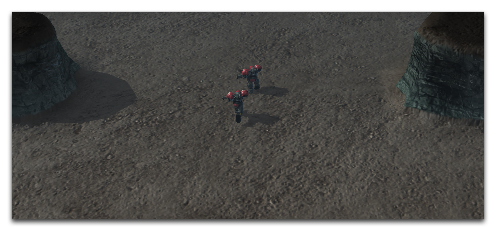

DYNAMIC PATHING BLOCKERS
========================

Dynamic Pathing Blockers let you build pathing zones that can be
switched on and off during gameplay. This ability is based on the fact
that they are actually units, meaning that they can be shown or hidden
through trigger actions. Hiding a unit suspends its footprint, removing
its pathing accordingly. When the blocker is shown again, its pathing
will be restored.

There are a number of uses for pathing on the fly like this. Most
notably, you can restrict access to certain portions of the map until a
condition or quest-type action is met. Dynamic pathing blockers will
also show their footprints in the Terrain Editor, making them easier to
work with than any other solutions for creating temporary blockages.

CREATING DYNAMIC PATHING BLOCKERS
---------------------------------

You can find pre-made dynamic pathing blockers in the Units Palette by
searching for the term 'Dynamic.'

Dynamic Pathing Blockers

The name of each blocker typically notes its footprint size and shape,
as well as the type of pathing it blocks. Dynamic pathing blockers are
not to be confused with the dynamic pathing fill option in the Pathing
Layer. The former is a pathing zone that can be altered during
game-time, while the latter fills an area in the Editor with a 'No
Pathing' zone.

You can also build dynamic pathing blockers from scratch using the
template PATHINGBLOCKER during unit creation, as shown in the image
below.

Dynamic Pathing Blockers

Once you've created it, you'll need to set the pathing blocker's
'Footprint' field to the desired Footprint object. It also needs to be
connected to a unit actor in order to connect it to its standard models.
The blueprint for a common blocker is shown below.

Dynamic Pathing Blocker Data Composition

PLACING DYNAMIC PATHING BLOCKERS
--------------------------------

The placement grid is particularly useful when placing dynamic pathing
blockers. You can enable it by navigating to View -\> Show Placement
Grid, then checking all of its options.

Placement Grid View Options

For this demo map, the dynamic placement blockers are used to simulate a
sort of energy gate. This map uses a 'Protoss Energy Line (Blue)' doodad
along with some cliff faces to give the placement blocker a visual
element. You can see these in the image below.

Energy Gate Site

Due to the construction of the map, there is only an eight unit-wide
area where the marines can pass through the gate. This is the ideal
scenario to use dynamic pathing blockers, and the map has been fitted
with four 'Dynamic Pathing Blocker 2x2' in order to fill the gap.

Energy Gate with Dynamic Pathing Blockers

Since the path is closed off by the dynamic blockers, you can turn them
on and off to give the functionality of a doorway or gate.

USING DYNAMIC PATHING BLOCKERS
------------------------------

Because dynamic pathing blockers are units, they will only apply their
footprints when they are active on the map. You can use the trigger
action 'Show/Hide Unit' to change the blocker's status, effectively
switching them on and off as needed. Any other actions that can target
units can be used with dynamic pathing blockers to varying effect,
useful choices include 'Kill Unit,' 'Create Units,' and 'Move Unit
Instantly.'

In the demo exercise, the dynamic pathing blockers have been added to a
group during map initialization. From there, the following trigger was
added.

Dynamic Pathing Blocker Toggling Trigger

This trigger alters the dynamic pathing blocker's status every five
seconds. When the 'Line Hidden' variable is set to False, the gate is
faded in using the SetOpacity actor message. This same statement block
also activates the dynamic pathing blocker with the 'Show Unit' action.
The closed gate will appear as follows.

Path Blocked by Closed Gate

When the variable is switched to True, the opacity and blocker status
are toggled with SetOpacity and 'Hide Unit' respectively. This
eliminates the gate and blocker from the map, allowing units to pass
through.

Path Revealed by Open Gate
