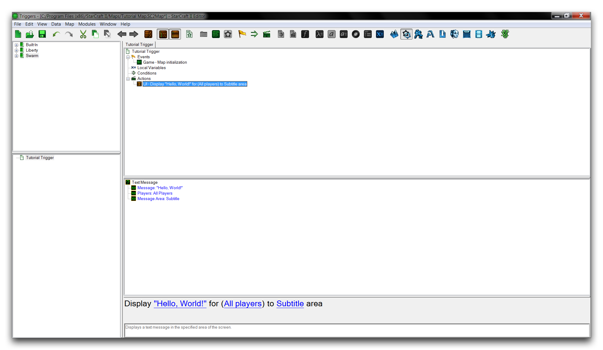

ACTIONS
=======

Actions are the individual commands within a trigger that make a change
within the game. An activated trigger resolves by running each of its
actions in a directed sequence. Each action provides a distinct
function, which can be combined with any number of other actions to
create larger effects. Essentially, actions are the building block
statements that you'll use to direct the game.

CREATING AN ACTION
------------------

First, create a new trigger by right-clicking the Trigger Panel and
navigating to New -\> New Trigger. Inside your new trigger, launch the
'Actions' window either by double clicking the 'Actions' heading or by
right-clicking inside the Main Tab and navigating to New -\> New Action.

Actions Window

The 'Actions' window shows a list of available actions in its rightmost
view. You'll also see a few searching options here, allowing you to
search by category, by browsing the sidebar on the left, or from the top
search bar.

Type "Text Message" into the search bar and select the action called
'Text Message.' This should present you with the following view.

Text Message Action

SETTING ACTION TERMS
--------------------

The anatomy of the action is shown in the Main Tab's subview here.
You'll notice the term 'Message' is colored red. Red text denotes a
required value for an action to be valid. By contrast, the blue text for
the other two terms of the action presents their default values. In the
tab view, you'll see that the action is marked with a distinct red X,
showing that it is invalid. A map with invalid elements won't run
correctly, so it's important that you take note of them.

To enable this action, a message is required. Click on the term
'Message' and add the text 'Hello, World!' to the popup. Click 'OK' and
return to the main screen to validate your action. To test this action,
its trigger must be called in some manner. In this case, you'll add a
'Map Initialization' event by navigating to Events -\> Map
Initialization. This should bring you to the following view.

Configured Action

Running the 'Test Document' action should result in this trigger firing
after the map begins. The message will print to the default 'Subtitle'
area just above the game's UI. Your test run should return a result like
the one shown below.

Action Screen Output

ACTION EFFECTS & VARIETIES
--------------------------

The criteria for the event (Map Initialization) has occurred, resulting
in the action firing, which displayed your message to the screen. This
is the basic process from which gameplay emerges. You can vary the types
of things you are able to do by studying the actions available in the
basic library. Highlighting an action in the 'Actions' window will
display basic tips below the list. These same tips are also available in
the bottommost subview of the Main Tab. Here's a brief intro to some
commonly used actions.

  -----------------------------------------------------------------------
  Action      Effect
  ----------- -----------------------------------------------------------
  Set         Determines the value of any variable available to the map.
  Variable    

  Create      Builds a dialog container for 'Dialog Items,' allowing for
  Dialog      custom UI constructions.

  Create Unit Spawns a unit with a specific rotational heading in the
  (Facing     plane of the map.
  Angle)      

  Play Sound  Runs a sound file from the StarCraft Asset library.

  Show/Hide   A group of actions that change visibilities of objects on a
  \_          player basis. For example, Show/Hide Dialog Item can create
              distinct UI items for each player.

  Set \_      A group of value changing actions. For example, Set
              Alliance defines if players or player groups are hostile to
              one another.

  Remove \_   A group of removal actions. These will eliminate many types
              of entities from the game, as in Remove Unit, Remove
              Behavior or Remove Inventory Item.
  -----------------------------------------------------------------------
