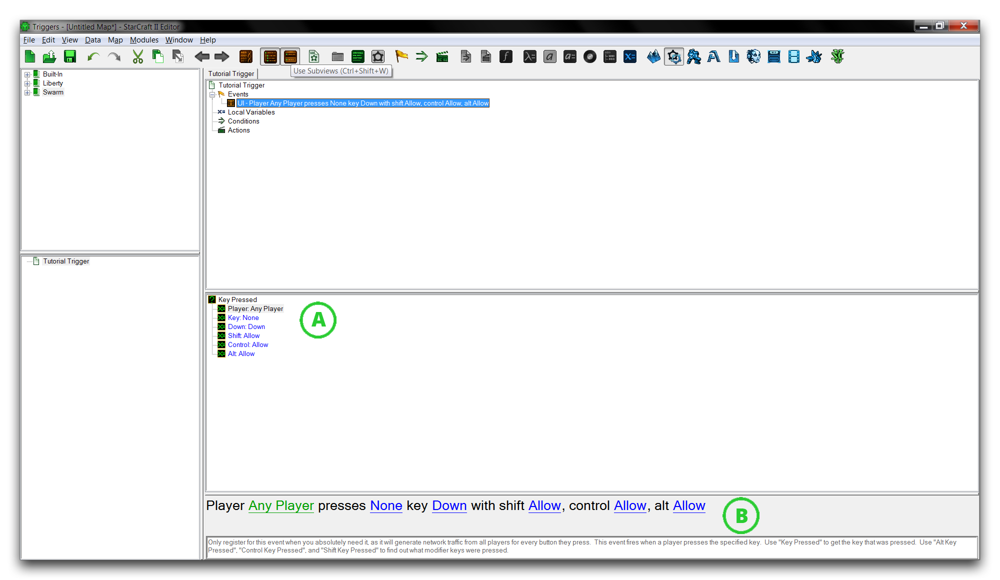

EVENTS
======

Events are the starting point for any typical trigger in the editor. By
selecting an event, you are choosing a set of circumstances that the
game will watch for. When this set of circumstances occurs, the
associated trigger is, you may have guessed, triggered. The trigger then
proceeds from top to bottom, creating changes in the game. Every map has
some sort of event recognition at its core. Even melee maps contain a
single trigger that responds to a 'Map Initialization' event, as you can
see below.

Default Melee Trigger

SETTING UP AN EVENT
-------------------

Create a trigger by right-clicking in the **Triggers Panel**, then
navigating to New -\> New Trigger. Select this new trigger to populate
the Main Tab with the trigger details. These details will be broken down
under several headings, double click the 'Events' heading to open the
'Configure Events' window.

Configure Event Window

This window displays the library of events available to your current
project. The leftmost view allows you to sort the events by any types
they've been labeled with. It also offers you the ability to search as
well as some brief tooltips explaining the selected event's use. It's
worth noting that each event has also been marked with a source. In this
case, each event will list 'Built-in.' The source heading describes if
the event is from the StarCraft trigger libraries or a custom
definition.

Take some time to browse the event possibilities, then find the 'Key
Pressed' event under the label 'UI'. Double click this event to select
it.

COMPOSITION OF AN EVENT
-----------------------

Unlike the 'Melee Initialization' event seen previously, most events
consist of several sub-options requiring configuration. Once you've
selected it, the 'Key Pressed' event will show its options in the main
tab's subview, as shown below. If these options are not visible, make
sure to select the 'Use Subviews' option from the Trigger Bar.

Event View with Sub-Options

The sub-options are presented in two formats. The format labeled 'A'
presents the sub-options in pairings. This gives a vertical list where
each heading takes the form 'Variable Type: Variable Input.'
Alternately, the 'B' format shows a plain-language interpretation of the
variables listed. Each underlined word in blue represents the variable
component. Pay attention to both cases, because in some instances these
formats can differ. The most common occurrence is 'A' offering
additional options that are not presented by 'B'.

Moving down the list in 'A,' the options you can set for this event are
as follows.

  --------------------------------------------------------------------------------
  Sub-Option          Description
  ------------------- ------------------------------------------------------------
  Player              Sets the player to be watched for key presses.

  Key                 Sets the key being monitored for presses.

  Down                Sets the direction of key presses being monitored. Each
                      keystroke on a keyboard produces a downstroke and an
                      upstroke.

  Shift/Control/Alt   Defines the modifiers permitted when pressing the key. These
                      are exclusive, so any combinations available are valid.
  --------------------------------------------------------------------------------
