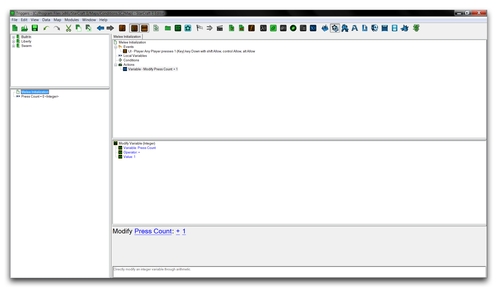
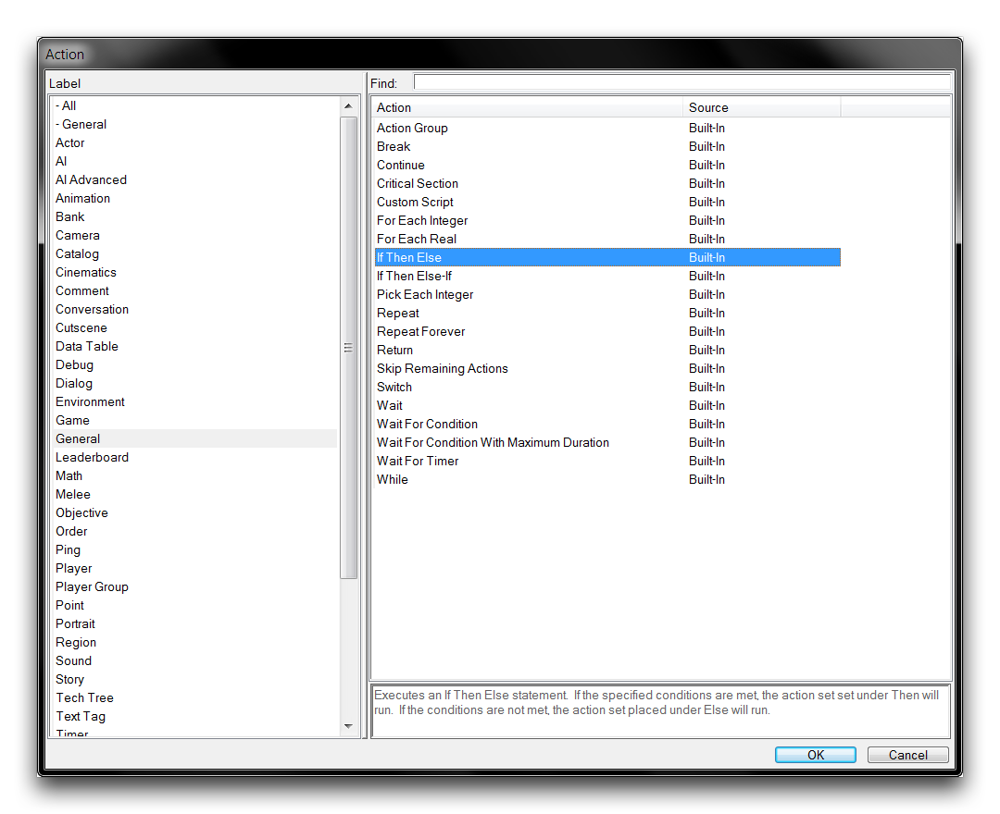
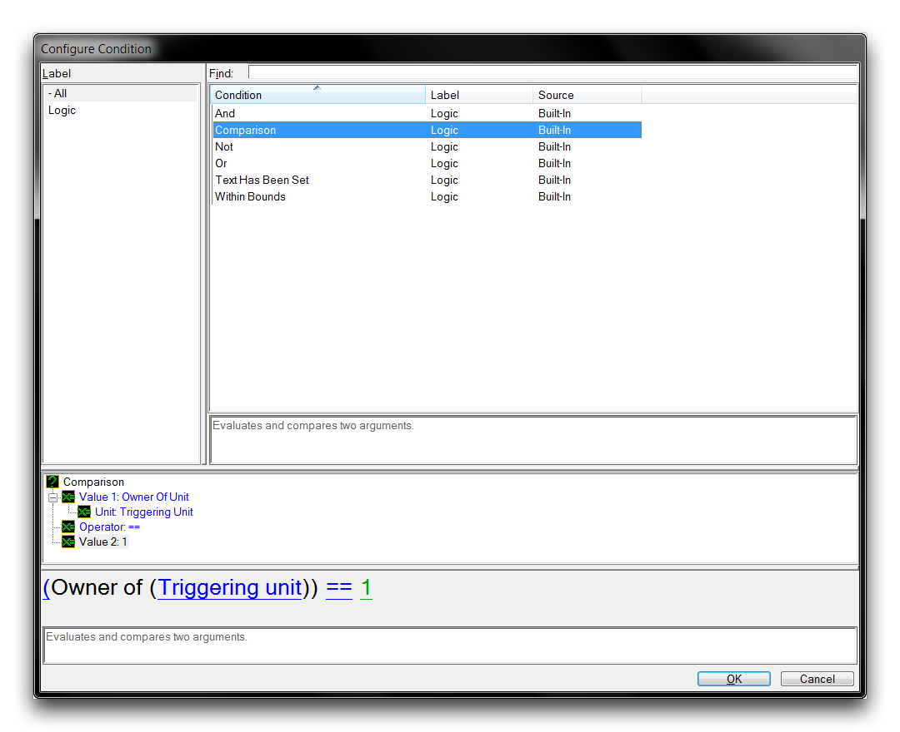
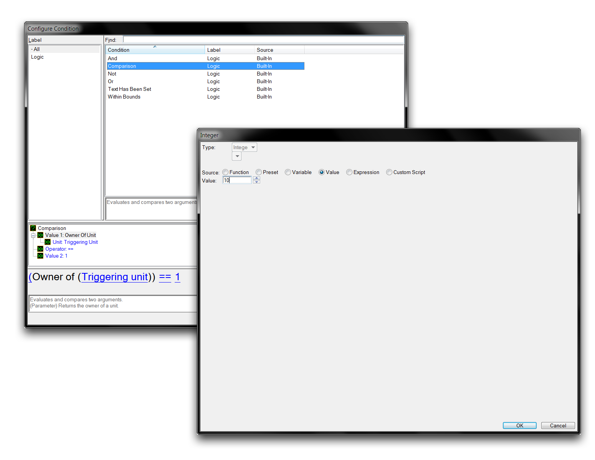
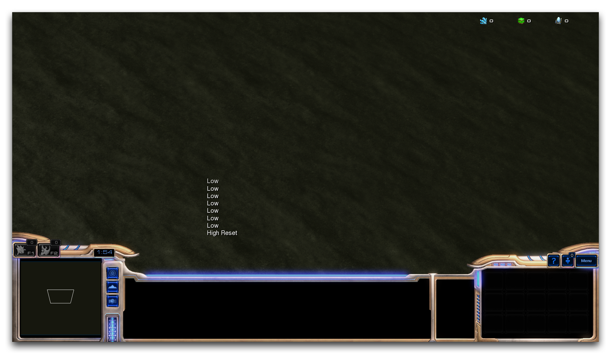

# Conditions

Conditions are used within triggers to determine whether 'something about the game' is true or false. The ambiguity here is intentional, as conditions can be applied to almost any object and any occurrence in the game.

Essentially, conditions pose questions about the game. One example could be, 'Does this player have at least five units?' The game then responds with its knowledge of that property, the player's unit count, and answers -- true or false. Based on the answer, statements in the Editor can proceed in different ways, a notion typically called 'Control.'

Control allows you to break the Editor's basic linear behavior. With conditions, elements like a trigger can become non-linear, avoiding certain segments of code, repeating certain segments multiple times, or completely stopping and jumping to entirely different locations altogether. Conditions allow for choices, and this is an important aspect of creating things that are dynamic, lively, and interesting.

The idea of conditions as questions is something you should try to keep in mind. This is a helpful habit that can be useful in figuring out if a condition is appropriate for a given scenario. It will also help when you start learning the mathematical notation that the StarCraft Editor expresses conditions in.

## Preparing A Trigger

To demonstrate the use of conditions you'll need to assemble a trigger. Use the following procedure to prepare the base trigger.

  - Create a new custom map and navigate to the Trigger Editor.
  - Proceed to the "Melee Initialization" trigger and delete all of the default actions and events contained within it.
  - Create a new event by navigating to Events ▶︎ Key Pressed.
  - Set the 'Key' term of the event to the key '1.'
  - Create a new variable via Local Variables ▶︎ New Element.
  - Name the local variable 'Press Count' and set its type to 'Integer.'
  - Create a new action by navigating to Actions ▶︎ Modify Variable (Integer).
  - Set the 'Variable' term of the action to the variable 'Press Count.'
  - Set the 'Value' term of the action to '1.'

This should leave you with the following.

*Trigger Basis*

## Control Statements

Conditions aren't relegated solely to the 'Conditions' heading in a trigger, they also appear in a type of action called Control Statements. One such action is 'If Then Else.' This action allows you to specify a condition that, depending on the result of a true or false question, will proceed to one of two possible blocks of statements, one for true and one for false. That block of statements is then run a single time, while the other block is skipped. The condition is specified under the 'If' heading of the control statement, while the block of statements for a true response is under a 'Then' heading, and the block of statements for a false response is under an 'Else' heading.

As such, the 'If Then Else' control statement can be considered as question and response in the form, 'If this happens Then do this, Else do this.'

You can investigate the 'If Then Else' control statement by adding it to your trigger below the 'Modify Press Count + 1' statement via New ▶︎ New Action ▶︎ If Then Else. You'll find the control statements under the ' -- General' category in the 'Actions' window.

*Selecting If Then Else Action*

## Condition Operators

Add a condition to the 'If Then Else' action by right-clicking on the 'If' heading and navigating to New ▶︎ New Condition. This will launch the 'Configure Condition' window shown below.

*Operators View*

Configuring a condition requires two things, assembling the terms of the condition and selecting what are known as the Operators. In the question model, the former involves what the condition is inquiring about, while the latter forms the type of question that a condition will ask. Each operator has their own specific function when it comes to forming conditions, which are described in the below table.

| Oper ator         | Details                                                                                                                                                                                                                                                                            |
| ----------------- | ---------------------------------------------------------------------------------------------------------------------------------------------------------------------------------------------------------------------------------------------------------------------------------- |
| And               | Creates a union between two terms. Both terms are then tested together.                                                                                                                                                                                                            |
|                   | If both terms test true, then the result is true. If both terms test false, then the result is false. If one terms tests true but the other does not, then the result is false.                                                                                                    |
| Comp aris on      | Evaluates and compares two terms. This is actually a group of operators, listed in the next six entries.                                                                                                                                                                           |
| \!=               | If the terms are not equal, return true. If equal, return false.                                                                                                                                                                                                                   |
| \<                | If the leftmost term is smaller than the rightmost term, return true. If not, return false. Equal terms return false.                                                                                                                                                              |
| \<=               | If the leftmost term is smaller than the rightmost term, return true. If not, return false. Equal terms return false.                                                                                                                                                              |
| \==               | If the terms are equal, return true. If not, return false.                                                                                                                                                                                                                         |
| \>                | If the leftmost term is larger than the rightmost term, return true. If not, return false. Equal terms return false.                                                                                                                                                               |
| \>=               | If the leftmost term is larger than the rightmost term, return true. If not, return false. Equal terms return true.                                                                                                                                                                |
| Not               | Inverts the term. Testing the Not version of a term will provide a result that is the opposite the normal term's result.                                                                                                                                                           |
| Or                | Creates a union between two terms. Both terms are then tested together.                                                                                                                                                                                                            |
|                   | Differs from And in that if a single term tests true, then the result is true. If both terms test true, then the result is true. If both test false, then the result is false.                                                                                                     |
| Text Has Been Set | Returns true if the text parameter being tested is not empty.                                                                                                                                                                                                                      |
| With in Boun ds   | A composite operator that tests if a term is between two values. This will also return true if the Value is equal to either term, as it uses two \<= operators, in the form Min Value \<= Term \<= Max Value. This operator supports only the Integer, Byte, and Real value types. |

## Configuring Your Condition

Finish setting your condition by navigating to the 'Comparison' within the 'Configure Condition' window. Set the terms by clicking on the headings within the subview. 'Value 1' corresponds to the first term, while 'Value 2' corresponds to the second term, which follows the operator. Set the first term to the variable 'Press Count' by double clicking on 'Value 1' and navigating to Variable ▶︎ Press Count. Set the second term by double clicking on 'Value 2', navigating to Value, and inputting 10. Now set the operator by double clicking on 'Operator' and navigating to ==.

*Setting the Term*

Click 'Ok' to return to the Trigger Editor. Now you can finish the trigger with the following procedure.

  - Under the 'Then' heading, create a 'Text Message' action. Set the Message to 'High Reset.'
  - Also here, create a 'Set Variable' action. Set the variable to Press Count and the value to '0.'
  - Under the 'Else' heading, create a 'Text Message' action. Set the Message to 'Low.'

You should now be left with something that looks like the image below.

*Completed Trigger*

You have assembled a trigger that triggers every time the player presses the 1 key on the keyboard. This increments the variable each time. Then, depending on the condition Press Count == 10, one of two block statements will be run. A true statement results in the message 'High Reset,' a false statement results in the message 'Low.' As such, each trigger poses the question, 'Is the variable equal to 10?' It then determines which procedure to follow based on the condition's response.

In practice, this should be false for the first nine triggers, then true for the tenth. The 'High Reset' message will show on the tenth keypress. You can test the map to confirm that it's working correctly by navigating to File ▶︎ Test Document. If you've done everything right, you should get the result shown below.

*Successful Output*

## Attachments

 * [036_Conditions.SC2Map](./maps/036_Conditions.SC2Map)
