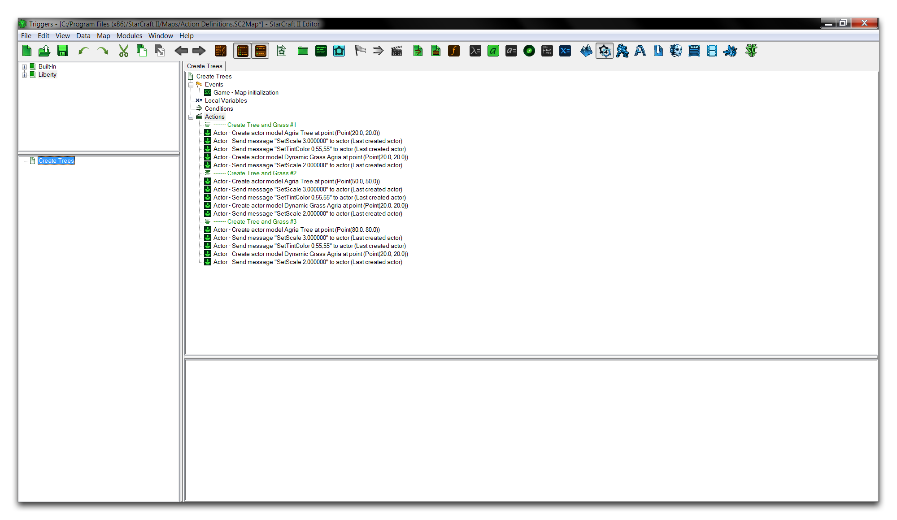
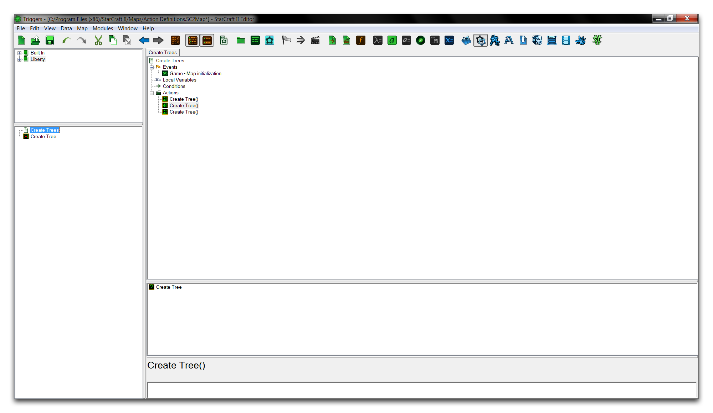
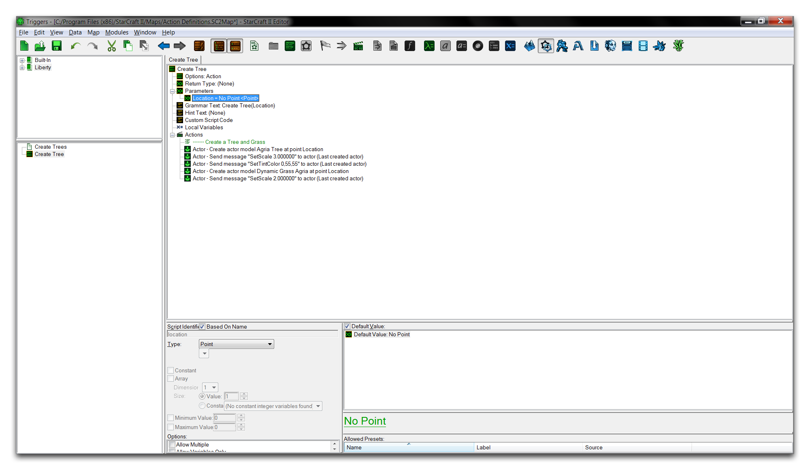
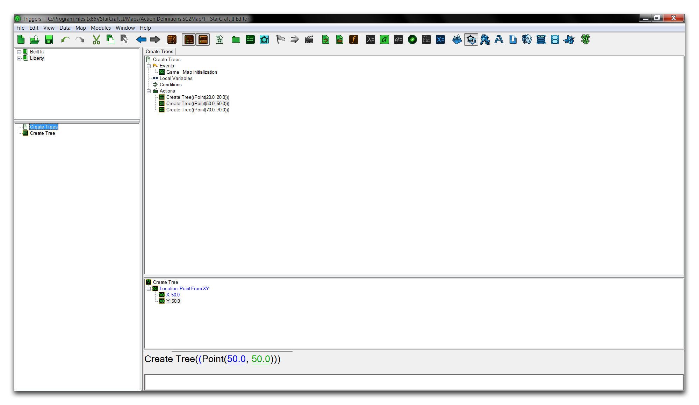

# Action Definitions

Action Definitions allow you to create customized sequences of action statements. Once assembled, they can be used in the same context that their component actions would be. They also give support for parameters, input values that can alter the behavior of the definition. By organizing actions into larger hierarchical chunks, you can use action definitions to take procedures that repeat often and abstract them into a robust tool to be deployed as needed. Properly used, this will save you time, make your code easier to understand, and even optimize performance.

## Demoing An Action Definition

Open the demo map provided with this article and navigate to the Trigger Editor. This project contains a single trigger that runs on map initialization, populating the map with three distinct sets of a tree and a patch of grass, and using some actor modifications on the models as they are generated.

*Tree and Grass Generation Actions*

The overall operation is fairly simple, but it consists of three similar procedures differentiated only by where they are creating objects. Redundant, bloated triggering should stand out as a possible location for an action statement. In this case, the repeated model creation options and their various actor messages could all be moved into an action definition.

To create an action definition, right-click on the Triggers Panel and navigate to New -\> New Action Definition. Name the definition 'Create Tree.' Now, hold shift and select the first five actions of the main trigger. Copy these actions into the new action definition, so that you're left with the following view.

*Create Tree Action Definition*

You have now refactored the redundant actions into a custom action definition. At this point, you can change the 'Create Trees' trigger to use the action definition three times, rather than its current bloat of code. Add the action definition to a trigger by accessing it from its 'call' location, the action list. Right-click on the trigger and select New Action, then find the 'Create Tree' definition, as shown below.

*Using the New Action Definition*

Repeat this action three times to reflect the three operations it is replacing and clear out all the unnecessary code. This should leave you with the following.

*Reorganized Main Trigger*

## Action Definition Parameters

Despite the main trigger being significantly cleaned up, something has been overlooked. Remember that each tree and grass grouping were being spawned at differing locations. As it stands now, the definition spawns a tree and grass patch at only one location, Point (20, 20).

You can make your action definition have variable results using parameters. A parameter value can pass additional information to the action definition. Creation of objects in three differing locations will require you to use a varying Point parameter. You can arrange this by moving to the 'Create Tree' action definition, then right-clicking on the 'Parameters' heading and navigating to New -\> New Parameter. Name the parameter 'Location' and set its type to Point. Select each action using the Point(20,20) as a location field, and alter it to the 'Location' variable. You should be presented with the following.

*Action Definition with Parameter*

Now return to the main trigger. Here you'll see each action requiring an input parameter for 'Location.' Alter the values for each action to match the original locations at which the trees were spawned. This will give you a functional final trigger, shown below.

## Attachments

 * [038_Action_Definitions_Start.SC2Map](./maps/038_Action_Definitions_Start.SC2Map)
 * [038_Action_Definitions_Completed.SC2Map](./maps/038_Action_Definitions_Completed.SC2Map)
