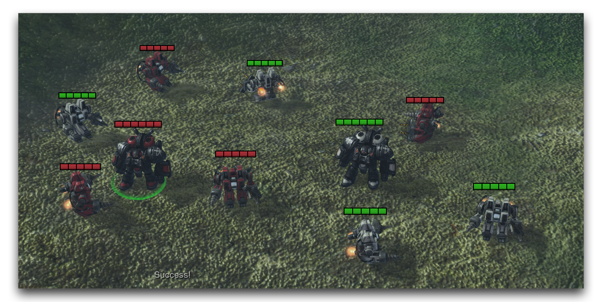

CONDITION DEFINITIONS
=====================

Condition Definitions are used to create custom-defined conditions.
Conditions already offer some customization in the selection of their
terms and the application of their operators. Definitions allow you to
further extend these abilities by defining custom operations that can
use any existing statement in the Editor. With these you can develop new
inquiries into the state of the game. They can also be a useful method
of organizing and combining common conditions.

Condition Definition View

  ---------------------------------------------------------------------------
  Field        Details
  ------------ --------------------------------------------------------------
  Options      This selects the type of definition, the Condition Definition
               is of particular interest here.

  Return Type  This determines the response value of the condition. Boolean
               offers the standard 'true or false.' Integer allows for
               additional responses beyond a binary.

  Parameters   Values passed to the condition.

  Grammar Text Sets the GUI text that phrases the condition into natural
               English.

  Hint Text    Sets the illustrative text to be displayed in the Hint Subview
               when this condition is selected.

  Custom       Allows for the condition to be coded in Galaxy Script rather
  Script Code  than GUI statements.

  Local        Variables available in the scope of this condition.
  Variables    

  Actions      The action statements composing the condition's operation.
  ---------------------------------------------------------------------------

DEMOING CONDITION DEFINITIONS
-----------------------------

Open the demo map provided with this article and look at the Terrain
Editor. There you'll find a grouping of SCVs and a pair of marauders.
The units are evenly split between the red player one and the white
player two. For this exercise, you'll build a custom definition to use
in a test of the unit selection event. This definition poses the
question, 'Is the unit a marauder belonging to player one?'

Begin by moving to the Trigger Editor, then right-click on the Triggers
Panel and select New -\> New Condition Definition. Name your new
definition 'Unit Type Owned by Player.' That name might seem a little
odd for now, but you'll understand it in a moment. The condition
definition will require two pieces of information to make its
assessment, the type of the unit, and a player number. To receive this
information the definition will use parameters. Navigate inside the
definition and right-click the 'Parameters' heading, then navigate to
New -\> New Parameter. Repeat this procedure once. Name the first
parameter 'Unit Type' and set its type to --Game Link and its 'Link
type' to Unit. Name the second parameter 'PlayerID' and set its type to
Integer.

Finally, create the action 'If Then Else.' Create two conditions under
the 'If' heading and set them to Unit Type == Marauder and PlayerID == 1
respectively. Make sure that the Unit Type and PlayerID are set to the
parameters you created.

RETURN STATEMENT
----------------

For a condition to operate, it must deliver some sort of response
statement. You've seen this before in the standard conditions.
Typically, they respond with Boolean values of either True or False.
Creating this sort of response here will require you to use a special
type of control statement called Return. When encountered, the Return
statement immediately exits the current layer of control, in this case
the condition definition. It then carries the response value to the
original call location of the condition. By using another control
statement, like 'If Then Else,' a condition controls its different
possible response values using multiple possible Return statements.

Under the 'Then' heading, add a 'Return' action and set its value to
True. Add a 'Return' action under the 'Else' heading and set its value
to False. The definition is now complete. It receives two parameters and
checks if they are equal to the desired values, Marauder and 1. If this
is true, the condition returns true. Otherwise it returns false.

GRAMMAR & HINT TEXTS
--------------------

The condition definition system offers a few options for making custom
definitions more useable. Grammar text allows for the setting of custom
plain language type phrasing, similar to most of the GUI triggers. Note
that the current description of the definition is Unit Type Owned by
PlayerID (Unit Type, PlayerID). Including this in a trigger can be a bit
overwhelming. You can change it by navigating to 'Grammar Text' and
deselecting 'Use Default Grammar Text.' The parameters must be
maintained in the new arrangement, so you can delete the text around
them and alter the field to 'Unit Type owned by Player.' This format
mimics the existing Editor conditions and explains the earlier naming.

Another option available for your convenience is 'Hint Text.' This
provides custom information that will be displayed in the Hint Subview
whenever the definition is selected. You can set it here by selecting
the 'Hint Text' heading and inputting Returns true if the Unit is a
Marauder, and the Player is 1. Completing these steps should result in
the definition appearing as follows.

Completed Condition Definition

USING A CONDITION DEFINITION
----------------------------

Create a new trigger and name it 'Unit Selected.' Navigate into the
trigger and create a 'Unit is Selected' event. Now create a condition
with the custom definition by navigating to 'Conditions,' right-clicking
and following New -\> New Condition. This will launch the 'Configure
Condition' window, which should contain the newly defined condition as
shown below.

Selecting the Custom Condition Definition

Highlight the condition and set its terms. The Unit Type should be set
to Unit Type of (Triggering Unit), while the PlayerID should be set to
Owner of (Triggering Unit). Click 'Ok' to return to the project.
Finally, create an action of the type 'Text Message' and set its
'Message' to Success, which should give the following view.

Completed Trigger

If you test it, the game should present the collection of units seen in
the Terrain Editor. When selecting any unit other than the red marauder
there will be no response. If you select player one's red marauder, the
custom condition test will respond with a True value, allowing the
trigger to run its body statements and display the message. Launching
the game and running the test should give you the following view.

Successful Output
