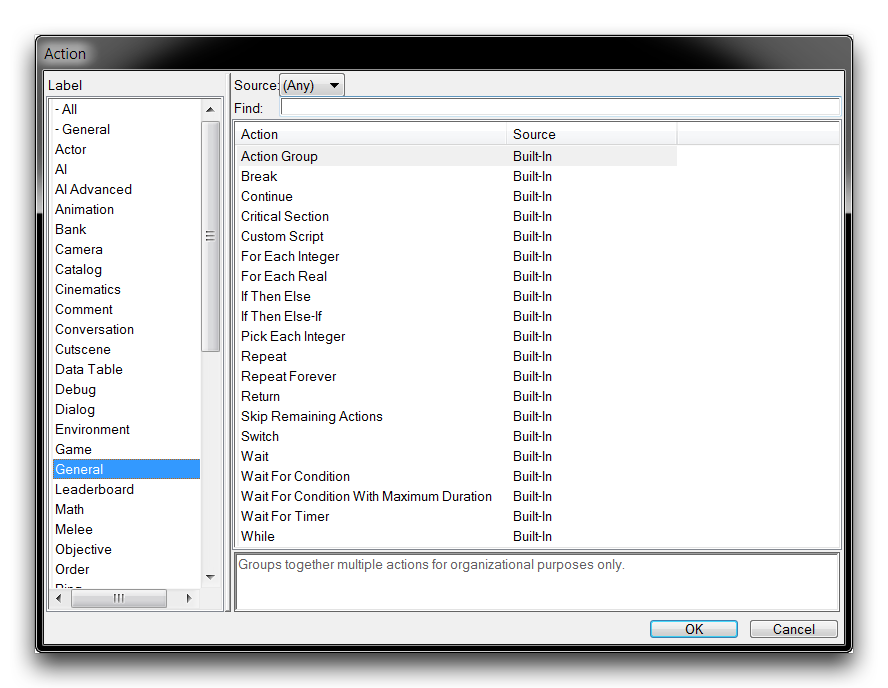
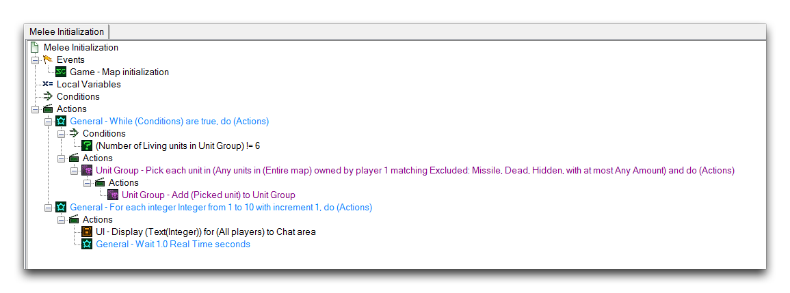

CONTROL STATEMENTS
==================

Control Statements are actions that control when other actions are
executed. Since the standard order of execution in the Trigger Editor is
linear, these statements offer the unique ability to disrupt that linear
flow and create dynamic systems. You can find control statements during
action creation under the 'General' label, as shown in the image below.

Control Statement Actions

LOOPS
-----

Loops create a repeating cycle of statements that continues until
broken. The types of loops are distinguished by how they're broken and
in what manner they proceed with their containing statements. The loop
types are described in the table below.

  -----------------------------------------------------------------------
  Loop Type  Details
  ---------- ------------------------------------------------------------
  Repeat     Containing actions are repeated until a Count variable is
             reached. The count is incremented after all the contents are
             executed.

  Repeat     Runs indefinitely until broken with another control
  Forever    statement.

  Pick Each  Runs until its Start value reaches its End value. This value
  Integer    is incremented after each run through the loop. The Picked
             Integer function identifier is used to access the value for
             the current iteration.

  Pick Each  Runs the loop once for every Player found in the Player
  Player in  Group. The Picked Player function identifier is used to
  Player     access the Player for the current iteration.
  Group      

  Pick Each  Runs the loop once for every Unit found in the Unit Group.
  Unit in    The Picked Unit function identifier is used to access the
  Unit Group Unit for the current iteration.

  For Each   Runs the loop until its Start value reaches its End value.
  Real       After each iteration of the loop the Start value is altered
             by an Increment that is a Real.

  For Each   Runs the loop until its Start value reaches its End value.
  Integer    After each iteration of the loop the Start value is altered
             by an Increment that is an Integer.

  For Each   Runs the loop once for each Player in the Player Group.
  Player in  
  Player     
  Group      

  For Each   Runs the loop once for every frame in a specified UI
  UI Frame   Variable.

  For Each   Runs the loop once for each Unit in the Unit Group.
  Unit in    
  Unit Group 

  While      Runs the loop until the supplied Condition is not True.
  -----------------------------------------------------------------------

There are two supplementary control statements used to manipulate how a
loop will behave. The first, Break, will terminate its containing loop
when it is encountered. The second, Continue, will skip every action
below it and return to the start of the loop when it is encountered.
These statements are usually used alongside a check like If Then Else to
control the loop under specific conditions. This is the strategy used in
Repeat Forever infinite loops, to eventually exit the loop.

WAITS
-----

Waits grant the ability to pause control. This pause may be indefinite,
until an event occurs, or until a certain condition is met. The wait
types are broken down in the following table.

  -----------------------------------------------------------------------
  Wait Type    Details
  ------------ ----------------------------------------------------------
  Wait         Pauses control until an amount of Time has elapsed. Also
               accepts a certain Time Type when setting the wait
               duration.

  Wait For     Pauses until a certain Timer hits an amount of Time either
  Timer        Elapsed or Remaining.

  Wait For     Pauses until a certain Condition is met. The Condition is
  Condition    checked for on an interval of Time.

  Wait For     Pauses until a certain Condition is met. The Condition is
  Condition    checked for on an interval of Time. There is additionally
  With Maximum a failsafe Max Duration that is allowed to elapse before
  Duration     the control is resumed.
  -----------------------------------------------------------------------

USING CONTROL STATEMENTS
------------------------

By providing a means of breaking the standard linear flow through a
project's logic, control statements become the key action for opening up
a wider variety of projects that you can make with the Editor. Take a
look at the following trigger.

Trigger Making Use of Control Statements

There are several control statements in use in this trigger. A While
loop containing a Pick Each Unit in Unit Group loop is used to populate
a Unit Group from the unit contents of the entire map. The demo map
contains a set of six marines, and stocking the Unit Group allows the
interior Pick Each loop to exit out of the While loop by breaking its
Condition. Once this loop concludes, a For Each Integer loop engages.
Inside this loop is a Wait of 1.0 seconds and a text output of the
loop's counting value. These actions will in turn result in the trigger
creating a count from 1 to 10 on the player's screen, happening at an
interval of 1 second. Now turn your attention to the other trigger.

Count Resultant Trigger

This trigger shows a secondary use of the Integer count from the last
trigger's counting loop. When the first trigger's count concludes, this
trigger will destroy every marine on the map. The result is shown below.

Text Tag Styled and Attached to Unit

This demo shows off some simple dynamic structuring enabled by control
statements communicating between triggers on a timed basis rather than a
standard linear basis.
