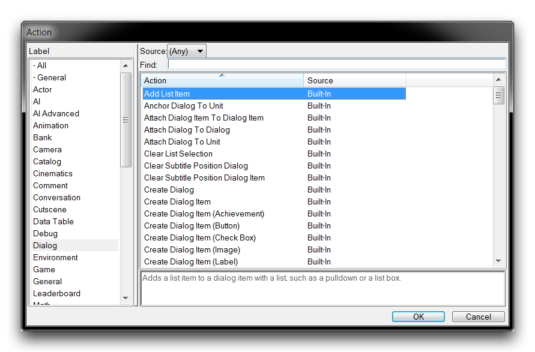
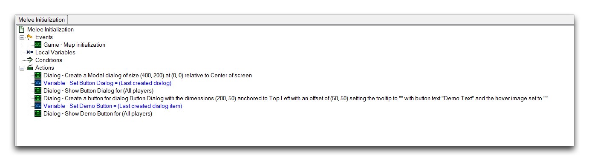
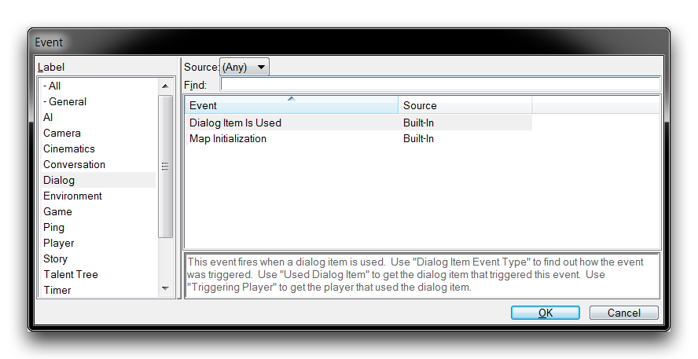
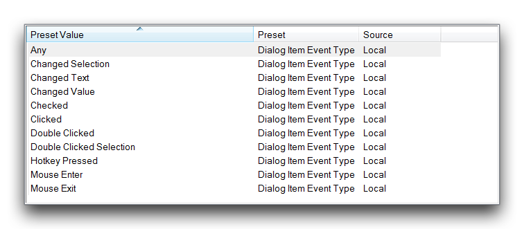
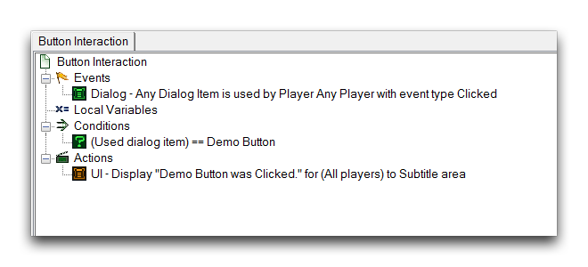
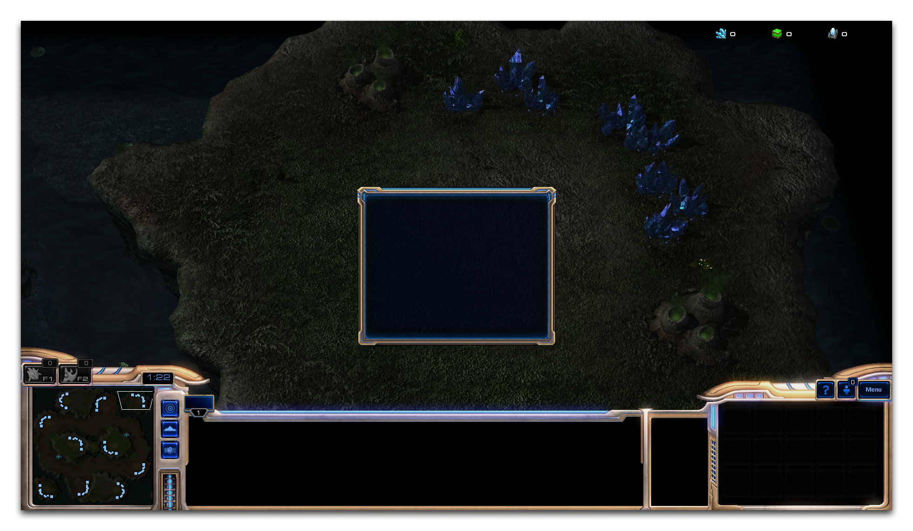
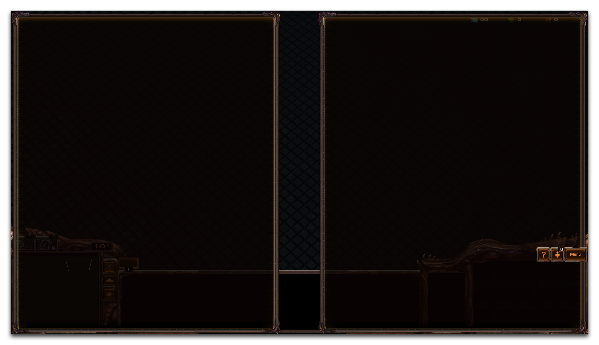
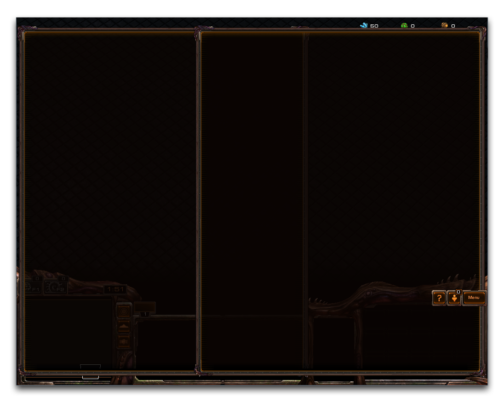

# Dialogs

Dialogs is a catch-all term in the StarCraft II engine referring to a large collection of elements that can occur in the screen space, including text, images, animation, and interfaces. The dialog itself is a sort of container that displays any combination of the aforementioned elements on a player's screen. Each of these elements are referred to as a Dialog Item, and are created inside a selected dialog. Using the dialog system enables you to produce many types of content, including briefings, portrait dialog sequences, buttons, sliders, and more.

# Creating Dialogs

Dialogs are usually created through a two-step process where the dialog is first instantiated and then is displayed to the screen for a player group. This process will appear as follows.

*Dialog Creation*

The bulk of dialog creation takes place under the Create Dialog and Show/Hide Dialog options, these allow for the dialog to be sized then oriented on the screen, and then displayed. The Show Dialog action is needed because dialogs are created in the Hidden state by default. Usually after this step, a dialog will captured to a variable with a Set Variable action. This gives the dialog a constant handle for things like referencing it, moving it, further altering its visibility, or building items within it. For setting a dialog to a variable, the function identifier Last Created Dialog is a standard.

# Dialog Actions

The Editor features a large collection of dialog actions that facilitate the creation and maintenance of dialogs and their items. A view of these actions is shown below.

*Dialog Actions*

The following table breaks down the general types of dialog actions and describes them. This list is usually appropriate for both dialogs and dialog items, which are discussed a little later.

| Function            | Description                                                                                                               |
| ------------------- | ------------------------------------------------------------------------------------------------------------------------- |
| Attach Dialog       | Moves an element to a specific anchor.                                                                                    |
| Create Dialog       | Creates a new element, allowing you to set its size, anchor, offset, and text.                                            |
| Destroy Dialog      | Destroys an element and any contained items.                                                                              |
| Display Screen Item | Creates an element directly in screen space that requires no containing dialog.                                           |
| Move Dialog         | Moves an element relative to a specific anchor.                                                                           |
| Set Dialog          | Sets the property of a specific element. Properties include size, lighting, text, color, animation, font style, and more. |
| Show/Hide Dialog    | Reveals or removes an element from a target player or group's screen.                                                     |

## Dialog Items

Dialogs are populated by dialog items. Without any items, a dialog is just a rectangular container with a themed backdrop depending on the player's race. Dialog items are varied and have options relevant to each individual type, but in general they abide by the same set of principles as dialogs. Much like dialogs themselves, you can create dialog items with a Create Dialog Item action, then display them with a Show Dialog Item action. After this, you'll usually save a handle within a variable with a Set Variable action. Again, a useful identifier for doing this is the function Last Created Dialog Item.

As an exercise, you'll create a dialog item using the general procedure described above. The assembly trigger is shown below.

*Dialog and Dialog Item Assembly*

Create Dialog Item (Button) allows you to create a button dialog item, which is a special item that accepts player input. Mousing over the button will change its visual state, indicating that it can be clicked. During the item's creation several fields were set.

The Width and Height define the button's area, which both displays the item's texture and determines the area of screen space that will accept player inputs. Its Anchor sets which side of the parent dialog the item will be attached to, while Offset X and Offset Y set the distances from the Anchor at which the button will be created. For Button Text, the input 'Demo Text' was set. This text will be created in the center of the button. If this text were too long to fit in the button's area, it would be truncated to '...' until corrected. Testing this dialog will appear as shown below.

*Button Dialog item in Game View*

## Dialog Event -- Dialog Item Is Used

As it stands, clicking the button made in the last demo will have no effect. For dialog items designed to accept user input, there is a specific dialog event, Dialog Item is Used, required to receive and respond to player inputs. You can find this event by sorting by the label 'Dialog' during event creation, as is shown below.

*Dialog Item is Used Event*

This event responds to a host of possible interactions with dialogs, which are shown in the following image.

*Dialog Item Interaction Types*

In this instance, the event type Clicked is appropriate. To recognize a specific dialog item, a condition can be used with a comparison operator between the identifier Used Dialog Item and the dialog item's variable handle. Creating an interaction trigger for the previous demo might look like the image below.

*Button Clicked Trigger*

Testing the demo will now give the following output.

*Button Responds To Click*

Giving the button a trial click here has shown a response to the dialog event by delivering a text message output.

## Dialog Formatting

Dialogs are constant constructs, meaning that they will look the same regardless of the output size of a particular player's screen. This is a similar system to that used in the basic melee game interface. This system ensures a level of reliability, but when creating custom content it is something you should be aware of. Take the following example. A centered dialog created at a 16:9 resolution will look like the following.

*Custom Dialog at 16:9 Resolution*

Creating this same dialog at a 4:3 resolution will look as follows.

*Custom Dialog at 4:3 Resolution*

Despite the difference in resolutions, the dialogs themselves have the same dimensions. This system works through an internal resolution that is provided by the StarCraft II client. The internal resolution has the following values for each screen ratio.

> 4:3 Ratio - 1600x1200
> 
> 16:9 Ratio - 2133x1200
> 
> 16:10 Ratio - 1920x1200

Height will always be calculated at a constant 1200, then width will be measured based on the screen ratio. While this system will ensure that your dialogs maintain the same level of visibility across a variety of machines, it is worth noting that large dialogs and dialog items might be cut off or cropped if you aren't careful. If you're developing your project without the means to test on a variety of systems, then it's important to keep in mind a range of usability when designing dialogs or other screen space elements. Consider another example, a standard set of dialogs could appear as shown below on a widescreen formatted computer.

*Widescreen Oriented Dialogs*

Testing this project on a different, non-widescreen display will look like the following.

*Overlapping Dialogs on a Non-Widescreen Display*

The constrained width of a standard display has caused the two dialogs to overlap, potentially obscuring important information. One method of avoiding this could be a provisional option for different types of displays. This would make use of Show/Hide Dialog actions and have two parallel dialog constructions. Alternately, designing dialog systems to be no more than 1600 px wide can prevent this sort mishap in most cases.
