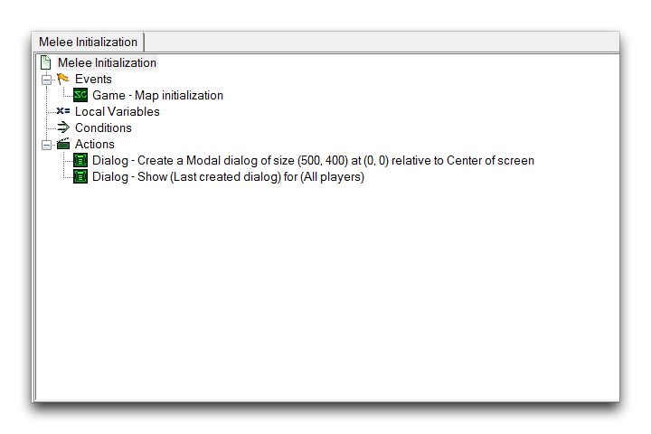
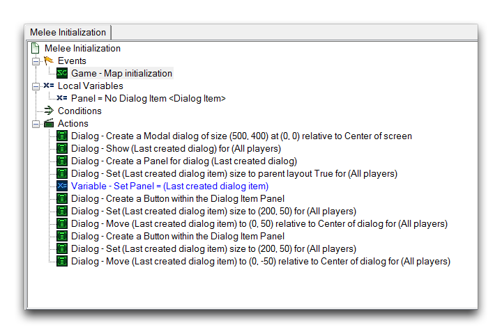

DIALOG PANELS
=============

Dialog Panels are a grouping option for dialog items. By creating a
panel and hosting dialog items on it, individual items can be controlled
together by applying alterations to the panel. Any changes you make will
then be propagated to every item belonging to the panel. As such panels
provide a level of hierarchy in between a dialog and other types of
dialog items. This ends up operating much like a unit group or a player
group. It is functionally equivalent to a dialog group.

CREATING A DIALOG PANEL
-----------------------

As an example, you'll host a panel within a dialog, like any other
dialog item.

Creating a Host Dialog

From here, create a panel by selecting the Create Dialog Item action, as
shown below.

Creating Panel Dialog Item

Select 'Panel' for the Type field of the Create Dialog Item.

Selecting Panel Type for Creation

You can set the panel's properties to the Width, Height, and Position of
its parent dialog through the Set Dialog Item Size to Parent action.

Setting the Panel's Size

This panel should now be saved to a variable to provide a consistent
handle for any future operations. Together, these actions have resulted
in what is essentially a finished panel. It should look as shown in the
image below.

Panel Created

CREATING ITEMS WITHIN A DIALOG PANEL
------------------------------------

With the dialog panel set up, you can test its functionality by creating
some dialog items inside it. In the following update to the trigger, a
pair of buttons has been created, sized, and oriented within the panel.

Dialog Items Created Inside Panel

The important distinction here is that, rather than being created within
the dialog, these items have been created inside the panel. This is how
dialog items are 'grouped' inside the panel and accept any alterations
that are made to it. You should also note that the panel's variable
handle is important here, as it ensures that the panel may be repeatedly
referenced for each dialog item being created inside the panel.
Sometimes dialog items are created without a handle, as they can be
completely controlled by their hosting dialog or panel, but panels
themselves will usually require a handle.

ALTERING A DIALOG PANEL AND ITS CONTAINED ITEMS
-----------------------------------------------

Now that you have everything set up, you're ready for a quick
demonstration of the utility of a dialog panel. In the trigger update
shown below, the Set Dialog Item Color is used to target the panel.

Altering Panel Property

Altering the panel like this will end up with each dialog item, the two
buttons in this case, being individually sent a Set Dialog Item Color
action. Investigating the map with the 'Test Document' function, will
show that each button has been set to Yellow. You can see the result in
the image below.

Panel Changes Propagated to its Contained Items

This should give you an impression of how much effort you can save
yourself by using dialog panels. They can be used to quickly group and
manage large numbers of dialog items.
