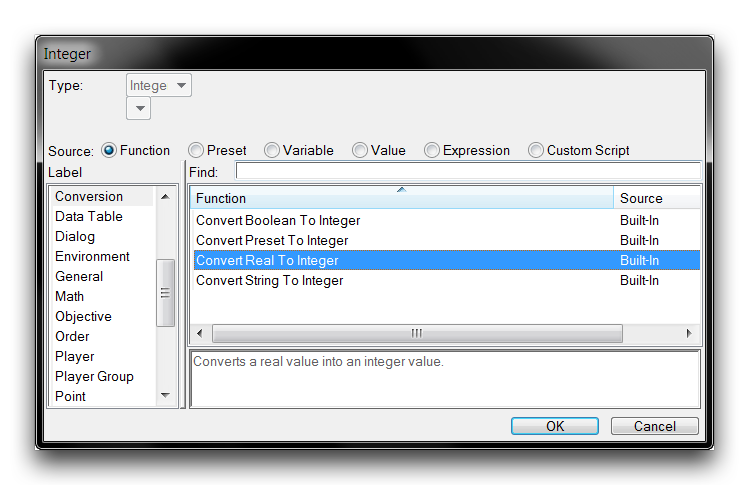
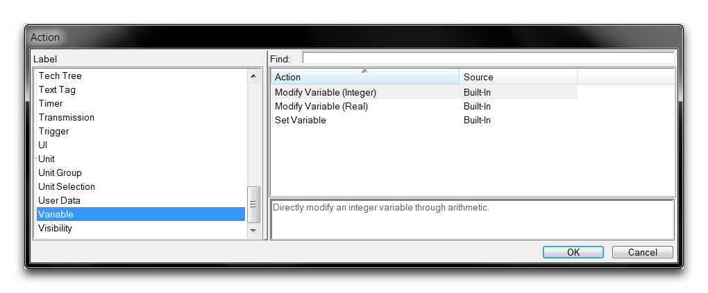
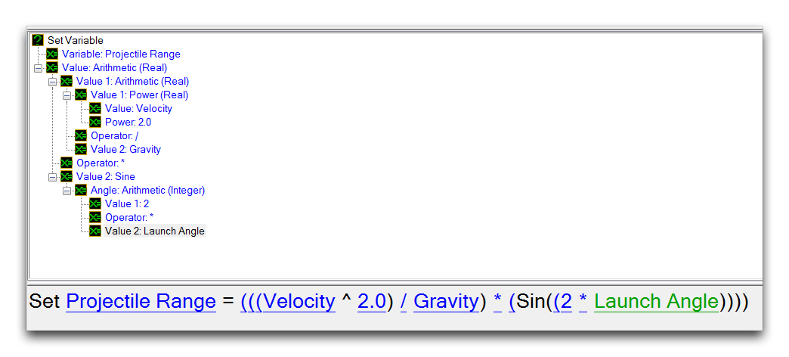
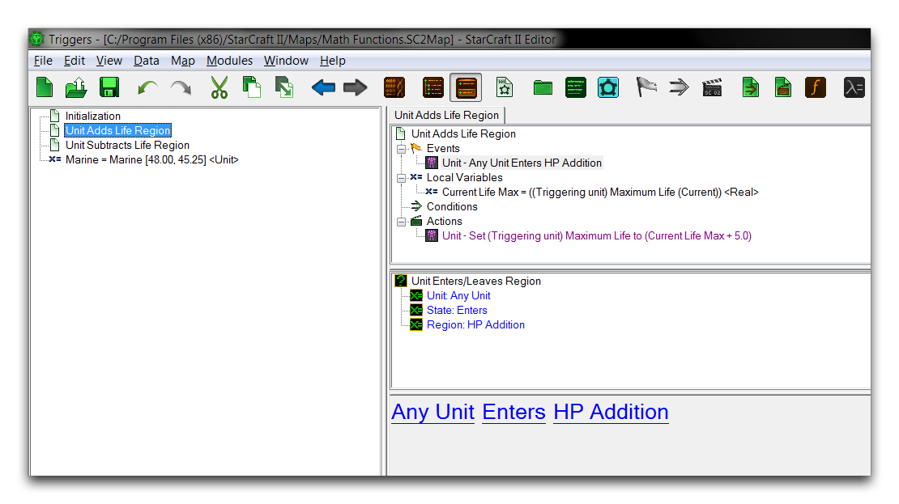
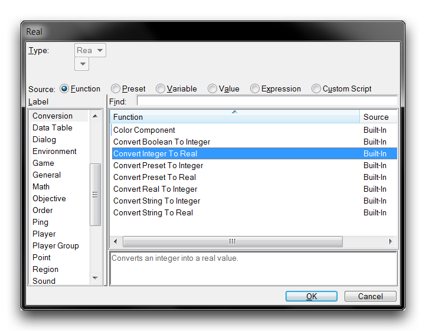

# Math Functions

The Editor comes with a standard complement of Math Functions for use in any work within the Trigger Editor. You can access these whenever you are filling in a numeric field by navigating to the 'Function' source and sorting by the 'Math' heading, as shown below.

*Math Function Selection*

## Type Conversions

As you can see from the image above, most math functions are made available with both a Real and an Integer version. This version references the type of the eventual output, and the input types to these functions may vary. A detailed look at one such example is provided below.

*Function Versions*

In this example, the Arithmetic math function is listed with a version that outputs integers, Arithmetic(Integer), and a version that outputs reals, Arithmetic(Real). Note that a Real field is being set, yet both Integer and Real functions are listed. This is because all Integer functions contain an implicit type conversion to Real, allowing them to be selected in such a case. The type conversion simply appends the Integer resulting from the function with a fractional part equal to zero. So an example Arithmetic (Integer) function of 1 + 1 would result in the Integer 2, which converts implicitly to a Real of 2.0.

The two versions of the Arithmetic function, Integer and Real, each takes inputs of the same type as their outputs. However some versioned math functions only accept Real inputs, but output in their namesake Integer or Real type. The Log2 function is one such example, it only accepts Real numbers in order to have a high enough accuracy to make its calculation. The Log2 Real and Log2 Integer versions, each still output their corresponding type.

For cases like these where an Integer input is required, there is an explicit type conversion available. You can find this while filling a Real field by navigating to the 'Function' source, then selecting the 'Conversion' label, as shown below.

*Integer to Real Conversion Function*

Explicit integer conversion works the same way as implicit conversion, by appending a zeroed fractional part to the number. This function also has some use in inputting integer values into the math functions that only have a Real version, which are explored a little later in this article. For any conversions in the opposite direction required, there is an explicit Real to Integer conversion function available during Integer field filling.

*Real to Integer Conversion Function*

'Convert Real to Integer' results in the Real being rounded to its nearest whole number Integer. All Real numbers ending in .5 are rounded downwards.

## Shared Math Functions

Of the math functions available, 16 are shared operations with versions available that output both Real and Integer types, these are listed in the table below. Although this article does not provide a full treatment of the math involved, some of the operations are furnished with examples. Each function will take its corresponding Real or Integer input unless otherwise noted.

| Func tion              | Description                                                                                                                                                                                                                                                                                                                                                                |
| ---------------------- | -------------------------------------------------------------------------------------------------------------------------------------------------------------------------------------------------------------------------------------------------------------------------------------------------------------------------------------------------------------------------- |
| Abso lute Valu e       | Returns the absolute value of a number. This value is equal to a signless magnitude of the number.                                                                                                                                                                                                                                                                         |
|                        | Absolute Value (-2.0) = 2.0                                                                                                                                                                                                                                                                                                                                                |
|                        | Absolute Value (4) = 4                                                                                                                                                                                                                                                                                                                                                     |
| Arit hmet ic           | Creates a two term equation that uses one of four elementary operators: addition, subtraction, division, or multiplication. The result of this equation is set to the field. This is a very commonly used function, which can be expanded to more terms by either selecting another Arithmetic function for one of the terms or by using the Arithmetic Multiple function. |
| Arit hmet ic Mult iple | Conducts a single elementary operation on any number of terms. As in Arithmetic, the available operations are addition, subtraction, division, and multiplication. The use of the Arithmetic functions is covered in more detail below this table.                                                                                                                         |
| Ceil ing               | Rounds a number up to the next whole number. This only accepts Real inputs.                                                                                                                                                                                                                                                                                                |
|                        | Ceiling Real (2.1) = 3.0 Real                                                                                                                                                                                                                                                                                                                                              |
|                        | Ceiling Real (-3.2) = -3.0 Real                                                                                                                                                                                                                                                                                                                                            |
|                        | Ceiling Integer (5.1) = 6 Integer                                                                                                                                                                                                                                                                                                                                          |
| Clam p                 | Adjusts a value to fit between a defined upper and lower bound. Values exceeding the upper bound will be set to it, and likewise those below the lower bound will be set to the lower.                                                                                                                                                                                     |
|                        | Clamp 40.0 between 1.0 and 10.0 = 10.0                                                                                                                                                                                                                                                                                                                                     |
|                        | Clamp -5 between 1 and 10 = 1                                                                                                                                                                                                                                                                                                                                              |
| Floo r                 | Rounds a number down to its preceding whole number. This only accepts Real inputs.                                                                                                                                                                                                                                                                                         |
|                        | Floor Real (2.1) = 2.0 Real                                                                                                                                                                                                                                                                                                                                                |
|                        | Floor Real (-3.2) = -4.0 Real                                                                                                                                                                                                                                                                                                                                              |
|                        | Floor Integer (5.1) = 5 Integer                                                                                                                                                                                                                                                                                                                                            |
| Log2                   | Returns the binary logarithm of the number. Essentially the value that 2 would have to be set to the power of to receive the number. This only accepts Real inputs.                                                                                                                                                                                                        |
|                        | Log2 Real (40.0) = 5.3 Real                                                                                                                                                                                                                                                                                                                                                |
|                        | Log2 Integer (40.0) = 5 Integer                                                                                                                                                                                                                                                                                                                                            |
| Maxi mum               | Returns the larger of two numbers.                                                                                                                                                                                                                                                                                                                                         |
| Mini mum               | Returns the smaller of two numbers.                                                                                                                                                                                                                                                                                                                                        |
| Modu lo                | Accepts a Dividend and a Divisor. Returns the modulo, or remainder of dividing the Dividend by the Divisor.                                                                                                                                                                                                                                                                |
|                        | 10.0 mod 4.0 = 2.0                                                                                                                                                                                                                                                                                                                                                         |
|                        | 9.0 mod 4.0 = 1.0                                                                                                                                                                                                                                                                                                                                                          |
|                        | 25 mod 5 = 0                                                                                                                                                                                                                                                                                                                                                               |
| Pow2                   | Returns the result of 2 set to the power of the number. This only accepts Real inputs.                                                                                                                                                                                                                                                                                     |
|                        | Real 2 ^ 4.3 = 19.7 Real                                                                                                                                                                                                                                                                                                                                                   |
|                        | Integer 2 ^ 4.3 = 20 Integer                                                                                                                                                                                                                                                                                                                                               |
| Powe r                 | Returns the Value raised to the Power. This only accepts Real inputs.                                                                                                                                                                                                                                                                                                      |
|                        | Real 4.0 ^ 3.1 = 73.5 Real                                                                                                                                                                                                                                                                                                                                                 |
|                        | Integer 4.0 ^ 3.1 = 73 Integer                                                                                                                                                                                                                                                                                                                                             |
| Rand om Real           | Returns a random number of the selected type within a specified range.                                                                                                                                                                                                                                                                                                     |
| Rand om Inte ger       | Random real between 0 and 100.0 = 42.5                                                                                                                                                                                                                                                                                                                                     |
|                        | Random integer between 25 and 50 = 26                                                                                                                                                                                                                                                                                                                                      |
| Roun d                 | Rounds a number to its nearest whole number. All numbers ending in .5 are rounded down. Takes only Real inputs.                                                                                                                                                                                                                                                            |
|                        | Round Real (3.2) = 3.0 Real                                                                                                                                                                                                                                                                                                                                                |
|                        | Round Integer (2.5) = 2 Integer                                                                                                                                                                                                                                                                                                                                            |
| Squa re Root           | Returns the square root of the value. This only accepts Real inputs.                                                                                                                                                                                                                                                                                                       |
|                        | Square Root Real (43.0) = 6.6 Real                                                                                                                                                                                                                                                                                                                                         |
|                        | Square Root Integer(43.0) = 7 Integer                                                                                                                                                                                                                                                                                                                                      |
| Trun c                 | Removes the fractional portion of a number. This only accepts Real inputs.                                                                                                                                                                                                                                                                                                 |
|                        | Trunc Real (3.5) = 3.0 Real                                                                                                                                                                                                                                                                                                                                                |
|                        | Trunc Real (2.6) = 2.0 Real                                                                                                                                                                                                                                                                                                                                                |
|                        | Trunc Integer(2.6) = 2 Integer                                                                                                                                                                                                                                                                                                                                             |

## Real Math Functions

There are also nine math functions available that output to the Real type only. These functions are largely trigonometry focused, so the use of a less precise Integer version would be minimal. Still, an Integer output can be generated by making use of the 'Convert Real to Integer' function. Note that some of these functions treat their inputs as other numeric types such as angles or percentages. This is primarily a modeling device, and the actual types of their inputs and outputs are still always Real. The real math functions are broken down in the table below.

| Function               | Description                                                                                    |
| ---------------------- | ---------------------------------------------------------------------------------------------- |
| Arccosine              | Returns the inverse of the number's cosine function.                                           |
| Arcsine                | Returns the inverse of the number's sine function.                                             |
| Arctangent From Deltas | Accepts an X and Y delta. Returns the inverse of the tangent function of these numbers' ratio. |
| Arctangent From Value  | Returns the inverse of the tangent function of the supplied Value.                             |
| Cosine                 | Returns the cosine of the supplied number treated as an angle.                                 |
| Sine                   | Returns the sine of the supplied number treated as an angle.                                   |
| Tangent                | Returns the tangent of the supplied number treated as an angle.                                |
| Random Angle           | Returns a random Real within the range of 0 to 360.0.                                          |
| Random Percent         | Returns a random Real within the range of 0 to 100.0.                                          |

## Variable Actions

You can use math functions during any action, event, or condition that makes use of a numeric field. That said, they see considerable use in supporting the very useful variable actions. These three actions are responsible for the alteration and initialization of variables. You can access them during action creation by navigating to the 'Variable' label, as shown below.

*Variable Actions*

The powerhouse here is the Set Variable action, which creates an equation that may set any type of variable to a value, as in the image below.

*Set Variable Action*

The value that the variable is set to may be directly specified, set from another variable, set from a preset, or set from a function. The last case supports math functions, and together these elements can be used to alter game variables in a powerful way. The following example uses a Set Variable action to set a numeric Real field using a sequence of math functions.

*Set Variable with Math Functions*

The Modify Variable (Integer) and Modify Variable (Real) actions are siblings of the Set Variable action, but with a more finely targeted purpose. They allow modification of a numeric variable using what is essentially a built-in Arithmetic function. There is one version for each numeric type. By having this form, these actions are less robust then their Set Variable cousin, but can be applied quickly for either in mock-ups or simple variable alterations. An example of these actions is shown below.

*Modify Variable Action*

Much like any shared math functions, the Modify Variable (Integer) action will make use of implicit Real to Integer conversions when necessary.

## Demoing Math Functions

At this point, turn your attention to the demo map provided with this article for a demonstration of math functions in action. Opening it will show you the following course.

*Demo Map Course*

The marine here has a few interesting choices before him. Each beacon is wired to a trigger action that will apply a math function to a game variable, that variable being this marine's health. Take a look at the Regions Layer to see that each beacon has been hooked to an appropriately sized circular region within their bounds. Move into the Trigger Editor to investigate further.

*Trigger Editor View*

In terms of logic, this map has been set up with an Initialization trigger that sets some camera and text tag features of the map, then hooks the marine into a Unit variable for use elsewhere. From then on, a pair of individual triggers respond to 'Unit Enters Region' events. In the trigger shown above, the HP Addition region entrance will run an action that makes use of a math function. You can take a closer look below.

*Set Unit Property Action with Math Function*

On entering the region, the marine's maximum life will be incremented by 5 using an Arithmetic math function. Testing the map will produce a result as shown below.

*Marine HP Increased by 5*

The math function has enacted a change directly on a game variable. Continue moving the marine into the beacon to repeat the effect if so desired. If you proceed to the Unit Subtracts Life Region trigger, you'll see the below.

*Unit Subtracts Life Trigger*

This trigger also applies an Arithmetic function, but in this instance it applies a subtraction operation to reduce the marine's HP. To account for this, an additional math function, Maximum (Real), has been sequenced to ensure that the marine's HP isn't reduced to zero. The effects of these functions can be seen from a quick test shown below.

*Marine HP Reduced to 5*

Repeated entry to the region has caused the trigger to eventually trip the Maximum function, which clamps its internal Arithmetic operation's output to 5.

## Attachments

 * [045_Math_Functions.SC2Map](./maps/045_Math_Functions.SC2Map)
