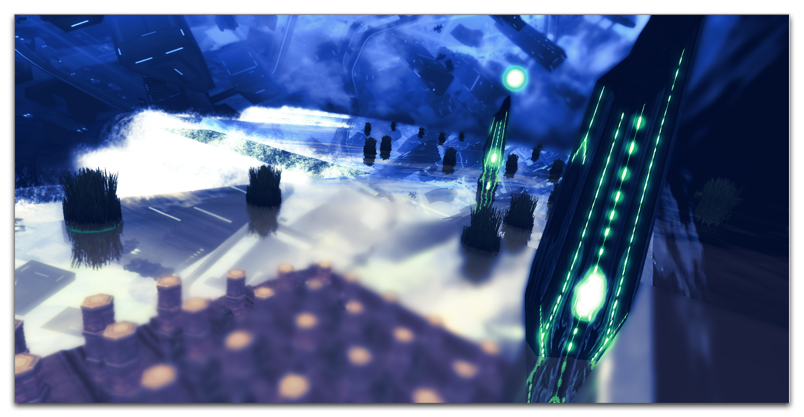

CAMERA ACTIONS
==============

The Editor's camera system offers a robust toolkit for controlling the
way a player sees the game. What really unlocks this as a creative force
is the addition of Camera Actions. With these you can animate cameras,
transition between them, and apply a range of effects and filters. This
sort of dynamic camera use allows you to incorporate a cinematic element
into your project's storytelling or gameplay.

Creative Camera Angles in joecab's Optical Illusion Piece

CAMERA ACTIONS LISTING
----------------------

You can access camera actions during action creation by navigating to
the 'Camera' label. This will bring you to the following view.

Camera Actions

The table below contains a breakdown of a selection of camera actions.

  ------------------------------------------------------------------------------
  Action         Effect
  -------------- ---------------------------------------------------------------
  Apply Camera   Sets a Camera as the main camera of a Player over a Duration of
  Object         time, with an Initial Velocity and Decelerate setting for the
                 transition.

  Apply Camera   Applies a Property to the Camera over a Duration of time, with
  Property       an Initial Velocity and Decelerate setting for the transition.
                 This will not change the camera object of that player.

  Follow Unit    Toggles the follow status of a Player to Do/Do Not Do with
  Group with     their currently selected unit group. A camera on follow will
  Camera         maintain smooth, constant movement over its target.

  Lock Camera    Toggles the Lock status of a Player. This prevents the player
  Input          from making any alterations to the camera. This is frequently
                 used for cutscenes.

  Lock Camera    Toggles the camera mouse relative mode to On/Off for a Player.
  Mouse Relative This mode changes a player's mouse movements into what is
  Mode On/Off    effectively drag-scrolling behavior, similar to holding down
                 the middle mouse button. It will also hide the mouse cursor.
                 This is commonly used in conjunction with Turn Camera Mouse
                 Rotation On/Off to create the kind of movement typically found
                 in a first-person game.

  Make Camera    Adjusts the camera for a Player to look at a target Point
  Look At        within a Region. This function will essentially trace the
                 camera's target in the XY plane without disrupting any of its
                 other features. Occurs over a Duration of time, with an Initial
                 Velocity and Decelerate setting for the transition.

  Make Camera    Similar to a combination of Make Camera Look At and Follow Unit
  Look At And    Group with Camera. It distinguishes itself from that
  Follow Actor   combination by also accepting an Actor input.

  Make Camera    Similar to a combination of Make Camera Look At and Follow Unit
  Look At And    Group with Camera. It distinguishes itself from that
  Follow Unit    combination by also accepting a Unit input.

  Pan Camera     Adjusts the camera for a Player to look at a target Point
                 within a Region. This function will essentially trace movement
                 in the isometric plane without disrupting any of its other
                 features. Occurs over a Duration of time, with an Initial
                 Velocity and Decelerate setting for the transition. If Smart
                 panning is enabled, the camera will not pan if it is already
                 looking at the target Point.

  Restore Camera Restores a camera to a previously saved configuration for a
                 Player. Occurs over a Duration of time, with an Initial
                 Velocity and Decelerate setting for the transition.

  Save Camera    Saves the current camera configurations for a Player.

  Set Camera     Sets the camera bounds for a group of Players to a Region. This
  Bounds         will limit the camera's movement to inside those bounds.
                 Selecting the Minimap parameter Do will resize it to fit the
                 camera bounds. This is a frequent choice in the campaign for
                 dividing a map into smaller areas that can be explored
                 separately.

  Set Camera     Sets the Yaw or Pitch sensitivity of the camera for a Player.
  Mouse Rotation This is engaged when camera mouse rotation is turned on.
  Speed          

  Set Camera     Sets a Property of a Camera to a Value. Properties include
  Object         Distance, Rotation, and Roll.
  Property       

  Set Camera     Sets the target of a Camera object to a Target within a Region.
  Object Target  

  Shake Camera   Shakes the camera for a Player. The shake is controlled along a
                 Direction by a base Frequency that is disrupted with a Random
                 value and lasts a Duration. If the Duration parameter is set to
                 0, it will shake the camera indefinitely until the Stop Shaking
                 Camera action is used.

  Shake Camera   Shakes the camera for a Player by selecting from a list of
  Using Preset   presets that set the Amplitude and Frequency. This shake
                 supports a Blend In and Blend Out across its Duration.

  Stop Shaking   Stops the camera shaking for a Player.
  Camera         

  Turn Camera    Toggles the camera height displacement On/Off for a Player.
  Height         This feature provides a height adjustment for any flying units
  Displacement   that are currently being followed to ensure their visibility
  On/Off         during camera zooms.

  Turn Camera    Toggles the camera height smoothing On/Off for a Player. This
  Height         feature provides a smooth transition as the camera moves
  Smoothing      between terrain heights.
  On/Off         

  Turn Camera    Toggles the camera mouse rotation to On/Off for a Player. When
  Mouse Rotation this is turned on, it will make a player\'s drag-scroll camera
  On/Off         movements rotate the camera in a free-look fashion rather than
                 dragging the camera. This can be used in conjunction with Lock
                 Camera Mouse Relative Mode On/Off to make the type of camera
                 commonly seen in a first-person game.

  Turn Camera    Toggles the vertical field of view to On/Off for a Player. By
  Vertical Field default, horizontal screen space is preserved between aspect
  of View On/Off ratios, while vertical space is cropped or expanded as
                 necessary. When vertical field of view is turned on, the
                 vertical screen space will be preserved between aspect ratios,
                 while the horizontal space is cropped or expanded as necessary.

  Zoom Camera    Zoom the camera in on a location for a Player. The zoom
                 proceeds from a DistanceFrom to a DistanceTo over a Duration.
  ------------------------------------------------------------------------------

USING CAMERA ACTIONS
--------------------

Examine the following sequence of camera actions.

Camera Action Sequence

This sequence begins by removing the game UI and adding a group of
marines. After that, a set of camera actions is used. A Pan Camera
action places the camera at the centre of the marine pairing. This
transition is made near-instantaneously by using an extremely small
Duration value and no Deceleration. An Apply Camera Object action is
then used to zoom the camera in by setting a small Distance value.
Another Apply Camera Object then changes the camera's axis by setting
the Rotation to an angle between the two marines. These properties are
applied over the same near-instantaneous Duration as the previous
action. The result of this action sequence is shown by the image below.

Custom Camera Settings with Actions
