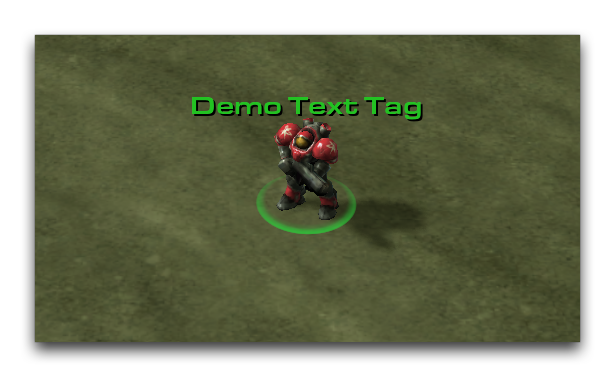

# Text Tags

Text Tags display text in game space, rather than in screen space like any interface or dialog options for text. They've been designed with a visual property that hangs them on top of a target unit and reacts to camera movements. This ensures that they're seated in the environment. As a result, they are often used in text elements that are halfway between being interface elements and gameplay elements. Notable applications of text tags include overhead player names, location names, and damage numbers. In the following image, you can see that text tags are shown above a hatchery and an extractor, giving relevant information on the worker count at each resource.

 Text Tags Showing Worker Counts

## Text Tag Actions

You can access the text tag actions during action creation by navigating to the 'Text Tags' label. This will present you with the following view.

*Text Tag Actions*

These actions are broken down in the following table.

| Action                               | Effect                                                                                                                                                                                       |
| ------------------------------------ | -------------------------------------------------------------------------------------------------------------------------------------------------------------------------------------------- |
| Attach Text Tag To Unit              | Attaches a text Tag to a Unit at a Height Offset.                                                                                                                                            |
| Attach Text Tag to Unit Attach Point | Attaches a text Tag to a Unit at an Attachment Point with offsets X and Y. Note that units contain specific attachment locations in their model data for this purpose, including Status Bar. |
| Create Text Tag                      | Creates a text Tag with the Text at a Font Size for Players. The tag is placed at a Position and Height Offset.                                                                              |
| Destroy Text Tag                     | Removes a text Tag.                                                                                                                                                                          |
| Pause/Unpause Text Tag               | Pauses or Unpauses any actions sent to the text.                                                                                                                                             |
| Set Alignment of Text Tag            | Sets the Horizontal alignment and Vertical alignment of a text Tag.                                                                                                                          |
| Set Background Border of Text Tag    | Sets the background border of a text Tag to a Horizontal and Vertical value.                                                                                                                 |
| Set Background Image of Text Tag     | Sets the background Image of a text Tag with a certain tiling Type.                                                                                                                          |
| Set Background Offset of Text Tag    | Sets the background offset of a text Tag to a Horizontal and Vertical value in terms of screen size percent.                                                                                 |
| Set Color Of Text Tag                | Sets the Color of a text Tag.                                                                                                                                                                |
| Set Edge Image of Text Tag           | Sets the Image of a certain Edge of a text Tag with offsets X and Y.                                                                                                                         |
| Set Enforce Fog Of War Of Text Tag   | Sets the Use Fog of War status of a text Tag.                                                                                                                                                |
| Set Faded Transparency Of Text Tag   | Sets the faded transparency Type of a text Tag.                                                                                                                                              |
| Set Font Size Of Text Tag            | Sets the Font Size of the text used in a text Tag.                                                                                                                                           |
| Set Maximum Size of Text Tag         | Text tags adjust their size depending on the camera's distance from them. This action allows you to set the maximum size that a text Tag can be in terms of Width and Height.                |
| Set Position Of Text Tag             | Sets the Position of the text Tag with a Height Offset.                                                                                                                                      |
| Set Text Alignment Of Text Tag       | Sets the alignment of a text Tag in the Horizontal and Vertical axes.                                                                                                                        |
| Set Text Of Text Tag                 | Sets the Text of a text Tag.                                                                                                                                                                 |
| Set Time Of Text Tag                 | Sets the Duration of a text Tag to a Time. Settings a time like this will cause the tag to expire after a Duration.                                                                          |
| Set Visibility Type Of Text Tag      | Sets the Visibility type of a text Tag.                                                                                                                                                      |
| Show/Hide Background For Text Tag    | Shows or Hides a background Image for a text Tag.                                                                                                                                            |
| Show/Hide Text Shadow For Text Tag   | Shows or Hides a shadow for a text Tag.                                                                                                                                                      |
| Show/Hide Text Tag                   | Shows or Hides a text Tag for Players.                                                                                                                                                       |

## Using Text Tags

Like dialogs, text tags are often reoriented, moved, and resized after creation. To support this, you should give each tag a persistent handle using a Set Variable action and the text tag function identifier Last Created Text Tag.

Take a look at the sequence of text tag actions below.

*Text Tags Action Sequence*

In this sequence, a text tag has been created with a Create Text Tag action. The action determines the tag's Text and Font Size, then sets the tag to the Position of a marine at a Height Offset. Following that, the tag is grafted to the marine with the Attach Text Tag To Unit action, targeting the Unit at a Height Offset. This pair of actions is a standard when using text tags. You should also note that the attachment has overwritten the tag position and will cause the text tag to move alongside its host unit.

*Text Tag Styled and Attached to Unit*
