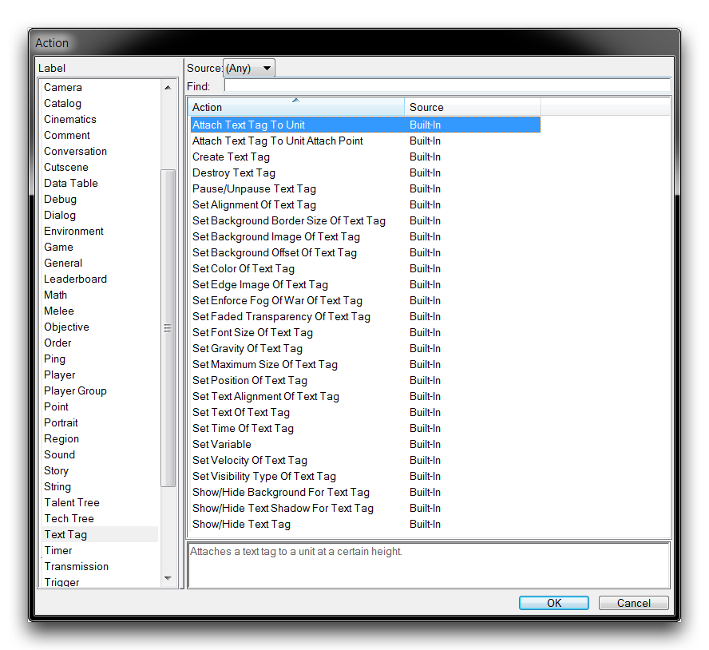

TEXT TAGS
=========

Text Tags display text in game space, rather than in screen space like
any interface or dialog options for text. They've been designed with a
visual property that hangs them on top of a target unit and reacts to
camera movements. This ensures that they're seated in the environment.
As a result, they are often used in text elements that are halfway
between being interface elements and gameplay elements. Notable
applications of text tags include overhead player names, location names,
and damage numbers. In the following image, you can see that text tags
are shown above a hatchery and an extractor, giving relevant information
on the worker count at each resource.

 Text Tags Showing Worker Counts

TEXT TAG ACTIONS
----------------

You can access the text tag actions during action creation by navigating
to the 'Text Tags' label. This will present you with the following view.

Text Tag Actions

These actions are broken down in the following table.

  --------------------------------------------------------------------------
  Action          Effect
  --------------- ----------------------------------------------------------
  Attach Text Tag Attaches a text Tag to a Unit at a Height Offset.
  To Unit         

  Attach Text Tag Attaches a text Tag to a Unit at an Attachment Point with
  to Unit Attach  offsets X and Y. Note that units contain specific
  Point           attachment locations in their model data for this purpose,
                  including Status Bar.

  Create Text Tag Creates a text Tag with the Text at a Font Size for
                  Players. The tag is placed at a Position and Height
                  Offset.

  Destroy Text    Removes a text Tag.
  Tag             

  Pause/Unpause   Pauses or Unpauses any actions sent to the text.
  Text Tag        

  Set Alignment   Sets the Horizontal alignment and Vertical alignment of a
  of Text Tag     text Tag.

  Set Background  Sets the background border of a text Tag to a Horizontal
  Border of Text  and Vertical value.
  Tag             

  Set Background  Sets the background Image of a text Tag with a certain
  Image of Text   tiling Type.
  Tag             

  Set Background  Sets the background offset of a text Tag to a Horizontal
  Offset of Text  and Vertical value in terms of screen size percent.
  Tag             

  Set Color Of    Sets the Color of a text Tag.
  Text Tag        

  Set Edge Image  Sets the Image of a certain Edge of a text Tag with
  of Text Tag     offsets X and Y.

  Set Enforce Fog Sets the Use Fog of War status of a text Tag.
  Of War Of Text  
  Tag             

  Set Faded       Sets the faded transparency Type of a text Tag.
  Transparency Of 
  Text Tag        

  Set Font Size   Sets the Font Size of the text used in a text Tag.
  Of Text Tag     

  Set Maximum     Text tags adjust their size depending on the camera's
  Size of Text    distance from them. This action allows you to set the
  Tag             maximum size that a text Tag can be in terms of Width and
                  Height.

  Set Position Of Sets the Position of the text Tag with a Height Offset.
  Text Tag        

  Set Text        Sets the alignment of a text Tag in the Horizontal and
  Alignment Of    Vertical axes.
  Text Tag        

  Set Text Of     Sets the Text of a text Tag.
  Text Tag        

  Set Time Of     Sets the Duration of a text Tag to a Time. Settings a time
  Text Tag        like this will cause the tag to expire after a Duration.

  Set Visibility  Sets the Visibility type of a text Tag.
  Type Of Text    
  Tag             

  Show/Hide       Shows or Hides a background Image for a text Tag.
  Background For  
  Text Tag        

  Show/Hide Text  Shows or Hides a shadow for a text Tag.
  Shadow For Text 
  Tag             

  Show/Hide Text  Shows or Hides a text Tag for Players.
  Tag             
  --------------------------------------------------------------------------

USING TEXT TAGS
---------------

Like dialogs, text tags are often reoriented, moved, and resized after
creation. To support this, you should give each tag a persistent handle
using a Set Variable action and the text tag function identifier Last
Created Text Tag.

Take a look at the sequence of text tag actions below.

Text Tags Action Sequence

In this sequence, a text tag has been created with a Create Text Tag
action. The action determines the tag's Text and Font Size, then sets
the tag to the Position of a marine at a Height Offset. Following that,
the tag is grafted to the marine with the Attach Text Tag To Unit
action, targeting the Unit at a Height Offset. This pair of actions is a
standard when using text tags. You should also note that the attachment
has overwritten the tag position and will cause the text tag to move
alongside its host unit.

Text Tag Styled and Attached to Unit
