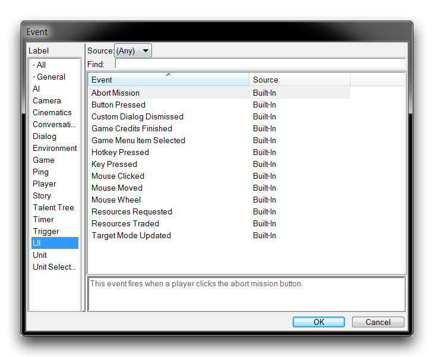
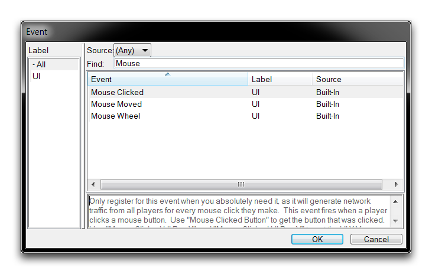
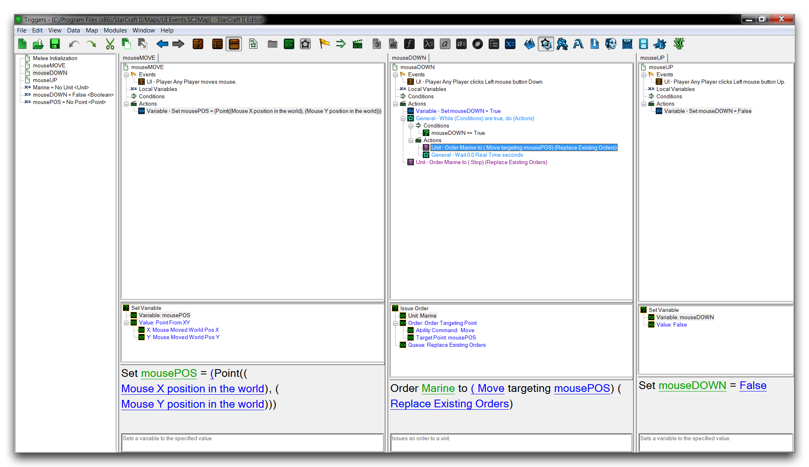
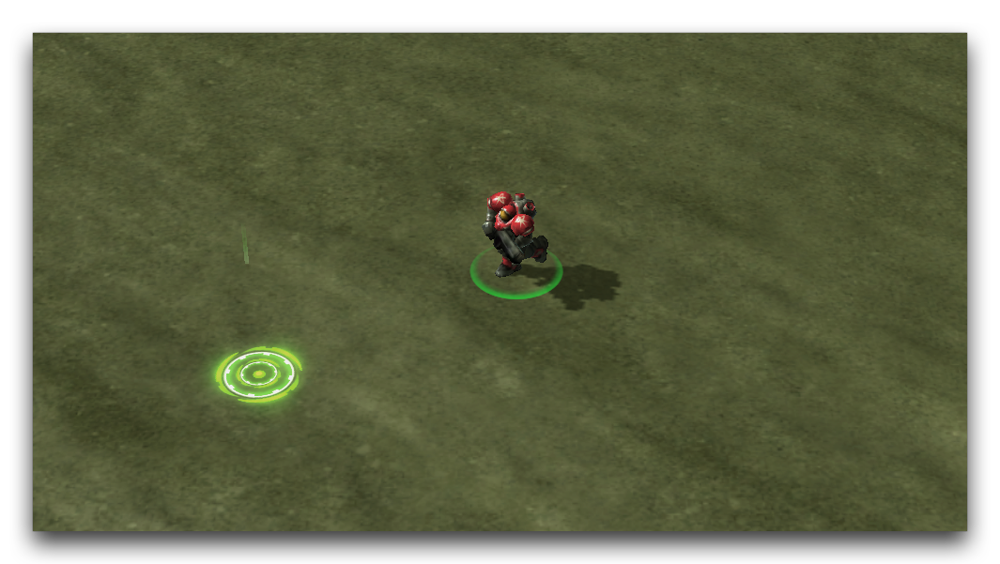
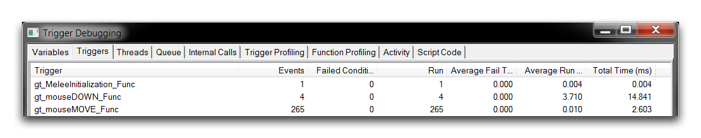

# Ui Events

The exact mechanics of how StarCraft reacts to a player's input can sometimes feel opaque and inaccessible. Despite the great deal of control offered by the Editor, there is still a host of unknown factors arising from a mixture of hardware, operating system, and back-end engine considerations. To combat this sealed-off feeling, there are a number of ways of getting between a player's input to their computer and the game's reactions. For triggering, the focus is a selection of events that respond to player inputs, collectively known as the UI Events. You can see these during event creation by sorting according to the 'UI' label, as shown below.

*UI Events Listing*

The following table provides a breakdown of these events.

| Event                   | Details                                                                                                                                                                                                                                                                                                                                                                                                                                                                                                                   |
| ----------------------- | ------------------------------------------------------------------------------------------------------------------------------------------------------------------------------------------------------------------------------------------------------------------------------------------------------------------------------------------------------------------------------------------------------------------------------------------------------------------------------------------------------------------------- |
| Abort Mission           | Triggers when a Player clicks the 'Abort Mission' button from the game menu.                                                                                                                                                                                                                                                                                                                                                                                                                                              |
| Button Pressed          | Triggers when a Player clicks a Button from the command card. That button can be identified with the Button Pressed function. This is a performance intensive event.                                                                                                                                                                                                                                                                                                                                                      |
| Custom Dialog Dismissed | Triggers when a Player closes a dialog with a certain Result, either Yes, No, or Any. The Result can be identified with the function Custom Dialog Result, and the Player with the function Triggering Player.                                                                                                                                                                                                                                                                                                            |
| Game Credits Finished   | Triggers when the end game credits finish rolling for a Player.                                                                                                                                                                                                                                                                                                                                                                                                                                                           |
| Game Menu Item Selected | Triggers when a Player selects a Game Menu Item. Examples include Save Button, Quit Button, Abort Mission, or Achievements Button. Available identifiers here are the Game Menu Selected and the Triggering Player functions.                                                                                                                                                                                                                                                                                             |
| Hotkey Pressed          | Triggers when a Player presses a Hotkey into a certain state, either Down or Up. The hotkeys are a variety of utility controls that are each bound to a single key, examples include Army Select, Idle Worker, and Warp-in. Available identifiers are the Hotkey Pressed function for the Hotkey, and the Triggering Player function for the Player. Note that, if code that handles the hotkey press has already been written, then the hotkey will no longer trigger this event. This is a performance intensive event. |
| Key Pressed             | Triggers when a Player presses a Key into a certain state, either Down or Up, with any of several modifiers activated: Shift, Control, and Alt. Each key press can be identified with the functions Key Pressed, Shift Key Pressed, Control Key Pressed, and Alt Key Pressed. This is a performance intensive event.                                                                                                                                                                                                      |
| Mouse Clicked           | Triggers when a Player presses a Mouse Button into a certain state, either Down or Up. Available mouse buttons include Left, Right, and Middle. The click itself can be identified with the function Mouse Clicked Button, then the functions Mouse Clicked UI Pos X or Y, and Mouse Clicked World Pos X, Y, and Z can identify coordinates in the screen space or game space respectively. This is a performance intensive event.                                                                                        |
| Mouse Moved             | Triggers when a Player moves their mouse. The functions Mouse Clicked UI Pos X or Y, and Mouse Clicked World Pos X, Y, and Z can identify coordinates in the screen space or game space respectively. This is a performance intensive event.                                                                                                                                                                                                                                                                              |
| Mouse Wheel             | Triggers when a Player moves their mouse wheel. The function Mouse Wheel Moved provides a magnitude of the movement. This is a performance intensive event.                                                                                                                                                                                                                                                                                                                                                               |
| Resources Requested     | Triggers when a Player requests resources using the team resources menu.                                                                                                                                                                                                                                                                                                                                                                                                                                                  |
| Resources Traded        | Triggers when a Player trades resources to a Recipient Player using the team resources menu.                                                                                                                                                                                                                                                                                                                                                                                                                              |
| Target Mode Updated     | Triggers when a Player turns the targeting mode of an Ability Command to a certain State, either On, Off, or Any.                                                                                                                                                                                                                                                                                                                                                                                                         |

## Performance Concerns

Monitoring player inputs can cause certain UI events to trigger an extremely large number of times. This is mostly a concern with the Button Pressed, Hotkey Pressed, Key Pressed, Mouse Clicked, Mouse Moved, and Mouse Wheel events. As a result, you should be careful to use these events only as necessary. Should you need to use these events, one technique for avoiding performance dragging is to pair the monitoring trigger with a condition that will close off the event until it is needed again. An example of this is shown below.

*Input Event Throttle*

## Examining Ui Events

Each UI event responds to a certain player input, then usually offers some identifier functions to help describe the input for use. This is particularly true for mouse events, a subset of UI events that offers a large variety of identifying functions to describe the number of mouse movements and mouse button presses available to a player. You can see these events from the event creation screen by searching for 'Mouse,' as shown below.

*Mouse UI Events*

In the demo map provided with this tutorial, you'll find some sample triggers showing how UI events are generally used. Opening the map and navigating to the Trigger Editor will give you the following view.

*Map Trigger Editor View*

The map contains a single marine, which has been identified and set to a variable on initialization. The rest of the triggers will use player inputs to create a control scheme that directly grafts control of the marine to the mouse. Of course, this is a pronounced change from StarCraft's traditional RTS control setup, which allows for the selection and control of a lot of units. To support this control scheme, mouse drag selection or 'box-selecting' has been disabled here. If you check the 'mouseMove,' 'mouseDown,' and 'mouseUP' triggers, you'll find the following.

*Mouse UI Triggers*

A system for direct control of a unit has been built using a combination of two Mouse Clicked events, 'mouseDOWN' and 'mouseUP,' and a Mouse Moved event, 'mouseMove.' This works by constantly monitoring the mouse's position with the 'mouseMove' trigger, and archiving that position using two identifying functions Mouse Moved World Pos X, and Mouse Moved World Pos Y. When a player clicks the mouse, the 'mouseDown' event fires, entering into a While loop that creates a constant move order for that unit to the last archived position of the mouse.

This process continues as long as the player holds the mouse button down, resulting in continuous movement of the unit in response to those two triggers working together. When the mouse button is unclicked, or 'clicked up,' the While loop in 'mouseDown' is broken and movement stops. Testing the map should present you something like the image below.

*Direct Marine Control*

This demonstrates one reason that you might want to get between player inputs and making use of UI events. Here it has been used to give players a new way of controlling the game, which can be a lot of fun. Still, there a lot of events required to keep the movement smooth. If you open the Trigger Debugger, you'll gain some insight into this process.

*Direct Marine Control*

Here, you can see that the constant mouse monitoring has resulted in 250+ events firing in the course of just a few seconds. This should give you an impression of how operations like this can get very expensive in terms of performance.

## Attachments

 * [049_UI_Events.SC2Map](./maps/049_UI_Events.SC2Map)
