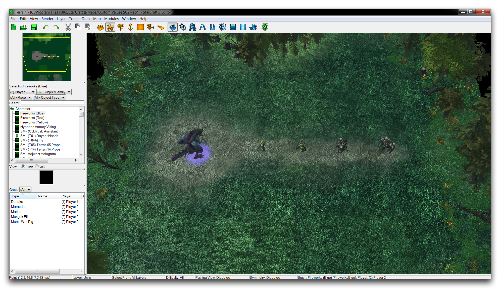
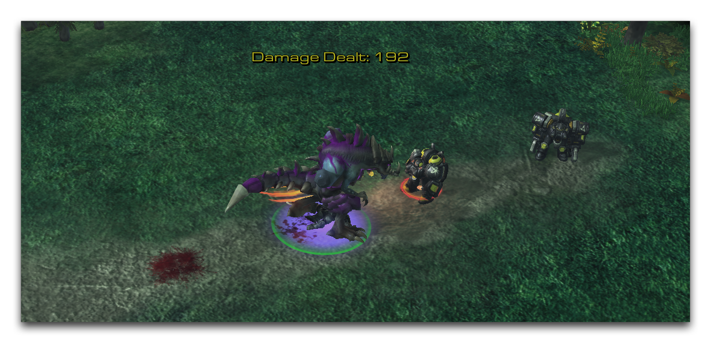

CUSTOM VALUES
=============

Custom Values refer to a unit-centric storage array. Once a number is
set to a unit's custom values, the array becomes active and any value
can be set again, read, modified, and used in any fashion. These numbers
are of the Real type, and are limited to an array of 64 values for each
unit. Essentially, the custom values are an equivalent to a Real\[63\]
that is stored at a special Unit scope.

Custom values represent a type of organized data that is different from
arrays or records. By providing it pre-organized within a unit, you are
saved from having to declare or manage an array. Combined with the
proximity of this data to its source, this makes for a straightforward
approach that supports quick calculations and data-tracking for complex
entities like hero units.

SET CUSTOM VALUE
----------------

Custom values are set using the action Set Unit Custom Value. You can
find this during action creation under the 'Unit' Label, as shown below.

Custom Value Actions

GET CUSTOM VALUE
----------------

Custom values are extracted using the function Custom Value of Unit. You
can find this during Real field filling under the 'Function' source.

Custom Value Functions

DEMOING CUSTOM VALUES
---------------------

Open the demo map provided with this article. Inside you'll find a view
of the Zerg hero Dehaka lining up some foes in a forest clearing.

Demo Map Course

Inside the Trigger Editor, you'll find a set of triggers that will
monitor and update a custom value belonging to Dehaka with a reading of
the unit damage he's dealt out. The triggers will then update this
custom value to a text tag.

If you check the global variable scope, you'll find an important tip for
custom value use. Creating an index Integer constant for any custom
values is a useful habit for creating a consistent handle for the
specific custom value. Then, on every occasion that that value is dealt
with, the index can be inserted to avoid dealing with the hard-coded
custom value array indices. Below you can see the trigger handling the
custom value text tag.

Text Tag Construction Trigger

Here, a text tag has been neatly constructed and appended to Dehaka as a
readout of his custom value. However, the key part of this exercise is
found in the 'Custom Value Readout Updater' trigger, which you can see
below.

Custom Value Readout Trigger

This trigger runs an update after each instance of damage, then updates
the custom value with the Set Custom Value action. Take note of the
Integer index here of c\_TotalDamageDealt; it operates as a quick
handle. After each update to the custom value, the text tag readout is
also reset. Together, these actions amount to a visualization of the
internal custom value through a text tag. Understanding custom values as
unit-centric data like this is helpful when drafting ways to use them.
If you test the map out for yourself, you should get a result like the
one shown below.

Custom Value Damage Tracking

As a final note, custom values do not count as variables within the
Trigger Debugger. That means that, when you're debugging systems like
this demo or any other custom value centric designs, it will usually be
worthwhile to develop a custom debug UI.
