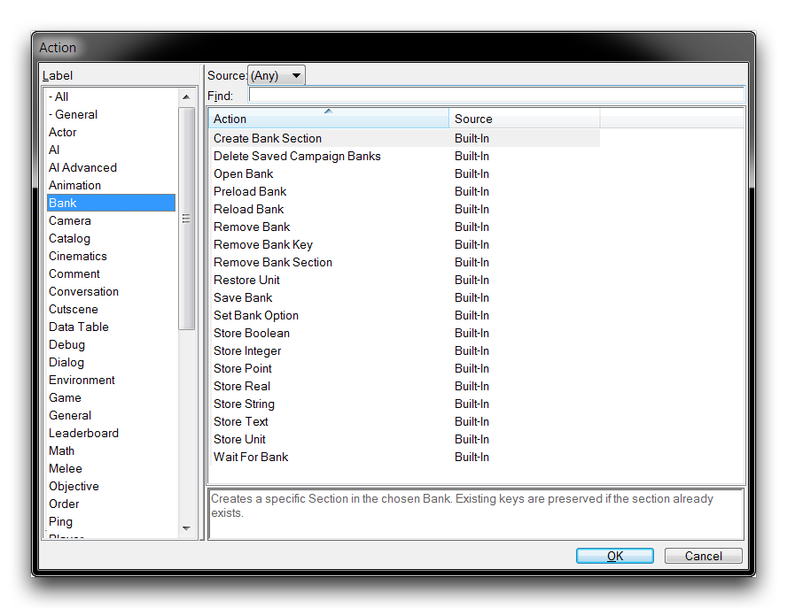

BANKS
=====

Banks are the Editor's method for storing information and using it
between projects. Below you can see a sample bank file.

Custom Game Bank File

This bank stores a player's personal statistics from a type of custom
game. Note the structure here. A bank is separated hierarchically first
by sections and then into key-value pairings. As values are stored in
the bank, they are written to the bank file in a target section, and by
their associated key, but in no particular order beyond that.

BANK ACTIONS
------------

The controls for bank handling can be found during action creation under
the label 'Bank.' This is shown below, followed by a table that breaks
down these controls.

Bank Actions

  --------------------------------------------------------------------------
  Action    Effect
  --------- ----------------------------------------------------------------
  Preload   Preloads and synchronizes a Bank for a specific Player.
  Bank      

  Create    Creates a bank Section, which can then accept key-value pairs.
  Bank      
  Section   

  Save Bank Saves a Bank, making sure that all changes to the file are
            maintained after the game.

  Store     Stores a Value as a Key to a certain Section of a Bank. There
  Data      are several types available for storage: Boolean, Integer, Real,
            Point, String, Text, and Unit.

  Reload    Reloads a Bank, reverting any changes that might have occurred
  Bank      between saves.

  Open Bank Opens a Bank for use and alteration.

  Restore   Creates a unit that was previously stored through a Store Unit
  Unit      action. The unit is restored from a Key within a Section from a
            Bank. This results in the unit being created at a Point, for a
            Player, and facing an Angle.

  Wait For  This is a Wait control statement that pauses until the condition
  Bank      of a specific Bank being reloaded is True.

  Set Bank  Sets the Signature option of a Bank to Enable or Disable. The
  Option    signature provides an encryption option for banks, so that they
            cannot be altered by players.

  Remove    Removes a Key from the Section of a Bank and its associate
  Bank Key  value.

  Remove    Removes a Section from a Bank and all of the key-value pairs it
  Bank      contains.
  Section   
  --------------------------------------------------------------------------

FINDING LOCAL BANK STORAGE
--------------------------

You can find the local bank storage at the Windows location described
below.

-   Libraries
    -   Documents
        -   StarCraft II
            -   StarCraftPlayer.ID@\#
                -   Banks
                    -   ID Code
                        -   Bank Files

This procedure is shown in the following image sequence.

Accessing Local Bank Storage
