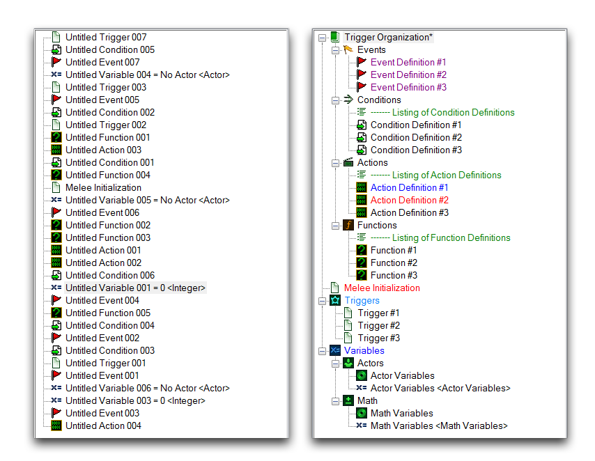
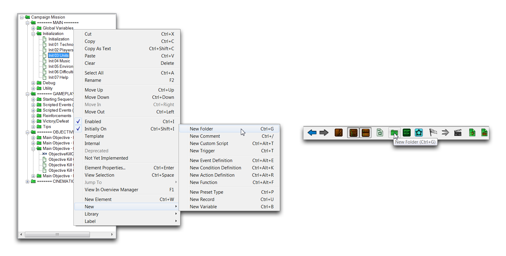
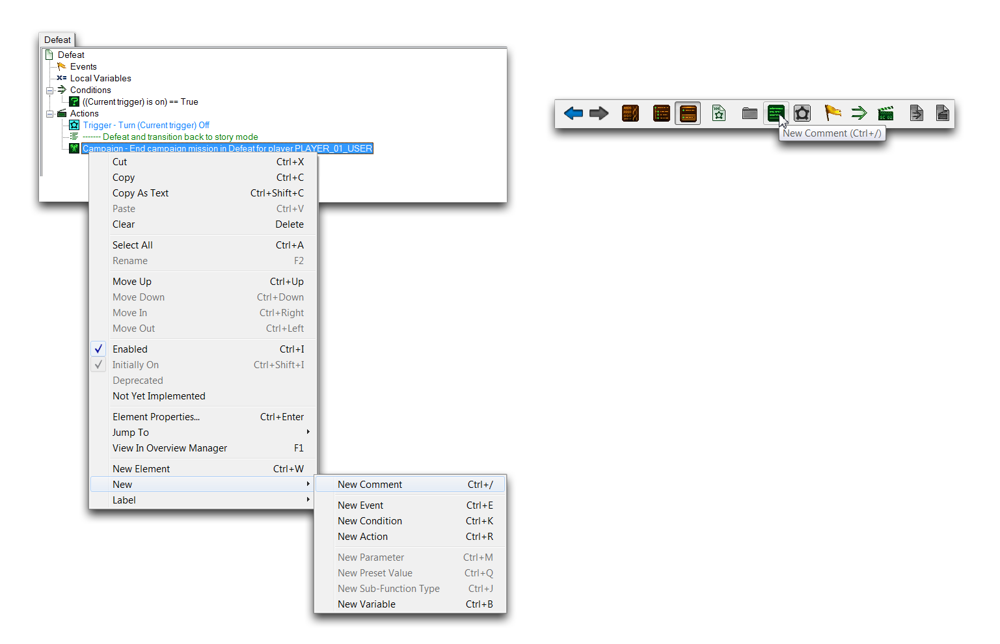
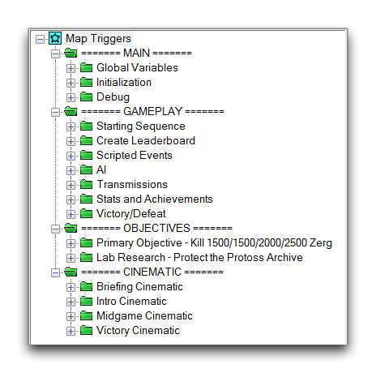
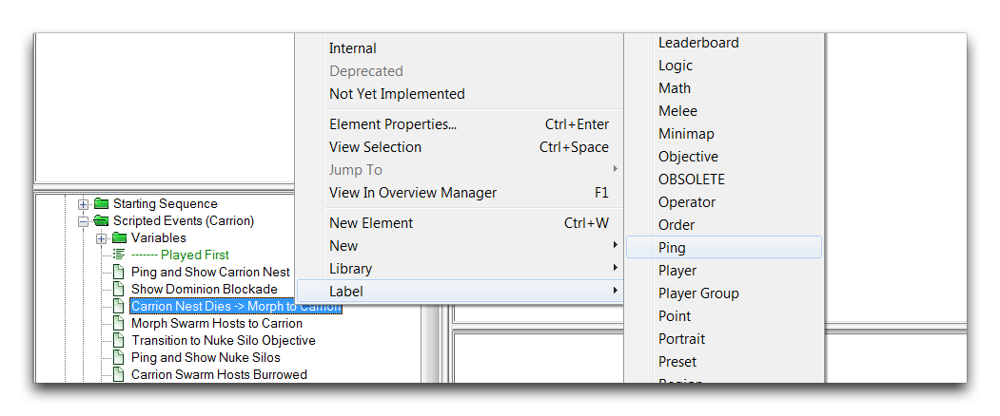
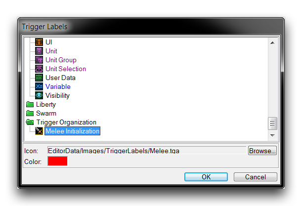
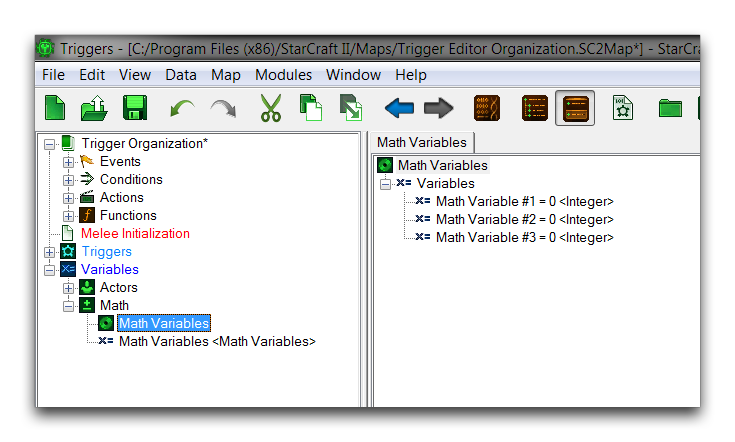
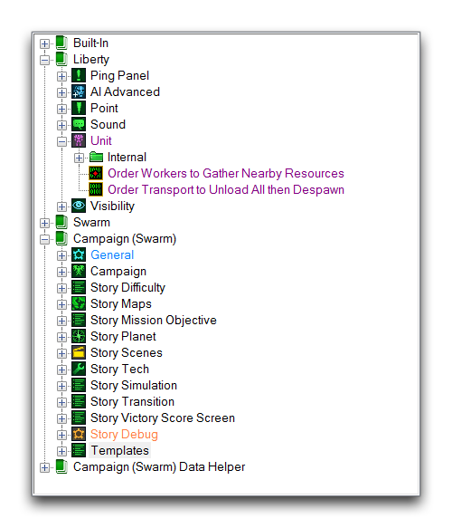

# Trigger Organization

As your project grows and incorporates more and more elements, it's probably going to trend toward some degree of disorder. This can be pretty hazardous. In programming, the quality of work often depends on how easily the developer is able to understand how the whole system works together. A big mess of elements is directly opposed to this sort of clear understanding, so developing a system for organizing your project is a must. To support this, there are several tools in the Trigger Editor to help you clean up. Organizing a project can have a pretty drastic effect, as the image below shows.

*Disorganized Triggers -- Triggers with Organization Measures*

## Folders

Folders are a fundamental element of organizing work on a computer, so they likely need little explanation. They work pretty much as you'd expect them to within the Editor. A Trigger Editor folder offers the ability to group items into a container object that can be opened or collapsed through its left-side + or - control.

Create a folder by right-clicking inside the Triggers Panel and navigating to New ▶︎ New Folder, or by using the New Folder button found in the Trigger Bar. These procedures are shown below.

*Creating Folders From Trigger Panel -- From Trigger Bar*

Moving or creating a folder inside another folder will create a subfolder. You can repeat this process to create a hierarchy for your project. While you should avoid getting too carried away with this, a couple of layers of hierarchy can be a strong first step for organization. The following image shows the means by which the official StarCraft campaign maps are organized, first broken into folders by their general type (MAIN, GAMEPLAY, OBJECTIVES, and CINEMATIC), then by their specific purposes, such as 'Global Variables,' 'AI,' or 'Victory Cinematic.'

*Folder Organization in a Campaign Map*

## Comments

Comments are a tool for project documentation. They add a text element that is written directly into the Editor. These elements have no effect on gameplay and stay inside the Editor, where they provide a useful communication tool for describing how a section of a project works. You can make comments for personal use or for other users who may see your map, whether teammates or the community at large. Extended comment sections can also be used for many utility purposes, including manuals, release histories, lists of debugs codes, and to-do lists. Some typical comments are shown below, denoted by their green text and 

*Commented Trigger*

You can create comments from either the Triggers Panel or the Trigger Content Panel. Do so by right-clicking in either location then navigating to New ▶︎ New Comment. Alternatively, you can also do so using the New Comment button in the Trigger Bar, which will create a comment at the cursor's current location.

*Creating Comments From Trigger Content Panel -- From Trigger Bar*

Adding comments within the Triggers Panel is considered less useful, as it tends to be messy. Still, the option is available for small notes that describe things like folder contents.

## Libraries

Libraries allow you to organize elements of the Trigger Editor into collections that you can share between projects using their import and export functions. You can see which libraries are active in a project in the Libraries Panel, which will typically include Built-In, Liberty, Swarm, Void, and so forth. These are trigger libraries from the standard dependencies, and they are the source of all pre-made actions, conditions, functions, and events in the Editor. You can see a standard view of a project's libraries below, denoted by their 

*Project Libraries*

## Labels

Next to every Trigger Editor element is a small illustrative icon, known as a Label. Each label categorizes its element via the icon, and may also change the element's description to a color associated with the label. Whenever you create an element from the standard library in the Trigger Content Panel, it is assigned a pre-determined label. For example, any action of the 'Camera' category will be set next to the  standard labels and their description colors in the image below.

*Element Labels*

These label presets are made available through the standard dependency libraries and may be repurposed for use in any project. An element's label is set by selecting it, right-clicking, and navigating to Label, as shown below.

*Setting an Element's Label*

Setting a label for a definition will add both the icon and the chosen label to any elements of that definition. If you choose a label for an element that exists only in the Triggers Panel such as a trigger, variable, or record, the label will only change the color of the element. Labels are also useful when searching for elements using the 'Find' function of the Trigger Editor.

If you find yourself looking for more customization, you may want to add custom labels. You can create a custom label by navigating to Data ▶︎ Modify Labels. This will launch the 'Trigger Labels' window shown below.

*Creating a Custom Label*

Here you can set the color and label. You can set any image sized 16 x 16 px as a label icon through the Archive Browser.

## Records

Records present layouts of variables that are typically useful for templating objects. This makes them a natural organizing tool as well. The image below shows a standard use of records to organize variables.

*Record as a Variable Organizer*

## Groups

The main Trigger Content Panel is actually composed of organizers called Trigger Groups. Each group allows you to browse a separate element of the Trigger Editor in a division of the main content panel. The Editor supports up to three groups in a given project. Opening an additional group will divide the panel space, as shown below.

*Trigger Content Divided Into Two Groups*

Viewing things in parallel, as in the above image, can be an effective way of comparing different parts of your project. Overall, it offers versatility in the ways that users can configure their Editor. You can enable additional groups in the Trigger Editor view by going to View ▶︎ Show Groups. There you'll find four options for configuration.

  - Smart -- Trigger groups will be continually added or removed, depending on the current needs.
  - 1 -- Allows a single trigger group. This is the default setting.
  - 2 -- Allows two trigger groups.
  - 3 -- Allows three trigger groups.

## Tabs

Tabs are sub-panels that exist within a certain trigger group. Tabs allow you to view any number of elements and quickly navigate between them using the tab headers at the top of the Trigger Content Panel. Tabbed browsing of trigger elements is shown in the image below.

*Tabbed Browsing within a Trigger Group*

You can open tabs to the currently active group by selecting multiple elements in the Triggers Panel, then hitting Enter. Once opened, you can close tabs by right-clicking the tab header and navigating to either Close Tab (CTRL+Shift+A) or Close All Tabs (CTRL+Alt+A). The combination of tabs and groups offers a significant amount of customization in how you organize the Trigger Editor. Below you can see an example of these features in use.

*Using Groups and Tabs Together in the Trigger Editor*

## Attachments

 * [052_Trigger_Organization.SC2Map](./maps/052_Trigger_Organization.SC2Map)
