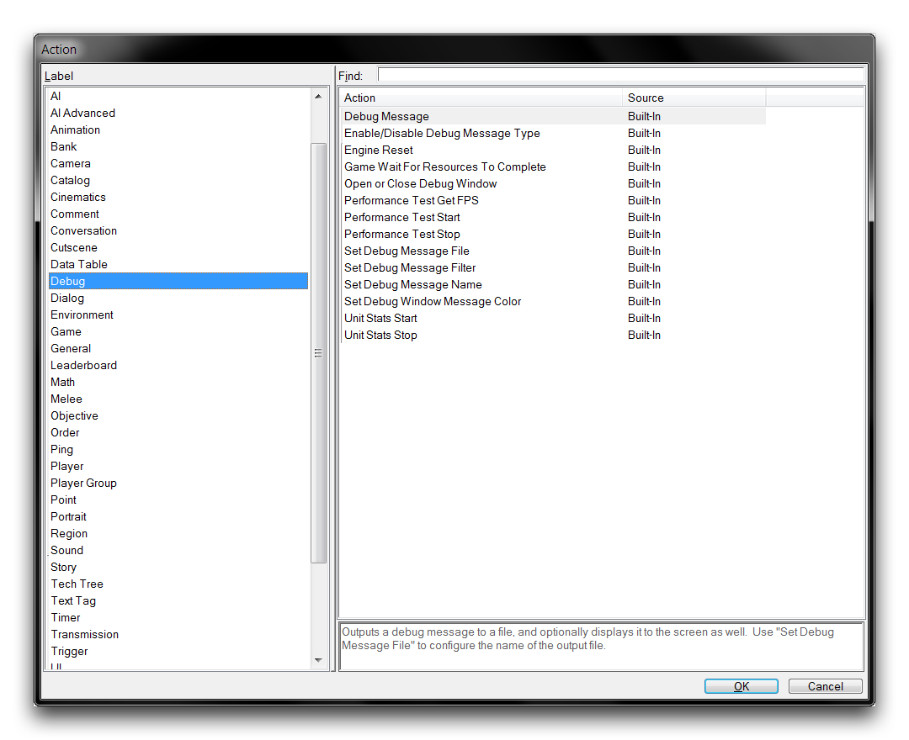
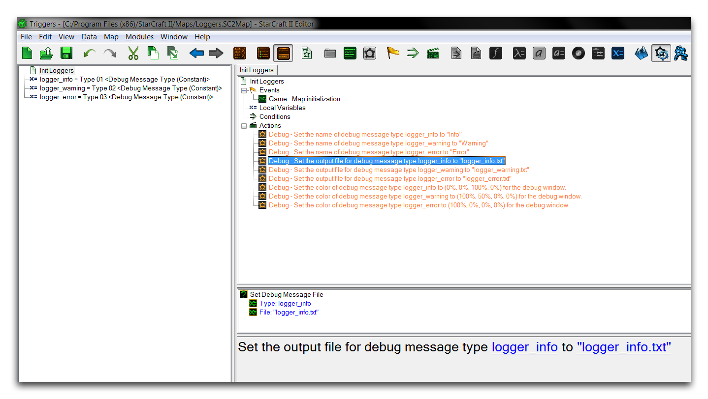

LOGGERS
=======

A logger is a diagnostic tool that allows developers to output data from
a running program over time and then archive it. This allows a
post-script characterization of how the program, in this case your game,
has run. Loggers often support a type of tagging, where events with
specific qualities are marked and individually monitored. Tagged events
are then either outputted to individual files or set up with some sort
of viewing client to parse the data. This type of sorted run-time
information can give detailed insight into how a game performed.

LOGGER USAGE
------------

By way of example, a logger could be designed to monitor non-critical
errors over the course of a play test. These errors could be tagged with
different severities or other game-state information from the time of
their occurrence. By inspecting the logged outputs after play, a
developer could gain crucial information about the number and
distribution of errors across an entire session. This offers a different
viewpoint than the more typical diagnostic approach of witnessing a
single error, then moving to fix it immediately. Another illustrative
example of data logging is shown below.

APM Logged in a Replay Visualized with Scelight

This chart is a visualization of the APM of a StarCraft player over the
course of a multiplayer match. APM has been logged every few seconds,
then graphed to give a smooth picture of it as a piece of data over a
game session. The data is derived from a StarCraft replay. Replays
themselves are the output of a logger that records every player action
during a match.

It may seem like a bit of a stretch to see this as relevant to the
article at hand. After all, replays are targeted at rebuilding a match
of a completed game as it occurs, while a logger usually monitors how a
program performs. Still, this should be a familiar example for StarCraft
users despite how elaborate it is. After all, replays are recorded for
any online play tests of a game and can offer a useful picture of what
occurred during that test. Replay analyzers, like Scelight in this case,
offer an example of a client that parses tagged output data.

CREATING A LOGGER WITHIN THE EDITOR
-----------------------------------

Assembling a logger directly within the StarCraft engine is both
possible and potentially useful for the development of your project. To
do so, there are a couple of specifications to meet. First, there must
be a way to output debug information at any given location within the
code. This information must then be able pass out of the Editor and into
a file structure, where it is separated into several files based on
logging tags. Having a global control for the debug process to quickly
enable and disable logging would be useful as well. With this design in
mind, you can shape a logger from existing functionality in the Editor.
In terms of output options, the 'Debug' actions are a good place to
start. A list of these actions is shown below.

Debug Actions

The first point of interest here is the action Debug Message. This
allows text to be printed to either a file, game window, or the Trigger
Debugger. Select this action and move into the Trigger Editor. There
you'll note that its parameters are an ideal fit for logger design. You
can see them in the image below.

Debug Message Parameters

The initial parameter sets the output text, while the second parameter
allows you to specify a Debug Message Type. This is a preset with 16
potential values, Type 01 through Type 16, that can serve as tags for
the output. Once tagged, you can configure each output type to print to
different files and exhibit different behaviors with respect to what it
outputs and how it presents those outputs. For this demo, you'll use
three tags, with each being modelled as a different error severity
level. To keep track of these tags, they have each been set to a
constant variable. The full mapping follows the scheme below.

logger\_info = Type 01 \<Debug Message Type(Constant)\>

logger\_warning = Type 02 \<Debug Message Type(Constant)\>

logger\_error = Type 03 \<Debug Message Type(Constant)\>

With these set, the logger trigger can be developed using the following
plan.

Debug Triggers

By using the Set Debug Message Name action, you can assign a custom name
to each of the specified debug message types. This name appears in the
Show User Input option available from the Trigger Debugger and makes it
easier to handle the different output channels. This is supported by the
Set Debug Message Color action, which will allow you to differentiate
more easily when looking at the debugger window. You can see this in the
image below.

{width="5.04167in" height="4.5in"}

Debug Triggers

Then, most importantly, the Set Debug Message File allows for the
assignment of file names to each of the debug message types. It is
recommended that you assign a unique file to every logging level. Doing
so will allow this trigger to serve as a full logger by delineating the
error types into separate files for inspection after a test. For single
player games, the output folder for logger files on Windows will be
C:\\Users\\\<username\>\\Documents\\StarCraft II\\UserLogs\\\<mapname\>.

{width="6.5in" height="4.62153in"}

Logger Output Files

ADDING FILTERS
--------------

At this point the logger is operational and can output potentially
useful diagnostic data to separate files. It meets the design criteria.
However, you might want to filter debugging messages one level further.
There are some more functions which can help here. Enable/Disable Debug
Message Type allows you to toggle each specific debug message type
within the Trigger Debugger. This filter is only for viewing though, it
will have no effect on the in-game readout or the output files. If you'd
like to filter the in-game readout and output files, you can use the
action Filter Debug Message Type.

Unfortunately, there is no way to disable messages only in the Trigger
Debugger. One workaround is to use the third parameter of the Debug
Message action to disable these outputs. If you are implementing your
own logger, it may be a good idea to encapsulate the Debug Message
inside an action definition to permanently build in this ability
yourself.

As a final note, when you're creating a release version of your project
for the public, these debug filters can be used to quickly disable every
debug output and maximize the performance of your release version.
