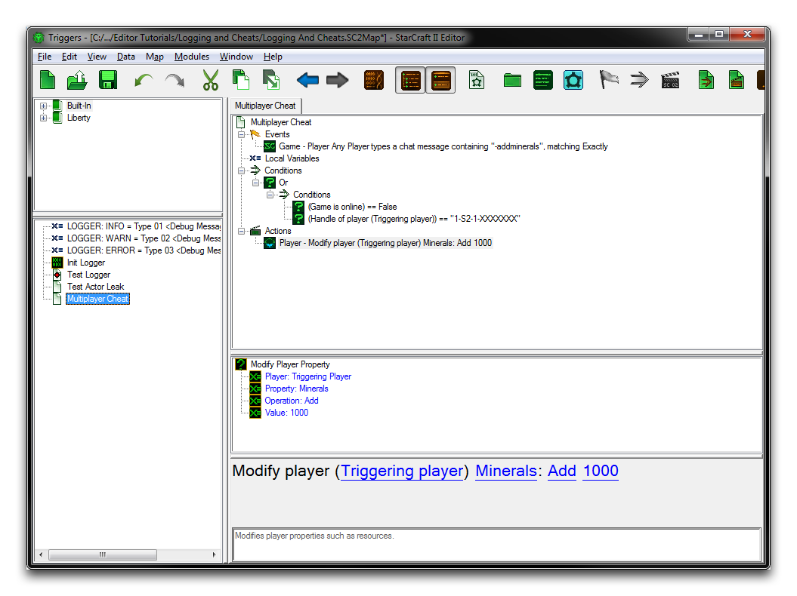
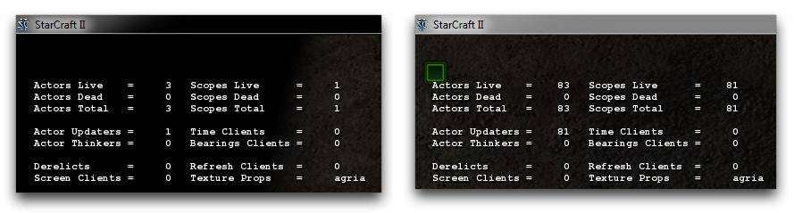

# Debug Cheats

Cheat codes were originally intended as testing elements for developers. When games began to be ship with these codes still included, they became a favorite for players to experiment with and use as shortcuts past irksome obstacles. Although player-side cheats like GreedIsGood and Black Sheep Wall still exist in StarCraft II, there are many more cheats that you can enable to ease development and testing of your projects. Below you'll find a list of these debug cheats for easy reference.

## Test Document Cheats

When testing a document from the editor, the Test Document Cheats are available. These are special chat commands that allow for game-time actions like creating units and modifying resources. They save developers from having to hand design special triggers for commonly performed testing tasks. These cheats are broken down in the table below.

| Cheat             | Effect                                                                                                                                                                                                                                        |
| ----------------- | --------------------------------------------------------------------------------------------------------------------------------------------------------------------------------------------------------------------------------------------- |
| Ally              | Changes all alliance states between the selected players. By default, if you just type 'Ally,' all players will share all alliance states with you.                                                                                           |
| AllianceDefeat    | Changes the Defeat alliance state between the selected players. By default, if you just type 'AllianceDefeat,' all players will share defeat with you.                                                                                        |
| AllianceControl   | Changes the Control alliance state between the selected players. By default, if you just type 'AllianceControl,' then all players share control with you.                                                                                     |
| AllianceGiveHelp  | Changes the GiveHelp alliance state between the selected players. By default, if you just type 'AllianceGiveHelp,' all players will respond to calls for help from your units.                                                                |
| AlliancePassive   | Changes the Passive alliance state between the selected players. Players that you are not passive with will be considered hostile for attacking purposes.                                                                                     |
| AlliancePushable  | Changes the Pushable alliance state between the selected players. This controls whether a player's units will move through another player's units, pushing them out of the way.                                                               |
| AllianceSeekHelp  | Changes the SeekHelp alliance state between the selected players. Controls whether a player's units call for help to the specified target player. The target player can choose to respond or not, depending on its GiveHelp alliance setting. |
| AllianceSpend     | Changes the Spend alliance state between the selected players. Players that you are sharing resources with are allowed to spend your money to purchase things.                                                                                |
| AllianceTrade     | Changes the Trade alliance state between the selected players. Players that you are trading with can be sent resources.                                                                                                                       |
| AllianceVision    | Changes the Vision alliance state between the selected players.                                                                                                                                                                               |
| BehaviorAdd       | Adds the requested behavior to the selected units.                                                                                                                                                                                            |
| BehaviorDuration  | Sets the duration of the requested behavior.                                                                                                                                                                                                  |
| BehaviorRemove    | Removes the requested behavior from the selected units.                                                                                                                                                                                       |
| Charges           | Toggles spell charge validation.                                                                                                                                                                                                              |
| Cooldown          | Toggles spell cooldown validation.                                                                                                                                                                                                            |
| Creep             | Adds creep at the cursor position given the requested radius.                                                                                                                                                                                 |
| DamageDealt       | Multiplies the amount of damage dealt by a player's units by the specified value. By default, this will multiply the damage dealt by 10 for the cheating player                                                                               |
| DamageTaken       | Multiplies the amount of damage taken by a player's units by the specified value. By default, this will reduce all damage taken to 0 for the cheating player.                                                                                 |
| DeathAll          | Kills all units on the map.                                                                                                                                                                                                                   |
| DeathExcept       | Kills all units on the map except the selected units.                                                                                                                                                                                         |
| DeathSide         | Kills all units owned by the selected player.                                                                                                                                                                                                 |
| DeathUnit         | Kills the selected units. The type of death can be specified as a parameter.                                                                                                                                                                  |
| Defeat            | Ends the game in defeat for the selected player.                                                                                                                                                                                              |
| DestroyPersistent | Destroys all persistent effects within the specified radius of the cursor.                                                                                                                                                                    |
| Effect            | Executes the requested effect from the selected units.                                                                                                                                                                                        |
| FastBuild         | Toggles fast building, research, and training times.                                                                                                                                                                                          |
| FastHeal          | Toggles fast healing times.                                                                                                                                                                                                                   |
| Fidget            | Forces selected units to perform the specified fidget type.                                                                                                                                                                                   |
| Food              | Toggles food usage validation.                                                                                                                                                                                                                |
| Free              | Toggles resource cost validation and expenditure.                                                                                                                                                                                             |
| God               | Turns on god mode for the selected player. Units owned by players that are in god mode will deal amplified damage, and take no damage.                                                                                                        |
| Loot              | Drops a type of loot for the specified player.                                                                                                                                                                                                |
| MakeUnit          | Creates N units for the specified player. Units will be created around the cursor position, or in the center of the map if the cursor position is invalid.                                                                                    |
| Minerals          | Adds the specified amount of minerals to the selected player.                                                                                                                                                                                 |
| Move              | Moves the selected units to the cursor position.                                                                                                                                                                                              |
| NoDefeat          | Disables defeat conditions.                                                                                                                                                                                                                   |
| NoVictory         | Disables victory conditions.                                                                                                                                                                                                                  |
| Order             | Orders the selected units to use an ability.                                                                                                                                                                                                  |
| Owner             | Changes ownership for the selected units to the selected player.                                                                                                                                                                              |
| ResourceCustom    | Adds the specified amount of a custom resource to the selected player.                                                                                                                                                                        |
| SetAll            | Sets the life, shields, and energy of the selected units to the specified value. By default, this will set these values to the maximum amount.                                                                                                |
| SetLife           | Sets the life of the selected units to the specified value.                                                                                                                                                                                   |
| SetEnergy         | Sets the energy of the selected units to the specified value.                                                                                                                                                                                 |
| SetShields        | Sets the shields of the selected units to the specified value.                                                                                                                                                                                |
| SetResource       | Sets the harvestable resources contained by the selected units to the specified value.                                                                                                                                                        |
| ShowMap           | Toggles fog of war display and validation.                                                                                                                                                                                                    |
| TechTree          | Toggles tech tree dependency validation.                                                                                                                                                                                                      |
| Terrazine         | Adds the specified amount of terrazine to the specified player.                                                                                                                                                                               |
| Tie               | Marks all undecided players with the tie result.                                                                                                                                                                                              |
| TimeOfDay         | Sets the time of day to the specified time.                                                                                                                                                                                                   |
| TimeOfDayRate     | Sets the rate that the time of day changes to the specified value. trigger debug window.                                                                                                                                                      |
| TrigRun           | Runs the specified trigger.                                                                                                                                                                                                                   |
| Uncreep           | Removes creep at the cursor position given the requested radius.                                                                                                                                                                              |
| Undecided         | Marks the selected player's result as undecided.                                                                                                                                                                                              |
| Upgrade           | Applies the selected upgrade to the selected player.                                                                                                                                                                                          |
| Vespene           | Adds the specified amount of vespene gas to the specified player.                                                                                                                                                                             |
| Victory           | Ends the game in defeat for all players that don't share the defeat alliance state with the selected player.                                                                                                                                  |
| XP                | Adds a relative amount of XP to the selected units. This can be used to change veterancy levels.                                                                                                                                              |

An example trial of some of these test document cheats is shown below.

*Test Document Cheats*

It should be noted that there is no way to enable these cheats for multiplayer tests. Should you require something similar, you'll need to devise a custom solution. If some mixture between private and public testing is desired, it is recommended to limit access to cheats to yourself as the developer and trusted parties only. This can be done with secrecy, but a better method is to use player handles and make a check of them upon either entering the game or within the conditions of each cheat trigger. Doing so will ensure that only a hardcoded list of players has access to your equivalent of test document cheats in multiplayer trials. You can see one example a system like this below.

*Multiplayer Test Document Cheats*

## Actor Cheats

When testing a document from the editor, Actor Cheats are also available. These cheats provide a number of ways to create and control Actors without needing to create custom testing provisions. It should be noted that

actor cheats are the only way to debug actors, as the Trigger Debugger does not contain any information about them due to their asynchronous nature. Actor cheats are similar to test document cheats in that they are activated by entering text into the in-game chat.

A particularly useful actor cheat command is actorinfodisplay. This command will display an in-game overlay showing how many actors and actor scopes are currently active, along with other useful information. The following images show the actor stats before and after a stress test trial.

*Before Actor Stress Test -- After Actor Stress Test*
