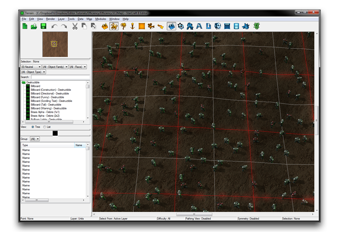
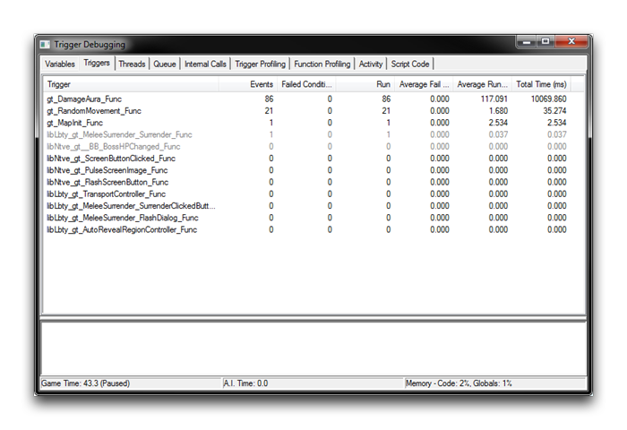
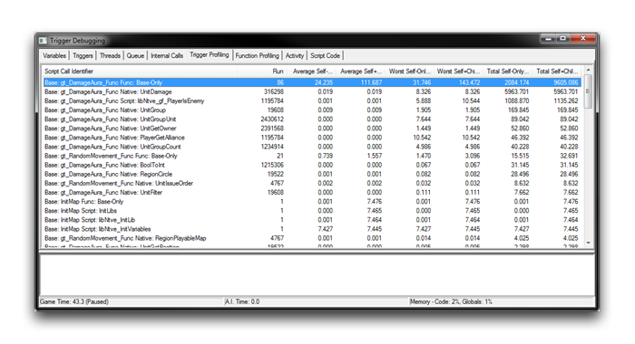
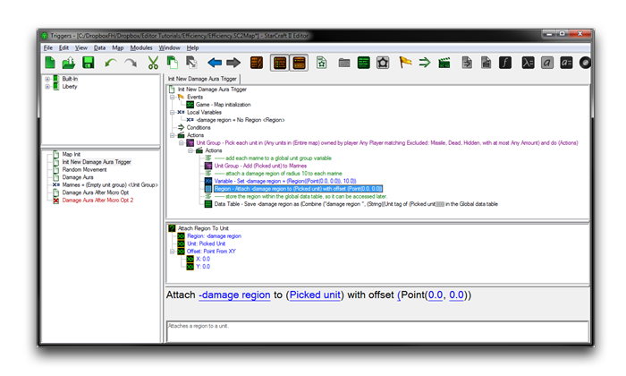
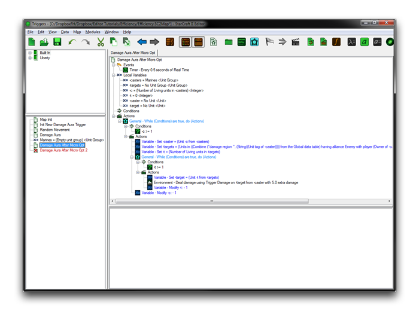
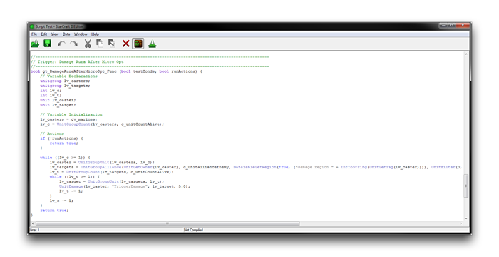
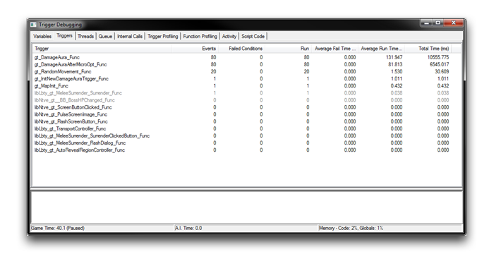

# Optimizing Code

Having a game than runs smoothly is paramount to your audience's experience. Although StarCraft and its engine are highly optimized within their closed off backend, once a user starts adding custom content using the Editor they run the risk of creating significant performance problems. Developers working at the code level are at more risk here. That said, there are optimization options in the Editor that could help attenuate any critical problems.

Performance issues can be separated into two broad categories, latency spikes and intensive background tasks. Latency spikes are an issue familiar to many players. They result in sudden, egregious interruptions of frame rate, followed by the game state snapping into the future. By comparison, intensive background tasks create long, dragging dips in frame rate, potentially over the whole game's performance. As a result, they may affect an audience's enjoyment without ever identifying themselves as a technical error.

Regardless of which category your performance issues belong to, the prescription is optimization.

## Locating Performance Problems

The first step of any optimization process is inquiring into the cause of slowdowns. While this article focuses on code optimization, you would do well to seal off all other possible areas of the map for performance optimization first. Changing code at this level can greatly reduce the readability and maintainability of code, and it should not be taken lightly.

The Trigger Debugger is the Editor's primary tool for finding optimization targets. In the debugger, there is a Triggers Tab of particular importance in identifying performance issues. This tab presents a full list of triggers the map, sorted by the field 'Average Execution Time.' Triggers with high-ranging values here are prime candidates for latency spikes. Taking a look at leaders in another field, 'Total Time,' will help you to find triggers causing intensive background task type lag. Advanced tabs in the debugger, such as the Trigger Profiling Tab and Function Profiling Tab, can offer evidence to support your first observations.

## Optimization In Practice

You'll find an exercise below that should help you understand the principles of finding and resolving performance issues.

Create a new Arcade map with the default settings. Now place a large number of marines split between the User Player 1 and the Hostile Player 15. You can confirm these control settings from 'Player Properties.' You should add enough marines to end up with a map that looks like the image below.

*Marine Coverage*

These marines will be periodically ordered to move to a random point on the map. Each Marine will also have a damage aura, which deals damage to any enemy units within a radius of 10 units. Move to the Trigger Editor and create a trigger responsible for the first behavior using the plan shown below.

*Random Movement Trigger*

Every two seconds, this trigger loops through each unit on the map and orders them to make a random movement. You can build the second trigger described above using the plan below.

*AOE Aura Trigger*

This trigger uses two nested loops to apply damage around each marine. The outer loop iterates over each unit on the map, finding potential targets for the aura. Then the inner loop uses this list, parsing it for any units within the 10 unit radius. Every half-second, Hostile units found by this procedure have the damage aura applied to them. After reading the descriptions for each behaviour, you might have a guess about which will be more problematic. Even so, run the map with the Trigger Debugger enabled to investigate. This should produce a view similar to the one pictured below.

*Trigger Debugger Trial*

The Trigger Tab's 'Total Time' field, has isolated the 'Damage Aura' Trigger as by far the most costly. It requires a total execution time of 10069 ms with average run time of 117 ms. This is nearly 300 times longer than the 'Random Movement' trigger at 35 ms. Demonstrable differences in optimization potential can be very large. Clearly, focusing your optimization efforts on the 'Random Movement' trigger would be a big mistake. To continue the investigation of your target, move to the Trigger Profiling tab and enable its Show Natives and Show SubCalls features.

*Trigger Profiling Tab*

At this level of detail, you can see that the 'Damage Aura' trigger's calls of UnitDamage and PlayerIsEnemy are the primary cause of the issues. Both of these functions are found in the inner loop, a location which is run multiplicatively more times than elsewhere within the code.

## Resolve Performance Problems

With your targets discovered, it's time to learn some unfortunate truths about performance resolution. Since problems like these differ wildly, there are very few catch-all solutions available. Every issue needs attention and understanding to be resolved.

In terms of general paradigms, there are some useful directions. First, question the algorithm itself with efficiency in mind. Make sure you've avoided spurious use of operations in trying to achieve a goal. Once you've been through this exhaustively, you can resort to making micro-optimizations. In micro-optimization, you'll fine-tune the code by hand, squeezing out better performance at the cost of your own effort.

The 'Damage Aura' example is too simple to have potential algorithmic problems. However, you could consider a solution using the Data Editor. For every triggered operation in the Editor, there is usually some equivalent in pure data or a mixture of the two disciplines. Data can typically offer a bit more efficiency at the price of intuitiveness. As a rule of thumb, if you find yourself making extensive provisions to work within data, you likely have crossed the threshold for performance savings.

## Micro-Optimizations

Micro-optimizations are usually a non-trivial way of eking out minute improvements for code, but in some cases they can have surprising results. Part of this is due to the Galaxy script compiler applying few native optimizations. There are also several GUI constructs, designed for ease of use, that don't smoothly break into Galaxy code. Although it is work intensive, micro-optimization can be simple compared to a complex algorithm change. They also may be applied uniformly to a great deal of code, awarding cumulative savings.

For a demonstration, create a duplicate of the 'Damage Area' trigger. Keep the original for comparison later. At this point, some code-reading is necessary to find targets for micro-optimization. The noticeable problems and their optimizations have been broken down in the table below. Note that some of these require a level of knowledge acquired through the practice of optimizing code in the Editor.

| Problem                                                                                                             | Optimization                                                 |
| ------------------------------------------------------------------------------------------------------------------- | ------------------------------------------------------------ |
| The trigger currently constructs a new group of marines on each execution by looping through every unit on the map. | Add the Marines to the unit group just once.                 |
| Each marine creates a new aura region during each check.                                                            | Create the region once and reuse it.                         |
| The '-targets' unit group initializes with 'Empty Unit Group', creating an unneeded empty group.                    | Initialize with 'No Unit Group', a less costly null value.   |
| The player alliance check, critically in the inner loop, has a less costly alternative.                             | Substitute an efficiency Unit Group Builder native function. |
| The GUI loop For Each Unit is inefficient for unit groups that are not manipulated during the looping procedure.    | Substitute a custom-tooled loop.                             |

Below you will find an optimization that alleviates the first two problems listed above.

*Micro-Optimization by Trigger Reorganization*

The tasks of aura region and marine group construction have been moved to a 'Map Initialization' trigger, resulting in their expensive operations being performed just once. The third, fourth, and fifth problems on the table are addressed below.

*Micro-Optimization by Hand Coding*

Here, the 'Damage Aura' trigger has had the previously mentioned, hand-coded optimizations made. The specifics are beyond the scope of this article, but it's worth considering that, even though its appearance is much more complex, at some point all GUI code will become Galaxy script, where things may look different. Below you will find the old and new versions of the trigger presented in raw code.

**

Galaxy Script Comparison

When presented in Galaxy code, the micro-optimized version is revealed to be far simpler. The truncation is largely the result of the use of custom While loops, rather than the GUI loop, For Each Unit. This GUI loop is designed for its ease and utility, but it was poorly suited to this task. A custom solution has saved many actions, considering that the 'Damage Aura' trigger makes no modification to the unit group while iterating.

The extraneous player alliance check has also been removed by the use of the Galaxy function UnitGroupAlliance, rather than the GUI's UnitGroup. The GUI is designed for simplicity in appearance and use for all users. With experience you may choose to suspend it where appropriate. You should also note that shorter code is not necessarily faster code, so you should confirm your new code's efficiency by going back to the Trigger Debugger.

*Optimization Savings*

As you can see, the 'Damage Aura' trigger has been accelerated by about 40% through the application of micro-optimizations to the code, an impressive result.
