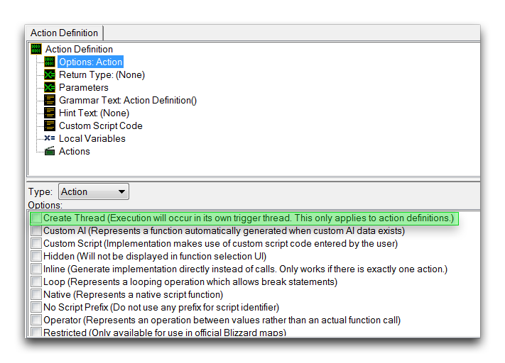
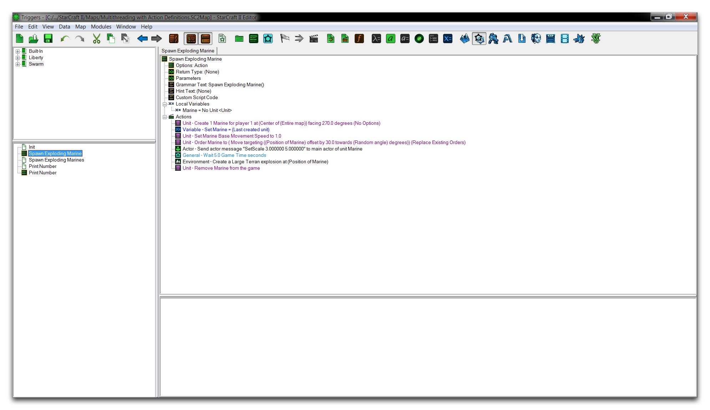
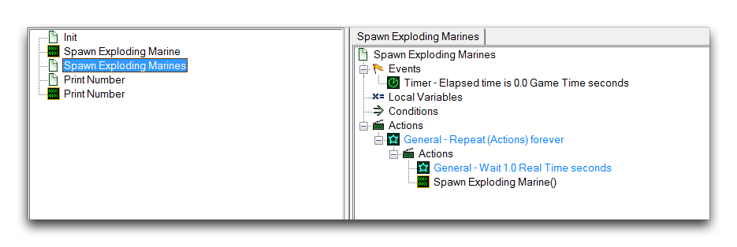
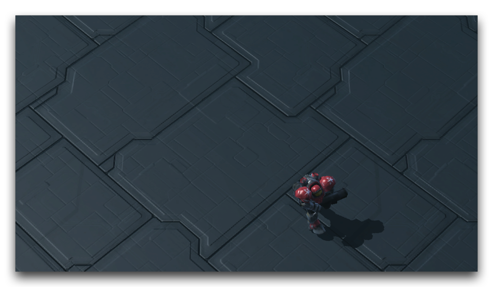
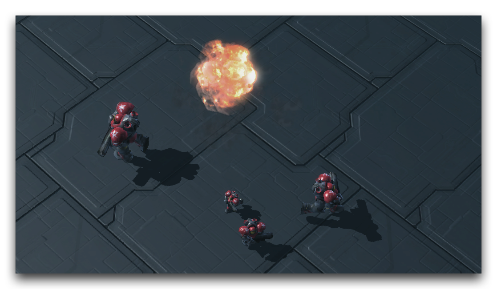
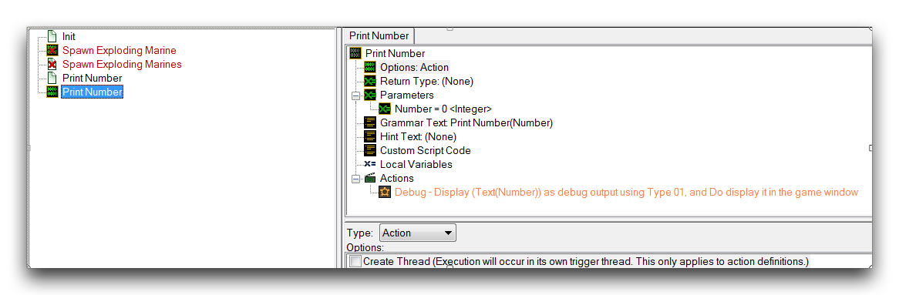
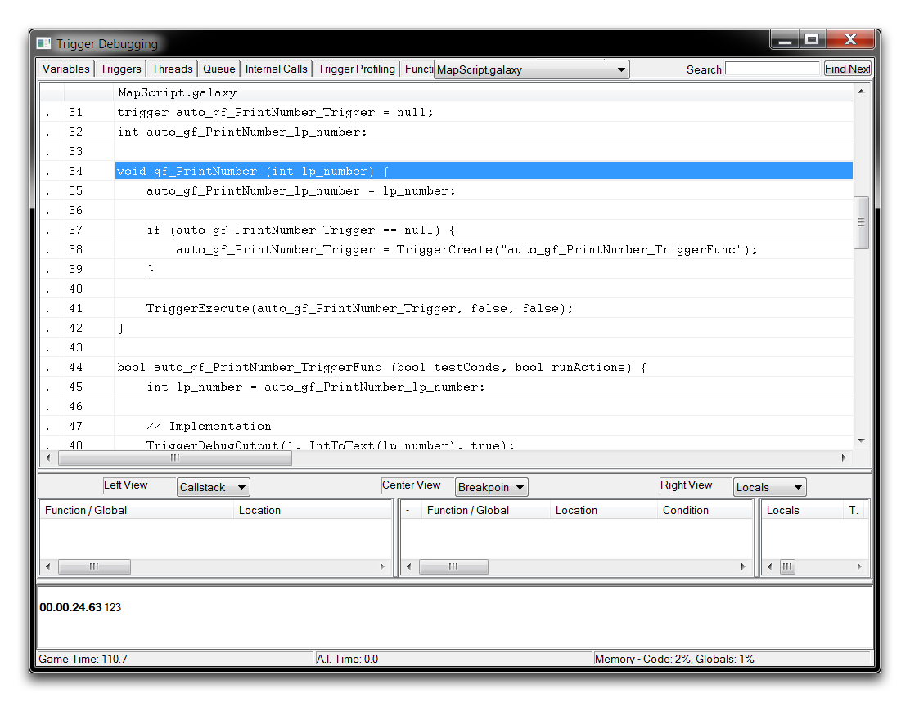

# Multithreading With Action Definitions

Multithreading is a computer science term that refers to a processing unit's ability to execute multiple actions at once. Traditionally, the standard behavior of a computer program is to execute all of its actions sequentially, one after another. By disrupting this behavior, multithreading allows a processor to perform actions in parallel, handling many tasks at the same time, each in what's known as a Thread. Take the following example of a linear operation system.

> Task 1 Start
> 
> ...
> 
> Task 1 Complete
> 
> Task 2 Start
> 
> ...
> 
> Task 2 Complete
> 
> Task 3 Start
> 
> ...
> 
> ...
> 
> ...

Each of these tasks take some time to complete, and the system is only capable of working on one at a time. A multithreaded system taking on the same tasks might look more like the setup below.

> Task 1 Start Task 2 Start
> 
> ... ...
> 
> Task 1 Complete Task 2 Complete
> 
> Task 3 Start Task 4 Start
> 
> ... ...
> 
> ... Task 4 Complete
> 
> ... Task 5 Start

In this scenario, multithreading has allowed a variety of shorter tasks to be organized into a separate thread. This has prevented the system from being gummed up by the long Task 3, allowing the entirely new Task 4 and Task 5 to be considered in the same time frame. Systems capable of multithreading have many advantages. For one, they can work efficiently by breaking large tasks into smaller chunks that can be worked on concurrently. In a gameplay context, multithreading is important for its performance advantages, but also for its ability to open up different ways of programming that can result in entirely new mechanics and gameplay.

## Processing In The Editor

By now you are probably fairly familiar with the way logic in the Trigger Editor is executed. A trigger is called, then its internals, actions, and control statements are run sequentially. Then the trigger closes, proceeding on to the next in line. If a separate trigger or action definition is called from a source trigger, then linear control is passed, but ultimately it returns to its original source, running sequentially until exhausted.

As such, triggers in the Editor operate as a standard, linearly processed system. While this might not be accurate behind the scenes of the code, where things are optimized to make use of multi-core systems, ultimately this article concerns the front end tools of the Editor. After all, the front end of the Editor is designed to be an intuitive tool in which you can concentrate on designing and building your project, rather than its precise programming details.

## Action-Definition Threads

Still, the Editor is an inclusive system, and just as it offers an intuitive front end for a wide range of users, it also has support for multithreading to give advanced users the chance to make use of non-linear processing. Multithreading is accessed through the use of specially flagged action definitions. The flag option is shown below.

*Multithreading Option within Action Definition*

Setting the Create Thread flag within an action definition causes the definition to be moved into a separate thread and handled in parallel to the rest of the code whenever it is called. The operation of these action definition threads themselves can be tracked and examined through the Trigger Debugger.

## Using Multithreading

Open the demo map provided with this article and move into the Trigger Editor. Opening the 'Spawn Exploding Marine' action definition will present you with the following.

*Demo Map View*

This definition creates a marine at the map's center, issues it a move command, scales it over the course of five seconds, and finishes by detonating it after five seconds. Turn your attention to the trigger calling this definition, as shown in the image below.

*Control Looping Trigger*

This trigger starts immediately on opening the map and begins calling the 'Spawn Exploding Marine' action definition once every second. Logically this should result in about five active marines on the map, undergoing the moving, scaling, and exploding behavior. A trial of the map will give the result shown in the image below.

*Single Marine in Motion*

When testing this implementation, you will see that only a single Marine is spawned at a time, with a period of about six seconds between each spawn. This is due to the fact that the main thread, the looping trigger, will pass linear control to the action definition it is calling. From there, the action definition blocks all other triggers from running until it's finished. This behavior clearly shows the standard, linear processing behavior of the trigger system. To change this, move to the action definition and enable multithreading, as shown below.

*Multithreaded Action Definition*

If you test the newly multithreaded action definition, you should end up with something like the image below.

*Many Marine Spawning Actions via Multithreading*

Now a new thread is opened for every call of the action definition. Since the thread takes about five seconds to run, the loop manages about five active threads, each separated by around a second. Knowing that the marines get larger the longer their thread has been open means that they serve as a great visualization of exactly how the system is managing many threads at once.

## Implementation

In actuality, the Editor's implementation of multithreading is kind of a pseudo or impure version of the concept. While a true multithreading implementation will be able to concurrently handle multiple tasks, the Editor instead handles them through a method known as Time-Slicing.

In the Editor's version of time-slicing, a thread-enabled action definition will run as typically expected when called. Linear control will be passed to it, its statements will run sequentially, and then control will pass back to the original parent caller. The difference lies in what happens when it reaches a wait control statement. If it does, control is interrupted and then passed back to the parent thread until the wait has been resolved, at which point control will come back to the threaded definition.

This differs from a non-threaded definition, which will hold on to control until the wait resolves. As such, the Editor is 'faking' multithreading by very rapidly switching linear control. This allows it to avoid wait statements creating full stops in the code and, as a result, it gives the impression of non-linear processing.

Still, giving users the ability to bypass wait statements like this means that the Editor's pseudo-multithreading boasts a lot of the utility that has been touted for the concept. It can still offer unique or more intuitive ways to program certain effects, and can serve as a valuable organizational tool. However, there is one important drawback: performance.

Since no real parallel execution happens in the Editor's multithreading, there is no specific positive impact on performance. In fact, because of the added internal work of this option, multithreading in the Editor will usually have a negative impact on performance. This is important to keep in mind, since it disagrees with most of the general definitions of the concept.

## Multithreading With Galaxy Script Triggers

Galaxy offers some unique multithreading support through the TriggerExecute native function. When executing a trigger directly with this function, you can specify a parameter that sets the target trigger to run in its own thread. The drawback here is that triggers have no parameter inputs, making them less useful than action definitions in most cases.

## Multithreading Mechanics

If you're an advanced user, you can gain insight into multithreading by examining the Galaxy script implementation. Turn your attention back to the demo map and disable the 'Spawn Exploding Marine' trigger and action definition by highlighting them, then right-clicking and unchecking 'Enabled.' Now, look to the trigger 'Print Number' and its associated action definition. The trigger calls the action definition pictured below.

*Print Number Action Definition*

The action definition sends a simple debug message to the screen. Notice that it is not currently set to be multithreaded. You can use this trigger and definition as a simplest possible test trial for examining the multithreading implementation. To do so, run the map in windowed mode, then launch the Trigger Debugger. Once inside the debugger, move to the Triggers Tab and right-click the gt\_PrintNumber\_Func trigger, then select 'View Script.' This will show the standard action definition script as follows.

*Standard 'Print Number' Script*

The script here is simple. It generates one void return function, the format of which matches that of the action definition in the GUI. This function is then called by the 'Print Number' trigger. Now, return to the Trigger Editor and enable multithreading in the 'Print Number' action definition by selecting the Create Thread flag. Repeating the same debug procedure will give the following result.

*Multithreaded 'Print Number' Script*

In this case, the script is far more complex, consisting of many automatically generated components. A breakdown of these components is shown below.

1.  One global variable for each parameter of the action definition, matching its original type.
    
    > int auto\_gf\_PrintNumber\_lp\_number

2.  A global trigger variable with an initial value of Null.
    
    trigger auto\_gf\_PrintNumber\_Trigger = null

3.  A bool trigger function with two boolean parameters; this contains every action defined in the GUI and one implicitly generated local variable for each threaded action definition parameter.
    
    > bool auto\_gf\_PrintNumber\_TriggerFunc (bool testConds, bool runActions) {
    > 
    > int lp\_number = auto\_gf\_PrintNumber\_lp\_number;

4.  A wrapper function that accepts the action definition's parameters.
    
    > gf\_PrintNumber(123)

Knowing these pieces, the mechanism acts as follows.

  - The wrapper function in 4 runs, first copying its parameter values to the global parameter variables in 1.
  - The wrapper function then checks if the global trigger variable in 2 is null. If so, it creates a new trigger based on 3, and assigns it to 2.
  - The function in 2 now executes in its own thread, obtaining the parameters from 1 and making local copies.

Note that the global in 1 serves as temporary storage, so it could be accessed from the trigger. At this point, creating local versions allows the thread to operate in parallel, insulated from any cases where the variables change.

By now you can no doubt see the added complexity of the threaded version shown here. As a result of this increase in code size, multithreaded action definitions perform at a significant deficit when compared to their unthreaded variety.

## Attachments

 * [057_Multithreading_with_Action_Definitions.SC2Map](./maps/057_Multithreading_with_Action_Definitions.SC2Map)
